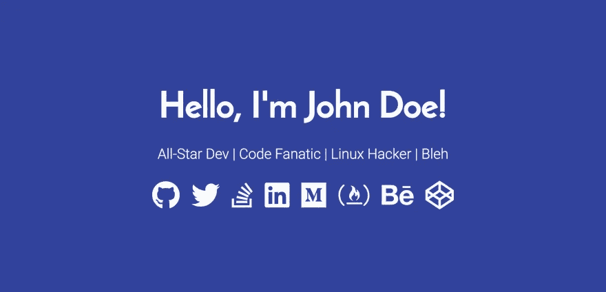
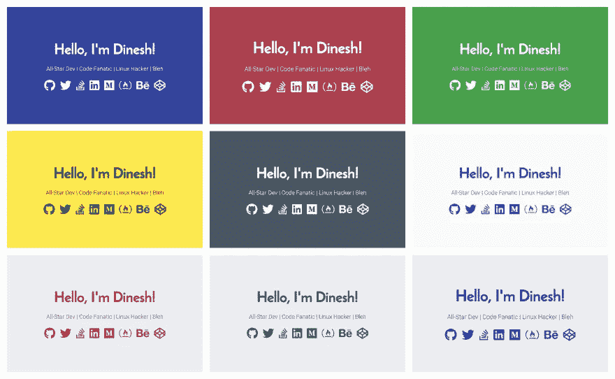

# 用 GitHub 页面创建你的开发者登陆页面🎉

> 原文：<https://medium.com/hackernoon/create-your-developer-landing-page-with-github-pages-70c89b40d052>

*我们所有的开发者，在某个时候，都希望有一个我们自己的个人网站，或者展示我们的在线形象，或者仅仅是因为它很有趣。所以在这里，我给大家呈现一个现成的* [***开发者登陆页面***](https://github.com/flexdinesh/dev-landing-page)

通常创建一个个人网站需要购买/注册一个域名，找到一个免费/付费的主机服务，开发你的网站并上传到主机提供商。

但是有了 GitHub Pages，发布你的网站就像喝咖啡一样简单。

*   您需要一个 GitHub 帐户(显然您已经有了一个)
*   创建一个名为`{username}.github.io`的新回购
*   克隆 repo 并创建一个`index.html`文件
*   补充一些内容和`git push`

瞧啊。你的网站应该在几秒钟后在`https://{username}.github.io`上线。

# 开发者登录页面

我想要一个**开发登陆页面**来展示我在网上做的一切。我希望它简洁明了，切中要害，而不是又漂亮又厚重。所以我在一个晚上坐下来，创建了这个 [**Dev 登陆页面**](https://github.com/flexdinesh/dev-landing-page) 。

我的朋友中很少有人喜欢它，我为他们创作了几个不同主题的相同内容。

我认为大多数开发者都希望有类似的东西。因此，如果你不是在寻找一些花哨的东西，并喜欢这个最小的 [**开发登录页面**](https://github.com/flexdinesh/dev-landing-page) ，请随意分叉/克隆并定制它以满足你的开发口味。

你可以从这些 **9 种材料主题中选择一种，或者根据你的喜好改变颜色，因为这太简单了。**

这是我的 [**Dev 登陆页面——Dinesh**](https://flexdinesh.github.io/)**，在我最喜欢的黄色中闪亮！🎉**

**你太棒了！祝您愉快！✨**

***最初发布于*[*dev . to*](https://dev.to/flexdinesh/create-your-developer-landing-page-with-github-pages---42jk)*。***