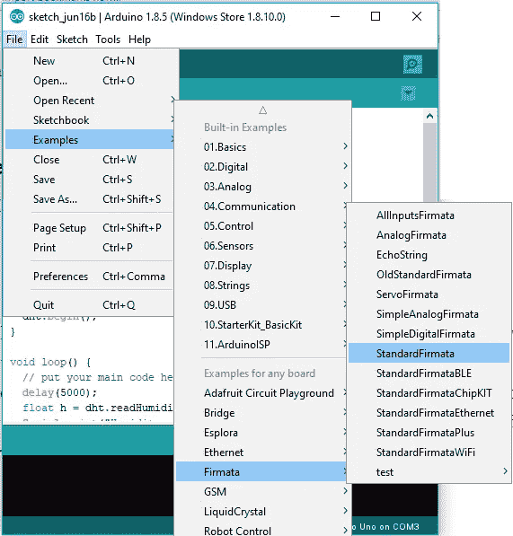
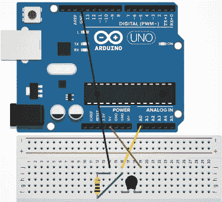
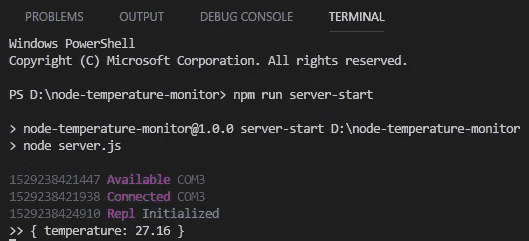
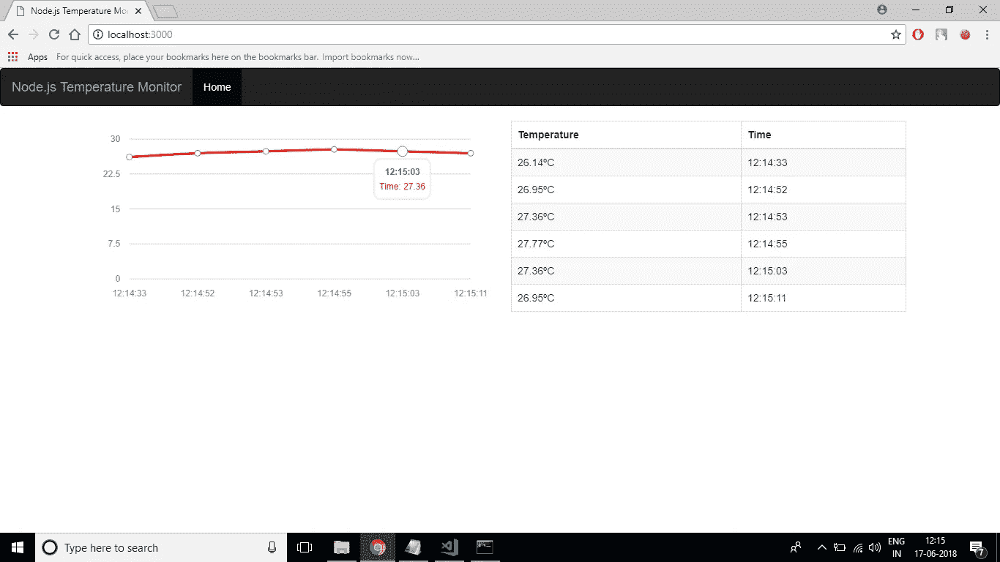

# 在 15 分钟内创建您的第一个 Arduino + Node.js 物联网可视化应用程序

> 原文：<https://medium.com/hackernoon/create-your-first-arduino-node-js-iot-visualization-app-in-under-15-minutes-619f8e6f7181>


> “智能家居和其他互联产品不会仅仅针对家庭生活。他们也将对商业产生重大影响。就像任何一家在世纪之交幸福地忽略了互联网的公司一样，那些忽视物联网的公司可能会落后。”——贾里德·纽曼，[在《快公司》写作](http://www.fastcompany.com/3044375/sector-forecasting/the-future-of-the-internet-of-things-is-like-the-internet-of-the-1990s)

目前，IoT 和 Node.js 是技术领域听到的两个流行语。使用 Node.js 和 Arduino 实现物联网应用本身是一个有趣的学习主题。本文结束时，您将构建一个实时温度监控系统。相信我…！如果您具备所有先决条件，构建这个应用程序非常容易。

被跟踪的 *GitHub 库* : [**节点温度监控器**](https://github.com/Narendra-Kamath/node-temperature-monitor)([https://github.com/Narendra-Kamath/node-temperature-monitor](https://github.com/Narendra-Kamath/node-temperature-monitor))

## 硬件要求

1.  Arduino Uno R3 主板[ [立即购买](https://amzn.to/2ljBxGR)
2.  1kω电阻[ [立即购买](https://amzn.to/2JPReVi)
3.  1kωNTC 热敏电阻
4.  跳线 X 3(公对公)[ [立即购买](https://amzn.to/2JLbTcU)
5.  试验板[ [立即购买](https://amzn.to/2lifcK6)
6.  桌面

## 软件要求

1.  Arduino IDE [ [下载](https://www.arduino.cc/en/Main/Software) ]
2.  Node.js [ [下载](https://nodejs.org/en/download/)

具备上述先决条件后，连接 Arduino 板卡，上传标准 firmata 的示例代码。这段代码允许您将 Arduino 作为标准的桌面通信设备，我们将使用将要构建的 Node.js 应用程序来控制 Arduino 板。因此，让我们验证并从 Arduino IDE 上传“标准 Firmata”代码到 Arduino。



Selecting the StandardFirmata code and uploading it to Arduino Uno R3

将代码上传到电路板后，我们将设置电路，使用三根跳线、1kωNTC 热敏电阻、1kω电阻和试验板以及 Arduino 电路板。



Circuit Design

设置好硬件之后，现在主要的部分就是准备 Node.js 服务器(用于从 Arduino 传输数据)和客户端应用程序(用于从 server app 接收数据)。本文开头提供的 GitHub 存储库可以被克隆来快速测试这个应用程序。

应用程序有两个部分，服务器端和客户端。

## 第 1 部分:服务器端应用程序

在 *server.js* 文件中，我们将包含两个依赖项，

*   [**node-dweetio**](https://www.npmjs.com/package/node-dweetio) :物联网的一个简单易用的免费消息平台。
*   [**johnny-five**](https://www.npmjs.com/package/johnny-five) :这个节点模块用于从我们的 Node.js 应用程序连接到 Arduino 板。

代码简单明了。其中提到我们已经连接了数据跳线(A0)的引脚。由于热敏电阻是可变电阻，Arduino 无法计算温度和电阻，但可以用来测量电压。

首先，我们必须测量电阻，然后从电阻开始，我们可以测量温度。这与温度传感器的' **on-change** '事件中应用的逻辑相同(*参考:* [*制作一个 Arduino 温度传感器*](http://www.circuitbasics.com/arduino-thermistor-temperature-sensor-tutorial/) )。DweetThing 是一个唯一的名称，可以为所连接的事物命名，在给定的例子中是'**node-temperature-monitor**'。服务器部分现在已经准备好了，每次温度变化时，都会发送一个消息对象。

## 第 2 部分:客户端可视化应用程序

现在我们已经设置了服务器部分。是时候创建一个出色的客户端应用程序来接收 dweeted 数据并将其可视化了。

这里我们将使用 [**socket.io**](https://www.npmjs.com/package/socket.io) 节点模块来实现基于事件的实时双向通信。当有从服务器发送的 dweet 时，app.js 捕获该 dweet，并使用 socket.io 实例发出相同的数据。现在，我们将在 public 文件夹中创建节点应用程序的视图部分。这个特定的文件夹将有一个 index.html 页面和一个 JavaScript 文件。

index.html 文件依赖于 socket.io、jquery、bootstrap 和 morris js。我们使用 Morris.js 图表库来创建一个简单的折线图，以显示当有来自服务器的 dweet 时特定时刻的温度。

## 最后的步骤

因为我们已经创建了应用程序的服务器端和客户端，所以首先我们将启动服务器。参考 [GitHub 库](https://github.com/Narendra-Kamath/node-temperature-monitor)来了解如何启动服务器。当服务器组成后，控制台看起来会像这样，

```
**> npm** run server-start
```



Server console output

这个应用程序最精彩的部分是可视化。运行命令并访问 **http://localhost:3000** ，

```
**> npm** run start
```



Real-time temperature monitoring

恭喜您，我们现在已经创建了一个基于 Node.js 的实时温度监控和可视化应用程序。这不是很容易吗？

请在回复部分分享您的观点:)谢谢！

**参考文献**

*   [制作一个 Arduino 温度传感器](http://www.circuitbasics.com/arduino-thermistor-temperature-sensor-tutorial/)
*   [创建物联网案例](/@otavioguastamacchia/creating-a-simple-iot-case-8102f22908a7)