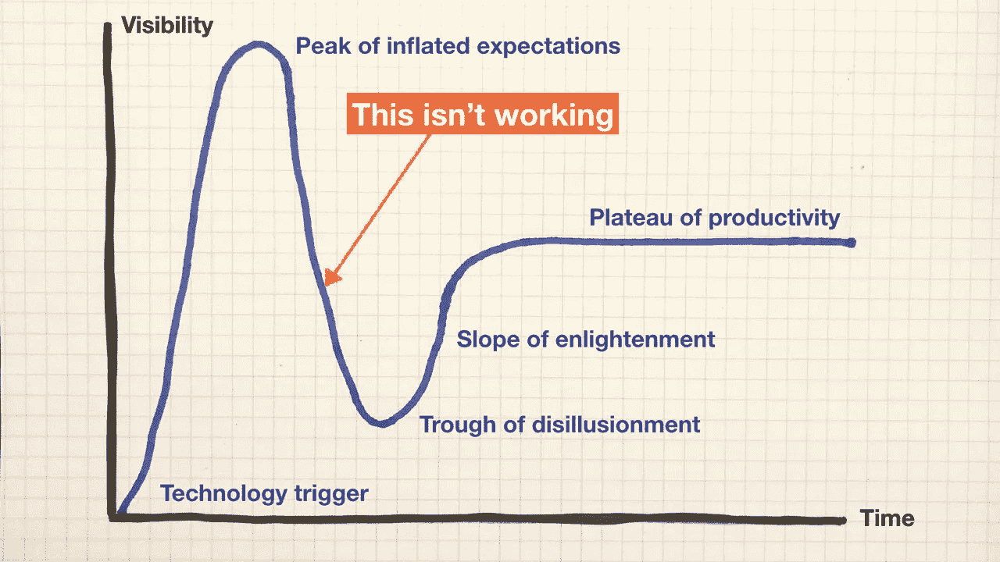
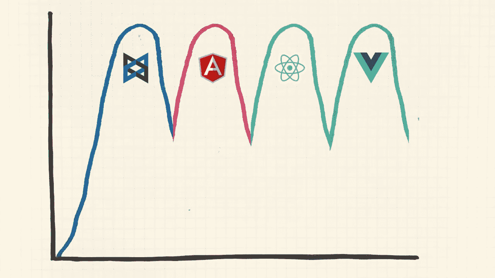

# 用五个简单的步骤创建你自己的功能失调的单页应用程序

> 原文：<https://medium.com/hackernoon/create-your-own-dysfunctional-single-page-app-in-five-easy-steps-7bfcba9df6df>

(Some) Single-page web applications (can) damage (certain) businesses.

好了，现在我们已经解决了引人注目、有争议的介绍性前提，我想让大家知道，在正确的情况下，我和下一个 JavaScript 开发者一样喜欢执行良好的单页应用程序(SPA)。

但我确实相信，我的开场白对许多组织来说是正确的，这些组织没有问自己是否有必要，他们是否会成功，或者有什么替代方案，就直接开发了一个全 JavaScript 的基于浏览器的应用程序。

# 愿景

看着像谷歌地图这样的单页应用程序的典型例子，我们很容易想到*“我们可以建立这样的东西！”*

毕竟只是个网站对吧？有像 React 和 Angular 这样的开源 JavaScript 框架可以帮助我们构建它。其他团队已经用这些技术创造了惊人的东西。我们知道是因为我们自己一直在使用它们。

但是，创建一个不符合这一愿景的单页面应用程序要容易得多。我们很容易得到一个迟钝的应用程序，它拒绝改进，排斥新功能。JavaScript 应用的质量有一条很长的尾巴，尤其是在企业环境中。

在我与产品团队的咨询工作中，我经常看到这种情况。他们可能会与单页应用程序斗争，因为他们低估了使它们接近谷歌地图所需的时间、专业知识和精力。

让我们看看这是如何发生的。剧透警告:这与技术关系不大，与团队和人关系很大。

# 假定的用户利益

产品团队首先被吸引到单页应用上，因为对用户来说有一些隐含的或假定的普遍利益(因此对业务的底线)。

奇怪的是，我们并不经常谈论水疗的用户好处，而是更喜欢谈论功能和特点。

我认为单页应用程序有三大假定的用户优势:

1.  **提升用户体验**。我们正在提供类似应用程序的交互模式，可与原生桌面或移动应用程序相媲美，专注于数据和任务，而不是任意的页面和文档模型。
2.  **改善的感知性能**。我们可以提供视觉反馈，并允许用户并行地继续其他任务，而不是用全页面刷新来中断任务流。
3.  **还是网络**。我们可以利用网络平台的所有优势:通用访问和设备兼容性、无需安装、深度链接、共享、索引等。

这些优势取决于执行，基于我们已经采取的方法。尽管市场营销或宣传传播了任何信息，但我们采用的 JavaScript 框架和库并不免费。

单页应用代表着复杂性向基于浏览器的代码的转移。不仅仅是远离服务器，在某些情况下也远离浏览器的原生特性。我们以前见过这种情况。他们以前被称为*胖客户端*。在 Flash 的后期，它们是*富互联网应用*。现在，许多人只是称它们为*网络应用*。

不幸的是，许多团队最终制造了一个烂摊子，因为他们无法调整他们的方法来开发胖客户端应用程序，其中的复杂性集中在运行在不确定和变化的计算环境(即用户设备)上的 JavaScript 代码中。

# 创建功能失调的单页应用程序的 5 个错误

下面是我见过的团队在构建基于 SPA 的产品时犯的五个常见错误。其中每一个都是我们经常解释为纯技术问题的人或实践问题。

不幸的是，每一个错误都会导致下一个错误，使整体情况更加复杂。

## 错误 1:低估长期开发和维护成本

许多团队低估了制作一个高质量的单页面应用程序所需的时间和成本。

这有很多阴谋的原因。

**框架营销关注早期开发者体验**

框架营销和讨论倾向于关注早期开发工作的容易程度，而不是长期维护。有多少框架营销声称帮助你编写易于重构的代码？不多。同样，与大量的入门教程相比，围绕重构的教育资源很少。

**真实维护成本的低可见性**

当然，所有软件都是如此，但是许多技术经理在运行大量使用 JavaScript 的应用程序的开发方面经验有限，所以如果你没有去过，单页应用程序的维护和持续改进费用可能会出乎意料。

**逐步改进工作的优先级降低**

在小型产品公司中，UI 产品工作通常被期望以极快的速度进行。持续的改进、重构和渐进的长期迁移工作可以被看作是对特性速度的不必要的负担。由于技术和产品债务，长期结果很容易导致完全瘫痪。

## 错误 2:单方面使用单页应用程序方法

这个错误反映了反对使用单页应用程序方法的最常见的论点。在许多情况下，这不是正确的做法。

当我们开始一个项目时，许多开发团队会选择一个默认的技术方法来覆盖所有预期的功能。这通常意味着你选择的框架吸收了一切，而不考虑用户的需求。"在 BobsWidgets，我们使用 React！"开发人员招聘广告大声疾呼。

这种先发制人的决策可能会有风险。对所有事情都使用 SPA 模式可能有些矫枉过正。毕竟，你典型的商业应用程序是一个创建-读取-更新-销毁(CRUD)的事务——可能有一两个关键特性需要一个真正动态的、数据驱动的 UI。绘图和实时数据可视化就是明显的例子。

但这并不意味着其他部分会因此遭殃。我们假设用 JavaScript 创建所有功能给用户带来的好处在整个产品中都是一样的。就我所见，我并不信服。

我们问“我们应该为整个应用程序使用什么框架？”当我们甚至还不知道我们在构建什么的时候，就提前为新产品做准备。问“什么样的技术方法最能支持这个用户需求？”会减少很多浪费随着我们在增量产品设计和开发过程中对这些用户需求的了解越来越多。

这种预先的决策通常意味着渐进增强(PE)会立即消失，为了开发人员的便利性以及工具和方法的一致性而牺牲。相反，我们假设通用 JavaScript 可操作性，并希望我们选择的框架将提供足够的性能和开箱即用的可访问性。

这只是关注工作投入(我们使用的工具和编写的代码)而不是结果(我们的产品给用户和客户带来的价值)的集体偏见的一个例子。

## 错误 3:前端能力投资不足

在过去的十年里，web 应用程序的复杂性已经从后端转移到了前端。或者，更准确地说，我们正试图提供更多的能力，这导致了更复杂的整体。前端承担了大部分新的复杂性。

面对快速发展的语言、web 平台和不确定的执行环境，前端 JavaScript 应用程序开发模式仍处于发展阶段。这意味着与后端相比，提供同等的复杂性需要做更多的工作。

产品团队能力的平衡并不总是随之改变。也许态度和习惯的改变比技术的采用要慢。

近年来，我们也看到了*全栈开发者*角色的崛起。这是行业的集体尝试，通过迫使这些技能成为商品，尽可能低成本地应对这种复杂性的转变。虽然拥有真正令人难以置信的全栈专业知识的个人确实存在，但他们是罕见的，而且对大多数公司来说不容易获得。

全栈开发人员代表的行业假设是[软件开发](https://hackernoon.com/tagged/software-development)专业知识可以从后端移植到前端，不需要大量昂贵的重新培训。同样的原则也适用。这在某种程度上是正确的，但并不神奇地适用于作为媒介和平台的网络知识。技能的可转移性充其量只是部分的。

这是关于全栈开发人员的众多笑话之一:

这些笑话对个人来说有点不公平，他们只是想为自己创造一个有回报的职业生涯。(顺便说一下，关于如何做到这一点，也有很多糟糕且不一致的建议。)

对我来说，全栈开发人员 mythos 分散了将*团队*视为专业单位的需求。

事实上，每个人都有不同的能力和潜力。将功能减少到*前端*对*后端*是过于简单的，因为将一组非常广泛的技能集中到*全栈开发人员*的角色中。这是将个人视为商品化资源的症状。

将现有产品团队的能力更多地转移到前端，以匹配系统复杂性的变化，这需要考虑培训、辅导和招聘的组合。换句话说:投资。

不幸的是，这种投资很少在团队层面上由需要它的组织有意进行。取而代之的是，团队通常被期望在实践中学习，有时是在他们自己的时间里自费学习。

更糟糕的是，前端工作通常作为一个孤立的工作交给没有经验的开发人员或实习生，让他们自己去解决，而不需要太多的指导或培训。从爱德华·戴明的角度来看，边工作边学习是好的。但是让一个没有经验的人在没有指导的情况下做不算。

这很大程度上是因为人们一直坚信前端开发相对容易。作为一种观点，现在公开声明的次数少了，但它的影响仍然可以在团队行为和管理的方式中看到。

## 错误 4:使用天真的开发实践

前端技能投资不足会产生连锁效应。

我们可以相对容易地用 JavaScript 框架创建工作软件，这是很吸引人的。但是天真的开发实践会威胁到产品的长期可维护性和质量。

糟糕的开发实践相互强化:

*   测试覆盖率低或没有覆盖率，导致…
*   高度耦合的代码，鼓励…
*   过度设计的解决方案，导致…
*   巨大的泥球，迫使我们交付…
*   巨大的整体资产包

所有这些都使得我们不太可能实现我们之前谈到的那些假定的用户利益。

对于大量使用 JavaScript 的应用程序来说，性能尤其是一个大问题，尤其是在移动设备上。虽然框架维护者正在努力改善这种情况，但我们仍然有现有的应用程序要处理。

如果你想改善这种情况，你首先需要一个可以改进的代码库。例如， [Addy Osmani 在他关于现代 JavaScript 应用程序性能的帖子中提出的优秀建议](/@addyosmani/the-cost-of-javascript-in-2018-7d8950fbb5d4)如果你没有结构良好的基础，就很难在现有的应用程序中实现。

现有 JavaScript 应用程序的逐步拯救、再生、剖析和加速的技能很难学习。所以他们在就业市场上很难找到。这让我们想到了另一种方法…

## 错误 5:在框架炒作的浪潮中冲浪

一旦我们发现自己有一个执行得很差的单页应用程序(使用我们简单的四步计划！)，我们自然想为此做点什么。这是一个非常危险的情况。正是在这里，我们可以对业务造成严重的复合损害。

将一个失败的应用程序归咎于用来创建它的技术和工具实在是太容易了。在这种情况下，我们最常见的怨恨目标是我们选择的 JavaScript 应用程序工具。毕竟，所有那些闪亮的营销和积极性在一开始就向我们承诺了一个谷歌地图或者至少是一些我们乐于从事的东西。

我们的团队无法快速推进产品；对核心功能的重新设计花了六个月而不是六周；那两个因沮丧而离开公司的开发人员；可怜的 UX 和表演。这些很容易归咎于我们几年前选择的技术。(或者说*几年前被别人*选中了。)

因此，我们寻找替代方案。

更广泛的 JavaScript 社区迅速变化的态度提供了大量的选择来诱惑我们。

在过去的五年里，新的 JavaScript 框架、库及其相关生态系统流行的规律性似乎与产品团队对其技术选择感到沮丧的节奏相匹配。这是巧合吗？

我将使用 Gartner 炒作周期对此进行有问题的论证。这张臭名昭著的图表描绘了一项技术的可见性随时间的变化。

会不会是产品团队在这里抱怨他们的 web 应用程序…

…正当替代工具越来越受欢迎的时候？

在极端的情况下，我们可能会陷入类似下面的情况，因为各种重写整个应用程序或其重要部分的尝试都在进行，在整个代码中留下了框架和库的痕迹。

这是另一种方式来说明[开发者体验诱饵-开关](https://infrequently.org/2018/09/the-developer-experience-bait-and-switch/)，正如亚历克斯·罗素所有力描述的。

我*可能*应该为允许这样的事情发生在一个快速发展的产品上负责。我毫无保留地向所有和我一起工作过的人道歉，他们不得不面对这个问题。但我绝不是唯一的一个。

在过去的几年里，JavaScript 社区中的浮躁已经平息了一些。我们实际上可能会看到一些基于组件的方法的整合，如由*生态系统*(不要说*框架*)提供的 React、Angular 或 VueJS。

但是，围绕其他应用程序功能，如状态管理、CSS 处理和平台原生功能的使用，仍然存在大量的混乱。变化是不断的，但不一致。

即使你是一个忠实的普通 JS(无框架)倡导者，围绕 JavaScript 语言本身、构建和开发工具、依赖管理、实用程序库、浏览器支持和 web 平台本身仍有许多变化需要应对。根本不使用框架并不能回避这个问题。

# 那么，解决办法是什么，坏脾气先生？

这篇文章太消极了，太长了，谢谢你，所以我会在以后的文章中寻找摆脱困境的方法。

很少有团队会遇到上述所有五个问题。它们可以在产品生命周期的不同时间出现。

正如我在开始时指出的，我上面确定的问题的共同线索不是技术本身，而是人。我们太过关注技术，把它作为解决非技术问题的方法。

关于团队结构、动态、技能和能力，关于编写和维护基于多平台异步浏览器的软件的成本，以及关于健康和可持续的长期软件开发实践，我们谈得不够多。

这应该会给你一些线索，让你知道产品团队如何开始解决这个问题。

本文基于我的 talk [*如何在单页 App-ocalypse*](https://www.youtube.com/watch?v=1SRO-1HBE6E) 中生存，首次在 2018 年 6 月的*Lead Dev London*大会上发表。本次演讲的幻灯片可在 Noti.st 上获得。

*原载于***。**