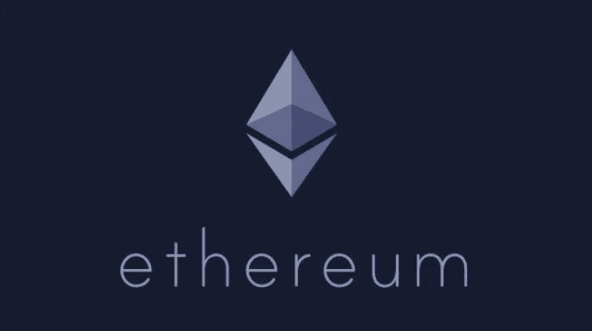
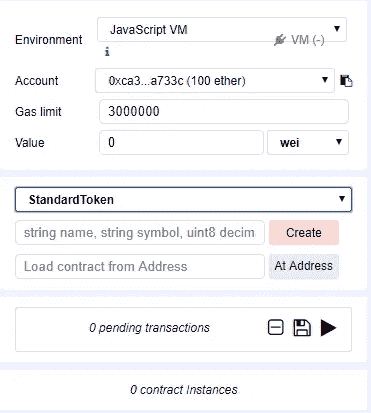

# 创建您自己的以太坊令牌。

> 原文：<https://medium.com/hackernoon/create-your-own-ethereum-token-bfa6302084da>

到现在为止，我们都很熟悉 ICO(初始硬币发行)。许多项目从投资者那里获得了数百万美元，通过智能合同承诺一项革命性的技术，将改变世界。

通常情况下，只有一个承诺，以及一份白皮书和一个网站，MVP 将在众筹结束后开发。在这个阶段(许多项目可能永远过不了这个阶段)，“革命性”智能合约看起来都有些相似，除了众筹销售之外，不提供任何功能。

在本文中，我们将展示为[以太坊](https://hackernoon.com/tagged/ethereum) [区块链](https://hackernoon.com/tagged/blockchain)制作自己的 ERC20 令牌有多简单。一定要看看我们的 dApp 教程。

 [## 使用 Web3 和 Vue 创建您的第一个以太坊 dAPP。JS(第一部分)

### 欢迎来到另一个教程！在本教程中，我们将深入创建一个简单的反应式分散应用程序…

itnext.io](https://itnext.io/create-your-first-ethereum-dapp-with-web3-and-vue-js-c7221af1ed82) 

*(本文仅供教育之用)*

# 步骤 ERC20 界面

在以太坊的编程语言 Solidity 中，接口是一段可重用的代码，它定义了函数和事件的约束，而不实现函数本身。具有 ERC20 接口的合同必须实现接口中定义的所有功能。

幸运的是，我们不需要自己编写所有的代码，我们可以从下面的存储库中复制这些代码:[https://github . com/open zeppelin/zeppelin-solidity/tree/master/contracts/token](https://github.com/OpenZeppelin/zeppelin-solidity/tree/master/contracts/token)

首先，打开[https://remix.ethereum.org](https://remix.ethereum.org)，创建两个文件:SafeMath.sol 和 ERC20.sol，将下面的代码粘贴到各自的文件中。

# 步骤 2:实现我们的功能

伟大的作品，或者说积木都快搭好了。现在我们必须实现我们在接口中定义的功能。为此，我们将把 OpenZeppelin 中的 BasicToken.sol 和 StandardToken.sol 合并到一个名为 StandardToken.sol 的文件中。

以下是这些功能的高级概述:

**balanceOf** :返回以太坊地址的令牌余额。

**转账**:向我们选择的地址转账。

**批准**:设置允许指定地址代表我们消费的代币数量

**津贴**:代表我们检查一个地址允许花费多少

**转账来源**:指定一个转账来源地址，如果该地址允许我们消费一些代币的话。

**事件转移和事件批准**将在区块链上记录一个输出事件。

# 添加你自己的风格

恭喜你。这是最难的部分。现在剩下要做的就是为我们的令牌指定一个名称、符号和供应。

因为我们稍微调整了一下，所以我们不需要实际编码！我们可以在 remix 中创建合同时输入我们想要的参数。在创建按钮旁边，按顺序输入名称、符号、小数位数和总供应量(见下面的示例)，然后按创建。

Example

干得好！您已经成功创建了您的第一个令牌。现在，您可以通过向 remix 中“帐户”旁边的下拉菜单中的地址发送令牌来测试这些功能。

如果您安装了 Metamask，也可以将它部署到其中一个测试网络。

完整的 gist 可以在这里找到:[https://gist . github . com/anonymous/9 eabd 0015 ca 7 DD 431992 a 522 aa 8 c 51 CD](https://gist.github.com/anonymous/9eabd0015ca7dd431992a522aa8c51cd#file-erc20-sol)

**一定要看看第 2 部分！**

 [## 创建自己的以太坊令牌(第 2 部分:ERC223)

### 第 1 部分:ERC20 令牌

medium.com](/@Alt_Street/create-your-own-ethereum-token-part-2-erc223-3076f764cf62) 

如果您喜欢这篇文章，请留下您的建议:
BTC—1 dnkxrlfesj 5 in 8 nbyzbnuejqcshohccvv *ETH—*0x 6d 31 CB 338 b 5590 adafec 46462 a1 b 095 ebdc 37d 50 *LTC—*LLC 8 pwsedmih 5 gldgvznq 361 lm 6 iaqndnj