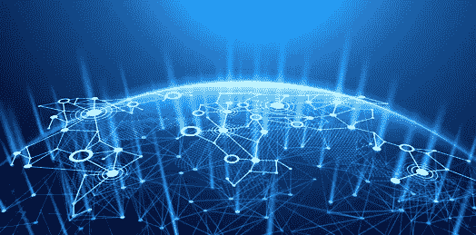
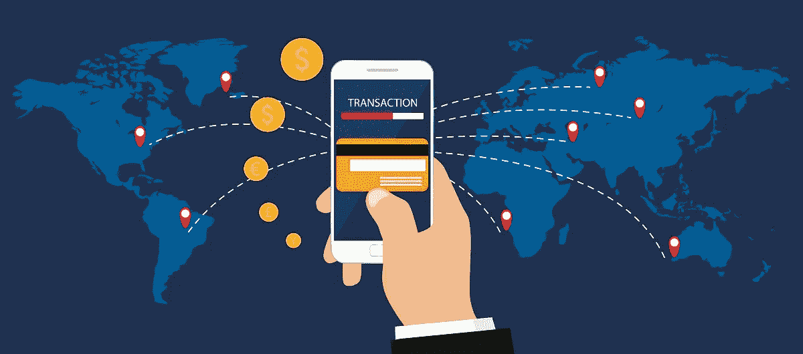
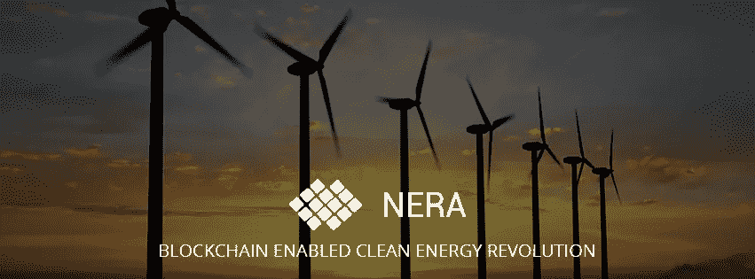
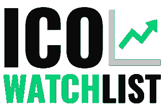

# 用区块链创造更美好的世界

> 原文：<https://medium.com/hackernoon/creating-a-better-world-with-blockchain-62ee39889dda>

这篇文章是由 Neweraenergy 的 NERA 团队撰写的，因此所有的荣誉都归于他们。新时代能源(NERA)是一个区块链认证平台，用于测量个人和组织的清洁能源足迹。

”*环境是我们所有人相遇的地方；所有人都有共同的利益；这是我们所有人共有的东西*。

**伯德·约翰逊夫人，美国第一夫人(1963-1969)**

第一夫人说得很有道理，那是 100 多年前的事了。我们对环境的依赖并没有太大的改变，我们怀疑这种情况会持续下去。

作为地球上的主导物种，我们正处于历史的十字路口，特别是在新技术跨越生态可行性和可持续性的神圣边界的时候。鸟瞰科技的飞跃，尤其是在过去的十年里，许多有见识的读者不确定科技是否从环境中获取了更多而不是回馈。事实上，区块链科技的最新环境相关信息是一场拉锯战，正如 NERA 联合创始人安迪·谭(Andy Tan)的一篇文章所示。

我们知道区块链理工和比特币、以太坊等的开采。需要大量的能源，这加剧了全球变暖的问题；我们也知道这项技术会一直存在。然而，就像所有其他人造物品一样，我们的发明需要改进，所以它变成了一个有利于地球的积极标记。

## 什么是区块链？

*“区块链是一个不朽的经济交易数字账本，通过编程，它不仅可以记录金融交易，还可以记录几乎所有有价值的东西。”*

***唐&亚历克斯·塔普斯科特，《区块链革命》作者(2016)***

大多数人似乎对区块链有一个非常模糊或迂回的想法。他们似乎都同意这让许多人成为了百万富翁。

## 什么是区块链技术？

简而言之，区块链可以被视为一个电子表格或分类帐，它是在多个网络上以数字方式复制的，这些网络不断更新分类帐(分类帐由分类帐构成的块组成)，而没有管理记录的集中系统。

由于这些记录托管在全球数百万个网络上，区块链目前被认为是防黑客的，在这个数字时代，我们大多数人都会欣赏这一点。

## 什么是代币？

代币是特定资产或公用事业的代表，很像公司的股票。代币可以代表任何可替代和可交易的资产，从商品到忠诚度积分再到其他类型的加密货币。

## 什么是智能合约？

智能合同(加密合同)是一个数字程序，直接控制各方之间的数字资产和货币的转移。这种类型的合同定义了与传统合同非常相似的规则和条例，并自动强制执行这些义务。这些合同存放在分类账中，形成一个区块链。

区块链可以公开访问，也可以私人定义。

# 新时代能源(NERA)是做什么的？

首先，NERA 并不回避这些棘手的问题。我们欣然承认，需要大量能源的技术不是这个星球所需要的，尤其是现在。我们还知道，区块链技术已经成为一种全球性现象，人们无法摆脱它。

NERA 的创造者对清洁能源和金融领域既有兴趣又有丰富的经验。想法是将这两个行业合并在一起，创造一个机会，建立一个公共和私营部门易于访问的平台。

NERA 的主要目标是为可再生能源开发商创造获得急需资金的便利条件。此外，我们希望这些项目不仅鼓励公众兴趣和投资，而且我们希望在全球范围内创造一个可再生、可持续能源计划的无限循环。

## NERA 平台

NERA

NERA 平台提供智能合约，确保您的投资保持高水平的安全性和透明度。正如我们在[白皮书](https://newera.energy/NEE_ICO_White_Paper.pdf)中提到的，该平台提供了一种向监管机构报告和提交碳排放数据和证书的有效方法，从而支持安全的能源交易。这意味着:

●全球急需的可持续能源项目容易获得资金

●容易获得可持续项目

●双重奖励，你可以在减少碳足迹的同时获得财务上的成功！

## NERA 回馈社会

我们重视我们的投资者，并鼓励开发商贡献 3-5%的利润来支持 NERA 生态系统。这通过回购 NERA 代币而循环到系统中，这确保了对所有代币持有者保持价值标准，并创造了对代币本身的需求。

我们相信透明度，这导致了一个新的全球专利申请标准，记录碳排放，减少废物等。这些数据将在区块链进行记录和标记，称为减排单位(ERU)。这进而成为一份智能合约，也是交易 NERA 代币的唯一商品。我们已经采取了这些措施，以确保“开采”我们的代币不仅仅是为了经济利益，而是为了鼓励对可再生能源开发的兴趣和投资。

我们的核心原则基于三点:

●脱碳

权力下放，

●数字

我们的希望是成为下一代公用事业令牌，在全球范围内被那些愿意并能够帮助清洁能源运动的人所接受。你还在等什么？

____

渴望了解新时代能源的更多信息？加入我们的[电报](https://t.me/NERAOfficial)群组的对话，或者在[推特](https://twitter.com/NERA_Official)上关注我们。