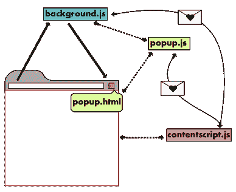
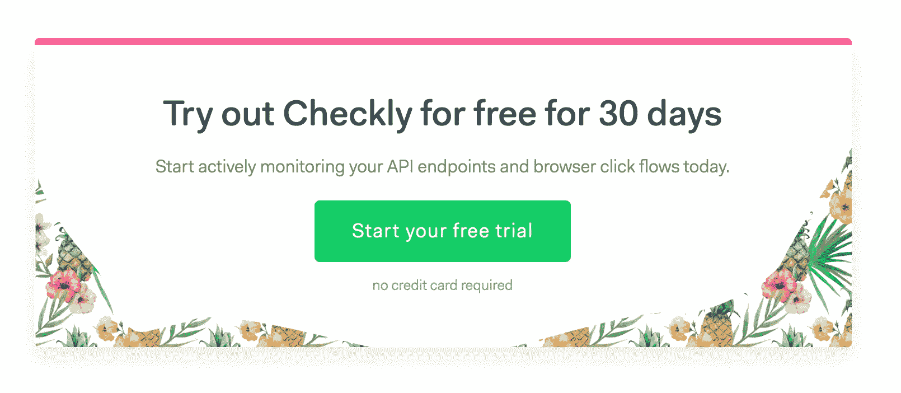

# 在 2018 年创建一个 Chrome 扩展:好的，坏的和不好的

> 原文：<https://medium.com/hackernoon/creating-a-chrome-extension-in-2018-the-good-the-bad-and-the-meh-8efcf6d28322>


“Actors as Construction Workers” by Utagawa Kunisada (1860) — [Museum of Fine Arts, Boston.](https://www.mfa.org/collections/object/a-roof-raising-ceremony-on-an-auspicious-day-kisshin-medetai-muneage-no-zu-actors-sawamura-tanosuke-iii-nakamura-shikan-iv-r-kawarazaki-gonj%C3%BBr%C3%B4-i-ichikawa-kodanji-iv-c-ichikawa-ichiz%C3%B4-iii-and-onoe-baik%C3%B4-45-later-jitsukawa-enjaku-i-l)

上周，我们发布了[木偶记录器](https://chrome.google.com/webstore/detail/puppeteer-recorder/djeegiggegleadkkbgopoonhjimgehda)的初始版本，这是一个谷歌 Chrome 扩展，记录你的浏览器交互并生成木偶脚本。

事实证明，Chrome 扩展开发*几乎*像真正的 web 开发，但是混合了一点奇怪的准嵌入式开发。

这篇文章向您介绍了创建扩展时的开发生命周期，并列出了一些架构上的问题。相关扩展的源代码在 [github](https://github.com/checkly/puppeteer-recorder) 上。

# 体系结构

谷歌的文档很好地向你介绍了扩展的所有活动部分，包括他们的[入门指南](https://developer.chrome.com/extensions/getstarted)。然而，这些文档混合解释了次要的关注点/方面，如安全性、打包、设置图标等。拥有五个核心架构组件。您最好设置项目的代码结构来反映这五个核心组件，即


因此它们反映了扩展中的组件:



*   manifest.json

这个文件引导您的扩展并提供元数据，如版本控制。没有这个，你就没有分机。

*   后台脚本

你扩展的核心和灵魂。您可以在这里创建一个监听器，当用户单击您的图标时实际触发弹出窗口。所有“硬”业务逻辑和原生浏览器交互应该尽可能放在这里。

*   内容脚本

内容脚本可以注入到浏览器的选项卡中，并在浏览器会话的上下文中访问 DOM。您可以在这里添加新的 DOM 元素，添加额外的侦听器等。注意:内容脚本是可选的

*   弹出用户界面

点击/激活分机时看到的小应用。可以用任何框架构建，比如 React 或 Vue，或者只是普通的 JS。我们用了 Vue。

*   选项页面用户界面

定制扩展设置的专用页面。这个页面应该将所有设置保存到存储中，以便插件的其他部分再次获取。

# chrome global

见见你的新好朋友👫的，`chrome`全局。你们会有很多时间在一起！其主要职能是:

1.  **在浏览器导航和界面点击上注册监听器&处理程序**。在下面的例子中，你可以看到当你点击弹出界面中的“记录”时运行的`start()`函数的缩略版本。

```
function start () {   // Inject the content script
  chrome.tabs.executeScript({file: 'content-script.js'})   // add various handlers to events     
  chrome.runtime.onMessage.addListener(MessageHandler)   
  chrome.webNavigation.onCompleted.addListener(NavigationHandler) 
  chrome.webNavigation.onBeforeNavigate.addListener(WaitHandler) // update the icon
  chrome.browserAction.setIcon({ path: './images/icon-green.png' })   
  chrome.browserAction.setBadgeText({ text: badgeState })  
  chrome.browserAction.setBadgeBackgroundColor({ color: '#FF0000' })
}
```

导航和打开/关闭弹出用户界面时需要保存的任何东西都应该放入`session`或`sync`存储中。`sync`商店应该通过与 Chrome Sync 连接的 Chrome 浏览器进行同步。更多信息，请参见下面的[状态](https://checklyhq.com/blog/2018/08/creating-a-chrome-extension-in-2018-the-good-the-bad-and-the-meh/#state)。

“全球化是坏的，米凯”。例如，测试任何使用它们的东西可能会很麻烦。当在多个通常松散耦合的对象上使用 global 时，事情很快变得棘手。话虽如此，Chrome 团队在保持`chrome`全球界面的最小化方面做得很好。将尽可能多的调用放在你的弹出用户界面之外，在那里你可能会使用一个“现代”的 web 框架，这将使事情保持理智。

# 状态

使用本机`chrome.storage` API 持久化状态。没有别的办法了。这将获取/设置你给它的 Javascript 对象，很像`localStorage` API。将它包装在某个非全局函数中有助于保持事物的理性。确保检查从存储返回的值，例如:

```
function loadState (cb) {   
  this.$chrome.storage.local.get(['controls', 'code'], ({
    controls, code }) => {
     console.debug('loaded controls', controls
     if (controls) {
       this.isRecording = controls.isRecording
       this.isPaused = controls.isPaused
     } if (code) {
       this.code = code
    } cb() 
  })
} function storeState () {
  this.$chrome.storage.local.set({
    code: this.code,
    controls: { 
     isRecording: this.isRecording,
     isPaused: this.isPaused
    }
  })
}
```

每个架构组件对状态的处理略有不同:

当通过点击工具栏上的图标来打开和关闭扩展时，弹出菜单会释放所有状态。您需要将所有内容写入会话存储，并在打开时重新加载它。

## 后台脚本的状态确实存在

后台脚本的行为有点像工作线程，因为除非调用显式的 reload 方法，否则它不会被重新加载。这意味着它应该(可能)作为你真理的主要来源

## 内容脚本的状态取决于许多因素

内容脚本完全取决于页面重新加载以及如何/是否/何时注入。在木偶记录器的特定情况下，内容脚本将消息处理程序附加到当前页面中的元素。这些处理程序将我们想要记录的事件消息发送给后台工作人员。

## 存储有非常严格的限制

是的，本地为 5，242，880 字节/ 5Mb，同步为 102，400 字节/ 0.1Mb。对存储中的个别项目也有限制。参见[文档](https://developer.chrome.com/apps/storage#property-local)

浏览器环境中的状态总是很棘手，不是真正的扩展问题。努力的分数🤙

# 信息发送

组件之间的通信是通过发送消息和在`chrome`全局上添加监听器来完成的。

```
chrome.runtime.onMessage.removeListener(handleMsg) chrome.runtime.sendMessage(msg) function handleMsg (msg) { console.log(msg) }
```

这应该是所有 JS 开发者都非常熟悉的。没有虚饰，只是作品。竖起双拇指👍 👍

# 编码

除了`chrome`全局和它的消息传递和状态函数之外，对您编写的实际代码基本上没有任何限制。任何 Node.js 或前端开发人员都应该非常熟悉。

我们将 ES6/7 与 Vue.js 一起用于弹出窗口，并使用了 Vue.js eco(以及更大的)系统的大多数常见部分，如 Webpack、Vue 测试实用程序和单个文件组件。见[建筑](https://checklyhq.com/blog/2018/08/creating-a-chrome-extension-in-2018-the-good-the-bad-and-the-meh/#building)了解更多关于这个话题。

**重新加载一个扩展有一些怪癖**，因为你的内容脚本被绑定到一个动态分配的端口，这个端口在完全重新加载后会消失。这是意料之中的，但是 console.log 受到了错误的攻击。除了在连接周围添加一个`try/catch`块并丢弃消息之外，我没有找到其他解决方法。

```
function sendMessage (msg) {
  console.debug('sending message', msg) try {   
   chrome.runtime.sendMessage(msg)
  } catch (err) {
  console.debug('caught err', err) }
}
```

# 排除故障

Chrome 的开发工具非常适合调试代码，在构建扩展时也是如此。然而，您可能需要打开多达四个单独的开发工具窗口来获得完整的画面:内容脚本、背景、弹出 UI 和选项 UI 都在单独的上下文中运行。

*   **内容脚本**使用当前浏览器窗口的开发者工具。
*   **背景**使用定制的开发者工具，可从您的扩展页面访问。


*   **弹出和选项**通过在弹出/选项窗口的 UI 中点击右键，点击**检查**打开

准备做一些漂亮的窗口俄罗斯！当然，从技术上来说这是有意义的，但是工作流程会受到极大的影响，尤其是当你习惯于 React、Vue 或普通 JS 应用程序开发，并且你有一个所有调试语句的需求时间表时。在一个控制台中。

# 建筑物

公平地说，你实际上不需要来构建任何东西。你可以只写普通的 JS，把它打包成一个. zip 就完成了。然而，当你习惯了像 Vue.js 和 ES6/ES7 语法这样的技术，你就会进入巴别塔和 Webpack 的土地:

*   传输 ESx
*   Vue.js 单一文件组件
*   萨斯/SCSS 汇编

获得正确的构建有点棘手，因为具体的 Webpack 示例和相应的版本似乎比光速还快。

所以，长话短说，看看 Github 上的 [webpack config](https://github.com/checkly/puppeteer-recorder/blob/master/webpack.config.babel.js) 和相应的 [package.json](https://github.com/checkly/puppeteer-recorder/blob/master/webpack.config.babel.js) ，你就能知道什么适用于木偶录制器。

# 测试

我们使用 [Jest](https://jestjs.io/) 进行测试。我们不追求 100%的测试覆盖率，正如我们所说的，测试正在增加。它们分为三类:

1.  模块或功能级别的单元测试
2.  UI 测试渲染 Vue.js 组件并使用 Jest [快照](https://jestjs.io/docs/en/snapshot-testing#snapshot-testing-with-jest)来验证正确性
3.  End 2 结束构建和安装扩展的测试。

对于 1 和 2，除了你必须…

## 模拟调用`chrome`全局

它的方法。您可以在这里发疯，但我们设法(目前)通过一个相当简单的模拟。下面的(编辑过的)例子显示了一个 Vue 组件被挂载、注入了一个 mock 并被断言。实际测试在 Github 上的 [App.spec.js](https://github.com/checkly/puppeteer-recorder/blob/master/src/popup/components/__tests__/App.spec.js) 进行。

```
import { mount } from '@vue/test-utils'
import App from '../App'const chrome = {
  storage: {
   local: { get: jest.fn() } },
   extension: { connect: jest.fn() 
  } 
}const mocks = { $chrome: chrome }describe('App.vue', () => {
  test('it has the correct pristine / empty state', () => {
   const wrapper = mount(App, { mocks })    
   expect(wrapper.element).toMatchSnapshot()
  }) 
})
```

## 使用木偶师检查构建和安装

最后，您需要向 Google 提交一个包含代码的 zip 文件，以便在网络商店上发布。您可能想知道可分发的“二进制文件”实际上是如何安装的。你可以用木偶师测试一下。下面的例子展示了我们如何构建代码并将其作为扩展安装在 Chrome 实例中。

当使用 Jest 时，一定要通过使用`--runInBand`标志按顺序运行这些测试用例。

```
import puppeteer from 'puppeteer'
import path from 'path'
import { scripts } from '../../package.json'
const util = require('util') const exec = util.promisify(require('child_process').exec) const extensionPath = path.join(__dirname, '../../dist')describe('build & install', () => {
  // Calls the standard 'npm dist' script used to build the
distributable    test('it builds the extension', async () => {
    const { stderr } = await exec(scripts.dist) 
    expect(stderr).toBeFalsy() 
   }, 15000) 

  // boots a Chrome instance using Puppeteer and adds the extension we build in the earlier test   test('it installs the extension', async () => {
   const options = {
     headless: false, ignoreHTTPSErrors: true,
     args: [
       `--disable-extensions-except=${extensionPath}`,
       `--load-extension=${extensionPath}`,
       '--no-sandbox',
       '--disable-setuid-sandbox'
   ]
  } 
  const browser = await puppeteer.launch(options) 
  expect(browser).toBeTruthy() 
  await browser.close()
 }, 5000)
})
```

# 分配

在网上商店获得扩展是一个分三部分的过程。

## 1.将您的代码打包成一个 zip 文件

您的扩展需要以 zip 格式上传到 Google。您可以让构建工具为您创建一个 zip 文件。我们从 [Kocal 的 vue-web-extension](https://github.com/Kocal/vue-web-extension) repo 中“偷”了这个脚本，在[脚本目录](https://github.com/checkly/puppeteer-recorder/tree/master/scripts)中检查它。
感谢 Kocal 和 Google 保持了像 zip 文件一样简单的分发格式👌。

## 2.创建一个 Chrome 网络商店开发者账户

在[https://chrome.google.com/webstore/developer/dashboard](https://chrome.google.com/webstore/developer/dashboard)的网上商店设立开发者账户

*注意:在发布之前，你必须一次性支付 5 美元的费用。好吧，不管怎样，看起来很公平。*

## 3.提供图片和视频

不要吝啬这个！我们用荷兰语说，意思是“不要让眼睛看不见！”。感谢谷歌为你提供了许多品牌和推广选项:图标，各种尺寸的推广图片，Youtube 上的演示链接等等。

*最初发表于*[*【checklyhq.com】*](https://checklyhq.com/blog/2018/08/creating-a-chrome-extension-in-2018-the-good-the-bad-and-the-meh/)*。*

附:如果你喜欢这篇文章，请用**鼓掌**来表达你的欣赏👏下面还有 [**在 Twitter 上关注我**](https://twitter.com/tim_nolet) **！**但是等等，还有更多！

