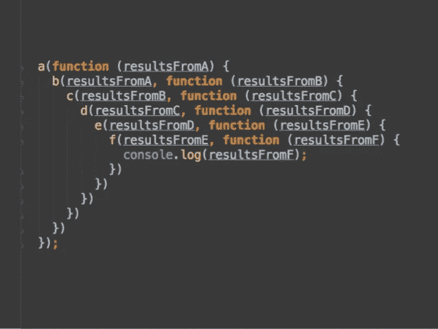

# 创建足球池作为学习 Node JS 的借口

> 原文：<https://medium.com/hackernoon/creating-a-football-pool-as-an-excuse-to-learn-node-js-4aa978b7ca61>

经过 4 年的等待，我们迎来了另一届充满惊喜的世界杯，我再次决定开一个足球赌局，或者在拉丁美洲被称为 quiniela，来欺骗我所有的朋友…我想了解更多。我的第一次经历是在 2014 年使用 PHP 和 Yii 创建它，但这一次我想学习一些新的和新鲜的东西。

我想分享我使用 Node 的经验和我达成的解决方案。

*注意:这篇文章是关于我用 Node 创建我的第一个应用程序的经历，绝不是初学者的实际指南。如果你是新来 Node 的，你会发现有几个指南会对你更有帮助，包括* [*官方指南*](https://nodejs.org/en/docs/guides/getting-started-guide/) *。当然，我总是渴望尽我所能提供帮助。*

## **为什么节点？**

在过去的几年里，我一直在使用 Python 进行 web 开发，每次我搜索新闻时，他们都在谈论 Node，所以我决定加入酷孩子俱乐部并尝试一下。


Me

## **规则**

在开始之前，我需要制定今年的规则。我不认为这些是标准规则，但根据我的经验，这些规则非常有趣(特别是在最后一场比赛中，一两分就能让你获胜):

*   所有用户必须在比赛开始前输入预测。
*   如果一个分数的预测与最终结果完全吻合，他得 3 分。
*   如果不是完全匹配，但有相同的赢家，那么他赢得 1 分。示例:如果用户 A 选择 3–0，实际得分为 2–1，则用户获得 1 分。
*   如果比赛是平局，用户也预测平局，他将获得 1 分。例如:如果用户 B 走 3-3，得分是 1-1，那么用户得到 1 分。
*   获胜者是得分最多的用户。

# 结构

(你可以在这里得到完整的代码)

我需要做的第一件事是找到一个易于理解同时又可扩展的结构。最后我决定使用一个有点类似于我更熟悉的[烧瓶蓝图](http://exploreflask.com/en/latest/organizing.html)的结构(小步骤！).

```
api/
|-- config.js
|-- controllers
|   |-- database.js
|   `-- positions.js
|-- matches
|   |-- index.js
|   `-- matches.js
|-- teams
|   |-- index.js
|   `-- teams.js
`-- users
    |-- index.js
    `-- users.js
```

这种结构将 API 和视图的每个主要特性的功能组织在一个目录中。因为这是一个小项目，所以我只使用了一个索引文件来展示路由器和一个文件来存储端点。

配置文件包含用于更改应用程序行为的变量，并存储其他配置，例如 Oauth 的 id

api 目录中每个组件的简要描述:

## 组

显示所有团队的信息，或者只显示一个团队的 id。

## 用户

计算每个用户的总积分，并在比赛前更新每个用户的预测。

## 比赛

包含查看匹配结果、更新结果、获取下一个匹配或 n 个最后匹配的控制器。

## 控制器

任何其他组件使用的函数。主要用于处理与数据库的连接和查询。说到这个…

# 数据库ˌ资料库

我的第二个问题是找到一种方法来存储团队、预测、日期和结果的信息。尽管我找到的大多数指南都推荐不同的方法(比如非关系数据库)，但我选择使用 Postgres，主要是因为这是我通常做的，而且我不想增加更多的难度，因为我在几天后就要开始第一场比赛了(拖延，万岁！).

数据库很简单，只包含四个表:

*   Matches:存储每场比赛的日期和最终结果。
*   团队:每个团队的名称。
*   预测:每个用户预测的分数。
*   用户:用于识别每个用户的名称和用于登录的电子邮件。

# API

## 按指定路线发送

为了创建 API，我使用了 [Express](http://expressjs.com/) 和它强大的[路由器](http://expressjs.com/en/guide/routing.html)组件。有了它，我可以像创建结构一样分离路由，并使用路由器在每个模块中创建端点:

```
// An example of matches.js inside api/matches
// obtain router
const express = require('express'),
      router = express.Router()
...// example of an endpoint. 
router.get("/all", (req, res) => {
  console.log("obtain all matches");
  // do stuff
})
```

在 server.js 文件中，我从其他模块导入所有路由:

```
// require express and import the routes in the api directory
const express = require('express');
      matches = require('./api/matches'),
      teams = require('./api/teams'),
      users = require('./api/users'),
...// register the routes in the app
app.use('/teams',teams)
.use('/matches', matches)
.use('/users', users)
... // other routes
```

## Postgres

为了管理数据库会话和查询，我使用了[节点-postgres](https://node-postgres.com/) 。使用这个库，您可以从环境中获得数据库 url(更安全，在 Heroku 等一些地方使用):

```
const { DATABASE_URL } = process.env;
var pool = new Pool({
    connectionString: DATABASE_URL
});
```

或者创建对象并将其传递给池:

```
var pool = new Pool({
      user: 'username',
      host: 'localhost',
      database: 'database_name',
      password: 'my_password',
      port: 5432
    });
```

建立连接后，您可以执行如下查询:

```
// connect pool and query all teams in table
pool.connect()
  .then(client => {
      return client.query("SELECT * FROM teams")
        .then(data =>{
          // do stuff with the data
          ...
        })
```

有了这两个组件，我就可以开始编写每个模块所需的端点代码，并将数据存储在数据库中

顺便说一下，如果你认为这个查询的代码很难看，那你就对了！我正在下降到地狱… [回调地狱](http://callbackhell.com/)



But that’s a story for another day

如果你想测试应用程序，请遵循以下步骤。

## 要求

*   节点 js(显然)
*   npm
*   postgres
*   浏览器或 curl 来查看响应

## 安装

首先从 github 克隆项目:

```
git clone [https://github.com/agmezr/quiniela.git](https://github.com/agmezr/quiniela.git)
```

项目的结构:

*   api/:控制器、视图和响应
*   assets/:包含数据库的脚本
*   server.js:配置和启动服务器的文件
*   包 json:用于安装所需的依赖项

使用 npm 安装项目的依赖项:

```
npm install
```

运行 assets/database.sql 中的脚本来创建数据库:

```
psql <db name | postgres> -f assets/database.sql
```

安装完依赖项和数据库后，使用以下命令运行服务器:

```
node server.js
```

如果一切正常，您应该会看到如下消息:

```
Staring app on 8080
```

现在打开您的浏览器(或使用 curl)并访问 localhost:8080/index，您会看到一个令人惊叹的响应:

```
{"status":"ok"} 
```

如果您看到该响应，则一切都在运行。您可以与其他端点一起玩，例如查看第一个团队的信息，请输入:

```
[http://localhost:8080/teams/1](http://localhost:8080/teams/1)
```

您将看到以下响应:

```
[{"id":1,"name":"Russia","grp":"A"}]
```

# 后续步骤

在接下来的文章中，我想分享我使用 Oauth 的经验，让用户使用 Google 帐户登录，并创建视图来友好地显示数据，最后将其部署到 Heroku 上。

# 结论

当我的一只拳头接近 Node 时，我想说和它一起工作非常愉快。有很多帮助初学者的指南，包括官方文档和更多的库，可以帮助你完成一些常见的任务，如安全性、数据库连接等。当然，有些事情一开始很难理解，比如[承诺](https://developer.mozilla.org/en-US/docs/Web/JavaScript/Reference/Global_Objects/Promise)和新的 [ES6 语法](https://www.w3schools.com/js/js_es6.asp)，但是没有什么是几个小时的编码不能解决的。

如果你想尝试 Node JS，我的建议是像我一样创造一些简单有趣的东西，并小心**回调地狱**！