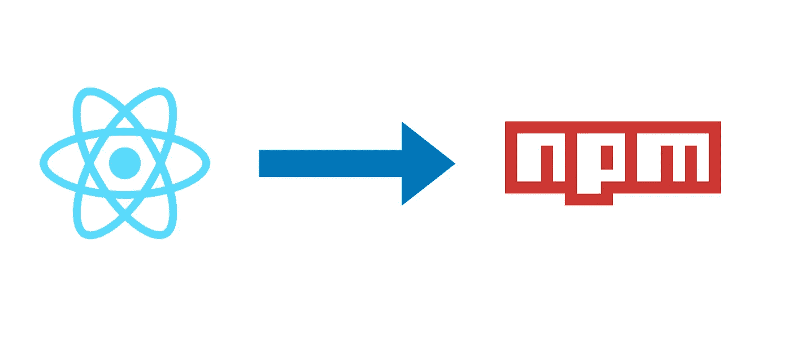
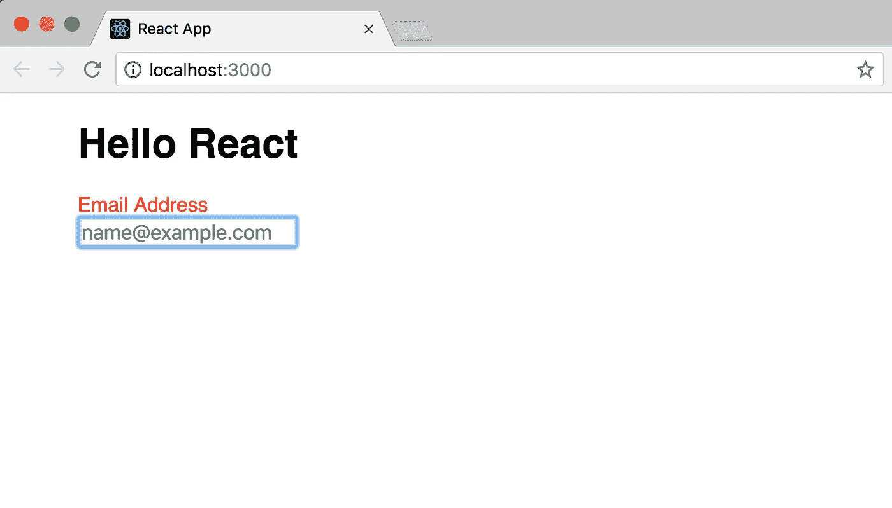

# 使用 Create React App 创建 React 组件库

> 原文：<https://medium.com/hackernoon/creating-a-library-of-react-components-using-create-react-app-without-ejecting-d182df690c6b>



**更新**:您可以使用 npm 包`[create-component-lib](https://www.npmjs.com/package/create-component-lib)`来自动化这篇博文中描述的所有步骤。

[](https://www.npmjs.com/package/create-component-lib) [## 创建组件库

### 创建可以发布到 npm 的 React 组件库

www.npmjs.com](https://www.npmjs.com/package/create-component-lib) 

Create React App 是创建和开发 React 应用程序的最佳工具。只需一点点工作，它还可以用来创建一个 React 组件库，可以发布到`npm`并在其他 React 应用程序中使用。你需要做的是:

1.使用`create-react-app`创建一个新项目:

```
create-react-app simple-component-library
```

2.删除`src/`中的所有文件，用一些启动代码创建一个新的`index.js`文件:

src/index.js

3.创建一个新文件夹`src/lib`，并将 React 组件放入其中。`src/lib`将作为发布到`npm`的模块的根文件夹。下面是一个示例组件的代码:

src/lib/TextInput.js

样式可以内联完成，也可以在单独的 CSS 文件中完成:

src/lib/TextInput.css

最后，为了便于导入，组件可以从`src/lib`导出:

src/lib/index.js

可选地，你也可以[为`src/lib`中的组件编写测试](https://github.com/facebook/create-react-app/blob/master/packages/react-scripts/template/README.md#running-tests):

src/lib/TextInput.test.js

4.*(可选)*使用`src/index.js`中的组件创建开发期间测试和调试的示例。任何放置在`src/lib`之外的代码都不会发布到`npm`。以下是`TextInput`的用法示例:

src/index.js

运行`npm start`并导航至`http://localhost:3000`查看结果。



It works (duh!)

提示:使用`[react-live](https://github.com/FormidableLabs/react-live)`创建一个可实时编辑的文档站点！

5.使用命令`npm i babel-cli --save-dev`安装`[babel-cli](https://babeljs.io/docs/usage/cli/)`,并在项目的根目录下创建一个文件`.babelrc`,内容如下:

```
{
  "presets": [["react-app", { "absoluteRuntime": false }]]
}
```

6.用以下内容替换`package.json`中的`build`脚本:

```
"build": "rm -rf dist && NODE_ENV=production babel src/lib --out-dir dist --copy-files --ignore __tests__,spec.js,test.js,__snapshots__"
```

命令`npm run build`现在将把`src/lib`中的代码(忽略测试和快照)传输到文件夹`dist`中。

7.从`package.json`上拆下管路`"private": true`。同时从依赖关系中移除`react-scripts`、`react`和`react-dom`，并将它们移动到`[devDependencies](https://docs.npmjs.com/files/package.json#devdependencies)`。此外，您还可以在`[peerDependencies](https://docs.npmjs.com/files/package.json#peerdependencies)`中添加`react`和`react-dom`。

8.为了准备发布，将下列行添加到`package.json`:

```
 "main": "dist/index.js",
  "module": "dist/index.js",
  "files": [ "dist", "README.md" ],
  "repository": {
    "type": "git",
    "url": "URL_OF_YOUR_REPOSITORY"
  }
```

9.移除默认的`README.md`文件，并创建一个包含库信息的新文件。

```
# simple-component-library
A library of React components created using `create-react-app`.## Installation
Run the following command:
`npm install simple-component-library`
```

10.[发布到](https://docs.npmjs.com/getting-started/publishing-npm-packages) `[npm](https://docs.npmjs.com/getting-started/publishing-npm-packages)`！

```
npm run publish
```

就是这样！现在，您可以使用命令`npm install simple-component-library`安装这个库，并在使用 Create React App 创建的任何项目中使用它。以下是本文的完整代码:

[](https://github.com/aakashns/simple-component-library) [## aakashns/简单组件库

### 这个例子演示了使用 Create React App 创建 React 组件库

github.com](https://github.com/aakashns/simple-component-library) 

您可以克隆存储库，并以此为起点跳过一些步骤。希望有帮助！