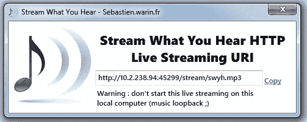

# 创建音乐流媒体服务器和实况音乐播放 android 客户端

> 原文：<https://medium.com/hackernoon/creating-a-music-streaming-server-and-live-music-playing-android-client-c12cd0600e56>


当我参加 [Smart India 黑客马拉松决赛](https://innovate.mygov.in/sih2018/)时，我有一次很棒的经历，我们解决了一个公告系统的问题。所以，我决定写一篇博客，介绍如何在 NodeJS 中制作一个简单的音频/音乐流媒体服务器，以及一个简单的 android 应用程序，它将实时播放音频。通过使用以下代码，您可以创建自己的本地简单音乐流服务器，并且可以在 android 客户端或浏览器上实时欣赏音乐。所以，我们打开烤箱来做这道菜吧。

# 创建一个简单的音乐流媒体服务器

你可以使用任何方法来制作自己的流媒体服务器，但我在这里发现的最简单的方法是使用开源软件 **SWYH** (流媒体播放你听到的内容)。你可以查看官方网站[这里](https://www.streamwhatyouhear.com/)。该应用程序仅适用于 windows，可以从[这里](https://www.streamwhatyouhear.com/download/)下载。你也可以使用 [**IceCast**](http://icecast.org/) 为好。

这里重要的是，我们不需要维护一个缓冲区，然后在一些代码的帮助下通过请求传输音频块。我们使用这些软件来为我们处理权重，因此很容易获得一个音频流的 url。

一旦安装好 **SWYH** 后，请按照这里的步骤[开始](https://www.streamwhatyouhear.com/getting-started/)。如果一切顺利，您将会看到以下画面:



在这里你可以查看 *URL* 作为服务器的某个本地地址和 **/stream/swyh.mp3** 的路由。要听音乐，您必须连接到带有 SWYH 的机器所连接的同一个 **wifi 网络**。您可以创建一个简单的热点，或者您可以连接到您自己的网络在家里。*这是必须的，那些想要收听流的设备应该连接到同一个网络*。现在我们准备向前迈进。

您可以简单地将 SWYH 显示的 *URL* 粘贴到浏览器中，然后就搞定了！！你也可以在那个设备上听音乐。当然，需要有人在安装了 SWYH 的机器上播放音乐。现在你已经准备好了流媒体服务器，我们可以构建 android 应用程序了。如果你到目前为止还不明白以上内容，请不要担心，随着我们的深入，它会变得清晰，或者你可以检查 *SWYH* 的*文档*以获得清晰的理解。

# 创建 NodeJS 流服务器

让我们假设你想让你的流媒体公开，世界上的每个人都可以听到你的 Weekend，Linkin-Park，Queen(我最喜欢的一个:我想挣脱束缚；-)等。您可以创建一个简单的 nodeJS 服务器来**传输**当前由 **SWYH** 软件传输的流。

要将流传输到不同的 URL，我们可以使用`request` `node module`。你所要做的就是首先安装`request`节点模块。

```
$ npm install request --save
```

一旦你安装了`request`模块，你就可以在你的`Express server`中使用它

```
var express = require('express');
    var path = require('path');
    var request = require('request');

    var app = express()

    app.get('/playback.mp3', function(req, res){

    //the request module is piping the steam over the get request coming on playback.mp3
    request.get('http://<your-swyh-url:56789>/stream/swyh.mp3').pipe(res, function(error){
       		console.log(error);
       });
    });

    //here the server is localhost and listening on the port 8000
    app.listen(8000,function(){
	console.log("Listening on 8000");
    });
```

正如你所看到的，我们正在通过管道将流从一个 *URL* 传输到另一个 *URL* ，即从一个服务器传输到另一个服务器。在这里，我想提一下，你可以使用`request.get(...)`功能中的任何链接。举个例子，你也可以用[这个](http://playerservices.streamtheworld.com/api/livestream-redirect/KUFXFM_SC)。

```
//....
request.get('[http://playerservices.streamtheworld.com/api/livestream-redirect/KUFXFM_SC](http://playerservices.streamtheworld.com/api/livestream-redirect/KUFXFM_SC)')
.pipe(res,function(error){
//....
 });
```

答对了。！现在你知道如何制作一个简单的音乐流媒体服务器了！！！这里完成了一半的食谱。

# 烘焙 android 客户端

创建一个 android 客户端应用程序来收听实时音频非常简单。我们将使用 android 框架中现有的`MediaPlayer`类。在这里查看描述。

它在后台处理音频缓冲，可以从 android 设备的扬声器中听到音频。下面是一个`onCreate()`方法中的代码:

```
public class MainActivity extends AppCompatActivity {
    //....//declaring the MediaPlayer
    MediaPlayer mp;

    @Override
    protected void onCreate(Bundle savedInstanceState) {
    	super.onCreate(savedInstanceState);
        setContentView(R.layout.activity_main);
        //...
        //...
        String streamURL = "your-music-streaming-url-whatever";
        //Instantiating the MediaPlayer class

        mp = new MediaPlayer();

        //setting the audio stream type to Streaming music
        try{

            mp.setAudioStreamType(AudioManager.STREAM_MUSIC);
            mp.setDataSource(streamURL);
            mp.prepareAsync();

        }catch (Exception e){
            e.printStackTrace();
        }

        //catching the error if any
        mp.setOnErrorListener((mediaPlayer,what,extra)->{
            mediaPlayer.reset();
            return false;
        });

    }
```

这里，我们已经初始化了`MediaPlayer`，音频流类型被设置为`STREAM_MUSIC`。`DataSource`被设置为我们用来传输音频/音乐的`URL`。

有趣的是`prepareAsync()`方法。这个方法创建了一个对 URL 的异步请求**并将网络隔离在`MainThread`之外。`MediaPlayer`异步调用我们服务器的`GET`方法，并响应请求发送 audi 包。音频包被捕获并存储在缓冲器中。**

当缓冲区被加载到足以播放一些音乐时，媒体播放器准备将声音发送到扬声器。`SetOnPreparedListener`用于检查上面的情况，我们可以`play()`播放音乐。下面的代码显示了写在上面代码正下方的`SetOnPreparedListener`。

```
mp.setOnPreparedListener((mediaPlayer)->{
    	//TODO:use some button to play and pause the music
        // you can use this with some button click action as well
    	if(playButton.isChecked()){
        	mp.start();
        }else{
        	mp.pause();
        }

    });
```

`mp.start()` call 将播放扬声器中的声音，您可以享受美妙的音乐。哇！！

现在，当我们在制作这个食谱的时候制造了一些混乱，我们需要把事情做好，除非我们将面临 android 中的大量内存泄漏。在您的`onDestroy()`和`onStop()`方法中添加以下代码，您就可以开始了:

```
//...
    @Override
    protected void onDestroy() {
        super.onDestroy();

        if (mp!=null){
            if (mp.isPlaying()){
                mp.stop();
            }
            mp.release();
            mp = null;
        }
     //...
```

好吧，我要去听一些皇后乐队和酷玩乐队。有任何疑问吗？评论部分在下面↓。

> 音乐之父

[](http://buymeacoff.ee/mrcurious)

Support me !