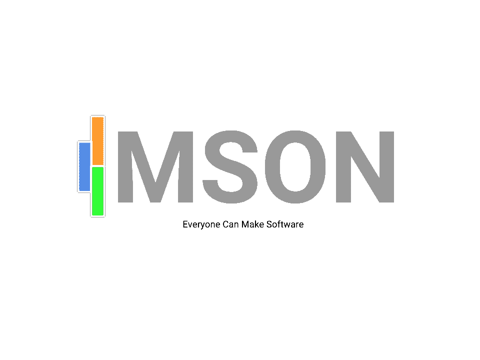
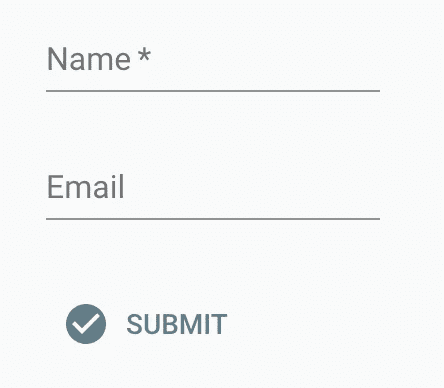
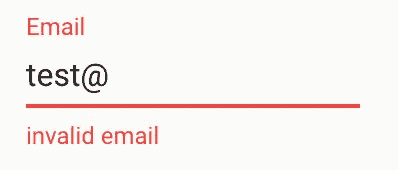
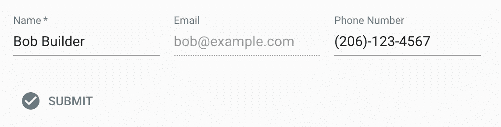
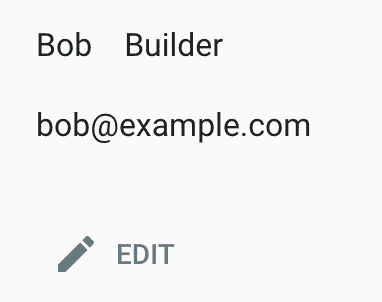
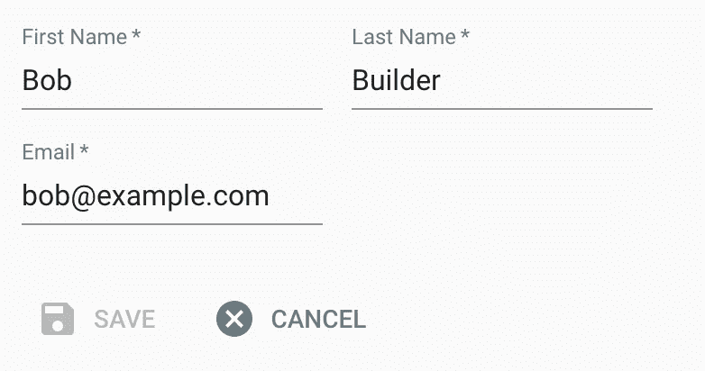
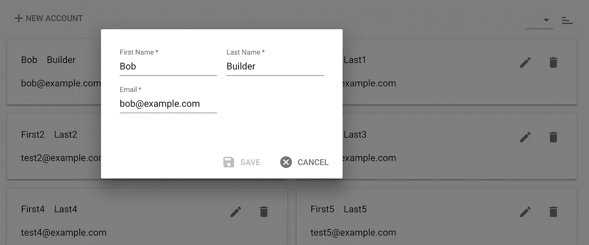

# 创造一种新的编程语言，让任何人都可以制作软件

> 原文：<https://medium.com/hackernoon/creating-a-new-programming-language-that-will-allow-anyone-to-make-software-7a8c73238dc2>



## 在过去的 7 个月里，我一直在开发一种新的编程语言，叫做 MSON。这是一个关于我为什么这么做，它是如何工作的，以及我想把它带到哪里的无聊帖子。

# 已经有数十亿种编程语言，为什么我们还需要另一种呢？

软件继续蚕食世界，软件开发工具也在以闪电般的速度发展，但是开发软件仍然需要深入了解编程语言。当然，有数以百万计的开源项目可以融合在一起，强大的云平台可以让这个过程变得更容易，但让所有这些技术协同工作需要相当高的技能。当我展望未来时，我想象普通人能够制作软件，就像普通人今天能够创建电子表格一样。

创建电子表格已经变得司空见惯，这在很大程度上是 MS Excel 中直观的用户界面(UI)的结果。开发软件；然而，仍然只有相对少数的人使用复杂的编程语言来完成。有人可能会说，创建一个生成代码的 UI 有些琐碎，但要逆转这个过程并消化编码的逻辑几乎是不可行的，因为大多数编程语言有几乎无限多种表示逻辑的方式。换句话说，我们通常不知道一个软件将如何执行，直到我们实际执行它。创建一种真正直观的软件开发方式需要一种新的范式，一种易于 UI 读取、修改和编写的新语言。

早在 2003 年，当 PHP 非常流行的时候，我开始构建一个叫做 FORMfields 的框架。当时，FORMfields 非常酷，因为你可以用 PHP 对象创建表单，然后 FORMfields 会自动生成相应的 HTML、CSS 和 JS。在创建了 FORMfields 后不久，我与人合伙创办了一家名为 GoExpo 的公司，生产基于 FORMfields 的事件管理软件。GoExpo 每年为世界上一些最大的贸易展处理数百万美元的展位销售，这是 FORMfields 有效性的证明。

这些年来，FORMfields 在允许我们的团队创建一个可以快速修改的一致的 UI 方面仍然是必不可少的(记住，这是在 Twitter Bootstrap 和更现代的 UI 框架出现之前的日子)。然而，随着浏览器变得越来越强大，更多的逻辑转移到了前端；而用 PHP 写的 FORMfields 只在后端运行。

快进到 2018 年，JavaScript 是网络的主力，前端和后端的区别就像白天和黑夜。GoExpo 已经被收购，我现在有时间用一个更现代的堆栈来重新审视表单域的概念。我希望下一代表单域既能在浏览器中运行，也能在后端运行，是开源的，并成为大众可以使用的东西的基础。

这种思路催生了 [MSON](https://github.com/redgeoff/mson) ，这是一种可扩展的声明式语言，可以通过用户界面轻松操作。MSON 只由几个构件组成，但是它和它的非声明性对应物一样强大。

这个初始帖子的目的是介绍 [MSON](https://github.com/redgeoff/mson) 编程语言的核心原则，并阐述其独特的设计。我计划稍后写一篇后续文章，从外行人的角度解释 MSON。这个帖子；然而，它是相当技术性的，因为它是关于 MSON 的开发人员层的东西，而不是关于我将在其上编写的通用 UI 层。我将阐述以下主题:

1.  声明语法
2.  组件、验证器、事件和监听器
3.  访问控制
4.  继承、模板参数和组合
5.  聚合组件
6.  模式和自我文档
7.  用户定义的 JavaScript 组件
8.  在任何 JavaScript 代码中使用 MSON
9.  在整个堆栈中重用 MSON 代码
10.  输入/输出属性

然后，我将以一份关于我计划如何将 MSON 货币化并使其成为一个自我维持的项目的声明来结束我的发言。我很想听听你的想法。

# 语言原则

## 声明语法

MSON 是模型脚本对象符号的缩写，它有意类似于 JSON (JavaScript 对象符号)。事实上，MSON 是 JSON 的子集，所以如果你知道 JSON，那么你就知道 MSON 的语法！

声明性语言对于软件来说更容易阅读和编写，因为它们定义了软件必须做什么，而没有确切地说明如何做。JSON 是一个很好的基础。它只包含几个主要的构造，无处不在，并由一个巨大的生态系统支持。

## 成分

MSON 最小的建筑块叫做组件。组件维护状态，也可以控制表示，非常类似于大多数 web 框架中常见的组件。组件可以继承、包含或包装其他组件。渲染层支持不同环境的插件，默认插件支持 React 和 Material-UI。呈现层的使用是可选的，因此组件可以在前端和后端使用。

用于收集姓名和电子邮件地址的简单表单组件如下所示:

```
{
  name: 'MyForm',
  component: 'Form',
  fields: [
    {
      name: 'name',
      component: 'TextField',
      label: 'Name',
      required: true
    },
    {
      name: 'email',
      component: 'EmailField',
      label: 'Email'
    },
    {
      name: 'submit',
      component: 'ButtonField',
      label: 'Submit',
      icon: 'CheckCircle'
    }
  ]
}
```

当它呈现时，看起来像是:



而且，实时验证是自动进行的:



这篇文章中剩下的大部分例子将集中在表单组件上，因为它们易于可视化，但是 MSON 可以支持任何类型的组件，例如菜单、快捷菜单、重定向等。此外，你可以使用 JavaScript 创建用户定义的组件，这些组件可以做你能想到的任何事情。

## 验证器

每个字段都有一组默认的验证器，例如 email 字段确保电子邮件地址的格式有效。您还可以为特定的字段甚至整个表单扩展这些验证器。

例如，您可以阻止用户输入*nope@example.com*:

```
{
  name: 'MyForm',
  component: 'Form',
  fields: ...,
  validators: [
    {
      where: {
        'fields.email.value': '[nope@example.com](mailto:nope@example.com)'
      },
      error: {
        field: 'email',
        error: 'must not be {{fields.email.value}}'
      }
    }
  ]
}
```

像`{{fields.email.value}}`这样的模板参数可以用来注入字段的值。并且，您可以在`where`中使用任何 [MongoDB 风格的查询](https://docs.mongodb.com/manual/reference/operator/query/)。例如，如果您有`password`和`retypePassword`字段，您可以确保它们等价于:

```
where: {
  'retypePassword.fields.value': {
    $ne: '{{fields.password.value}}'
  },
  error: ...
}
```

**事件&监听器**

对组件中属性的更改会生成事件，您可以创建用操作响应这些事件的侦听器。有设置、发出、电子邮件、联系 API 等基本动作，也可以使用 JavaScript 构建自定义动作。

以下示例根据用户单击`submit`按钮时在`name`字段中提供的值设置`email`字段的值:

```
{
  name: 'MyForm',
  component: 'Form',
  fields: ...,
  validators: ...,
  listeners: [
    {
      event: 'submit',
      actions: [
        {
          component: 'Set',
          name: 'fields.email.value',
          value: '{{fields.name.value}}[@example](http://twitter.com/example).com'
        }
      ]
    }
  ]
}
```

我们也可以使该操作有条件，例如，仅在`email`为空时设置它:

```
listeners: [
  {
    event: 'submit',
    actions: [
      {
        component: 'Set',
        if: {
          'fields.email': {
            $or: [
              {
                value: null
              },
              {
                value: ''
              }
            ]
          }
        },
        name: 'fields.email.value',
        value: '{{fields.name.value}}[@example](http://twitter.com/example).com'
      }
    ]
  }
]
```

有时我们希望嵌套操作，以便在执行所有操作之前满足一个条件:

```
listeners: [
  {
    event: 'submit',
    actions: [
      {
        component: 'Action',
        if: {
          'fields.email': {
            $or: [
              {
                value: null
              },
              {
                value: ''
              }
            ]
          }
        },
        actions: [
          {
            component: 'Set',
            name: 'fields.email.value',
            value: '{{fields.name.value}}[@example](http://twitter.com/example).com'
          },
          {
            component: 'Set',
            name: 'fields.name.value',
            value: '{{fields.name.value}} Builder'
          }
        ]
      }
    ]
  }
]
```

**访问控制**

与大多数编程语言不同，access control 是 MSON 的一等公民，所以它很容易使用，不需要做很多工作。对于创建、读取、更新和归档操作，可以在表单或字段层限制访问。(MSON 旨在鼓励数据存档而不是删除，以便在数据意外存档时可以恢复。当然，您可以在需要时永久删除数据)。

每个用户可以拥有任意数量的用户定义的角色，并且访问权限仅限于拥有指定角色的用户。还有一个为数据所有者定义的系统角色`owner`。首先检查字段层访问，如果缺少字段层访问，将级联检查表单层访问。如果在表单层没有定义访问权限(也没有在字段层定义)，所有用户都有访问权限。

下面是一个配置示例:

```
{
  name: 'MyForm',
  component: 'Form',
  fields: ...,
  validators: ...,
  listeners: ...,
  access: {
    form: {
      create: ['admin', 'manager'],
      read: ['admin', 'employee'],
      update: ['admin', 'owner', 'manager'],
      archive: ['admin']
    },
    fields: {
      name: {
        create: ['admin'],
        update: ['owner']
      }
    }
  }
}
```

其中，只有拥有`admin`或`manager`角色的用户可以创建记录。此外，只有记录的所有者可以修改`name`。

**继承**

继承用于向组件添加额外的功能。例如，我们可以扩展`MyForm`并添加一个电话号码:

```
{
  name: 'MyFormExtended',
  component: 'MyForm',
  fields: [
    {
      name: 'phone',
      component: 'PhoneField',
      label: 'Phone Number',
      before: 'submit'
    }
  ]
}
```

我们可以在这个新的层定义新的验证器、监听器、访问等等。例如，我们可以预先填充一些数据，将所有字段放在同一行上，并通过为`create`事件创建一个监听器来禁用电子邮件字段:

```
{
  name: 'MyFormExtended',
  component: 'MyForm',
  fields: ...,
  listeners: [
    {
      event: 'create',
      actions: [
        {
          component: 'Set',
          name: 'value',
          value: {
            name: 'Bob Builder',
            email: '[bob@example.com](mailto:bob@example.com)',
            phone: '(206)-123-4567'
          }
        },
        {
          component: 'Set',
          name: 'fields.name.block',
          value: false
        },
        {
          component: 'Set',
          name: 'fields.email.block',
          value: false
        },
        {
          component: 'Set',
          name: 'fields.email.disabled',
          value: true
        }
      ]
    }
  ]
}
```

这将表现为:



**模板参数**

模板参数在创建可重用组件时很有帮助，因为它们允许您将组件的各个部分动态化。例如，假设我们希望第一个字段和第二个字段的标签是动态的:

```
{
  name: 'MyTemplatedForm',
  component: 'Form',
  fields: [
    '{{firstField}}',
    {
      name: 'secondField',
      label: '{{secondFieldLabel}}',
      component: 'EmailField'
    }
  ]
}
```

然后我们可以扩展`MyTemplatedForm`并填充片段:

```
{
  name: 'MyFilledTemplatedForm',
  component: 'MyTemplatedForm',
  firstField: {
    name: 'firstName',
    component: 'TextField',
    label: 'First Name'
  },
  secondFieldLabel: 'Email Address'
}
```

**构图**

属性允许您包装组件，使您的可重用组件能够转换任何组件。例如，我们可以使用组合来创建一个添加电话号码的可重用组件:

```
{
  name: 'AddPhone',
  component: 'Form',
  componentToWrap: '{{baseForm}}',
  fields: [
    {
      name: 'phone',
      component: 'PhoneField',
      label: 'Phone Number',
      before: 'submit'
    }
  ]
}
```

然后传入要包装的组件:

```
{
  name: 'MyFormWithPhone',
  component: 'AddPhone',
  baseForm: {
    component: 'MyForm'
  }
}
```

您甚至可以扩展包装组件，为由其他组件组成的聚合组件的丰富生态系统铺平道路。

**骨料成分**

MSON 附带了许多聚合组件，如`RecordEditor`和`RecordList`，这使得只需几行代码就可以轻松地将表单组件转换成可编辑的 ui。

让我们定义一个用户组件:

```
{
  name: 'MyAccount',
  component: 'Form',
  fields: [
    {
      name: 'firstName',
      component: 'TextField',
      label: 'First Name'
    },    
    {
      name: 'lastName',
      component: 'TextField',
      label: 'Last Name'
    },
    {
      name: 'email',
      component: 'EmailField',
      label: 'Email'
    }
  ]
}
```

然后，我们可以使用`RecordEditor`来允许用户编辑她的/他的帐户:

```
{
  name: 'MyAccountEditor',
  component: 'RecordEditor',
  baseForm: {
    component: 'MyAccount'
  },
  label: 'Account'
}
```

渲染为:



如果你点击*编辑*按钮，你会看到:



您也可以使用`RecordList`来显示这些帐户的可编辑列表:

```
{
  name: 'MyAccountsList',
  component: 'RecordList',
  label: 'Accounts',
  baseFormFactory: {
    component: 'Factory',
    product: {    
      component: 'MyAccount'
    }
  }
}
```

渲染为:



**模式和自我文档**

必须为所有组件定义架构，这意味着 MSON 是强类型的。例如，定义布尔和日期属性的模式可能如下所示:

```
{
  name: 'MyComponent',
  component: 'Component',
  schema: {
    component: 'Form',
    fields: [
      {
        name: 'hidden',
        component: 'BooleanField',
        help: 'Whether or not the component is hidden'
      },
      {
        name: 'updatedAt',
        component: 'DateTimeField',
        required: true, 
        help: 'When the component was updated'
      }
    ]
  }
}
```

模式还可以通过`help`属性包含文档，这意味着组件是自文档化的！此外，模式是继承的，可以被覆盖以允许更多甚至更少的约束。

**用户自定义的 JavaScript 组件**

MSON 编译器是用 JavaScript 编写的，可以在浏览器和 Node.js 中运行。因此，您可以使用任何自定义 js(包括外部 JS 库)来创建自己的组件。

例如，下面是一个使用 [Moment.js](https://momentjs.com/) 将`currentDay`属性设置为当天的组件:

```
import compiler from 'mson/lib/compiler';
import Component from 'mson/lib/component';
import Form from 'mson/lib/form';
import { TextField } from 'mson/lib/fields';
import moment from 'moment';class MyComponent extends Component {
  _create(props) {
    super._create(props); this.set({
      // Define a currentDay property
      schema: new Form(
        fields: [
          new TextField({
            name: 'currentDay'
          })
        ]
      ), // Default currentDay
      currentDay: moment().format('dddd')
    });
  }
}compiler.registerComponent('MyComponent', MyComponent);
```

然后`MyComponent`可以用在任何 MSON 码中。

您还可以定义自定义异步操作，例如发布表单数据的操作:

```
import compiler from 'mson/lib/compiler';
import Action from 'mson/lib/actions/action';
import Form from 'mson/lib/form';
import { TextField } from 'mson/lib/fields';class MyAction extends Action {
  _create(props) {
    super._create(props); this.set({
      schema: new Form(
        fields: [
          new TextField({
            name: 'foo'
          })
        ]
      )
    });
  } async act(props) {
    const form = new FormData();
    form.append('foo', this.get('foo')); const account = props.component;
    form.append('firstName', account.get('firstName');
    form.append('lastName', account.get('lastName');
    form.append('email', account.get('email'); return fetch({
      '[https://api.example.com'](https://api.example.com'),
      {
        method: 'POST',
        body: form
      }
    })
  }
}compiler.registerComponent('MyAction', MyAction);
```

然后你可以在你的 MSON 代码中使用它:

```
{
  name: 'MyAccountExtended',
  component: 'MyAccount',
  listeners: [
    {
      event: 'submit',
      actions: [
        {
          component: 'MyAction',
          foo: 'bar'
        }
      ]
    }
  ]
}
```

**在任何 JavaScript 代码中使用 MSON**

编译和未编译组件之间总是存在奇偶校验，因此编译和未编译代码都支持相同的功能集。例如，我们同样可以将`MyAccount`组件定义为:

```
import Form from 'mson/lib/form';
import { TextField, Email } from 'mson/lib/fields';class MyAccount extends Form {
  _create(props) {
    super._create(props); this.set({
      fields: [
        new TextField({
          name: 'firstName',
          label: 'First Name'
        }),
        new TextField({
          name: 'lastName',
          label: 'Last Name'
        }),
        new EmailField({
          name: 'email',
          label: 'Email'
        })
      ]
    })
  }
}
```

事实上，将 MSON 代码转换成这种类型的代码基本上就是编译器的工作。虽然，编译器实际上并没有将 MSON 转换成 JS，它只是基于 MSON 定义实例化了 JS 代码。

因为所有的 MSON 代码都可以被编译成 JS 代码，所以你可以在任何 JS 代码中使用 MSON 组件。例如，您可以设置一些字段并验证数据:

```
import compiler from 'mson/lib/compiler';// Compile the MyAccount component
const MyAccount = compiler.compile({
  component: 'MyAccount'
});// Instantiate the JS class with a default value
const myAccount = new MyAccount({
  // Default values
  value: {
    firstName: 'Bob'
  }
});// Set the remaining data
myAccount.set({
  lastName: 'Builder',
  email: 'invalid-email@'
});// Make sure the values are valid
myAccount.validate();
if (myAccount.hasErr()) {
  console.log(myAccount.getErrs());
}
```

换句话说，您可以在现有的 JS 代码中使用 MSON 来节省编写复杂代码的时间。通过在 MSON 中声明组件，您将删除大量样板代码，并减少出现错误的可能性。您还将拥有具有标准结构且与框架无关的代码。这些代码不会向您的代码库添加任何不需要的框架或后端依赖项。

**在整个堆栈中重用 MSON 代码**

MSON 组件可以由前端和后端共享，允许关键逻辑编写一次，然后重用。例如，相同的表单验证规则可以在浏览器中强制执行，也可以由您的后端 API 强制执行。

此外，动作可以被限制到`backEnd`或`frontEnd`，以便相同的组件可以根据主机环境进行调整。例如，您可能希望联系人表单在后端使用时向用户发送电子邮件，但只在前端显示一个 [snackbar](https://material-ui.com/demos/snackbars/) :

```
{
  component: 'Form',
  fields: [
    {
      name: 'email',
      component: 'EmailField',
      label: 'Email'
    },
    {
      name: 'message',
      component: 'TextField',
      label: 'Message'
    },
    {
      name: 'Submit',
      component: 'ButtonField',
      label: 'Submit'
    }
  ],
  listeners: [
    {
      event: 'submit',
      actions: [
        {
          // Send an email on the back end
          component: 'Email',
          layer: 'backEnd',
          from: '{{fields.email.value}}',
          to: '[noreply@example.com](mailto:noreply@example.com)',
          subject: 'My message',
          body: '{{fields.message.value}}', // Detach so that user doesn't have to wait for email
          // to send
          detach: true
        },
        {
          // Display a message to the user on the front end
          component: 'Snackbar',
          layer: 'frontEnd',
          message: 'Thanks for the message'
        }
      ]
    }
  ]
}
```

**输入/输出属性**

有时您希望数据存在，但不希望从后端写入或读取数据。例如，您的默认用户组件可能不允许读取或编辑密码:

```
{
  name: 'MyUser',
  component: 'Form',
  fields: [
    {
      name: 'name',
      component: 'TextField',
      label: 'Name'
    },
    {
      name: 'email',
      component: 'EmailField',
      label: 'Email'
    },
    {
      name: 'password',
      component: 'PasswordField',
      label: 'Password',
      hidden: true,
      in: false,
      out: false
    }
  ]
}
```

但是，您的`EditPasswordForm`可能需要允许这样的访问:

```
{
  name: 'EditPasswordForm',
  component: 'MyUser',
  listeners: [
    {
      event: 'create',
      actions: [
        {
          // Hide all fields
          component: 'Set',
          name: 'hidden',
          value: true
        },
        {
          // Show password field
          component: 'Set',
          name: 'fields.password.hidden',
          value: false
        },
        {
          // Allow user to write password to the back end
          component: 'Set',
          name: 'fields.password.out',
          value: true
        }
      ]
    }
  ]
}
```

# 后续步骤

在发表这篇文章之前，我只向少数人展示过 MSON。对于一个开源项目来说，这可能看起来很奇怪，但这是有意的，因为我想在进行更广泛的发布之前充实语言。我不希望人们开始使用构建模块会发生剧烈变化的东西。因此，我从编译器的基本原型开始，然后开始构建一个用 MSON 语言编写的示例应用程序。这让我能够使用迭代的方法来查看什么可行，什么不可行。在几次重写编译器之后，感谢单元测试和一个耐心的妻子，我已经能够实现一个全功能的应用程序了。我确信这种语言会继续发展，但是我现在相信 MSON 是一个坚实的基础。

MSON 编译器完全用 JS 编写，既可以在浏览器中运行，也可以在 Node.js 上运行。repo 托管在 https://github.com/redgeoff/mson 的 github 上——如果你喜欢这个想法，请给它打个星。

我还计划通过开发 mson.co 来实现这个想法，它将拥有一个任何人都可以用来制作软件的用户界面。UI 将在后台读取、修改和编写 MSON，并且会根据您的组件定义自动创建一个后端。对于开发人员来说，你可以选择使用尽可能多的 mson.co 堆栈，例如，你可以使用 MSON UI Builder 引导你的应用程序，然后用你最喜欢的技术替换/定制前端(mson.co 后端通过 GraphQL API 公开)。或者，您可以只在前端使用 MSON，并创建自己的自定义后端 API。

我希望你喜欢读这篇文章，我很想听听你的想法。可以在[中](/@redgeoff)、[推特](https://twitter.com/redgeoff7)或 [github](https://github.com/redgeoff) 上关注我。

# 关于作者

杰夫·考克斯是 MSON 的创造者，这是一种新的声明式编程语言，它将允许任何人可视化地开发软件。他喜欢承担雄心勃勃但令妻子抓狂的项目，如[创建数据库](https://github.com/delta-db/deltadb)和[分布式数据同步系统](https://github.com/redgeoff/spiegel)。你可以在[redgeoff.com](https://redgeoff.com)或者联系他 [@CoxGeoffrey](https://twitter.com/coxgeoffrey) 或者在 [github](https://github.com/redgeoff) 阅读他的更多帖子。