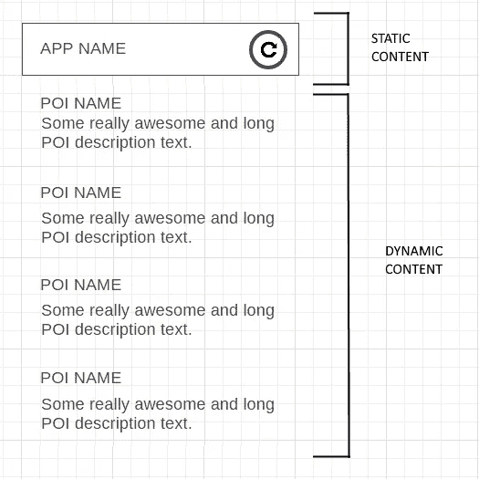
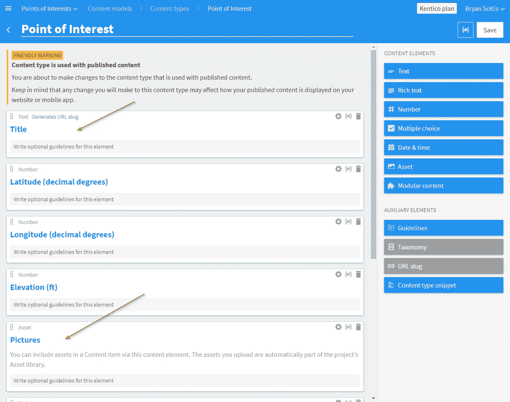
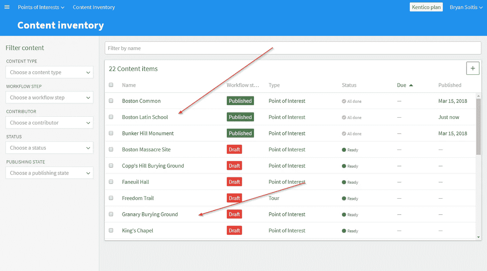

# 使用无头 CMS 创建渐进式 Web 应用程序—第 1 部分

> 原文：<https://medium.com/hackernoon/creating-a-progressive-web-app-with-a-headless-cms-part-1-85ede9dba59b>

第 1 部分| [**第 2 部分**](https://hackernoon.com/creating-a-progressive-web-app-with-a-headless-cms-part-2-88ffee198ff6) **|** [**第 3 部分**](https://hackernoon.com/creating-a-progressive-web-app-with-a-headless-cms-part-3-a6bb538084)

想想你见过的所有开发者。

现在，将列表限制在那些喜欢为每个平台/浏览器/显示器编程的人。

接下来，把它精简到那些喜欢为多个生态系统维护应用代码库的人。

我猜你现在只剩下很少的几个人了。

事实是，让每个设备上的每个用户看起来(和执行起来)都很棒是一项艰巨的工作，不希望在这个过程中翻几张桌子。这不是一个新问题。自从 2000 年早期的浏览器大战以来，开发人员一直在努力解决他们设计的每一个像素，以确保正确加载。再加上移动平台的兴起，这场斗争滑稽地变成了一边倒。这是一场徒劳的战争，但每一个程序员都加入了这场战争。

输入**渐进式网络应用**(或 PWAs“在我的公寓里广为人知”)。早在 2015 年，一些非常聪明的谷歌开发人员就提出了 pwa，旨在为每个用户提供类似应用程序的体验，无论他们的平台是什么。通过响应式设计和后台流程，PWAs 允许您快速加载您的 UI，然后异步填充您的内容，以获得无缝、安全的体验。他们无需在设备上安装就可以做到这一切。

由于 pwa 如此关注平稳地加载内容，为它们提供一个可靠的内容交付平台是必不可少的。答案？一个无头 CMS。这些可扩展、API 驱动的服务允许您在一个时尚的用户界面中管理数据，同时为您的应用程序提供精心策划的内容。这对每个人来说都是双赢！

不服气？在这个多部分系列的第一篇文章中，让我向您展示如何操作。

# 什么是 PWA？(求朋友……)

Those are actually phones I’ve collected over the past 10 years.

渐进式 web 应用程序(PWA)是一种简化的 Web 应用程序，可在本机应用程序体验中提供响应性内容。PWAs 被设计成在浏览器或手机上看起来很棒，它们都是为了给用户最好的体验。这些应用程序建立在 web 技术和库的基础上，可以使用标准的 HTML 和 JavaScript 技能快速编码，允许当前的 web 开发人员轻松编码。通过利用一些现代浏览器功能，移动用户可以接收后台更新、推送通知和一系列其他设备功能。没有网络？没问题！PWAs 可以使用缓存数据来确保快速加载，即使当你在地下掩体中吃着没有接收信号的桃子罐头。简而言之，PWAs 就是将网络和移动的精华结合成一个单一的、优化的体验。

[**阅读更多关于渐进式网络应用的信息**](https://developers.google.com/web/progressive-web-apps/)

# 无头 CMS 能有什么帮助？

虽然 pwa 肯定是这个节目的明星，但如果没有一些很棒的内容，他们仍然会在烟雾弥漫的拉斯维加斯休息室工作。幕后的人，内容交付是确保应用程序顺利运行的关键。这意味着能够快速更新信息，以闪电般的速度交付信息，并确保开发人员拥有一个强大的工作平台。无头 CMSs 非常适合这项工作，它使用了云的所有奇妙方面，再加上强大的、与技术无关的 API。

有了这些 CMS，开发人员可以自由地以他们需要的任何方式编写他们的应用程序，并且总是知道他们的内容将准备好显示。因为 PWAs 是建立在有或没有连接的基础上的，所以 CMSs 提供了可伸缩性和用你名片上的任何语言进行编码的自由。

在我们的演示中，我们选择将 Kentico Cloud 用于我们的 headless CMS。该平台为向任何设备或渠道交付内容提供了可扩展的灵活解决方案。

[**阅读更多关于 Kentico 云**](https://kenticocloud.com/)

# 构建应用程序

有一个好的计划不仅是明智的，而且是必要的。如果第一个做比萨饼的人是从底部的调味汁开始的，想想看，作为一个文明，我们将不得不面对的斗争。对于 PWAs 来说，这意味着知道你要构建什么，以及你将如何利用这项技术。您需要决定首先加载 UI 的哪些部分，如何加载内容，以及何时何地缓存信息。因为 PWAs 应该给移动用户带来应用程序般的愉悦，所以你需要考虑如何实现推送通知、更新和其他以手机为中心的体验。

首先，将您的应用程序分解成几个逻辑部分。从设计的角度来看，确定你的页眉和页脚区域。这些是你要先加载的。想想你将如何使用你的服务人员获取你的内容，以及何时获取。如果您打算使用 headless CMS，请查看您的供应商提供了哪些 SDK。这些将极大地简化您的开发，让您更专注于您的 UI。

对于我们的演示，我们从一个名为 Pack and Go 的旅行应用程序开始。该应用程序旨在告诉你你周围地方的各种有趣信息。在设计上，我们使用了一个带有刷新按钮的简单标题，与你手机上的许多移动应用程序相匹配。内容是兴趣点(POI)信息，包括名称、描述、图片和坐标。

这是应用程序功能的基本概述。

作为基础，我们使用了 Google PWA 教程。它提供了一个简单的界面和功能，非常适合我们开始构建新的应用程序。

[**Google PWA 教程**](https://developers.google.com/web/fundamentals/codelabs/your-first-pwapp/)

# 创建内容

弄清楚了应用程序的功能，你就要开始考虑内容了。你可能已经在现有的网站、数据库中有了自己的想法，或者只是在你的脑海中浮想联翩。你的下一步是让它进入你的 CMS。不要担心，他们应该有一个内容管理 API 来帮助您编写流程。但是你不会想把它放入新系统。因为无头内容管理系统都是关于全渠道交付的，所以您需要花一些时间来规划您的内容模型和结构。你可能有一些非常适合网络的内容，而其他信息更适合智能手机和可穿戴设备。正确映射数据是充分利用平台的关键。

对于我们的站点，我们从 poi 的简单结构开始。启动我们的初始 PWA 只需要几个文本和数字字段，以及一些资产。在以后的博客中，我们将基于这个模型来驱动我们的应用程序。

POI Content Model

创建内容模型后，我们在波士顿地区添加了几个位置(我家来自匹兹堡，不是我的第一选择)。CMS 允许您轻松地管理内容，因此我们利用工作流功能来发布一些兴趣点，同时继续开发其他内容。

Lots of interesting Boston POIs in content Inventory

# 下次

好了，我们已经写了超过 1000 个单词，但是仍然没有显示任何代码！我将在这里结束第一部分，为**第二部分**做准备。在下一篇文章中，我将深入研究代码，并向您展示如何集成您的无头 CMS，编写 PWA 来加载数据，并确保一切在您的设备上顺利运行。下次见！

第 1 部分| [**第 2 部分**](https://hackernoon.com/creating-a-progressive-web-app-with-a-headless-cms-part-2-88ffee198ff6) **|** [**第 3 部分**](https://hackernoon.com/creating-a-progressive-web-app-with-a-headless-cms-part-3-a6bb538084)