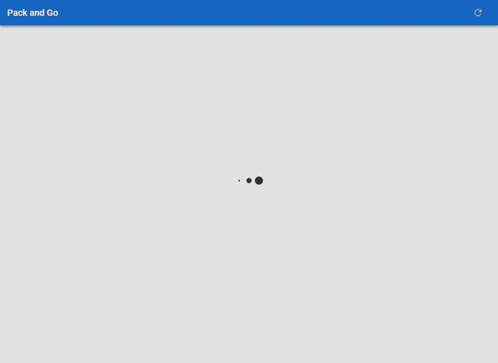
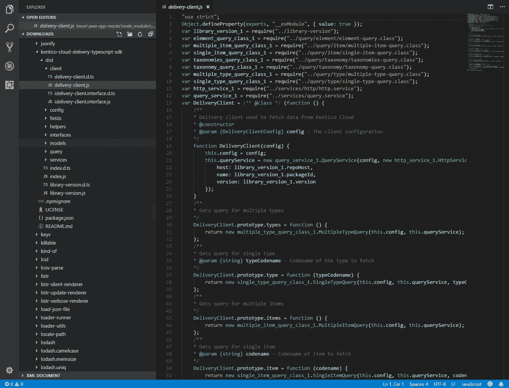
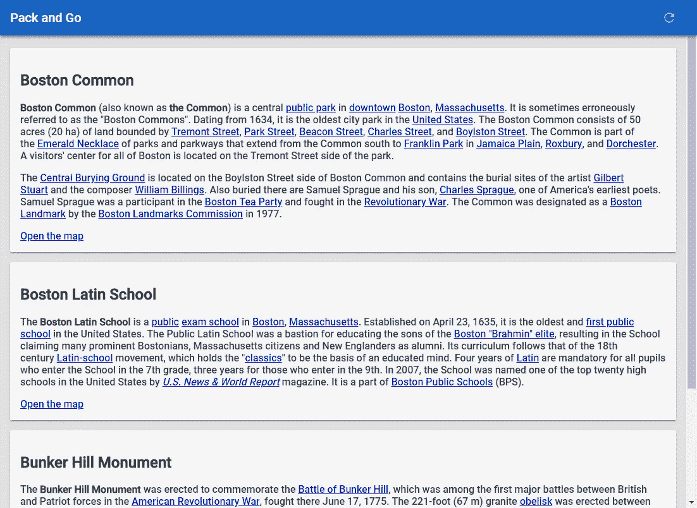
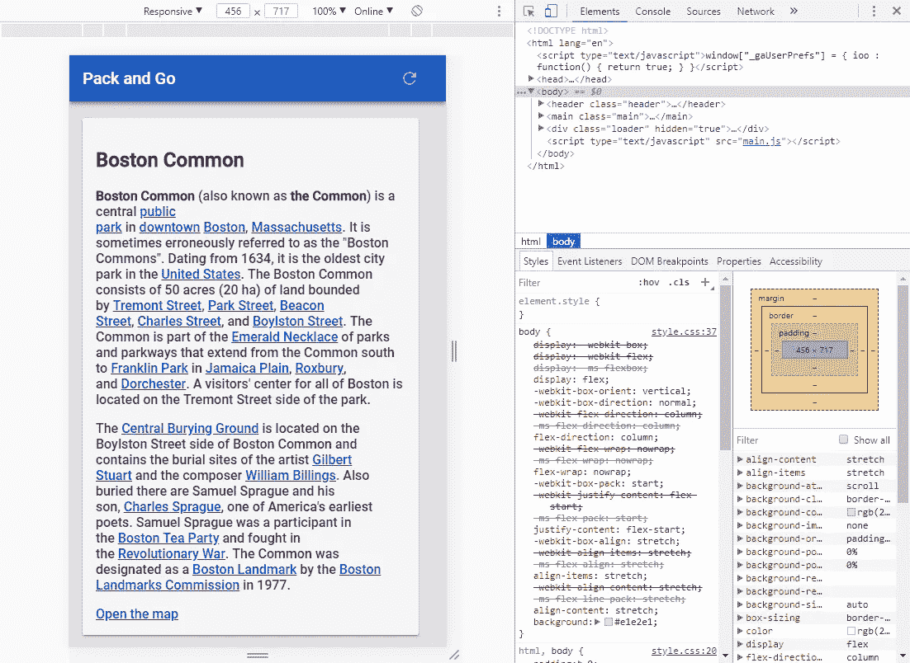
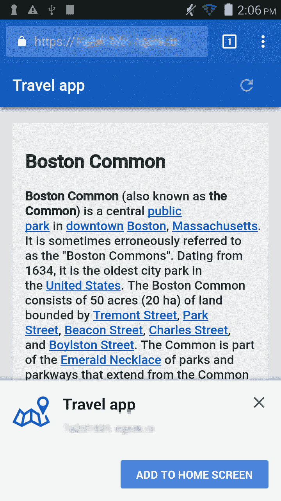
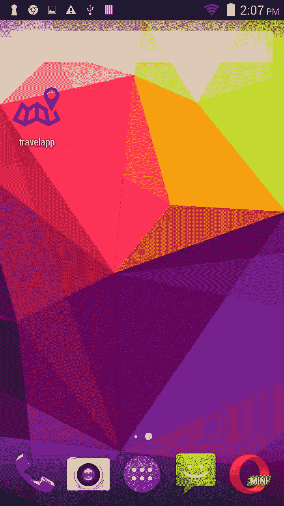

# 使用无头 CMS 创建渐进式 Web 应用程序—第 2 部分

> 原文：<https://medium.com/hackernoon/creating-a-progressive-web-app-with-a-headless-cms-part-2-88ffee198ff6>


[**第一部分**](https://hackernoon.com/creating-a-progressive-web-app-with-a-headless-cms-part-1-85ede9dba59b) **|** 第二部分| [**第三部分**](https://hackernoon.com/creating-a-progressive-web-app-with-a-headless-cms-part-3-a6bb538084)

嘿，欢迎回来！在本系列的 [**第 1 部分**](https://hackernoon.com/creating-a-progressive-web-app-with-a-headless-cms-part-1-85ede9dba59b) 中，我向您介绍了渐进式 Web App (PWA)。我介绍了它们是什么，它们是如何工作的，以及一个无头 CMS 如何真正添加一些令人敬畏的功能。在**第 2 部分**中，我将深入构建一个 PWA 并添加一些很酷的特性。这意味着创建基础应用程序，添加魔力，并进行测试。

所以，让我们开始吧！

# **重述**

在 [**第一部分**](https://hackernoon.com/creating-a-progressive-web-app-with-a-headless-cms-part-1-85ede9dba59b) 中，我提到了一些我们将在本系列中多次讨论的服务。

[**Google PWA 教程**](https://developers.google.com/web/fundamentals/codelabs/your-first-pwapp/)这是我们开始演示用的“base”app。这是一个很棒的教程，为 PWA 提供了一个很好的基础。

[**Kentico Cloud**](https://kenticocloud.com)这是我们用来驱动我们的应用的基于云的 CMS。这是一个可扩展的、灵活的 CMS，有大量的 SDK 和示例项目来帮助你快速上手。

# 创建基础应用程序

好了，让我们开始创建你的应用程序。您可以从头开始，或者使用许多可用的演示之一来快速启动您的开发。无论你选择哪种方式，你的应用都将包含一些关键组件。

**应用外壳(App Shell)**
应用外壳是 App 的基础 UI。这是您最初将加载的内容，以便为用户提供一致的体验，而不管他们的连接和设备如何。该组件通常在第一次加载应用程序时存储在浏览器缓存中，因为它不会经常更改。您还应该在应用程序外壳中包含任何控件、按钮或图像，以帮助它们快速加载。

服务人员
你的服务人员可能是最重要的组成部分，他会给你的 PWA 带来新鲜的内容。当人们使用 PWA 时，他们将期待丰富的、响应性的体验。服务人员就是让这一切发生的人。这些组件负责处理异步事件和执行代码来更新 UI。您可以完全控制脚本的生命周期和状态管理。

**Manifest**
要获得类似 app 的体验，你的 PWA 需要告诉浏览器如何表现。在您的清单文件中，您将定义应用程序的基本内容，以及要加载的 URL 和图标。您甚至可以设置方向、全屏模式和其他环境变量，以确保您的内容完全按照您想要的方式加载。

**真正的代码**
在您定义了您的 AppShell、service worker 和 manifest 之后，您需要添加功能。我的意思是获取数据、更新布局和任何其他想要包含的特性的代码。它可以是一个独立的 JaveScript 文件，也可以是它们的组合。我还将任何外部库组合到这个组合中，以防您计划在设计中添加一些可爱的光标轨迹。

# 制作应用程序外壳

对于我们的演示，我们从标题、标题和兴趣点列表的基本布局开始。通过使用标准的顶栏，PWA 将在浏览器和移动设备上具有熟悉和一致的外观。这基本上构成了我们的应用程序外壳，所以我们尽可能保持简单。



This is the extent of my design skills.

应用程序外壳中还包括我们的兴趣点的基本布局。为此，我们使用一个模板来显示元素。不是很令人兴奋，但这就是一个应用程序的第一个版本的目的！

```
<main class=”main”>
 <div class=”card cardTemplate” hidden>
 <h2 class=”title”></h2>
 <div class=”content”></div>
 <a class=”map-link” target=”_blank” hidden>Open the map</a>
 </div>
</main>
```

当我们在获取内容后将兴趣点写入应用程序时，我们将使用该模板。

# 添加服务人员

下一个要添加的是服务人员。文件。您需要设置触发器，定义缓存信息，并配置应用程序的运行方式。这可能会对应用程序的行为产生很大影响，并使其更像移动用户的原生应用程序。你和你的服务人员可能会花很多时间在一起，所以带一份乔迁礼物来打破僵局。

在我们的演示中，我们创建了一个新的脚本来保存服务工作者逻辑。在示例的基础上，我们添加了缓存信息、想要存储的文件列表和事件侦听器。有了这个工人，我们可以在用户与应用程序交互时捕获事件，并根据请求和/或环境控制功能的处理方式。

```
var dataCacheName = 'packAndGoData-v1';
 var cacheName = 'packAndGoApp-v1';var filesToCache = [
   '/',
   '/index.html',
   '/main.js',
   '/manifest.json',
   '/styles/fonts/RobotoMedium.eot',
   '/styles/fonts/RobotoMedium.svg',
   '/styles/fonts/RobotoMedium.ttf',
   '/styles/fonts/RobotoMedium.woff',
   '/styles/fonts/RobotoMedium.woff2',
   '/styles/style.css',
   '/assets/images/icon_refresh.svg'|
 ];self.addEventListener('install', function (e) {
   console.log('[ServiceWorker] Install');
   e.waitUntil(
     caches.open(cacheName).then(function (cache) {
       console.log('[ServiceWorker] Caching app shell');
       return cache.addAll(filesToCache);
     })
   );
 });self.addEventListener('activate', function (e) {
   console.log('[ServiceWorker] Activate');
   e.waitUntil(
     caches.keys().then(function (keyList) {
       return Promise.all(keyList.map(function (key) {
         if (key !== cacheName && key !== dataCacheName) {
           console.log('[ServiceWorker] Removing old cache', key);
           return caches.delete(key);
         }
       }));
     })
   );

   /*
    * Fixes a corner case in which the app wasn't returning the latest data.|
    * You can reproduce the corner case by commenting out the line below and
    * then doing the following steps: 1) load app for first time so that the
    * initial New York City data is shown 2) press the refresh button on the
    * app 3) go offline 4) reload the app. You expect to see the newer NYC
    * data, but you actually see the initial data. This happens because the
    * service worker is not yet activated. The code below essentially lets
    * you activate the service worker faster.
    */
   return self.clients.claim();
 });self.addEventListener('fetch', function (e) {
   console.log('[Service Worker] Fetch', e.request.url);
   var dataUrl = 'https://deliver.kenticocloud.com/XXXXXXXXXXXXXXXXXXXXXXXXXXXXXXXXXXXXXXXXXXXXXXXXXXXXXX/items';
   if (e.request.url.indexOf(dataUrl) > -1) {
     /*
      * When the request URL contains dataUrl, the app is asking for fresh
      * weather data. In this case, the service worker always goes to the
      * network and then caches the response. This is called the "Cache then
      * network" strategy:
      * [https://jakearchibald.com/2014/offline-cookbook/#cache-then-network](https://jakearchibald.com/2014/offline-cookbook/#cache-then-network)
      */
     e.respondWith(
       caches.open(dataCacheName).then(function (cache) {
         return fetch(e.request).then(function (response) {
           cache.put(e.request.url, response.clone());
           return response;
         })
       })
     );
   } else {
     /*
      * The app is asking for app shell files. In this scenario the app uses the
      * "Cache, falling back to the network" offline strategy:
      * [https://jakearchibald.com/2014/offline-cookbook/#cache-falling-back-to-network](https://jakearchibald.com/2014/offline-cookbook/#cache-falling-back-to-network)
      */
     e.respondWith(
       caches.match(e.request).then(function (response) {
         return response || fetch(e.request)
       })
     );
   }
 });
```

# 集成 Kentico 云

有了应用程序集的基础，您就可以添加好的东西了。如果你走的是基于云的 CMS 路线，这就是你想要利用任何可用的 API 和 SDK 的地方。这些将帮助您快速将平台集成到 PWA 中，确保系统之间的无缝通信。有可能他们有几种 SDK 版本，所以选择一种与你的架构相匹配的。

对于我们的 PWA，我们为 Kentico CloudT3 选择了一个 [**JavaScript SDK。因为我们的应用程序是以 JavaSscript 为中心的，所以这个 SDK 提供了最好的解决方案来快速整合到我们的架构中。通过执行几个 **npm** 命令，我们将 SDK 安装到了应用程序中，并准备好进行编程。这导致了一些新的包文件，用于创建我们的 CMS 客户端和检索内容。**](https://github.com/Enngage/KenticoCloudDeliveryTypeScriptSDK)



可以进一步了解[**Kentico Cloud JavaScript SDK**](https://github.com/Enngage/KenticoCloudDeliveryTypeScriptSDK)。

# 添加内容

好了，你已经花了这么多时间来学习架构、定义内容和创建功能。现在是时候让它发挥作用了！这就是你的“真正的代码”发挥作用的地方。您需要将您的应用程序连接到 CMS，获取一些内容，并连接您的服务人员来处理这些请求。

对于我们的应用程序，我们创建了一些脚本来保存我们的功能。首先，我们创建了一个 **client.js** 文件来定义我们的 CMS 客户端。这个文件利用了我们集成到站点中的 JavaScript SDK，使得创建客户端变得轻而易举。因为我们为应用程序使用了 Kentico Cloud，这意味着定义我们的项目 id 并创建一个新的 **DeliveryClient** 来访问我们的内容。

```
import { DeliveryClient, DeliveryClientConfig } from 'kentico-cloud-delivery-typescript-sdk';
 const projectId = 'XXXXXXXXXXXXXXXXXXXXXXXXXXXX;
 const previewApiKey = "";const isPreview = () => {
     return previewApiKey !== "";
 }const client = new DeliveryClient(
     new DeliveryClientConfig(projectId, [],
         {
             enablePreviewMode: isPreview(),
             previewApiKey: previewApiKey
         }
     )
 )module.exports = {
     projectId,
     client
 }
```

接下来，我们为主要功能添加了一个 **app.js** 文件。按照 Google PWA 教程，我们编写了 POI 卡更新的方式和时间。

因为 pwa 大量利用缓存，所以我们添加了检查 POI 数据是否已经被检索的功能。如果是这样，应用程序将加载该内容。否则，我们使用我们的 Kentico 云交付客户端从我们的项目中检索信息。

```
const getPointsOfInterest = () => {const url = 'https://deliver.kenticocloud.com/XXXXXXXXXXXXXXXXXXXXXXXXXXXXXXXXXXXXXXXXXXXXXXXXXX/items?system.type=point_of_interest';
     if ('caches' in window) {
         /*
          * Check if the service worker has already cached this data about the Point of interests
          * data. If the service worker has the data, then display the cached
          * data while the app fetches the latest data.
          */
         caches.match(url).then(response =>
             response && response
                 .json()
                 .then(json => {
                     const typedResponse = new BaseResponse(json, response);
                     responseMapService
                         .mapMultipleResponse(typedResponse, client.config)
                         .items.forEach(pointOfInterest =>
                             updatePointOfInterestCard(pointOfInterest))
                 })
         );
     }client.items()
         .type('point_of_interest')
         .get()
         .toPromise()
         .then(response =>
             response.items.forEach(pointOfInterest => {
                 updatePointOfInterestCard(pointOfInterest);
             }))
 }
```

在这两种情况下，我们调用**updatePointOfInterestCard**函数来用内容更新我们的布局。

接下来，我们创建了**updatePointOfInterestCard**函数来与页面元素进行交互。我们检查以确保卡存在，如果需要就创建它。然后，我们找到每个元素并用检索到的数据更新值。因为我们使用 SDK，所以我们利用一些预建的功能和模式来帮助轻松设置我们的内容。

```
const updatePointOfInterestCard = (data) => {
    const key = data.system.id;
    const title = data.title.value;
    const content = data.description.value
    const latitude = data.latitude__decimal_degrees_ && data.latitude__decimal_degrees_.value;
    const longitude = data.longitude__decimal_degrees_ && data.longitude__decimal_degrees_.value;let card = visibleCards[key];if (!card) {
         card = cardTemplate.cloneNode(true);
         card.classList.remove('cardTemplate');
         card.removeAttribute('hidden');
         container.appendChild(card);
         visibleCards[key] = card;
     }card.querySelector('.title').textContent = title;
     card.querySelector('.content').innerHTML = content;if (latitude && longitude) {
         card.querySelector('.map-link').setAttribute('href',
 `http://maps.google.com/?ie=UTF8&hq=&ll=${latitude},${longitude}&z=16`)
         card.querySelector('.map-link').removeAttribute('hidden');
     }if (isLoading) {
         loader.setAttribute('hidden', true);
         isLoading = false;
     }
 };
```

# 配置清单

好了，你已经准备好你的程序了。您已经集成了布局、服务人员和功能，但是您需要让它在所有设备上都看起来不错。这就是清单文件发挥作用的地方。在这个文件中，您将定义用户将看到的体验、他们可以使用的选项以及应用程序在他们设备上的外观。

在我们的 PWA 中，我们在清单中为标题和颜色设置了一些基础。对于显示，我们选择了**独立。这使得页面看起来像一个本地应用，去掉了地址栏。最后，我们定义了我们的图标。因为 PWAs 可以固定在用户的主屏幕上，所以包含所有可能使用的尺寸非常重要。**

```
{
   "name": "Travel app",
   "short_name": "travelapp",
   "theme_color": "#1564bf",
   "background_color": "#e1e2e1",
   "display": "standalone",
   "Scope": "/",
   "start_url": "/",
   "icons": [
     {
       "src": "\/assets\/images\/icons\/android-icon-36x36.png",
       "sizes": "36x36",
       "type": "image\/png",
       "density": "0.75"
     },
     {
       "src": "\/assets\/images\/icons\/android-icon-48x48.png","sizes": "48x48",
       "type": "image\/png",
       "density": "1.0"
     },
     {
       "src": "\/assets\/images\/icons\/android-icon-72x72.png",
       "sizes": "72x72",
       "type": "image\/png",
       "density": "1.5"
     },
     {
       "src": "\/assets\/images\/icons\/android-icon-96x96.png",
       "sizes": "96x96",
       "type": "image\/png",
       "density": "2.0"
     },
     {
       "src": "\/assets\/images\/icons\/android-icon-144x144.png",
       "sizes": "144x144",
       "type": "image\/png",
       "density": "3.0"
     },
     {
       "src": "\/assets\/images\/icons\/android-icon-192x192.png",
       "sizes": "192x192",
       "type": "image\/png",
       "density": "4.0"
     }
   ],
   "splash_pages": null
 }
```

# 测试应用程序

此时，您应该能够测试您的应用程序了。您会希望在您的计算机和移动设备上查看它。您应该会看到整个环境一致、整洁的外观。在你的手机上，它应该看起来非常类似于一个本地应用程序，并使你能够与主屏幕和你添加的任何其他功能进行交互。

对于我们的演示，我在电脑上打开了应用程序，并检查了布局。



然后，我使用开发工具来模拟一个移动设备。这是为了测试响应式布局是否正确地调整了内容的大小。



接下来，我将应用程序部署到 Azure 应用程序服务，以便从外部访问站点。我在移动设备上打开了这个应用程序，以确认它显示正常。

**提示**
我必须运行 **npm run build-prod** 命令来为部署创建 **dist** 文件夹。



由于 **manifest.json** 的设置，我能够将应用程序添加到主屏幕，并确认图标显示正确。



如果你想看现场演示，请查看 [**我的网站**](https://bryansdemopwa1.azurewebsites.net/) 。随着博客系列的继续，我将继续用新特性更新这个部署。

# 下次

咻，要输入的信息太多了！如果你一直跟着，毫无疑问你和我一样累了，应该休息一下。在这篇博客中，我介绍了如何设置我的基本应用程序、添加我的服务人员和布局，以及在不同的点缓存文件和数据。在确保我所有的代码都准备就绪后，我启动了这个应用，并在各种设备上进行测试。

在以后的博客中，我将会涉及更多高级的主题，比如推送通知、图片和原生应用功能。我将继续构建这里提到的演示，所以我希望你喜欢这个旅程。下次见，朋友们！

如果你想跟踪我们的 PWA 演示应用程序，请查看我们的 [**Pack and Go GitHub 项目**](https://github.com/Kentico/cloud-sample-pwa-app/tree/v1-introduction) **。**

[**第一部分**](https://hackernoon.com/creating-a-progressive-web-app-with-a-headless-cms-part-1-85ede9dba59b) **|** 第二部分| [**第三部分**](https://hackernoon.com/creating-a-progressive-web-app-with-a-headless-cms-part-3-a6bb538084)