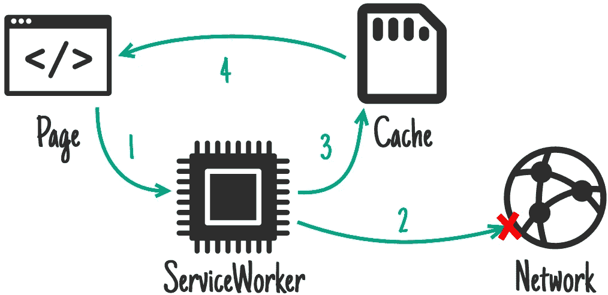

# 使用无头 CMS 创建渐进式 Web 应用程序——第 3 部分

> 原文：<https://medium.com/hackernoon/creating-a-progressive-web-app-with-a-headless-cms-part-3-a6bb538084>


[**第一部分**](https://hackernoon.com/creating-a-progressive-web-app-with-a-headless-cms-part-1-85ede9dba59b) **|** [**第二部分**](https://hackernoon.com/creating-a-progressive-web-app-with-a-headless-cms-part-2-88ffee198ff6) |第三部分

欢迎学习第 3 部分！如果你没有关注这个系列，我已经使用一个无头 CMS 创建了一个渐进式 Web 应用程序(PWA)。而且激动的心情已经无法忍受了！一直有悬念！戏剧！开拍！浪漫？是的，我们已经在第 1 部分和第 2 部分中看到了很多，所以是时候通过下一个令人兴奋的部分来继续这个系列了。抓住牛奶球。

在前两篇文章中，我介绍了创建 PWA 的基础知识以及如何将一个无头 CMS 集成到组合中。我概述了 PWA 架构，详细介绍了一些重要的组件，并向您展示了如何创建一个工作示例。因为 pwa 都是关于提供动态体验的，所以提取和显示内容是一件非常重要的事情。如何以及何时获取内容同样重要，所以我想分解一下如何在应用程序中缓存内容。看到了吗？我告诉过你这会变得更加令人兴奋。

# 为什么要缓存？


如果您曾经构建过使用第三方服务的应用程序，您会知道这不会使用魔法来实现。当系统通信时，总是有 API 来回调用。这可能意味着提取数据，验证信息，或者记录你刚刚点的拿铁的味道。关键是，当用户与你的应用程序交互时，这种交流会很快增加。学习如何明智地打这些电话将有助于你的应用程序更好地运行，并防止公司知道你的一举一动。

到处都在使用缓存来减少调用和提高速度。但是，这是有代价的，因为当显示数据时，缓存的数据必须仍然有效。对于少数幸运的人来说，这意味着你可以缓存应用程序的每个方面，并获得惊人的加载时间。对于我们其余的人来说，需要做一些计划来决定什么是最有意义的。因为有太多的方法可以进行缓存，所以选择过程可能会令人望而生畏，尤其是当您发现您将根据数据使用不同的技术时。

什么是最适合你的应用程序的解决方案完全取决于你。请记住，缓存在 PWA 中可以(应该)发挥多大的作用，以帮助它尽可能平稳地运行。这一切都是为了给用户一个很好的体验，并提供最相关的内容。

# 缓存解决方案

说到缓存，您可以利用许多现有的库，或者开发自己的库。如果你真的喜欢使用底层组件(或者喜欢 Crossfit ),那就自己动手为你的应用程序做一个可爱的新解决方案(同时翻转轮胎或其他东西)。如果您像我一样，那么您可能更倾向于利用现有的库来完成繁重的工作。只要做好功课，找到最符合你需求的解决方案。

Google Offline Cookbook 是学习 PWAs 中缓存的一个很好的资源。我强烈建议您查看它，了解流程工作流、场景，并深入了解数据如何在您的应用程序中移动。

[**阅读更多关于谷歌离线食谱**](https://developers.google.com/web/fundamentals/instant-and-offline/offline-cookbook/)

对于我们的打包演示，我们选择了**工具箱**。Workbox 是一个 JS 库，为 PWAs 和其他应用程序提供离线支持。通过预缓存，Workbox 允许您从内存中快速加载代码的各个方面，同时定义何时从外部源中检索哪些区域。更好的是，它用最少的代码和配置做到了这一点，使实现变得轻而易举。所以，赢/赢，对吧？

[**阅读更多关于工具箱的信息**](https://developers.google.com/web/tools/workbox/)

# 缓存策略



NetworkFirst process (from the Google Offline Cookbook)

那些多重缓存方法？是的，大约有十亿种，这取决于您的平台、库、组件和喜欢的颜色。无论选择哪种类型，PWAs 都要记住缓存的“类型”。以下是最常见选项的简要概述:

**cache first**从缓存中取。如果不可用，从网络中获取并更新缓存。

**CacheOnly**
只从缓存中取，不从网络中取。

**network first**从网络中获取。如果失败，那么从缓存中获取。

**NetworkOnly**
只从网络上取，从不从缓存中取。

**stalewhirelvalidate**
从两者中提取。如果可用，从缓存返回。如果不成功，从网络返回并更新缓存。

[**阅读更多关于缓存方法的内容**](https://developers.google.com/web/tools/workbox/reference-docs/latest/workbox.strategies)

您将在开发的不同阶段使用一些(如果不是全部),这取决于您如何组织数据和应用程序。请务必仔细阅读每个选项，准确理解如何处理请求，以便您的应用程序按照您的要求执行。

在我们的演示中，我们有两种不同类型的内容。

1.AppShell(图像、样式、标题等。)

2.来自 Kentico Cloud 的兴趣点内容

因为我们的“主”文件很少改变，所以我们选择了 **CacheFirst** 选项。这将从缓存中加载我们的 **AppShell** 和支持文件(在第一次加载之后),以便快速显示界面。看到这些文件很少被修改，这是最有意义的，并给了我们很大的加载时间。

对于我们的兴趣点内容，我们将使用 **Kentico Cloud API** 加载这些内容。因为这些信息会经常变化，所以这些内容需要更加动态。为了满足这一需求，我们采用了**网络优先**策略。该选项允许应用程序始终从我们的 Kentico 云项目加载最新信息。如果网络因为任何原因中断，我们将会回到缓存版本。

# 服务行业人员

无论您选择哪种缓存方式，您的旅程都将从您的服务人员开始。作为通信的 [**Heimdal**](http://marvel.com/universe/Heimdall#axzz5CxRSzyKT) ，您的服务人员将在那里注册您的缓存并确定何时调用它。因为你的服务人员是应用程序和互联网之间的代理，它可以拦截每一个请求。它可以访问您实现的缓存存储库，并使所有组件协同工作。让冰霜巨魔远离彩虹桥，进入他们自己的社区。

# 缓存打包

现在您已经了解了使用 PWAs 进行缓存，让我告诉您我们是如何在我们的打包示例应用程序中实现它的。如果您一直在关注这个系列，您可能还记得在我们的 **service-worker.js** 文件中有很多代码，用于定义立即缓存哪些文件，以及何时缓存对 Kentico Cloud API 的调用。Workbox 通过将所有东西打包到一个预建的库中来处理所有的代码。这使得配置超级简单和干净，同时提供相同的功能。

首先，我们将 workbox 插件添加到我们的 **package.json** 文件中。

```
“devDependencies”: {
   …
   “workbox-webpack-plugin”: “³.0.1”
},
```

接下来，我们在节点应用程序中注册了 Workbox。在我们的 **webpack.config.js** 文件中，我们添加了一个新的**常量**和对**工具箱插件**的引用。这包括缓存匹配一组扩展名的文件的代码。这取代了以前版本应用程序中服务工作者文件中的 **AppShell** 文件定义。**工具箱**还处理 **AppShell** 文件的版本控制。

```
const workboxPlugin = require(‘workbox-webpack-plugin’);new workboxPlugin.InjectManifest({
   swSrc: ‘./src/public/service-worker.js’,
   globDirectory: ‘./src/public/’,
   globPatterns: [‘**/*.{html,js,css,svg,png,ico,woff,woff2,ttf}’],
});
```

在我们的 **serviceworker.js** 文件中，我们定义了如何缓存对 Kentico Cloud API 的调用。我们向 API 注册了具体的路由，并选择了 **networkFirst** 选项。这段代码取代了之前版本应用程序中的 **addEventListener** 代码。这要简单得多，因为默认情况下，监听器的注册是由 **Workbox** 处理的。

```
if (workbox) {
   console.log(`Yay! Workbox is loaded 🎉`);
   workbox.routing.registerRoute(
      /https:\/\/deliver\.kenticocloud\.com\/66ab95de-6599–0018-f141–3c9dc08fe797\/items/,
      workbox.strategies.networkFirst()
   );
   workbox.precaching.precacheAndRoute(self.__precacheManifest || []);
} else {
   console.log(`Boo! Workbox didn’t load 😬`);
}
```

# 测试

注册并配置好**工具箱**后，您应该准备好测试您的 PWA 了。对于我们的演示，我们在本地启动了站点，并确认了站点加载正确。


查看 **Chrome 开发者工具**，我们可以看到**工具箱**正在被注册并正确缓存响应。


然后，我们将该网站部署到 Azure 应用服务中，并在那里进行测试。


如果你想看现场演示，请访问我的网站。

如果你想看完整的代码，可以查看一下 **Kentico Cloud Pack 和 Go GitHub 项目**。确保使用我们今天讨论的 **v2 缓存**分支。我们将继续用新的特性更新这个项目，我们将在以后的文章中介绍这些特性。

[**查看 Kentico Cloud Pack and Go GitHub 项目**](https://github.com/Kentico/cloud-sample-pwa-app/tree/v2-caching)

# 包扎

构建一个在任何情况下都表现出色的应用程序是一个巨大的挑战。您必须考虑用户的环境、连接、偏好和许多其他因素。通过利用 PWAs 中的缓存，您可以确保快速正确地加载内容。这将提高用户满意度，并减少系统间的呼叫。

我还向您展示了 Kentico Cloud 的许多强大功能。通过使用这种无头 CMS，您可以集中您的内容，并利用技术无关的 API 将它交付到您需要的任何地方。这有助于您在任何语言中以您想要的方式构建应用程序，同时为您的编辑人员提供出色的内容管理体验。

[**了解更多关于 Kentico Cloud**](https://kenticocloud.com/)

这篇文章总结了我关于用一个无头 CMS 创建一个渐进式 Web 应用程序的系列文章。我希望您学到了很多关于这种令人兴奋的新开发技术的知识。有了它，你可以为你的观众建立一个惊人的用户体验，不管他们的平台。

对于我们的打包 PWA，我们有大计划！寻找未来关于过渡到 Angular、添加搜索和其他利用应用程序的设备功能的博客。下次见！

[**第一部分**](https://hackernoon.com/creating-a-progressive-web-app-with-a-headless-cms-part-1-85ede9dba59b) **|** [**第二部分**](https://hackernoon.com/creating-a-progressive-web-app-with-a-headless-cms-part-2-88ffee198ff6) |第三部分