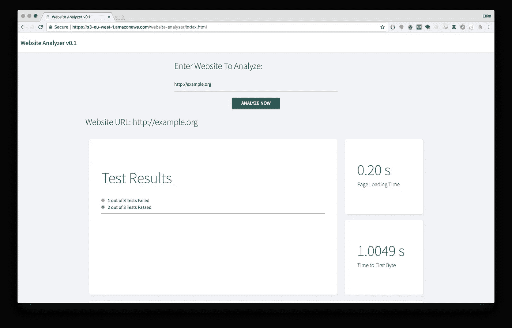
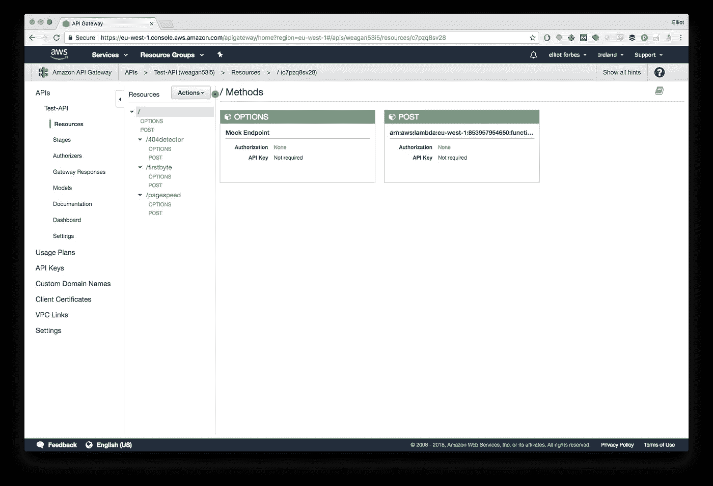

# 使用 Lambda、API 网关和 S3 创建可扩展的网站分析工具

> 原文：<https://medium.com/hackernoon/creating-a-scalable-website-analysis-tool-using-lambda-and-api-gateway-and-s3-66df47506371>

> 欢迎我所有的新追随者，很高兴你的加入，我希望你喜欢我成为百万富翁的最新尝试！

## 本周百万美元创意

因此，上周花费百万美元创建一个高度可扩展的网站监视器的想法似乎有点失败了。

 [## 使用 AWS Lambda 在半小时内创建高度可伸缩的网站监控服务

### Lambda 函数是一项真正令人敬畏的技术，如果你没有读过我的理论，即无服务器和更多…

hackernoon.com](https://hackernoon.com/creating-a-website-monitoring-service-in-half-an-hour-using-lambdas-4f64fb199df3) 

我不认为这对这些亿万富翁天使投资者来说是足够的*【颠覆性】*，但无论如何……这一次我们要打破僵局，我要给自己买一艘大游艇。

本周，我们将围绕我们最初的想法，我们将创建一个服务，了解这个，分析网站。听起来很酷，对吧？这项新服务最大的优点是满足以下要求:

*   这件事将会很便宜地完成。我们的前端将被托管在 S3。除非我们大获成功，否则我们的 lambda 不会花一分钱。
*   这将是高度可扩展的！一旦我们上市，这将是黄金时间。
*   它将是稳定的和可扩展的——如果有新的需求进来，我不能让平台垮掉。

如果它符合这些要求，它肯定会大受欢迎！

因此，为了实现这些巨大的需求，我们将利用 AWS Lambda、 [API](https://hackernoon.com/tagged/api) 网关和 S3。我们将创建一系列 API 端点，这些端点将被我们用 Vue.JS 编写的前端所访问。然后，这些端点将继续访问用我们希望的任何语言编写的许多不同的 Lambda 函数！我将利用 Go、Python 和 Node，为什么不呢？都有点好玩！

## 前端—在 Vue。关于 S3 的联署材料

所以首先，我们需要一个华丽的外观前端。如果它看起来不酷，投资者就不会被诱惑与他们辛苦赚来的钱分道扬镳。

这将是一个非常简单的前端，它将通过一个简单的输入接受一个网页 URL，然后它将点击 3 个不同的端点，我们将在我们的 API 网关中定义。这 3 个端点将计算总的页面加载速度，第一次字节，以及该页面上存在的链接和 404 的数量。

这个的成品看起来有点像这样:

Inspired By: [https://dribbble.com/shots/3203637-Dashboard-Report/attachments/683409](https://dribbble.com/shots/3203637-Dashboard-Report/attachments/683409)

> 前端的完整源代码以及以下所有 Lambda 函数都可以在这里找到:[https://github.com/elliotforbes/website-analyzer](https://github.com/elliotforbes/website-analyzer)

## 到达第一个字节的时间—进入

因此，第一个 Lambda 函数将利用最近宣布的 Go 运行时！如果你以前从未编写过 Go Lambda，那么我建议你看看我在 Youtube 上关于如何做的简短介绍视频。

(Remember to like and subscribe to support the channel! :D)

在我们的 Lambda 函数中，我们将通过请求对象接收一个 URL，然后尝试精确计算到达第一个字节的时间。

我们基于 Go 的端点的最终版本将如下所示:

这实际上是解析通过请求传入的 URL，然后尝试在端口 80 上与该 URL 建立 TCP 连接。然后，我们通过这个 TCP 连接发送一个 GET HTTP 1.0 请求，并计算 1 个字节返回所需的时间长度。这个计算出来的时间值就是我们的`time-to-first-byte.`

一旦计算到第一个字节，它就把这个返回给 Lambda 函数的调用者。

## 页面速度—在 Python 中

我们将要定义的第二个 lambda 函数是计算页面加载速度的函数。这将是相当粗略的，将简单地计算执行一个`urllib.request.urlopen()`调用所花费的时间，并将其返回给调用者。

您会注意到，没有什么奇特的错误处理来检查传入的`url`是否有效，这在将来是可以做到的！

## 404 检查器—在节点中

最后，我们来到最后一个 Lambda 函数。我们的 404 checker 端点将简单地接受与其他两个函数相同的 URL，它将利用[断开链接检查器](https://www.npmjs.com/package/broken-link-checker)节点模块来充分测试我们的页面中的链接和断开链接。

断开链接检查器模块使得这个端点实现起来简单得可笑。假设这样的节点模块已经存在，而不是尝试自己实现，我会节省很多时间…

> 关键要点——如果您正在 node 中编写任何东西，很可能已经有一个包可以满足您的需求。

## 我们的 API —使用 API 网关

现在我们有了 3 个不同的 Lambda 函数，我们需要定义一种通过 HTTP 端点访问它们的方法。最好的方法是通过 API 网关！

本质上，这允许您将路径和`HTTP`方法与它们各自的 lambda 函数配对。这非常简单，一旦您对终端满意，只需点击“操作”按钮，然后点击“部署”。

部署是在特定阶段完成的，因此如果您希望部署到测试环境，您必须部署到`test`阶段，对于生产环境，您部署到`prod`阶段，依此类推。

经过一点点调整和启用类似可怕的`CORS`之类的东西，我有了一个可以让我的前端指向的工作 API。

一旦我对我的本地前端感到满意，我就把它推到一个公共的 S3 桶上，让公众可以访问它。这个新部署的站点的 URL 可以在这里找到:[https://S3-eu-west-1 . amazonaws . com/website-analyzer/index . html](https://s3-eu-west-1.amazonaws.com/website-analyzer/index.html)

> 注意:我确信只要稍加修改，你就能以某种方式打破它，让它具有生产价值将在我上市后完成！

## 结论

这就是你要的，伙计们！我们现在有一个全功能的网站分析[工具](https://hackernoon.com/tagged/tool)，我们可以向投资者展示，并希望吸引投资！

My and my team after our first seed round.

这个网站不仅弹性惊人，而且非常便宜。前端托管在一个服务上，该服务在正常运行时间方面具有高得离谱的 SLA，后端托管在 Lambda 函数上，这些函数不仅具有大规模可伸缩性，而且具有难以置信的弹性。

没有什么能让这个网站这么容易就瘫痪。这不仅能确保我们的客户看不到任何重大影响，还能让管理层和投资者满意，因为他们有一个可以依赖的产品。

希望你发现这篇文章非常有用，也很有趣！我还希望它向您展示了 Lambda 和 API Gateway 在相互结合使用时是多么强大！

如果你喜欢这样，请随时在推特上告诉我:[埃利奥特·福布斯](https://medium.com/u/eb71d34fbe09?source=post_page-----66df47506371--------------------------------)。我也在 LinkedIn 上，如果你想联系:[https://linkedin.com/in/elliotforbes](https://linkedin.com/in/elliotforbes)。我目前还在写一本名为《云开发入门》的新书，如果你想支持我并了解更多关于云的知识，请点击这里:

 [## 云开发简介

### 这本书温和地介绍了云开发的世界。我们将深入了解…

leanpub.com](https://leanpub.com/an-introduction-to-cloud-development) 

*如果你没有时间自己推进这个创业想法，Cronitor 的天才团队已经基于这一设计创建了一个正常运行时间监控工具，该工具使用了全球部署的 Lambda。我强烈推荐在这里查看他们的产品—*https://cronitor.io/uptime-monitoring。