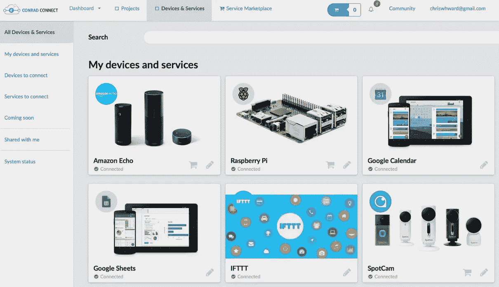
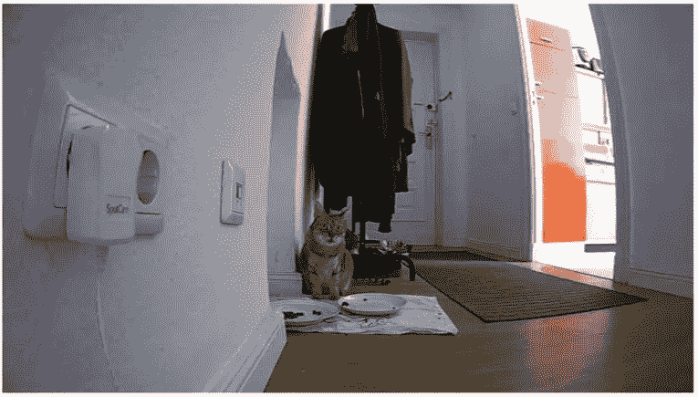
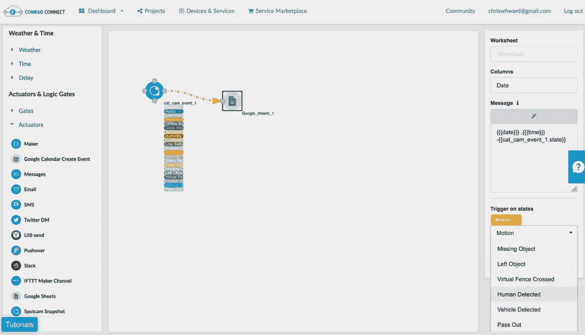
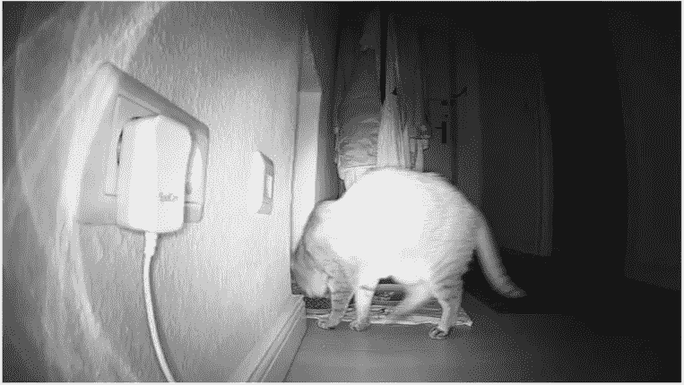
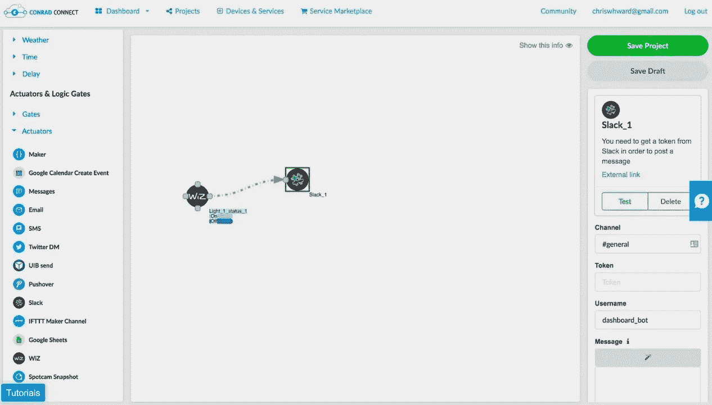
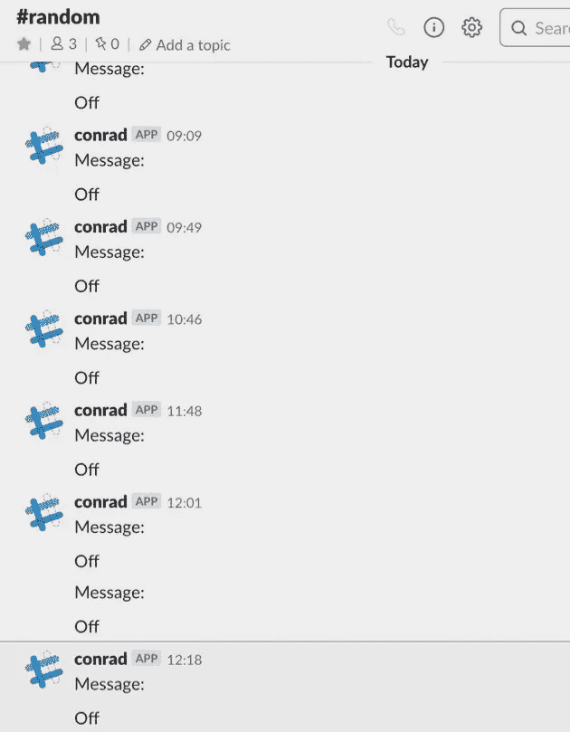

# 用 Conrad Connect 打造智能家居

> 原文：<https://medium.com/hackernoon/creating-a-smart-home-with-conrad-connect-a5c4cdd83ee4>

联网设备正在我们的家中激增，冰箱、灯泡、手表、(很快)植物、垃圾箱以及不知什么样的数据流遍布全球。

忽略联网设备需求的问题，设备数量的一个重要问题是您需要管理的所有竞争应用、标准和平台。每个设备制造商通常都需要自己的应用程序，质量各不相同，而且有些设备会报告重复的信息，那么如何让您的联网家庭成为智能家庭呢？

我最近查看了一系列平台，这些平台的目标就是将互联设备整合到一个平台上，让你可以在一个地方管理它们并查看它们的数据。我推荐的一个选项是 [Conrad Connect](https://conradconnect.de/en) ，作为一家本地企业，他们为我提供了各种设备来彻底测试平台，并向我报告我的发现。

Conrad Connect 遵循与其他连接设备平台类似的范例，为设备和输出提供触发器和数据点，如消息传递系统、电子表格、IFTTT 等。所有这些设备都可以通过拖放界面进行连接，这对于任何人来说都是相对容易使用的，但需要一些润色。这个项目背后的团队在公司内部像初创企业一样运作，并迅速做出改变。

# 设备和使用案例

首先，我将介绍我测试的设备，因为即使有一个平台试图改善您的使用体验，一些设备也比其他设备提供更多的集成平台。

# Spotcam 感知

[Spotcam](https://www.myspotcam.com/en) 制造了一系列用于各种目的的联网摄像机，但主要是为了安全。我对安全监控并不太在意，所以我选择安装一个摄像头，监视我们的猫何时去吃它的食物，将时间记录在电子表格中，并记录下照片。

Spotcam 设备制作精良，配有支架，以适合你的方式安装相机。然而，该软件还有许多不足之处。web 客户端要求你安装 Flash，我很久没有遇到需要 Flash 的应用了。考虑到他们也有 iOS 和 Android 应用程序可用，我不明白为什么网络客户端需要一个即将被其创造者抛弃的软件。虽然安装了 Flash，但界面仍然缓慢、过时、丑陋，移动应用也好不到哪里去，但它们完成了工作。

该平台的另一个负面影响是，它厚颜无耻地声称给你一个“免费的安全云——永远”，但这并不完全正确。要保存录像超过一天(这实际上是你所需要的)，你必须付费。要使用任何人工智能服务来识别人或动物，你需要付费。总而言之，这使得相机在不购买少量他们的订阅包的情况下有些无用。

不用担心，Conrad Connect 意味着至少你可以从相机中捕捉到关键时刻。我添加了设备源，方法是将我的 Spotcam 帐户连接到我的 Conrad Connect 帐户，选择触发事件、我要将数据发送到的位置以及我要发送的数据。你可以有多个输入和输出，并将它们链接在一起，我最终的 cat cam 项目将数据发送到 Excel 电子表格，并在每次猫有东西吃时给我发一封电子邮件。

# Wiz 智能灯

[Wiz](https://www.wiz.world/) 生产一系列适用于不同尺寸和类型的智能灯泡。它们做得很好，应用程序也开发得很好，提供了很多功能。不幸的是，他们没有向第三方公开很多这种功能，如 Alexa，Google Assistant 和 Conrad Connect。我最近与他们在 IFA 的一名员工交谈，他们承认这是一个不足，他们很快就会解决。

Conrad Connect 目前只能访问 Wiz 灯的`on`或`off`状态，而不能访问任何场景或精细控制。这意味着您可以使用外部触发，如时间、天气或松弛时间，将灯切换到默认设置。

# Sygonix 智能插座

据我所知，Sygonix 是一个 Conrad house 品牌，用于一系列连接电源插座。由于它们是相对普通的中国产品，硬件和软件都不怎么样，也不漂亮。由于欧洲的插头没有开关，这些是我最想尝试的设备，所以我可以从插座上关掉设备。只有当我开始安装插头时，我才意识到，也许我已经习惯了没有开关的插座，我努力为它们找到任何有效的用例。我还想知道维护 Wi-Fi 模块的电力开销(这是许多连接设备的一个问题)是否高于让设备处于待机模式。

我注意到 Conrad Connect 对插座的瓦数有一个值，这似乎是监控设备消耗的一个很好的方式。我将输出连接到一个电子表格，并定义了我想要检查的范围，但是除了 0 之外，我从来没有得到任何值，所以我不确定哪里出错了。

# 一般想法

Conrad Connect 与我之前的帖子中提到的许多平台有共同之处，也有一些不太直观、更通用的工具，如 [IFTTT](https://ifttt.com/discover) 。对于那些希望在一个地方看到所有内容的人来说，工作流构建器和可视化输出的结合是一个令人信服的组合。弄清楚如何触发事件需要大量的试验和错误，一些设备和服务的响应时间有时很慢。

我仍在努力寻找生活中联网设备的完美用例，但使用 Conrad Connect 帮助我发掘了潜力，我对 Wiz 灯泡尤其满意，我现在经常使用它。该平台需要一些工作，但市场上有一家拥有多年专业知识的公司支持的欧洲选项是很好的。从一家拥有销售电子产品的大型零售企业的公司，到创建一个连接许多电子产品的平台，这是一个天才的举动。在我最近与项目负责人的一次谈话中，我被告知，除了这一收入来源和高级账户(允许您创建更多项目)之外，他们还打算从订阅服务中发掘附属收入。这个想法与我开始这篇文章的地方相吻合，需要一个平台来帮助你过滤和管理你的设备正在收集的所有信息以及它们发出的所有请求。

你可以听听下面对 Conrad Connect 高级总监 Andreas Bö的采访。

*最初发表于*[T5【dzone.com】](https://dzone.com/articles/creating-a-smart-home-with-conrad-connect)*。*