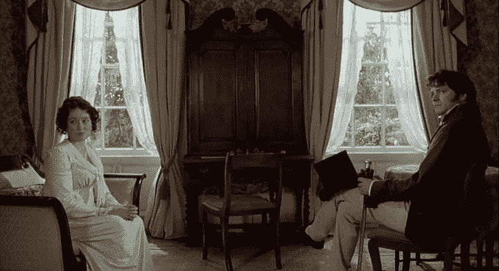
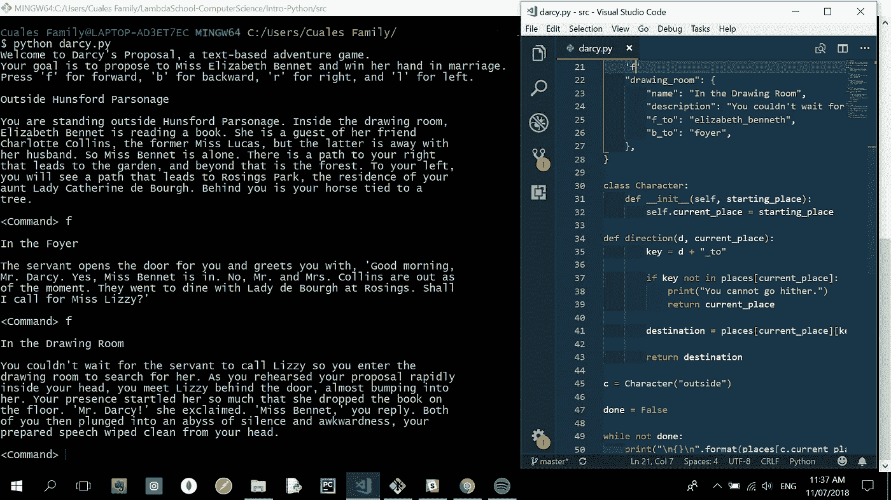
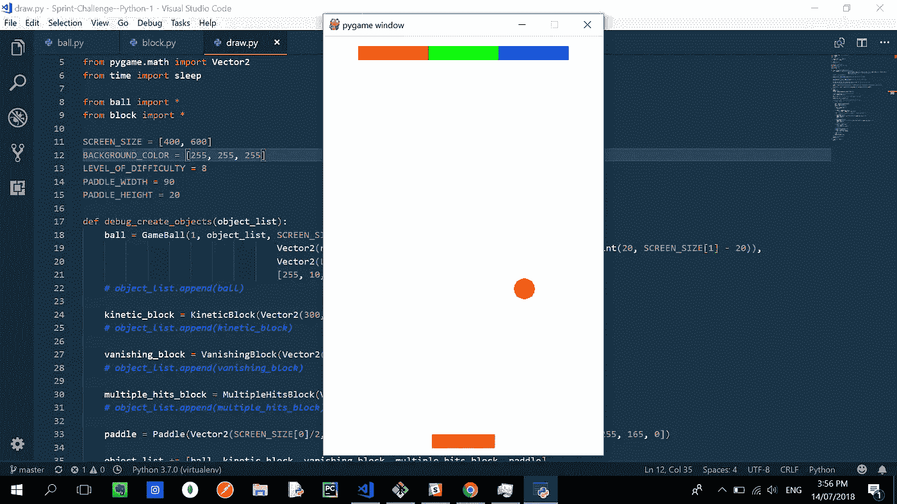

# 使用 Python 创建一个超级老派的基于文本的简·奥斯汀游戏

> 原文：<https://medium.com/hackernoon/creating-a-super-old-school-text-based-jane-austen-game-using-python-37da39da7f93>

本周，我们在 Lambda 学校开始了计算机科学部分的课程，涵盖了 Python 和面向对象 T2 编程的基础知识。所以从技术上讲，我们现在已经完成了课程的一半。时间过得真快！仿佛就在昨天，我写了第一篇关于成为软件工程师的文章。

不管怎样，有趣的事实:你知道 Python 是以英国喜剧团体“巨蟒剧团”命名的吗？你可能已经知道了。我没有，所以当我上周在阅读这门语言的历史时发现它时，我觉得很有趣。Python 的创始人吉多·范·罗苏姆遵循的原则是，Python 应该是有趣的。

你知道吗？在很大程度上，我本周使用 Python 的确很开心，尽管这是我第一次学习它。我说“大部分”是因为我们今天的 Sprint 挑战是一块非常难啃的骨头。

这有助于我对 JavaScript 有所了解。我甚至可以说 Python 对我来说更容易学，因为我之前已经接触过 JavaScript。他们的逻辑非常相似。比如 Python 也有称为“列表”的数组，称为“字典”的对象，if 语句，For 循环，while 循环等等。

这两者的主要区别可能是它们的语法。例如，Python 使用空格和缩进，而 JavaScript 使用花括号。

所以我们这周做的一个项目是编辑一个“文本冒险游戏”的代码。你知道，那些超级老派的基于文本的游戏，利用了文本而不是图形。我能够完成它，但为了了解事情是如何真正在引擎盖下工作的，我必须创建自己的基于文本的游戏。

我称之为“达西的求婚”，根据简·奥斯汀的小说《傲慢与偏见》改编。顾名思义，这个游戏的目的非常简单，就是让主角达西先生找到伊丽莎白·班纳特(故事中的女主角)，成功向她求婚，并赢得她的婚姻。(如果你还没看过这本书，那听起来会是史上最无聊的游戏情节。但我是奥斯汀的超级粉丝，那本小说是我一直以来最喜欢的，所以那个情节听起来让我很兴奋，当你开始阅读和欣赏简·奥斯汀时，你就会知道我的意思了。)

当然，这种游戏只会吸引男人，所以为女孩创造一个对应的游戏可能会很酷，比如说“丽西的拒绝”，其中玩家的目标是继续拒绝达西先生的求婚，直到她认为他值得她求婚(也就是说，当他失去他的骄傲，傲慢，等等)。)

它很容易构建，因为我所做的只是使用字典(对象)和类。

我们本周的主要项目，Sprint Challenge，是关于创建一个名为 Breakout 的经典 Atari 游戏的克隆。

做起来要困难得多。挑战在于构建一个拥有《突围》中所有或大部分功能的产品。因此，在屏幕底部必须有一个玩家可以控制的球拍，当然还必须有一个球在球拍、墙壁和屏幕顶部的砖块之间弹跳。一旦球击中这些木块，它们就会消失，以此类推。

大部分代码已经提供给我们了，尤其是那些提供对象间“碰撞”功能的代码。我们所需要做的就是为桨和积木创建对象。文件中已经有一个 Block 的超(父)类，所以我创建了一个继承父类属性的 Paddle 子类(或子类)。我对屏幕上方的方块做了同样的事情。然后，我相应地配置代码，或者以某种方式使这些对象显示在游戏的游戏区。

不过，我的这两个项目仍在进行中。达西先生仍然必须向利兹·班纳特求婚，而《越狱》中的积木仍然需要在被球击中后消失。但是这些游戏给了我们很多机会去更深入地了解 Python。

***

***λ大使计划***

**我已经报名参加了 Lambda 学校的大使项目，因为我简直无法停止谈论我的学校。如果你有兴趣进入他们的全栈 Web 开发和软件工程课程，请点击这里:***。***