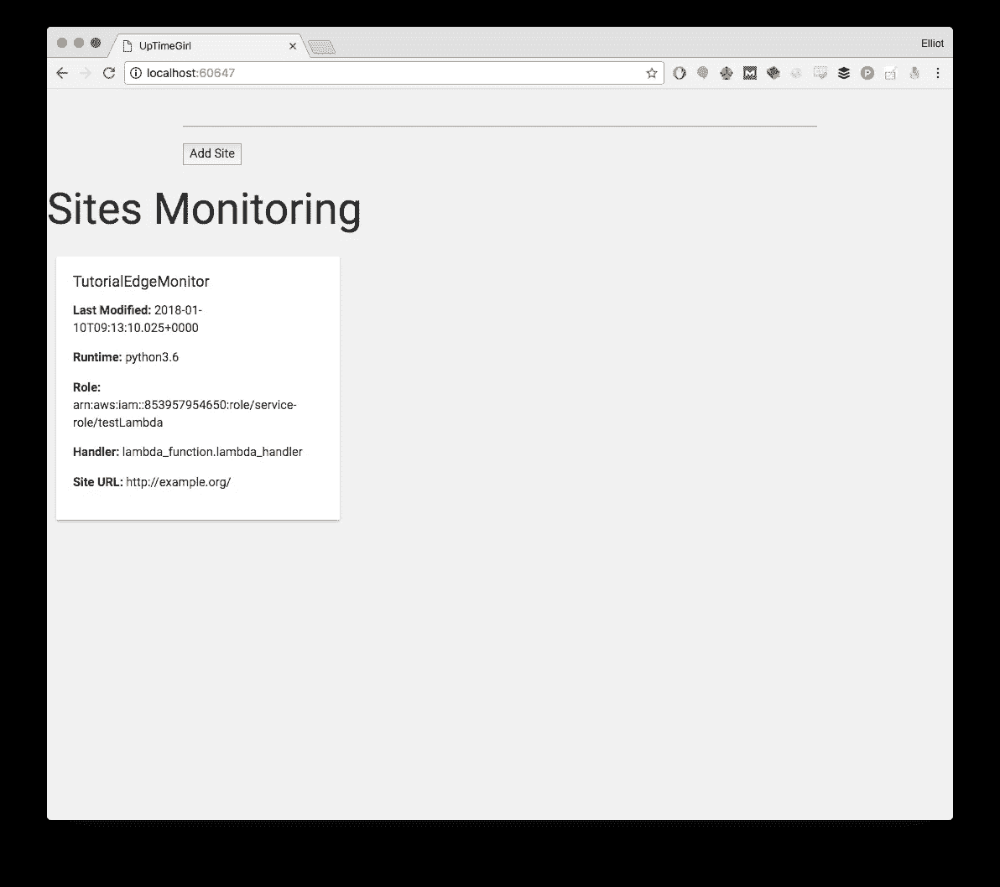
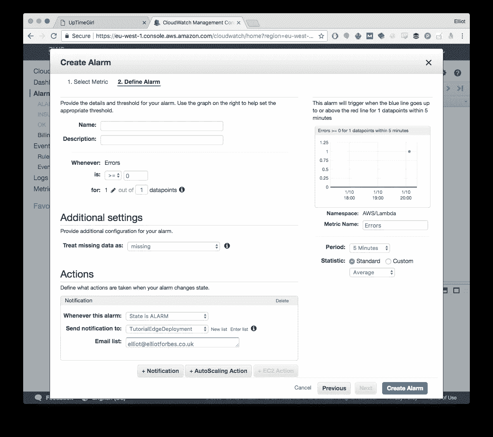

# 使用 AWS Lambda 在半小时内创建高度可伸缩的网站监控服务

> 原文：<https://medium.com/hackernoon/creating-a-website-monitoring-service-in-half-an-hour-using-lambdas-4f64fb199df3>

Lambda 函数是一项真正令人敬畏的[技术](https://hackernoon.com/tagged/technology)，如果你没有读过我的理论，即[无服务器](https://hackernoon.com/tagged/serverless)和更具体的 AWS Lambdas 将在 2018 年接管世界，那么请在这里查看:

 [## 无服务器计算将如何在 2018 年改变世界

### 无服务器计算是一个相当新的概念，在流行程度上有所增长。这部分是由于…

hackernoon.com](https://hackernoon.com/how-serverless-computing-will-change-the-world-in-2018-7818fc06b447) 

它吸引了一些读者，不知何故成为了 1 月 1 日阅读量最大的媒体文章之一……我想这一定是新闻不多的一天。

## 然而，无服务器到底能做什么？

我宣扬这些无服务器技术是很好的，但是它并没有向您展示这项技术的真正潜力。

所以，为了向你展示 Lambda 的真正可能性，我想我会把这本书放在一起，向你展示这项技术到底能做什么！

## 介绍 uptime girl——我最新的百万美元创业公司

在这篇文章中，我将建立一个网站正常运行时间监视器，允许人们填写表格，它将自动为您创建一个新的 lambda 函数，该函数将每 15 分钟检查一次您的网站的健康状况，并在其中一个网站死亡时向您发送电子邮件。我将更多地关注面向 Lambda 的概念，并讨论诸如 IAM 和角色设置之类的东西。

每一个好的创业公司都需要一个吸引人的名字，所以我们将称之为`UpTimeGirl`网站监控服务，有点像比利·周？

> 声明:如果你真的从这个想法中赚了一百万美元，我希望至少有一瓶啤酒！！

## 要求

由于这是一个软件项目，它需要一套需求，否则我们如何能够从我们的项目中定义任何形式的成功？由于我想为我的所有站点构建一个世界级的数百万美元的监控解决方案，我希望它具有以下要求:

*   它绝不能自己倒下。
*   跑起来一定很便宜。我们当然需要实现利润最大化。
*   每当一个网站关闭，它必须通知我，无论是通过文本或电子邮件
*   它必须扩展到数百个，如果不是数千个站点。

我们将在不到半小时的时间内为一个项目提出一套相当不错的要求，我想你会同意的。

## 前端

前端将是一个简单的 VueJS 应用程序，它既有一个输入框，将采取新的网站进行监控，也有一个显示已注册网站的瓷砖列表。

**为什么是 VueJS？我目前正在尝试学习它，我想为什么不呢？**

这只是一个非常简单的前端，看起来像这样:

如果你想要这个的源代码，你可以在我的 github repo 这里找到:[https://github.com/elliotforbes/uptimegirl](https://github.com/elliotforbes/uptimegirl)

我目前只是使用一个非常简单的`HTTP GET`请求来触发构建 lambda 函数的 Python API。

## API

该 API 将用 Python 编写，并将使用 Boto3 AWS SDK 来使我能够与 AWS 的各种 API 进行交互。这个 API 本质上将接受一个`URL`和`time_period`，它将基于这些参数动态地生成和创建一个新的 Lambda 函数。

> 免责声明:我可以保证这不是生产就绪。

在这段代码中，我们在 Python 3.6 中创建了一个简单的 [aiohttp REST API](https://www.youtube.com/watch?v=Z784Mwm4VBg) 。这将有两个主要端点，一个 get_functions 端点和一个 create_lambda_function 端点，可以分别通过`/funcs`和`/create`访问。

在`get_functions()`函数中，我们简单地返回一个 json 响应，其中包含当前在 Lambda 服务中注册的所有函数。

`create_lambda_function()`函数是有趣的地方。在这里，我们创建了一个字典对象，它包含了我们希望传入的所有环境变量。在这种情况下，我们只是传入我们希望监控的`URL`。为了确保函数名的唯一性，我们用一点点正则表达式的魔力从 URL 创建了一个字母数字函数名。

这样做之后，我们创建我们的`Code`字典对象，它将简单地以字节的形式传入我们的`lambda.zip`文件。然后，我们将`env`字典和`code`字典传递给 AWS 的`create_function`函数，这应该会为我们创建 lambda 函数。

之后，我们尝试将 CloudWatch 事件触发器附加到我们新创建的 lambda 函数，方法是使用`put_targets()`函数并传入我们已经在 AWS 控制台中定义的 15 分钟规则的名称和目标列表，在本例中是单个目标。

一旦这一切顺利运行，我们就返回一个简单的非 json(我知道…抱歉)响应。

在 github repo 中，我已经包含了一个 dockerfile，如果你想走这条路，可以在 AWS 的 ECS 上运行和部署，现在我把它全部放在 localhost 上，因为显然还有很多开发工作要做。

## 兰姆达斯

我们将动态创建的 Lambda 函数本质上将试图使用一个简单的`GET`请求获取我们传递给它的任何 URL。然后，我们将根据用来触发每个功能的 CloudWatch 事件规则，每隔 15 分钟运行一次。

如果这些预定请求中的任何一个发生失败，它将自动向 SNS 发布一个事件，然后 SNS 将向订阅该 SNS 的任何人发送一封电子邮件和一条短信。

## 代码

我们的 lambda 函数的代码非常简单。它所做的就是试图向一个 URL 发送一个`GET`请求，这个请求是从一个环境变量中获取的，这个环境变量是在我们动态创建函数时设置的。如果这个请求失败，那么它抛出一个异常。

如果我们想让我们的系统通知我们任何错误，那么我们可以用两种不同的方法之一。我们可以扩展我们的 Lambda 函数并添加必要的代码来发布到 SNS 主题，或者我们可以在 CloudWatch 上设置一个警报，每当我们的 Lambda 函数报告一个错误时抛出一个错误。

为了简单起见，我们将选择后者:

然后嘣！我们有一个警报系统，当我们的系统停机时，它会给我们发电子邮件。

订阅这个 SNS 主题的人的名单可以由前端动态修改，但我们需要留下一些工作让我们做，一旦我们通过了我们的创业公司的第一轮融资。

## 我们在生产中！

在不到半个小时的时间里，我们已经能够使用一系列 lambda 函数成功构建一个完整的监控解决方案，该解决方案现已投入使用。

它不仅具有难以置信的弹性，还可以扩展到潜在的数千个站点，并且由于我们正在创建的 lambdas 非常小，因此这样做的成本是最小的。

在本文中，通过创建新的 lambdas 来编排新站点添加的前端和 API 尚未部署到 ECS，因为我觉得这超出了范围，但是如果您想开始这方面的工作，这里有一个 docker 文件。如果你真的觉得元，你完全可以从一个 Lambda 函数服务前端应用程序，并使用 API 网关将其前置，然后将 Python API 分割成一系列 Lambda 端点，但我将把这作为读者的后续任务！

仍然有很多可以改进的地方，但是我希望这个简单的例子有助于突出 Lambda 函数不可思议的能力以及如何使用它们。在传统的应用程序中，您不仅需要编写大量的代码，还需要跨多个可用性区域部署它。这些都表现出额外的复杂性，需要花费更多的时间来构建和发布。

# 结论

希望你觉得这篇文章很有见地，令人愉快！如果你在设置这些 lambda 函数时需要任何进一步的帮助，请在下面的评论区留下你的评论或发推特给我:[埃利奥特·福布斯](https://medium.com/u/eb71d34fbe09?source=post_page-----4f64fb199df3--------------------------------)

我也在 [LinkedIn](https://linkedin.com/in/elliotforbes) 上，如果你想联系的话！

*如果你没有时间亲自推进这个创业想法，Cronitor 的天才团队已经基于这一设计创建了一个正常运行时间监控工具，该工具使用了全球部署的 Lambda。我强烈推荐在这里查看他们的产品—*[https://cronitor.io/uptime-monitoring](https://cronitor.io/uptime-monitoring)。