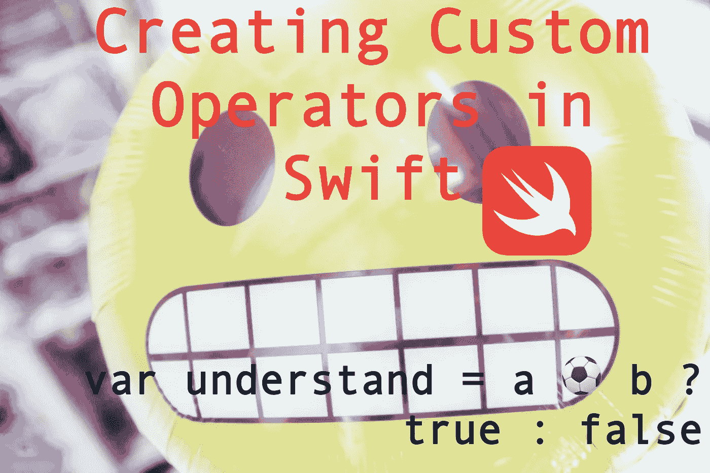

# 在 Swift ☕创建定制运营商

> 原文：<https://medium.com/hackernoon/creating-custom-operators-in-swift-2c8bababbaf6>

## 使用自定义操作符创建清晰、简洁、偶尔有趣的代码。

当我第一次看到包含自定义操作符的 Swift 代码时，我立刻认为它们只是又一种高级语言特性，像我这样的普通修补者根本不需要。然而，在我在早先的[文章](/@aclaytonscott/creating-and-distributing-swift-packages-132444f5dd1)中把它们作为一个非常基本的包例子之后，我认为除了方便之外，它们还可以让你的代码更具可读性，甚至在使用非标准操作符的时候。

# 什么是运算符？

直接摘自[维基百科](https://en.wikipedia.org/wiki/Operator_(computer_programming)):

> (运算符是)构造，其行为通常类似于函数，但在语法或语义上不同于通常的函数。

如果你做过任何[编程](https://hackernoon.com/tagged/programming)你都用过操作符。你可能很熟悉这些基础，例如`+`、`-`和`=<`。所有的语言都以不同的方式定义它们的操作符，一些语言如 Java 和 Javascript 主要依赖于一小组单独或组合使用的符号，而另一些语言如 python 使用英语单词作为它的一些操作符，如`and`、`or`、`is`和`not`。

## 运算符的类型

运营商通常分为几大类:

> **赋值** — 赋值运算符用于给变量赋值。
> 
> **算术** —算术运算符用于执行加、减、乘等数学运算。
> 
> **比较** —比较运算符用于比较值。它根据条件返回`True`或`False`。
> 
> **逻辑** —逻辑运算符用于创建定义布尔逻辑，即`And`、`Or`和`Not`。
> 
> **按位** —按位运算符对一个或多个位或二进制模式进行运算。

## 运算符语法

典型的操作符语法可以分为三种类型的操作符，`prefix`、`postfix`和`infix`。

**中缀**

Swift 和大多数其他编程范围通常支持`infix`操作符，因为它们是允许使用多个操作数的操作符类型。`infix`运算符有时也被称为二元运算符，因为它们对两个目标进行运算。使用这种思想`prefix`和`postfix`也被称为一元运算符。Swift 和其他几种语言也支持三元运算符。

**前缀**

`prefix`运算符放在操作数之前，是一元运算符。

**后缀**

`postfix`运算符放在操作数之后，是一元运算符。

# 创建自定义运算符

现在我已经简要定义了什么是操作符，我将演示如何在 Swift 和一些用例中定义自定义操作符。

## 声明自定义运算符

苹果在这里描述了声明操作符，但是你可以参考这个伪代码样本来简单看看使用的语法。使用`operator`关键字及其相关修饰符在全局级别声明新操作符。

Swift Operator Declarations

需要注意的一点是，对于如何定义您的操作符名称有一些限制。虽然我很想定义一个🌮或者💩操作员，Swift 将您限制在[定义的 unicode 字符范围内](https://docs.swift.org/swift-book/ReferenceManual/LexicalStructure.html#ID418)。

## 前缀

创建自定义`prefix`操作符的一个用例是，如果您有一个通用的操作，其中一个通用的符号可能与每次调用一个函数一样容易理解，而且更加简洁。比如求一个数的平方根或立方根。

## 后缀

一个`postfix`操作符有很多很好的用途，比如`--`和`++`操作符，我在这里用的是。但是当我看到镰刀和锤子 unicode 可以在 Swift 中使用时..哦天啊。

## 中缀

正如我前面提到的，`infix`操作符是最常见的。这里有一些有趣的例子，我把它们放在一起。

这里需要注意的一点是优先组的使用，以及定义`infix`操作符的时候。

> 运算符*优先级*赋予某些运算符比其他运算符更高的优先级；首先应用这些运算符。
> 
> 运算符*结合性*定义了相同优先级的运算符如何组合在一起——或者从左边组合，或者从右边组合。你可以把它理解为“他们与左边的表情联系在一起”，或者“他们与右边的表情联系在一起”
> 
> — [苹果](https://docs.swift.org/swift-book/LanguageGuide/AdvancedOperators.html)

# 摘要

Swift 包含自定义操作符的决定使您能够根据自己的需求创建简洁、可读的代码。如果有人在你的项目中碰巧遇到了☭或⛹，向你的编码同事解释这些也是很有趣的。😉