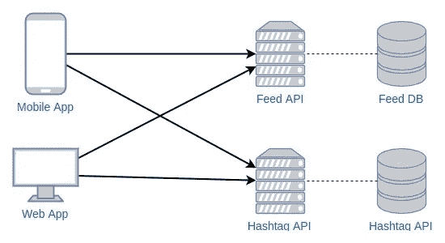
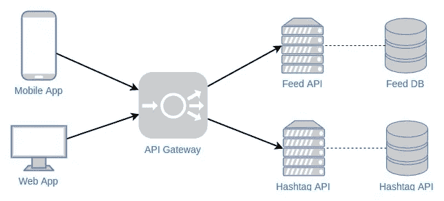
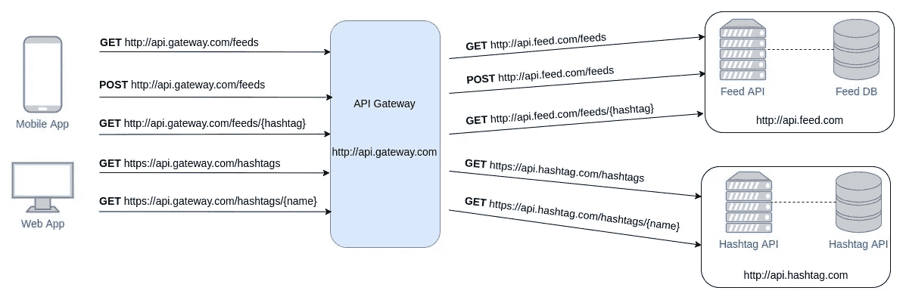

# 使用节点 JS 创建简单的 API 网关

> 原文：<https://medium.com/hackernoon/creating-simple-api-gateway-using-node-js-6d5933c214b8>


Photo by [Nikola Knezevic](https://unsplash.com/@nknezevic?utm_source=medium&utm_medium=referral) on [Unsplash](https://unsplash.com?utm_source=medium&utm_medium=referral)

在我的[上一篇](https://hackernoon.com/messaging-system-hands-on-7dda1afded37)文章中，我解释了消息传递系统如何帮助我们的系统更具可伸缩性。

回到我们使用微服务架构的时候，主要的概念是分离每个服务。分离服务后，现在我们有多个部署在不同主机上的服务。这意味着我们的客户端 Web、Mobile 或 CLI 等前端服务——应该从不同的主机检索数据。当我们有更多的服务时，这种情况会变得更加困难。我们应该记住每个服务的主机，这样我们就可以检索数据。这是系统的样子。



The current system design

因此，我们需要一种机制来使我们的前端服务调用后端服务，而不知道后端服务托管在哪里。我们如何创造这种机制？

# API 网关——你逃离的大门

我们能做的解决方案是使用 API 网关。我不想在这里解释什么是 API Gateway，因为有很多很棒的文章解释了它，你可以在这里找到，[这里](https://docs.microsoft.com/en-us/azure/architecture/microservices/gateway)，和[这里](https://smartbear.com/learn/api-design/api-gateways-in-microservices/)。

基于 [Nginx 的伟大文章](https://www.nginx.com/blog/building-microservices-using-an-api-gateway/)，API Gateway 的目标之一就是启用请求重路由。请求重新路由将使我们的前端服务调用后端服务，API 网关将为我们做这件事。当我们在服务上实现 API 网关时，这里将是我们的系统设计。



After API Gateway implemented

# 请为我创建一个 API 网关

实际上，API 网关提供商很少，比如 [Nginx Plus](https://www.nginx.com/solutions/api-gateway/) 、[亚马逊 API 网关](https://aws.amazon.com/api-gateway/)、 [IBM API Connect](https://developer.ibm.com/apiconnect/) 和[微软 Azure API 管理](https://azure.microsoft.com/en-us/services/api-management/)。但在这里，我想创造我自己的东西，因为动手做的东西让我更了解它是什么样的东西。

现在我想用 Express JS 创建自己的 API 网关。在此之前，我需要解释一下当前的系统是怎样的。目前，我有两个服务，Feed 服务和 Hashtag 服务。API 网关将把传入的请求重新路由给应该处理它的服务。

在我的 Feed 服务上，我有三个端点

*   获取所有的饲料
*   `GET /feeds/{hashtag}`获取包含标签的所有提要
*   `POST /feeds`创造新的饲料

在我的标签服务上，我有两个端点

*   `GET /hashtags` 获取所有标签
*   `GET /hashtags/{name}`按名字获取单个标签

目标是当前端服务向 API 网关发送请求时，请求将被重新路由到应该处理它的服务。请看下图，API 网关是如何重新路由请求的。



API Gateway reroute upcoming request

## 创建新的 Express JS 项目

创建一个新的 Express JS 项目，可以关注官网[这里](https://expressjs.com/en/starter/installing.html)。

## 创建 index.js

在创建 index.js 之前，安装 [body-parser](https://www.npmjs.com/package/body-parser) 以便我们能够解析 POST 数据。运行这个命令来安装主体解析器

```
npm install -s body-parser
```

`index.js`将成为我们的切入点。这里是我们的`index.js`

要运行服务器，请运行以下命令

```
node index.js
```

然后访问`localhost:3000`并确保它正常工作。现在，我们将创建路由器作为 API 网关的入口点。首先，在根文件夹下创建一个新目录，命名为`routers`。其次，在`router`目录下创建四个文件，分别是`router.js`、`apiAdapter.js`、`feedService.js`和`hashtagService.js`。这里每个文件的用途

*   `router.js`是组合所有的服务端点
*   `apiAdapter.js`是为每个服务构建 API 端点
*   `feedService.js`是重新路由请求到 Feed 服务的文件
*   `hashtagService.js`是将请求重新路由到 Hashtag 服务的文件

使您的`router.js`、`feedService.js`和`hashtagService.js`像下面的代码一样

更新这些文件后，尝试重新运行服务器并访问每个端点，确保一切正常。但在此之前，我们没有重新路由任何请求。那么我们该怎么做呢？

首先，我们需要先安装 [Axios](https://github.com/axios/axios) 。我们使用 Axios 来构建 HTTP 客户端。要安装 Axios，请运行以下命令

```
npm install -s axios
```

安装 Axios 后，现在在你的`apiAdapter.js`上写这段代码

然后，更新你的`feedService.js`和`hashtagService.js`像下面的代码

上面代码的目的是为每个服务创建 HTTP 客户端。我们为每个服务构造新的 Axios 对象，并将`BASE_URL`作为参数传递。`BASE_URL`是每个服务的基本 URL。因此，当 API 网关收到请求时，它将由之前使用`BASE_URL`构建的 Axios 对象处理。搞定了。就这么简单。

这就是我如何使用 Express JS 创建自己的 API 网关。实际上，API 网关并不仅仅用于重新路由请求。API 网关还用作认证器服务、处理数据缓存和响应聚合器。

非常感谢 Jonathan Natanael Siahaan 教我如何写一个好的代码设计。哦，对了，我的存储库上的 API 网关已经被修改了，JWT 添加来处理认证。你可以在这里找到我的完整代码

[](https://github.com/ecojuntak/api-gateway) [## ecojuntak/API-网关

### 使用 Express JS 的简单 API 网关。通过在 GitHub 上创建一个帐户，为 ecojuntak/api-gateway 开发做出贡献。

github.com](https://github.com/ecojuntak/api-gateway) [](https://github.com/ecojuntak/hashtag-api) [## ecojuntak/hashtag-api

### 使用 Golang 的简单 REST API。通过在 GitHub 上创建一个帐户，为 ecojuntak/hashtag-api 开发做出贡献。

github.com](https://github.com/ecojuntak/hashtag-api) [](https://github.com/ecojuntak/feed-api) [## ecojuntak/feed-api

### 使用 Lumen 的简单 REST API。在 GitHub 上创建一个帐户，为 ecojuntak/feed-api 的开发做出贡献。

github.com](https://github.com/ecojuntak/feed-api) 

卡皮·霍丁！😎 💻 ☕️