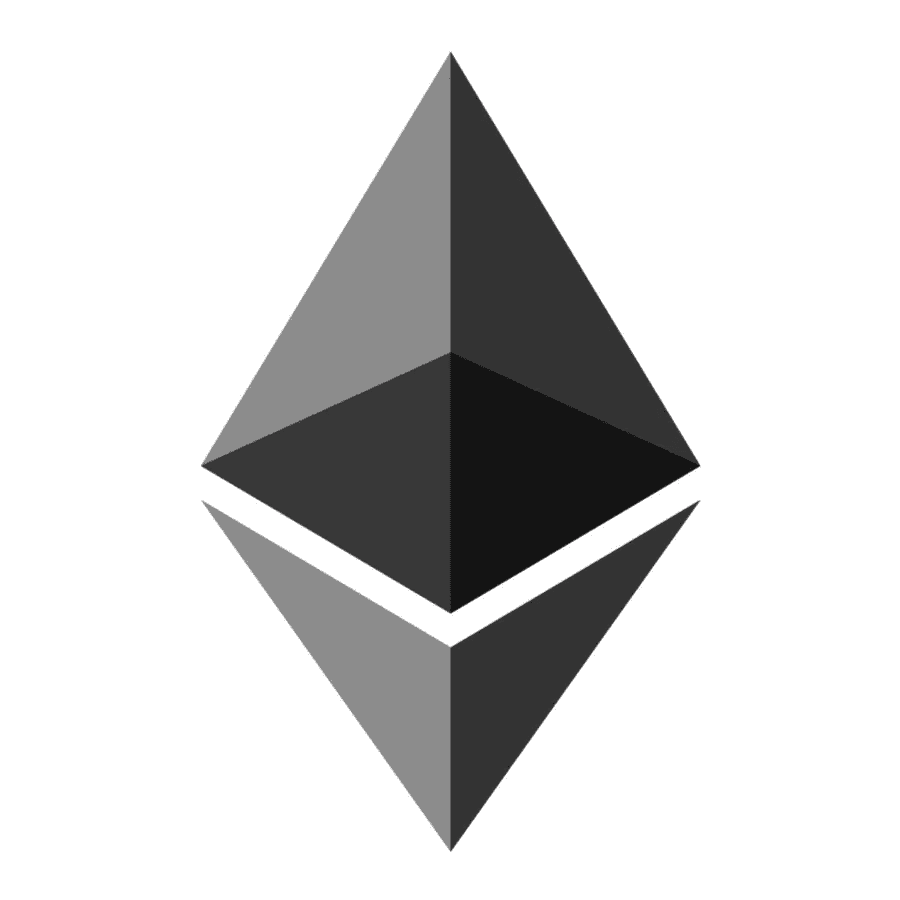
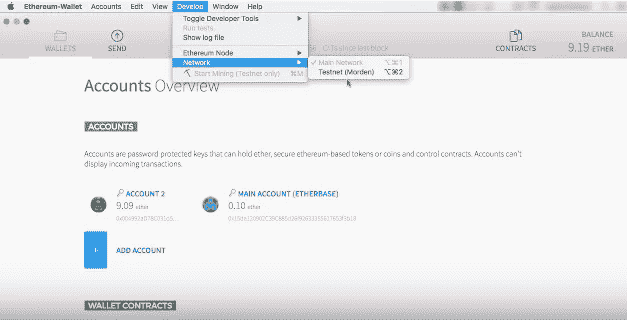
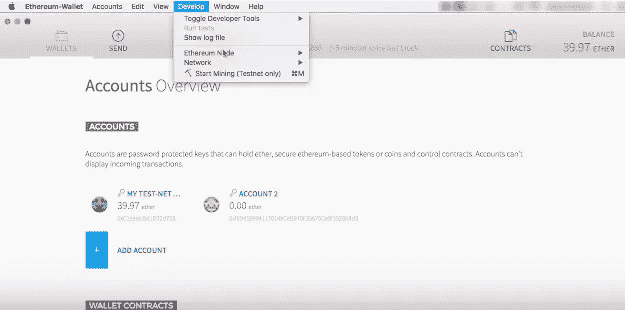
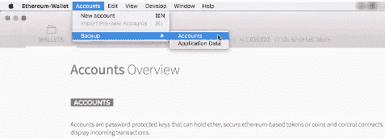
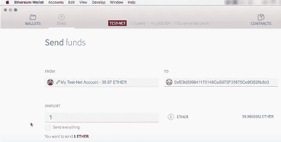

# 在以太坊上为 DAaps 创建智能合约！

> 原文：<https://medium.com/hackernoon/creating-smart-contracts-for-daaps-on-ethereum-9e8ff64a9977>

有些人认为以太坊只是类似于比特币的补充数字货币。但远不止如此。以太坊是智能合约的开源平台，而比特币是基于简单的数字货币概念。

什么是 DAaps？

Daaps 或分散式应用程序是基于[区块链](https://hackernoon.com/tagged/blockchain)T2 技术的开源应用程序。这些可以直接连接用户和服务提供商。这些应用程序不需要任何第三方合同。DAaps 必须是开源的，即源代码应该对所有人开放，并且必须生成令牌或数字硬币来为自己供电。

以太坊白皮书将 DAaps 分为三类。第一类是与金融和管理货币及其交易相关的应用程序。这些 DAaps 有自己的区块链，就像比特币和其他替代货币一样。第二类 DAaps 基于第一类 DAP。这些类别 DAaps 是应用程序，其中涉及令牌或数字货币，但所做的事情有非金融的一面；一个完美的例子是对计算问题的解决方案的自我强制奖金。最后，还有在线投票和去中心化治理等完全不是金融的应用。

智能合同基本上只是一个在区块链上运行的程序，但它有一些令人兴奋的潜力来降低与其他人交互的风险和成本。有很多问题，比如如果代码中有错误该怎么办，以及政府将如何监管此类合同。但是，有令人兴奋的潜力来扰乱各种行业，如法律，赌博，在线市场，点对点租赁，投票，甚至企业组织和政府。为此，我将演示如何创建和使用一个简单的智能契约。

我正在使用新发布的以太坊钱包，我相信这是 Mist 的第一个版本，这个程序最终将成为探索和使用去中心化应用程序的用户友好方式。一旦运行钱包 app，它就会和网络一起下沉。在试验时，您可能希望在测试网络上运行。

我也打开了采矿，所以我有一些乙醚玩。

我花了 10 多个小时才得到 10 个左右的测试以太。当你创建一个帐户时，你应该创建一个强密码，并且在后台创建一个密钥存储文件。密码和密钥存储文件是你备份账户的全部。

那我们可以从送些乙醚开始。我输入了我在**到**地址开的另一个账户，并输入了一笔金额。

在底部，您可以看到一个从左到右的滑块，即从更便宜到更快。这是向矿工支付的规定费用。

既然你已经走了这么远，请为我的硕士学位捐款。

比特币地址:32h 62 nu 8 fqn 21 px 3k 5 jhpget 9 xprmzhpaw

文莫:@Kshitiz-Hamal

CashApp: $KshitizHamal