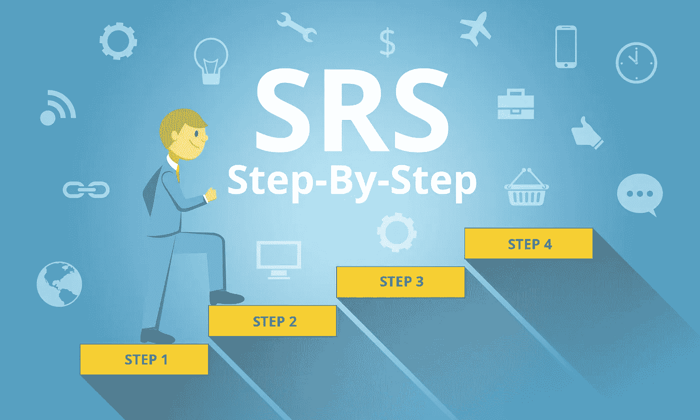
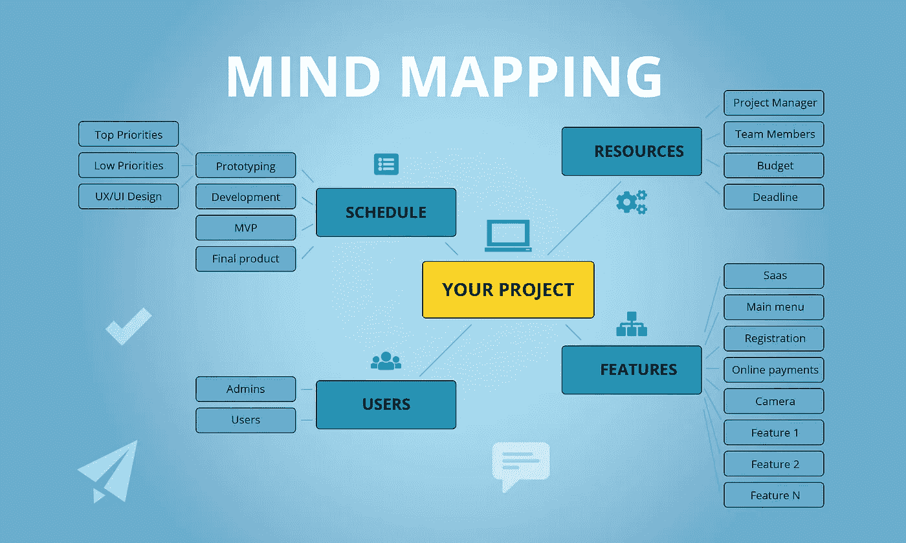

# 通过分析需求逐步创建服务请求

> 原文：<https://medium.com/hackernoon/creating-srs-step-by-step-by-analyzing-requirements-2429d8e3b0ac>

当你寻求[网络开发服务](https://freshcodeit.com/services)时，任何公司都会希望看到你的系统需求说明书(SRS)。如果您不知道如何为 web 应用程序创建 SRS，本文将指导您完成这个过程。我们还将添加一个 SRS 模板示例，您可以使用它来加快项目的开发。

## 如果一个系统需求规格？

SRS 是包含开发过程的目标和可测量结果的文档。只需看一眼 SRS，任何项目的利益相关者就能理解成品应该是什么样子，应该具备哪些特性。在之前的一篇文章中，我们已经介绍了创建 SRS 的[主要步骤，其中包括一个可下载的 SRS 文档模板。您可以使用它来概述关键需求，确定可量化的参数并设置项目的约束。](https://freshcodeit.com/freshcode-post/how-to-create-srs-system-requirements-specification-for-web-application-advice-from-experienced-developers)

## 什么是系统要求？

当你创建自己的应用程序时，对你希望征服的行业和竞争有一个清晰的了解。根据您提供的是零售产品、咨询服务还是 SaaS 解决方案，大多数要求会有所不同。尽管如此，有些需求是所有软件产品的标准，比如:

*   用于存储产品或用户信息的数据库；
*   前端用于舒适的用户交互，后端用于信息处理；
*   为管理员和用户提供独立访问权限和功能的用户层次结构；
*   第三方软件产品集成；
*   对桌面、平板和移动用户的跨平台支持；
*   适应项目未来扩展的可伸缩性。

这些**非功能性需求**在多个行业中可能是相同的。他们阐述了系统的性能，展示了它应该如何运行。**功能需求**概述了系统的行为，或者它在不同的环境和不同的使用场景下应该做什么。

功能性需求让人爱上你的产品，非功能性需求让人留下。不过，要想在这个过度饱和的市场中为自己赢得一席之地，你需要拿出别人没有的独特功能。管理用户意愿、案例和相应特征的最简单和最具描述性的方法是思维导图。这将让所有利益相关者看到全局，并对项目的特性有一个亲密的了解。

## 如何使用思维导图开发 SRS？

当你有了一个关于网络应用的绝妙想法，并想找一家[网络开发公司](https://freshcodeit.com/)来实现它时，你最不想做的事情就是写一份冗长的技术文档。有一种更令人愉快的方式来进行需求获取——从关于产品主要特性的头脑风暴会议开始，并将结果转化为可操作的思维导图。以下是该过程的简要概述:

1.  在面试中确定你的应用程序的用户和他们最大的愿望。
2.  创建一个大图思维导图来回答为什么、谁和什么时候的问题。谁将从您的解决方案中受益？他们为什么需要它？他们什么时候会使用你的产品？
3.  开发用户故事思维导图，以跟踪不同的场景，并了解哪些功能将满足用户的需求。
4.  基于用户故事思维导图，评估功能特性，计划和优先考虑它们的开发。
5.  将思维导图数据传输到 SRS 中。结构化文档可以帮助你想出新的想法，添加到思维导图中。
6.  当你对用户的需求和要求有了更好的理解并计划开发过程时，更新和扩展思维导图。

没有必要浪费几天时间来绘制一个复杂的思维导图，对所有功能进行详细的解释。相反，集中精力在关键概念上，并在 SRS 中解释它们。您将把文档转交给所选择的软件开发服务提供商，因此您的 SRS 应该尽可能详细，解释您的所有愿望。记住使每个参数可以量化，以确保您可以确认需求得到满足。

包括你认为对项目必要的任何限制，比如预算和时间表。如果应用程序开发团队不能按时或在分配的总额内完成工作，优先考虑功能并消除那些对项目成功不重要的功能。

现在你知道如何从头脑风暴会议到生动的思维导图再到可操作的 SRS。如果你以前没有经验，这个过程比从头开始开发一个 SRS 文档要容易得多。

如果你只有一个软件需求规格模板，不知道如何处理它，请联系我们的团队。我们将帮助您为您的项目开发一个全面的 SRS。或者将您的 SRS 发送到 FreshCode，立即获取报价。

点击进入 [FreshCode 博客](https://freshcodeit.com/blog)如果你想要更多关于项目管理、选择离岸定制软件开发公司和最新 IT 趋势的实用技巧。听听我们的时事通讯，成为第一个获得新一批有用提示的人。

你喜欢这篇文章吗？请为我们鼓掌！在媒体上与其他人分享文章。

欢迎登陆我们的 [*FreshCode 网站*](https://freshcodeit.com/) 联系我们

最初的 [*通过分析需求逐步创建服务请求*](https://freshcodeit.com/freshcode-post/creating-srs-step-by-step-by-analyzing-requirements)