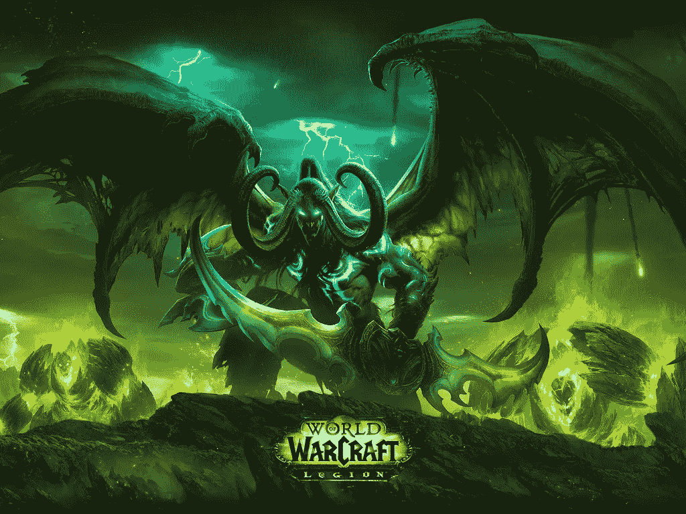
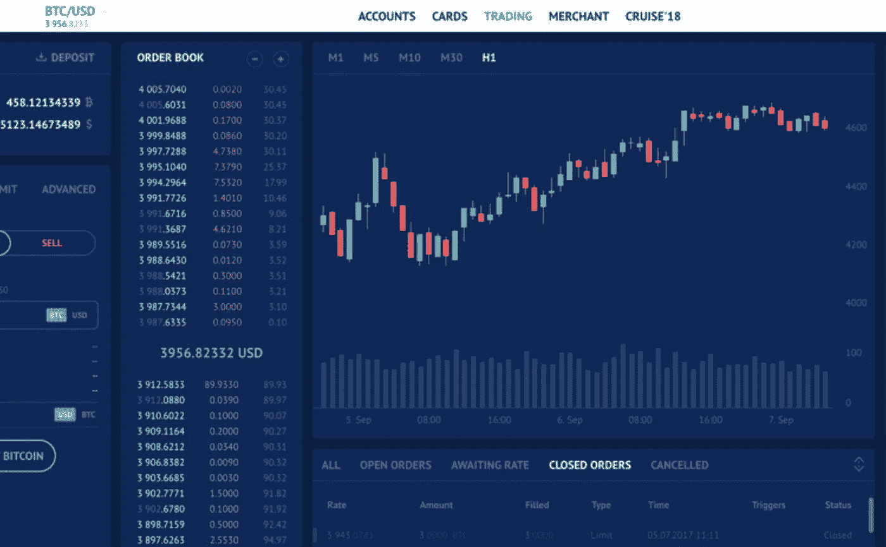

# 创建虚拟经济:终极指南

> 原文：<https://medium.com/hackernoon/creating-virtual-economies-the-ultimate-guide-dd39482fb67c>

# 介绍

虚拟经济是一种新兴现象。公司可以从围绕其平台成功创造虚拟经济中获益良多。来自虚拟经济的数据和经验也可以帮助经济学家、社会科学家和政策制定者改善我们的现实经济。

本文分为两个部分:

**第 1 部分**描述了虚拟经济、可从虚拟经济中受益的企业、相关技术以及理解如何创建虚拟经济所需的关键经济原则。

**第二部分**展示了创建虚拟经济的综合过程。这包括定义如何创造和交换价值、经济规划和治理机制、用户策略、映射关系以及关于架构、设计和功能的最佳实践。

**缩写**

本文中的“**用户**”一词指的是以下两者之一:

视频游戏玩家

区块链平台参与者

社交、电子商务和共享经济平台参与者

每当我使用术语“游戏”时，我特指 MMO

**MMOs** :大型多人在线游戏

**MMORPG**:大型多人在线角色扮演游戏

**简洁**

我写这篇文章时考虑的是以行动为导向的人。这是一个让你快速入门的指南。在这篇文章中，我试图保持我的解释简洁明了。

**第一部分:必备知识**

1.虚拟经济

2.相关技术

3.能够从虚拟经济中获益的企业

4.经济学原理

**第二部分:构建虚拟经济**

5.用户配置文件

6.用户价值网格

7.定义价值交换的方式

8.映射关系和互动

9.经济规划

10.创造用户利益和激励

11.最佳实践

# 第一部分:必备知识

# 1.虚拟经济

# 什么是虚拟经济？

虚拟经济是存在于虚拟世界中的经济，在虚拟世界中，用户可以在游戏或平台环境的背景下交换虚拟或真实的资产、产品和服务。用户可以为了娱乐或者为了真正的经济利益而参与虚拟经济。

虚拟经济最早出现在 20 世纪 70 年代末的 MUD(多用户地下城)游戏中，但也存在于其他非游戏平台上。今天，最大的虚拟经济存在于 MMORPGs(大型多人在线角色扮演游戏)上，如《魔兽世界》和《激战》。

一些社交网络平台上的用户参与和节制已经演变成社交货币的形式。虚拟经济无意中在这些平台上发展起来。虚拟经济可以存在于任何平台上，在这个平台上，真实的钱可以花在用户创造的数字资产、产品、服务和互动上。

## 虚拟经济和实体经济如何互动

虚拟经济和实体经济之间的重叠越来越多。虚拟经济中存在的资产通常在现实世界中用真实的货币进行交易。这些交易通常在在线拍卖网站上进行，被称为“真钱交易”(rmt)。

许多平台积极宣传虚拟商品与现实世界货币挂钩的理念。然而，一些游戏平台不鼓励甚至禁止用现实世界的钱来交换虚拟物品，因为人们认为这不利于游戏。

淘金是一种用户玩在线游戏的做法，目的是获得游戏中的货币，然后将其出售给其他人以获得真实的货币。黄金农业利用了经济不平等，因为大多数黄金农民来自发展中国家，他们将辛苦赚取的游戏货币出售给发达国家的富裕玩家，换取真金白银。

## 虚拟经济对企业意味着什么

许多成功的公司拥有虚拟经济存在的平台。通过在类似游戏的环境中创建虚拟经济，让用户在其中互动和协作，公司平台可以在其主要业务活动中经历快速增长。

公司创造虚拟经济，让消费者参与其中，有几个好处。

## 为用户赢得机会

虚拟经济越来越受欢迎，因为它们为用户创造了赚钱的机会。用户能够在这些平台上以新的方式互动，创造价值，赚真金白银。

## 用户参与和平台增长

能够将互动游戏化的平台拥有更高的参与度和用户留存率。具有虚拟经济的应用程序可以经历大量的有机增长，因为它们的用户积极地传播信息，并鼓励更多的人加入。

## 协作互动

一些平台允许第三方广告商和商业服务提供商参与到他们的环境中。虚拟环境中的企业和服务提供商通常与用户发展合作关系，而不是敌对关系。

# 2.相关技术

本节概述了一些可用于虚拟经济创造的技术和概念。

## 区块链

区块链是一种不可变的数字分类账，其中[数据和交易](https://towardsdatascience.com/blockchains-the-technology-of-transactions-9d40e8e41216)按时间顺序记录。区块链以“块”的形式保存成批的有效交易。使用[加密散列](https://hackernoon.com/cryptographic-hashing-c25da23609c3)将每个块链接到它之前和之后的块。

区块链是防篡改的。许多安全机制，如“ [Merkle Trees](https://hackernoon.com/merkle-trees-181cb4bc30b4) ”使得篡改保存在先前块中的数据变得非常困难。数据的完整性是这项技术的关键特征之一。

权力下放是公共区块链的核心。公共区块链的每个用户都可以通过下载整个区块链以及相关软件来参与其中。分散式数据存储使每个用户都能拥有不断发展的区块链总账的完全相同的副本。

这项技术可能会有一系列复杂的用例。区块链很容易被审计，并且[可以是私有的](https://towardsdatascience.com/how-blockchains-will-enable-privacy-1522a846bf65)或公共的，有权限的或无权限的。区块链创建了一个环境，在这个环境中，用户无需相互信任就可以进行交互和交易。

Blockchain Structure.

## 加密货币

加密货币是数字资产，最初被设计为交易媒介。加密货币由区块链技术驱动，因此本质上是分散的。加密货币使用极其强大的加密安全机制来保护金融交易。

开发人员可以为他们创建的加密货币分配一组属性和规则，例如总供应量、创建新单位的过程以及如何验证价值转移。

你可以把加密货币想象成可编程的货币。智能合同可以将加密货币单元编程到其中，这些加密货币单元仅发布给满足智能合同创建者描述的条件或工作的人。

## 代币

代币代表由私人实体发行的资产或公用事业的价值单位。[令牌](https://hackernoon.com/erc20-tokens-b3b50c95ad08)是数字的，通常位于区块链平台之上。代币通常是可替换的，这意味着一个公司发行的代币与它发行的所有其他代币具有相同的价值。

## 实用令牌

公用事业代币代表一个价值单位，可以兑换发行公司提供的商品或服务。

## 安全令牌

证券代币是由私人公司发行的可交易金融资产。证券代币代表债务、股权或衍生品。

## 过期令牌

令牌可以编程为在特定时间或满足特定条件时过期。这些代币可能有也可能没有经济价值或附带的某些权利。

## 有限使用令牌

发行机构可以限制令牌的使用。代币可以被编程，因此它们只能在特定的地方或满足特定的条件时使用。有限使用特征可以帮助设定代币的经济价值。

## 不可替换的令牌

不可替换令牌(NFT)是一种特殊类型的加密令牌，代表某种独特的东西。每个不可替换的令牌都不同于其他令牌，不能直接与它们互换，并且价值也不同。

## 不可替换令牌支持的资产所有权

虚拟和现实世界资产的所有权可以嵌入到不可替换的令牌中。例如，蒙娜丽莎的所有权可以嵌入到一个不可替代的令牌中。这个令牌可以进行数字交易，持有它的人可以宣称拥有蒙娜丽莎的所有权。

在以太坊上，区块链不可替换令牌目前可以使用 ERC-721 令牌标准来创建。另一个不可替代的令牌标准 T1 被称为 T2 ERC-1190 T3 已经在以太网上提出。

ERC-1190 tokens feature two different types of digital asset ownership.

## 数字稀缺

稀缺使商品变得有价值。无论是否得到媒体知识产权所有者的同意，数字媒体都可以很容易地共享和复制。

不可替代的加密令牌最终使得数字稀缺得以存在。不能复制不可替换的令牌。保存在不可替换令牌中的图像可以被复制，但是原始图像的所有权只能保存在该令牌中。

在娱乐和数字版权管理领域，数字稀缺性正成为越来越重要的话题。

# 3.业务类型

虚拟经济更适合某些商业类型。区块链公司、游戏公司和基于平台的企业将从设计良好的虚拟经济中获得最大收益。

## 区块链公司

区块链平台是去中心化的对等网络。这些网络受到密码保护，并使用共识机制来防止修改数据。区块链平台实现了一系列不同的用户交互和独特的功能。区块链用例包括智能合同、[跟踪](https://towardsdatascience.com/blockchain-technology-for-supply-chain-management-3a12b5d67aa3)和[优化物流](/blockstreethq/optimizing-logistics-with-blockchain-technology-34a1ba83130)、[身份管理](https://towardsdatascience.com/https-medium-com-shaanray-how-blockchains-will-solve-privacy-88944f3c67f0)、分布式存储、安全[投票](/blockstreethq/voting-on-the-blockchain-b49bf8c9e8c)、管理医疗记录和交互、数字权利和媒体、能源跟踪和交易、金融科技和银行、房地产登记。

区块链公司提供了一个平台，用户可以在这个平台上相互交流、交换价值和合作。加密货币是使用区块链技术构建的，当智能合同中满足特定条件时，加密货币的单位可以自动交换。复杂的区块链平台创造了虚拟经济，用户可以在其中创造、利用和交易稀缺的数字资产。根据区块链平台的功能和复杂程度，可能存在几种不同的用户类别。

具有智能设计环境的区块链平台将使每个用户类型都能通过成为其环境的一部分而获得一些价值。

## 游戏公司:MMO 和 MMORPGs

**MMOs** :大型多人在线游戏

**MMORPG**:大型多人在线角色扮演游戏

多人在线游戏不可避免地创造了巨大的虚拟经济。持续开放的网络世界不断发展，成千上万的普通玩家相互创造和交换价值。用户可以大规模地互动、协作、组织自己和相互竞争。游戏已经有了虚拟经济，玩家可以创造游戏中的资产和物品，然后互相交易，有时是为了真钱。

目前流行的游戏提供社交互动、角色扮演，有独特的主题，并以某种定义的方式发展。一种独特的文化通常围绕这些游戏发展。

游戏内通货膨胀已经成为一些游戏平台不得不解决的经济问题。一些游戏公司已经雇佣了经济学家来帮助优化他们游戏中的虚拟经济。

World of Warcraft is a popular MMORPG with over 10 million subscribers.

## 平台公司

平台的目的是匹配用户，促进社交货币、商品和服务的交换。存在许多类型的平台。社交媒体平台包括 Instagram 和脸书。由于优步和 Lyft，社交乘车共享是众所周知的。像 Tinder 和 Match.com 这样的婚介平台帮助人们认识彼此。Upwork & Fiverr 等平台有助于在零工经济中匹配人才。电子商务平台如 E-bay 和亚马逊帮助人们购买和销售。成功的平台公司花很多时间思考他们的核心交互，他们的参与者，以及他们为用户创造的价值。

与区块链和游戏公司相比，平台公司在互动方面要刻板得多。然而，微工作和共享平台上的用户之间的交互越来越像游戏，以保持动机和用户参与。通过允许用户偶然开发新的功能和交互，可以创造很多价值。让虚拟经济围绕更传统的平台发展可以增加互动，促进增长。

# 4.经济学原理

本节介绍了一些需要理解的经济原则，以正确创建和管理虚拟经济。

## 微观经济学

微观经济学是一门社会科学，它研究个人和企业的行为，以更好地理解他们的决策机制。它分析了确定商品和服务相对价格的市场机制，以及所做的决定如何影响有限资源的利用和分配。

用户在商品市场中相互交流。生产者构成供应方，购买其产品和服务的消费者构成需求方。一个市场可以是竞争性的、开放的，也可以是少数用户垄断的。正确的分析必须考虑商品市场的结构，以创建一个准确的模型。

## 宏观经济学

宏观经济学研究整个经济的行为。它分析不同经济部门之间的相互关系，以更好地理解整体是如何运作的。

宏观经济学有两个主要的研究领域:

1.商业周期:理解国民收入短期波动的原因和后果

2.增加国民收入:理解哪些因素决定性地影响长期经济增长

宏观经济学关注经济作为一个整体的运行方式，分析产出、消费、储蓄、国内生产总值和通货膨胀等因素。管理机构利用这些因素来制定其经济政策。

## 通货膨胀

通货膨胀是商品和服务价格上涨的速度，因此，一种货币的购买力(或内在价值)正在下降。

当货币供应量增长快于经济增长率时，就会发生通货膨胀。通货膨胀的主要原因是需求增长快于供给，以及由于生产或原材料成本的上升而导致的价格上涨。今天，大多数经济学家倾向于低而稳定的通货膨胀率。

高通胀率被视为对经济有害，因为它增加了市场的低效率，使预算或长期规划变得困难，而且未来货币购买力的不确定性会抑制投资和储蓄。

## 通货紧缩

通货紧缩是指商品和服务的总体价格水平下降。

当生产过剩、消费减少或货币供应减少时，就会出现通货紧缩。当一个经济体的货币供应量固定时，通货紧缩会随着时间的推移自然发生。有固定供应量的加密货币将经历通货紧缩。

通货紧缩会导致失业增加。随着公司赚钱越来越少，为了削减成本，他们可能会解雇更多的人。

通缩螺旋是指价格下降导致产量下降，进而导致工资和需求下降，进而导致价格进一步下降。

## 货币

货币是流通中作为交换媒介的货币。一种货币在一个国家内是通用的。加密货币在封闭的数字环境中很常见。加密货币交易所使用户能够将他们持有的货币从一种货币转换为另一种货币，而不必在这两种货币之间转换为法币。

Fiat currencies.

## 管理

管理任何经济体系都需要一套规则和机制。治理是构建规则和行动、持续监管和问责的方式。治理系统的正式程度取决于所治理环境的复杂程度。

财政政策是政府收集资金，然后通过支出来影响经济的政策。收入主要通过税收征收，支出可以通过多种方式进行，包括直接投资和为某些部门提供补贴。财政政策用于在商业周期中稳定经济。

## 中央银行

中央银行是管理一个国家货币、货币供应和利率的机构。中央银行垄断着一个国家货币基础的增长。

货币政策是中央银行控制短期借款成本或货币基础的过程，通常以通货膨胀率或利率为目标，以确保价格稳定和对货币的信任。它是由中央银行设定的。

## 货币发行局

货币发行局是货币当局，负责维持外币与美元的固定汇率。在一个虚拟经济中，如果能够与另一个虚拟经济互通，货币发行局就很重要。

## 国民收入认同

国民收入或产品身份描述了国内生产总值(GDP)的衡量方式。GDP 的公式是消费+投资+政府支出+(出口-进口)。简而言之，这就是 GDP = C + I + G + (X — M)。

# 第二部分:建立虚拟经济

# 5.用户配置文件

在虚拟经济中，价值是由用户创造的，所以开始设计过程的逻辑起点是用户。

本节的目标是描述一个详细的用户配置文件文档，该文档定义了用户、用户的功能及其权限。

## 定义用户类型

首先定义您的平台拥有的用户类型。

示例:

Instagram 和 Twitter 都有一类用户

优步有两种类型的用户:司机和骑手

游戏可以有多种类型的用户

Instagram 和 Twitter 用户创建个人账户、宠物账户或公司账户，但这些账户的用户类型仍然相同。

这一步不需要复杂。只需在垂直栏中列出您的平台拥有的用户。

## 定义函数

功能是用户可以在平台上采取的行动。

示例:

Twitter 的功能有:tweet，retweet，tweet at users，delete tweet，回复用户 tweet，关注用户，阻止用户，给用户发消息，编辑个人资料，使帐户私人化等等。

Instagram 的功能有:上传帖子，删除帖子，为帖子添加位置，为帖子添加描述，评论其他图片，关注其他用户，喜欢帖子，转发帖子，消息用户，阻止用户等等。

优步的功能有:选择目的地，选择接送地点，订购搭车，取消搭车，选择搭车人数，选择哪种类型的车(拼车还是私家车)，报告事故，添加小费等等。从驾驶员的角度来看，这些功能包括开启驾驶模式、接受乘坐、给乘客发信息、取消乘坐等。

不同类别或分组的用户可能比其他用户更多地使用某些功能。在 Instagram 和 Twitter 上，公司比个人用户更多地使用推广功能来推广他们的帖子，但这些功能都是通过同一类型的用户帐户访问的。

在下一列中，在每个用户类型旁边，列出用户可以在您的平台上使用的所有功能。

## 分配权限和限制

并非所有用户都可以使用所有功能。许多权限和约束是由应用程序的创建者设置的，并且通常单个用户能够通过编辑他们的设置来改变一些权限和约束。

某些功能是可能的，但不鼓励使用。例如，优步的司机在拒绝匹配的顺风车时会被扣分，而乘客在取消已经到达并等待了一段时间的顺风车时会被扣分。

在更复杂的应用程序和游戏中，某些功能和权限只有在用户提交所需信息、付款或达到一定级别时才会解锁。这些是有条件的权限，也应该在本文档中进行映射和定义。

示例:

Instagram 用户可以编辑他们的设置，以允许或限制互动。

优步的司机和乘客有非常明确、严格的功能，他们自己设置权限和约束的能力有限。

游戏可以变得非常复杂，在游戏过程中可以设置、获得、购买和失去不同级别的技能、权限和限制。

在每个单独功能旁边的第三列中，写下相关权限和约束的详细描述。描述应包括以下细节:

该功能允许还是不允许？

用户可以调整设置吗？

有条件吗？如果是，那么是什么？

是不是取决于别的？

许可可以通过购买或获得吗？

他们是通过这个功能和别人互动还是有什么东西通过这个功能和他们互动？

# 6.用户价值网格

这一步的目标是指定用户如何创造价值。在这一步的最后，我包含了一个用户价值网格示例。一旦定义了下面讨论的每个子部分，您就应该创建您的用户价值网格。

用户通过参与平台上的一系列活动来创造价值。每个用户可以采取的具体操作在您在上一节中创建的用户配置文件文档中定义。多种用户类型将参与不同的活动，因此创造不同形式的价值。

## 定义值的类型

价值将与可用的功能及其使用方式密切相关。从规划功能开始。

在平台或虚拟环境中出现了两类价值；开发人员通过设计创造的计划价值，以及用户意外行为创造的未预见价值。

不可预见的价值是非常有趣的，因为它是在用户或团体发现通过平台创造价值的创造性新方法时产生的。通常这些用途会让创始团队大吃一惊。

每个功能通常都有量化的已知价值，在许多情况下还有不可预见的价值。例如，在 Instagram 上拥有 100 万粉丝将使账户所有者确认他们正在发布受欢迎和受欢迎的内容，不可预见的价值可能是，账户所有者现在可以向其他人收取在他们的账户上发布推广内容的费用，或者出售他们的账户以获得真正的金钱。

## 定义每种用户类型如何创造价值

每个平台都可以创造价值。作为平台开发人员，您有责任清楚地定义如何在您构建的环境中创造价值。

价值直接来源于你为用户提供的功能，在许多情况下，不同的有价值的活动的组合创造了他们自己的利基和狂热的粉丝基础。

暂时以社交媒体为例，一个拥有 10，000 名用户的 twitter 帐户具有一定的关联价值，而一个关注者少得多但其已验证的个人资料带有蓝色勾号的 twitter 帐户具有另一种类型的关联价值。如果将这两种类型的值组合在一起，组合帐户(即 10，000 个用户+一个经过验证的蓝色勾号)的值将远远高于这两个帐户中任何一个单独的值。

当你设计你的用户价值网格时，为每个功能留出一些空间来讨论所有计划好的和可能创造的看不见的价值。您还可以创建一个新文档，专门探索在您的生态系统中可能创造的价值组合。还要探索使用不同功能组合的多种用户类型所创造的价值。

## 定义每种用户类型如何购买价值

价值可以赚，价值可以买。正如我前面提到的，价值经常在未经批准的拍卖网站上交易，平台创建者甚至都不知道。

一些平台和游戏允许他们的用户在他们自己的生态系统中购买价值。

Call of Duty’s game developers decided to call their in-game market ‘Black Market’.

例如，一个用户在社交平台上发布引人入胜的内容，并积累了 1000 万其他用户的粉丝，然后可以将他们的用户档案出售给某人，获得大笔金钱。

定义用户如何购买价值，因为这将帮助你正确地定义如何创建一个交换，并对你的平台的经济保持脉搏，无论是批准的还是未批准的。

## 定义每个用户如何解锁/赢得奖励

既然你已经有机会思考用户、功能和价值类型，那么开始定义和规划奖励是有意义的。奖励是虚拟经济极其重要的战略组成部分，因为它们有两个关键功能:

1.可以从虚拟环境中有策略地添加或删除奖励，以抑制通货膨胀或应对通货紧缩

2.奖励可用于鼓励或阻止平台上的各种经济活动

一些奖励可能取决于环境中的其他因素，例如在平台上花费的时间、等级或层级，而其他奖励可以对所有参与者开放。

愿意在平台上花更多钱、对生态系统忠诚度高的用户，应该通过获得某种类型的奖励而受益。其他奖励应该鼓励和激励闲置用户或保守玩家增加他们在系统中的参与度。

想想你的虚拟经济中存在的所有回报，然后为每种类型的用户绘制出来。

The format for a basic User Value Grid.

# 7.价值是如何交换的

一旦价值被创造出来，它就会被交易。如果你的用户可以在你的平台上轻松创造和交换价值，这将真正帮助你的平台成长。从这种虚拟经济中获益的快乐用户会传播消息，鼓励其他人加入你的平台。

让我们花一些时间来思考我们如何预见价值被交换，以及我们希望用户在理想的场景中如何交易价值。你的平台会支持交换机制作为用户的免费福利，还是会对某些交易收取一定比例或固定费用？

我们可以向用户提供应用内环境和工具，以实现富有成效的价值交换。本节中的工具和策略将包括:应用商店、商店和拍卖中的数字和法定货币。

## 货币兑换

价值通常被用来换取货币。你应该给你的用户不同的货币选择。它可以是普通的美元，加密货币，甚至是游戏中或应用程序中的货币。只要有一个方便的地方，人们可以很容易地将这种货币兑换成美元，游戏内和应用程序内的货币就是一个很好的选择。也许游戏中美元支持的代币或稳定币也是你可以尝试的游戏货币。数字货币的伟大之处在于，当达到某些里程碑或条件时，它可以被编程为移动、释放、交易或奖励。这使得它非常适合零工经济平台、竞技游戏和其他游戏化环境。

The interface of a cryptocurrency exchange.

## 商店

考虑在你的平台上的某个地方开设一个诱人的动态商店。您的商店可以包括您作为应用程序开发人员正在销售的东西，或者它可以是一个易货的地方，其他用户也可以列出他们在该环境中获得的物品或奖励。后者将是一个市场或拍卖区，而不是传统的商店。

你的商店会一直营业吗，还是只在特定的时间在特定的地点或级别营业？会有单一的综合商店还是多个专业商店？你是只允许商店里的报价，还是允许用户在平台的任何地方进行交易？

## 时机和排他性

一个设计良好的产品将包括基于每个用户的忠诚度、在平台上的时间、消费习惯、水平、经验和其他特征的时机和排他性。

并非所有项目都应该对所有用户可用。商品应该基于适当考虑的指标和层次结构提供，这取决于您希望构建的业务或应用程序的类型。

## 离线交易

我怀疑，不管应用内的交换机制有多优化，线下仍会有一些价值交换，这没关系。如果你不时做一些研究，看看线下交易在哪里发生，以及这些交易的性质是什么，这将是有益的。一旦你有了更多的数据，你就可以考虑如何尝试将这些交易重新上线，或者以某种方式定位你的虚拟经济，以便从这些线下交易中战略性地获益。

## 消息灵通的用户

在你的平台上拥有一个强大的经济系统的关键是消息灵通的用户。想办法告诉你的用户如何在你的平台上交换价值。无论是通过应用程序内的消息、给用户的电子邮件，还是在游戏过程中智能设计的弹出窗口，都取决于你。但是要确保你的用户知道:

他们如何买卖

他们可以买卖什么

在那里他们可以买卖

他们购买或出售的每一件物品如何使他们受益

# 8.映射关系和互动

您可以尝试构建一个您认为在构建平台时会形成的关系图，但您应该定期重新访问此文档，并在您的平台启动并与多个用户一起运行后更新它。事情会变化和发展得很快，如果你有一个清晰的地图概述你的平台上错综复杂的关系，这将有所帮助。

## 虚拟经济三角

大多数成功的虚拟经济平台将连接两种或更多类型的用户和服务提供商。这里涉及三种类型的个人或组织:

1.平台本身

2.平台上的第三方服务提供商

3.平台上所有类别的用户

如果您绘制出这三方之间可能发生的交易、沟通和互动的排列和组合，您将获得重要的洞察力。

## 行会和专业团体

公会可以在经济中扮演市场或资源分配机制的角色:给定一组资源(护甲、治疗、指导新玩家等等)。产生后，行会的结构和规则决定了它们如何在成员之间分配，也可能在外人之间分配。行会有时甚至可以取代市场本身——这是通常的资源分配机制。尽管市场可以存在，但在许多情况下，玩家可能会选择使用替代机制——公会。

公会和专业团体通常是由有影响力的玩家和团体通过你的平台可能支持也可能不支持的组织方法形成的。在大型平台上，行会和专业团体会很快形成。例如，加密货币矿工已经在各种网络上形成了团体，并且他们已经将自己组织成大型矿池。宠物爱好者已经在脸书组织起了团体和社区。

AntPool is a prominent bitcoin mining pool. Source: Bitcoin Magazine.

## 协作

团体和用户可以找到许多互利的合作理由。协作将发生在不同的群体和用户之间，如果你能规划并监控它，它将让你更深入地了解你的平台生态系统。协作在大型 MMORPG 游戏中最为常见。在这种情况下，具有特定技能的专业团体与其他团体或个人一起为一个共同的目标工作，尽管他们的个人兴趣或动机可能不同。

## 允许偶然的关系

偶然的关系是那些以有益的方式偶然发生的关系。诸如此类的关系通常是一个平台最有价值的方面。一个精挑细选的团队可能纯粹是偶然发现了创造和获取巨大价值的独特方式，他们将高度参与到你的平台中，并广泛传播消息，让其他人加入进来。

一旦你的虚拟经济平台开始运行，模式和趋势就会出现。密切监控用户创造的价值，并拥有快速移动和优化平台所必需的设计灵活性，以允许偶然关系蓬勃发展，这将被证明对你的虚拟经济有益。

# 9.经济规划

建立全面的经济规划和治理机制至关重要。平台经济可能会经历通货膨胀或通货紧缩的压力，往往容易被不同类型的用户滥用。为每个场景定义一个定义良好的工具和策略库是非常重要的。你所建立的经济和治理体系将取决于你所建立的平台的性质。

## 结构和治理机制

如果有规则和复杂的问题需要整个平台的社区不时达成一致，那么您应该在您的平台上创建一个治理机制。许多区块链平台都有健全的治理机制，在做出关键决策之前，机构群体会参与讨论，并就平台的发展方向进行投票。治理决策应该不同于经济决策，因为将两者混为一谈通常会导致组织良好的用户组滥用。

平台的设计者应做出经济决策，以抑制通货膨胀，监控和鼓励平台的竞争力，并激励用户以积极的方式参与平台。高度发展和复杂的平台应该考虑聘请一位经济学家。有几种工具可以用来监控和调节你的平台的经济健康，包括税收、激励、发布你的平台的新维度以及平衡和汇的形式。

## 天平和水槽

创建正确的平衡和汇机制对于任何平台环境都很重要。余额是用户在你的平台上挣钱、获得奖励或价值的地方。汇是用户可以在你的平台上消费价值、金钱或回报的地方。

这些都是关键的工具，可以帮助你调节平台上的通货膨胀或通货紧缩压力。

## 真实货币和虚拟货币

如前所述，您可以监控虚拟货币或应用内积分，但真实货币将不可避免地用于在您的平台上交换价值。人们将开始从你的平台交易价值来换取真金白银。最好是意识到这一点，尽可能收集所有数据，然后在这个平台上计划你的下一步经济行动。

# 10.用户利益和激励

激励用户提高参与度和奖励他们使用你的平台是你平台的两个重要增长策略。如果你能以独特而有趣的方式做到这一点，用户将会是你最大的支持者。本节有一些关于用户利益和激励的最佳实践和技巧。

## 从正平衡开始

当一个新用户开始使用时，他们应该保持正平衡。游戏完善了这一点:一个新玩家开始时有一套生活或一些点数或工具，他们可以在游戏中使用，同时他们学习基础知识并试图掌握游戏的诀窍。如果用户在一开始就获得了正余额的奖励，这将完全改变他们的心态。当你开始的时候，如果你有一些资源可以利用，事情看起来就不会那么糟糕。你也可以通过提供几周的宽限期来做到这一点，在此期间，新用户不必为他们的交易或收入支付费用或税款。你选择的正平衡的大小和性质将取决于你正在建立的虚拟经济的性质。

## 关注用户收益

一个满意的用户是你最大的财富。如果用户在你的平台上获得了巨大的价值，他们会告诉所有他们认识的人使用这个平台。一个伟大的战略是帮助‘创造平台百万富翁’。Ebay 和脸书是普通用户能够建立百万美元商店或大型出版企业的平台的例子。一个赚钱或获得感知价值的用户会把其他人拖到平台上。

## 关注用户知名度和推广

某一类用户非常看重名气。创造“平台超级明星”是你可以尝试的另一个策略。一个用户在一个平台上获得认可或追随者会促进它。有影响力的人和超级明星将帮助你建立一个临界质量的用户，尤其是在早期。YouTube 和 Twitch 利用这一策略取得了巨大的成效。

Twitch is a live streaming video platform.

## 激励每种类型的用户参与进来

到目前为止，社交平台已经很好地激励了他们的平台明星，但他们在很大程度上忽略了他们的被动用户，他们并没有真正创造多少内容，而是在这些平台上花费大量时间消耗内容。一些区块链支持的发布平台，如 Flixxo 和 LBRY，在激励所有类型的用户参与平台方面做得很好。这很可能是未来的一个大趋势。

# 11.最佳实践

在这一节中，我将概述一些有用的观点和最佳实践，当你考虑为你的平台创建虚拟经济时，请记住这些观点和实践。

## 围绕你的核心互动

创建虚拟经济的关键是将你的核心平台交互作为你设计的核心，然后围绕它构建其他一切。

核心平台交互作为应用程序的锚。优步的核心互动是连接司机和乘客。Instagram 的核心交互是照片和视频分享。在游戏《魔兽世界》中，核心互动是让用户能够探索风景，与各种怪物战斗，完成任务，并与游戏中的玩家和非玩家角色互动。

## 平台设计

平台通常是根据某些设计原则构建的。应用程序的核心业务交互决定了它应该支持什么功能。

对于试图在现有平台上构建虚拟经济的读者来说，在完成本文定义的步骤时，牢记平台的设计原则是很重要的。

对于正在构思平台的读者来说，在完成本文定义的步骤后，你可以自由地设计你的应用程序。然而，现在创建一些基本的平台设计原则，并在执行这些步骤时遵守它们，可能是有益的。这些自我强加的设计原则将在你思考每一步时给你一个参考框架。

## 循环

虚拟经济的设计和管理是一个反复的过程。当你第一次经历这些步骤时，你会有一个蓝图来创建一个适合你的平台和商业模式的虚拟经济。第一次来的时候，可能会有一些未解决的设计和架构问题。当你创建一个虚拟经济并进行几天的试验时，你会产生大量的数据并得到大量的反馈。当你在连续迭代中优化你的虚拟经济时，你应该参考这些数据。

为了管理虚拟经济并确保其健康发展，你需要密切跟踪一些关键指标。应该尽早确定要跟踪哪些指标，并为每个指标定义一个可接受的范围。

## 互用性

互操作性是区块链平台世界中真正出现的一种趋势。在某种意义上，当我们在一个平台上用美元交换价值时，每个平台之间都存在互操作性，但平台设计者可以有目的地在他们的平台上建立与其他世界的互操作性。这当然是一把双刃剑:你希望监管你的虚拟经济，使其免受通货膨胀或通货紧缩的影响，而其他平台之间的完全互操作性可能会破坏你的环境。受控或密切监控的互操作性将是一个谨慎的策略。其中定义并监控有限的互操作性点。这些点可以是特定的交易所或市场。

## 易接近

让每个人都可以访问你的平台，可以减少新用户加入时的摩擦。一些人更喜欢使用笔记本电脑，而另一些人更喜欢手机或平板电脑。设计您的平台，使其可以被所有设备访问，并仍然提供一致的体验是关键。数百万以前没有上过互联网的用户在不久的将来将成为活跃用户。随着 5G 的到来，数据消费和流媒体将在全球范围内增长，即使是在数字消费历史较低的地区。

## 用户界面和设计

同样，你的平台的用户界面和 UX 将完全取决于你所构建的东西的性质。简单的设计是一个永恒的特征，其重要性不能被夸大。

此外，增强现实和虚拟现实已经成为现实，并将呈指数级增长。这将对广告、零售和媒体产生重大影响。尝试 AR & VR 功能不会损害平台。

Augmented Reality Objects displayed in a room, viewed through smart phones and tablets.

## 免费增值

免费增值策略可能适用于你的平台，也可能不适用。免费增值是指所有用户都可以免费享受，但要获得额外的功能和级别，他们必须付费。游戏通常都有这些特点，很多游戏是免费的，但是必须在游戏中购买特殊的关卡或盔甲。希望将其产品游戏化的企业和出版商也可以尝试这一功能。

## 价值交换机制的设计

价值交换机制是用户交换价值的不同方式。这可能是通过消息传递，也可能是通过关注另一个用户。它甚至可以是微交易或更大的经济价值交换。价值交换越有规律，用户参与度就越高。在您的环境中无缝实施和嵌入价值交换机制。

# 结论

为了成功构建稳健的虚拟经济，您必须:

经常重新校准你的虚拟经济

反复迭代，直到你优化你的平台

与您的用户就变更、功能和更新进行交流

虚拟经济是活的，需要日常维护。

我希望你发现这里提供的信息和想法是有价值的和可行的。这篇文章中的观点只是让你开始的基础。对于真正复杂和动态的情况，没有什么诀窍，但如果你收集数据，使用正确的指标，并从战略角度思考每一个决定，你将创造一个充满活力的虚拟经济。

我热衷于创造一个每个人都能有意义地参与经济的未来。我相信，来自虚拟经济的数据和经验将使社会科学家、经济学家和政策制定者能够改善我们的现实世界经济，并可能推进普遍基本收入研究。

—

[沙恩雷](http://www.shaanray.com)

关注 [Lansaar Research](https://medium.com/lansaar) on Medium，了解最新的新兴技术和新的商业模式。

 [## 沙恩·雷

### 来自 Shaan Ray 的最新推文(@ShaanRay)。创造新价值和探索新兴技术| ENTJ | #科学…

twitter.com](https://twitter.com/shaanray)