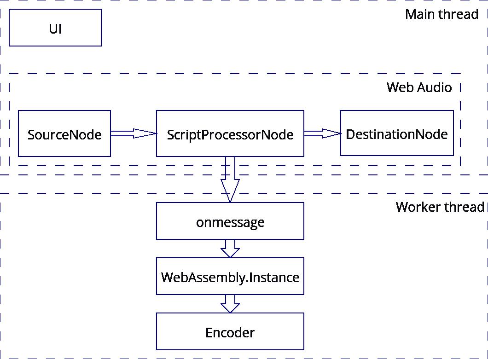

# 为现代 web 创建基于 WebAssembly 的库

> 原文：<https://medium.com/hackernoon/creating-webassembly-powered-library-for-modern-web-846da334f8fc>

*这篇文章讲述了我在创建* [*vmsg 库*](https://github.com/Kagami/vmsg) *时，第一次使用 WebAssembly 的实践经验和一些有用的技巧。*

最近我有一些空闲时间，所以我决定尝试新的 WebAssembly 标准，并用它实现简单但有用的库。

如 [WebAssembly 文档](http://webassembly.org/docs/high-level-goals/)中所述，主要目标之一是创建可以快速解析并具有紧凑代码表示的格式。所以我真的很好奇如何利用这一主要优势。我过去有过使用 asm.js 的经验，做过相当复杂的 C 软件的移植，比如 FFmpeg 和视频/音频编码器。构建规模非常糟糕——大约 15 兆字节的 ffmpeg CLI 精简版 JavaScript，几乎没有基本的过滤器和编码器。鉴于代码解析是计算量很大的操作，尤其是在移动设备上，它看起来不太实用，更像是针对概念验证的小演示: [webm.js](https://kagami.github.io/webm.js/) ， [deviceframe.es](https://paulkinlan.github.io/deviceframe.es/) 。

另一方面，WebAssembly 二进制文件可以在它通过网络时被解析和编译，这使得它成为用 C 编写的库的完美构建目标，您需要在网页中使用这些库。

图书馆的想法来得很快:我在网络论坛上花了很多时间，通过短信和图像讨论各种事情。最近，随着 HTML5 视频和 WebM/VPx 格式的兴起，在帖子上附上小视频变得非常普遍，这进一步增加了自我表达的可能性。声音呢？如果你可以直接说出你的信息，并作为帖子的一部分发送出去，会怎么样？听起来很棒，我们试试吧！

## 决定高层架构

因此，首先我们需要从麦克风获取音频样本，然后对其进行编码，然后将文件返回给库用户。看起来很简单。

2018 年[网络音频 API](https://developer.mozilla.org/en-US/docs/Web/API/Web_Audio_API) 被广泛支持，这里没有真正的麻烦。 [getUserMedia](https://developer.mozilla.org/en-US/docs/Web/API/MediaDevices/getUserMedia) 结合 [ScriptProcessorNode](https://developer.mozilla.org/en-US/docs/Web/API/ScriptProcessorNode) 能够完成第一步，WebAssembly 模块将负责第二步。因为`ScriptProcessor`节点的`onaudioprocess`回调是在主线程中执行的，也为了保持网页界面的响应性，WebAssembly 模块将在 Web Worker 中实例化，通过消息与主线程通信。

> 旁注:`ScriptProcessNode`已经被弃用，很快将被[音频工作者](https://developer.mozilla.org/en-US/docs/Web/API/Web_Audio_API#Audio_processing_in_JavaScript)取代，但它目前只在 Chrome 64+中实现，为了兼容，我们在不久的将来无论如何都要使用旧的 API。此外，由于我们在 worker 中处理样本，不将它们输出到扬声器，并且可以使用大的缓冲区，因此在我们的特定情况下不需要 Worklet。`ScriptProcessNode`应该工作得很好，它所需要做的就是将样本发送到 Web Worker，这是一个非常快速和轻量级的操作。

我们还将创建一个简单的界面，要求允许使用麦克风，并显示带有开始/停止/关闭按钮的记录表单。下面您可以看到该库组件的示意图:



Library architecture

## 选择格式

现在我们需要决定将接收到的样本编码成哪种音频格式。先决条件:它应该在所有支持 WebAssembly 的浏览器中工作，它应该提供合理的压缩，它应该在所有平台上广泛使用。

我最初的愿望是抓住 Opus，因为它是最好的语音压缩工具。不幸的是，Safari 和 Edge 中的`<audio>`元素不支持它。当然有各种各样的解决方法。例如，在 Edge 中，你可以手动获取 Opus 文件，并通过 [MediaSource API](https://developer.mozilla.org/en-US/docs/Web/API/MediaSource) 播放。似乎也有可能[安装网络媒体扩展](https://wpdev.uservoice.com/forums/257854/suggestions/6513488)包来获得全面支持。在 Safari 中，你可以使用移植到 JavaScript 的 Opus 解码器，比如 [ogv.js](https://github.com/brion/ogv.js) 。

尽管这是可能的，但在我看来这太不切实际了。可以这样说:“如果你想支持语音消息，请将这个库添加到你的项目中”。但是现在，您可以指定使用哪个播放器来收听结果音频，或者需要一些重要的代码来处理回放。我不喜欢它，所以我不得不放弃 Opus。也许几年后，选择会容易得多。

> 旁注:Chrome 和 Firefox 支持 [MediaStream 录制 API](https://developer.mozilla.org/en-US/docs/Web/API/MediaStream_Recording_API) ，并且可以使用 Opus 编解码器对`MediaStream`数据进行编码。虽然在 Safari 和 Edge 中没有，但我真的想让我的库在所有 4 个版本中工作，所以在这里没有运气了。

下一个，所有浏览器都有 WAV/PCM 格式。从原始样本创建 WAV 文件是一个非常简单的过程，已经有了用于此的[库](https://github.com/mattdiamond/Recorderjs)。不过它有一个小小的缺点:根本没有压缩。因此，无论你是在麦克风里唱一些美妙的歌曲，还是保持沉默，30 秒的录音(48 khz/单声道)总会正好重 2.7 兆字节。这太浪费了。

MP3 呢？它在任何地方都受支持，有体面的压缩和伟大的[蹩脚的编码器](http://lame.sourceforge.net)。历史上，自由/开源软件项目因为软件专利而放弃使用它，但是所有的专利都在去年到期了。看来我们有赢家了。

还有 AAC 和 Vorbis 但是都不合适。以前的[禁止以二进制形式](https://en.wikipedia.org/wiki/Advanced_Audio_Coding#Licensing_and_patents)发布编解码器实现，而我们的 WebAssembly 模块将有效地发布。(同样值得怀疑的是，免费实现是否和专有实现一样好。)后者不适合语音压缩。

## 收集

所以我们需要抓取 LAME encoder，编译成 WebAssembly 模块，并使得从 JavaScript 使用它成为可能。

有很多 LAME 的 asm.js 端口，甚至可能是 WASM 端口，但我决定从头开始创建一个新的，以便专注于构建大小优化。

起初我[用 git-svn 镜像了 SVN 回购协议](https://github.com/Kagami/lame-svn)，因为[之前的半官方镜像](https://github.com/rbrito/deprecated-lame-mirror)由于某种原因被弃用，并且不包含最新的 3.100 版本，这可能会有一些有用的错误修复。

对于编译，我们使用事实上的标准 [Emscripten 工具链](http://webassembly.org/getting-started/developers-guide/)，这里没有什么新东西。它已经被积极开发了很多年，旨在将 C/C++库移植到 web 上，这正是我们所需要的。我就不赘述了，你可以在[官网](https://kripken.github.io/emscripten-site/)了解更多关于 Emscripten 的内容。

Emscripten 的 asm.js 编译器由名为 fastcomp 的 LLVM 后端提供支持。对于 WebAssembly 你有两个选择:首先编译成 asm.js，然后用 [Binaryen](https://github.com/WebAssembly/binaryen) 翻译成 WASM。或者使用 LLVM 的 in-tree WebAssembly 后端，它能够自己生成 WebAssembly 二进制文件(差不多，最后一步还需要使用 Binaryen)。我选择了第二个，因为在不久的将来，它似乎是首选。此外，Emscripten 最近支持[标准 LLVM 链接器](https://github.com/kripken/emscripten/pull/6056)，这也将很快成为首选。

> 旁注:我不打算描述用 WASM 后端编译 LLVM 的过程。一般建议使用最新的 SVN 版本。你可以看看[这个要领](https://gist.github.com/yurydelendik/4eeff8248aeb14ce763e)为起点。通过提供`--enable-wasm`标志，也可以用 emsdk 编译 WASM 后端，但是它使用非常旧的 LLVM(fastcomp 补丁的基础),所以结果模块可能比 SVN LLVM 更大/更慢。它也不构建 LLD。

让我们创建我们图书馆的存根。我将使用 Linux shell 命令，YMMV。

```
$ cd ~
$ git init vmsg && cd vmsg
$ npm init -y
```

现在我们需要 LAME 编码器的源代码，git 子模块非常方便:

```
$ git submodule add https://github.com/Kagami/lame-svn.git
$ cd lame-svn && git checkout RELEASE__3_100 && cd ..
```

到目前为止一切顺利。我们来编译一下`libmp3lame.so`(共享的 LAME 库)，这样以后就可以从 WebAssembly 模块调用它的函数了。我使用 GNU Makefile，尽管像 webpack 和 parcel 这样的现代构建器正在获得对 WASM 的支持，因为它还不成熟，我想尝试编译器标志和其他优化。建筑商只会在这里碍手碍脚。

使用以下文本创建`Makefile`(确保使用制表符缩进):

```
export EMCC_WASM_BACKEND = 1
export EMCC_EXPERIMENTAL_USE_LLD = 1

lame-svn/lame/dist/lib/libmp3lame.so:
	cd lame-svn/lame && \
	git reset --hard && \
	patch -p2 < ../../lame-svn.patch && \
	emconfigure ./configure \
		CFLAGS="-DNDEBUG -Oz" \
		--prefix="$$(pwd)/dist" \
		--host=x86-none-linux \
		--disable-static \
		\
		--disable-gtktest \
		--disable-analyzer-hooks \
		--disable-decoder \
		--disable-frontend \
		&& \
	emmake make -j8 && \
	emmake make install
```

我告诉 Emscripten 使用 WASM 后端和 LLD，启用高级收缩大小优化，禁用断言，并在 LAME 中禁用一些我们不需要的额外内容。[补丁](https://github.com/Kagami/vmsg/blob/v0.2.0/lame-svn.patch)修复了配置脚本中的 strtol 检查，并禁用了默认的 LAME's reporters 以缩小构建规模(否则 Emscripten 将包括`printf`函数和其他东西的实现)。

```
$ source /path/to/emsdk/emsdk_env.sh
$ make
```

这将激活 Emscripten 环境并在`lame-svn/lame/dist/lib/`目录下创建 LAME 库。

现在我们需要在 WebAssembly 模块中使用 LAME 库函数，并导出 MP3 创建例程，以便可以从 JavaScript 调用它们。这里就不多赘述了，大家可以查看一下结果 [vmsg.c](https://github.com/Kagami/vmsg/blob/v0.2.0/vmsg.c) 。它有 4 个方法: *init* ， *encode* ， *flush* 和 *free* ，这些方法都是自描述的，调用内部一个或几个相应的 LAME 函数。为了与 JavaScript 来回通信，使用了简单的`vmsg`结构来存储当前的编码状态。也可以并行编码多个文件，因为我们没有全局变量。

让我们最后编译我们的 WebAssembly 模块。将此添加到`Makefile`:

```
vmsg.wasm: lame-svn/lame/dist/lib/libmp3lame.so vmsg.c
	emcc $^ \
		-DNDEBUG -Oz --llvm-lto 3 \
		-Ilame-svn/lame/dist/include \
		-s WASM=1 \
		-s "EXPORTED_FUNCTIONS=['_vmsg_init','_vmsg_encode','_vmsg_flush','_vmsg_free']" \
		-o _vmsg.js
	cp _vmsg.wasm $@
```

这里没有什么真正令人困惑的，我们要求 Emscripten 编译我们的 C 包装器，将它与 LAME 共享库结合，并导出我们在 JavaScript 端需要的函数。

键入`make vmsg.wasm`就这样。我们已经将全功能的 MP3 编码器移植到网络上，重量只有 70kb 左右:

```
$ wc -c < vmsg.wasm
152799
$ gzip -6 -c vmsg.wasm | wc -c
74152
```

请注意，就解析复杂性而言，70kb 的 gzipped WebAssembly 甚至与 70kb 的 gzipped JavaScript 不相上下。这就像一个小图像:WASM 模块将被编译，并准备好使用后，它已经被下载。也许可以进一步缩小模块的尺寸，但是现在我对这个数字很满意。

## 运行时间

用于加载和调用 WebAssembly 模块的 JavaScript API 非常简单。这里棘手的部分是提供模块在 web 平台上正确操作所需的函数。WebAssembly 规范没有像 C 语言那样定义任何负责内存分配、数学运算、输入/输出 API 等的标准库。而 LAME 没有其中一些是不行的。Emscripten 在 WASM 端使用打了补丁的轻量级 [musl](https://en.wikipedia.org/wiki/Musl) C 标准库(因此被移植的库不需要重写),并在 JS 中生成包装器模块，该模块将与 musl 协同工作，并调用例如浏览器内的`Date`对象，因此 musl 的日期/时间功能可以正常工作。不幸的是，这是有代价的:即使用闭包库缩小，它也会重约 10kb，所以我很好奇在我的特殊情况下，我是否能比 Emscripten 做得更好。

让我们先看看什么模块实际上需要来自 Binaryen toolchain 的`wasm-dis`:

```
$ wasm-dis vmsg.wasm | grep '(import'
 (import "env" "memory" (memory $0 3))
 (import "env" "pow" (func $import$1 (param f64 f64) (result f64)))
 (import "env" "exit" (func $import$2 (param i32)))
 (import "env" "powf" (func $import$3 (param f32 f32) (result f32)))
 (import "env" "exp" (func $import$4 (param f64) (result f64)))
 (import "env" "sqrtf" (func $import$5 (param f32) (result f32)))
 (import "env" "cos" (func $import$6 (param f64) (result f64)))
 (import "env" "log" (func $import$7 (param f64) (result f64)))
 (import "env" "sin" (func $import$8 (param f64) (result f64)))
 (import "env" "sbrk" (func $import$9 (param i32) (result i32)))
```

只有 10 个函数，其中大部分可以直接映射到`Math`对象！还有`exit`，当模块决定退出时被调用，`memory`是虚拟内存，当需要分配更多内存时，由 musl 调用`new WebAssembly.Memory`和`sbrk`创建。[在这里](https://github.com/Kagami/vmsg/blob/efcbb9ffdd718fe0aebd13b19d0018b71027bfcc/vmsg.js#L24-L55)你可以看到我实现的所有功能，它只用了 30 行代码，运行得非常好。

## 聚合填料

WebAssembly 受到所有 4 种主要浏览器(Chrome/Firefox/Safari/Edge)的支持，这是一件好事，但并非所有网络用户都可以访问最新版本的浏览器。因此，在不损害可读性/性能/维护性等的情况下，让你的应用程序支持尽可能多的版本是合理的。例如，我有意在没有[web assembly . instantiate streaming](https://developer.mozilla.org/en-US/docs/Web/JavaScript/Reference/Global_Objects/WebAssembly/instantiateStreaming)的浏览器上使用 XHR，因为它使代码仅长 5 行，并允许支持没有 Fetch API 的浏览器，例如 Edge 12–14。

目前推荐的“多填充”WebAssembly 的方法是用相同的代码创建单独的 asm.js 版本。它与 Emscripten 的运行时配合得很好，因为它抽象出了这两种技术之间的差异，并提供了单一的`Module`接口来与编译后的代码进行交互。因为我们使用我们自己的运行时，并且因为使用 WebAssembly API(如果可用的话)和模拟它(如果不可用的话)感觉更自然，所以我决定踏上“真正的 polyfill”之路。

快速搜索“WebAssembly polyfill”会返回几个项目，其中最有希望的是莱恩·凯利的。它通过模拟 WebAssembly 浏览器 API(如`WebAssembly.Memory`和`WebAssembly.Table`)来工作，解析二进制模块并动态生成类似 asm.js 的代码。正是我想要的！不幸的是，它不再被维护，所以我不得不分叉，稍微重构，修复明显的问题和测试，并发布到 NPM。最可怕的错误出现在`i64.store`指令的代码生成中，但最终我还是修复了它。[这里](https://github.com/Kagami/wasm-polyfill.js)是我的叉子，我想它可能对其他项目也有用。

我还在 Binaryen repo 中发现了 [polyfill，但是它太大了(wasm-polyfill 的大小为 2.5mb，而 wasm-poly fill 的大小为 95kb)，而且不完整:它没有模拟 WebAssembly 浏览器 API。最后，](https://github.com/WebAssembly/binaryen/blob/master/bin/wasm.js)[官方 polyfill 原型](https://github.com/lukewagner/polyfill-prototype-1)看起来被废弃了，所以 wasm-polyfill 可能是我们现在最好的选择。但是这并不理想:生成的代码并不像它应该的那样高效，有许多额外的检查被创建来保证完全的语义正确。请参阅最后一节，了解该领域可能的改进。

polyfill 的用法很简单:包括带有`<script>`标签的缩小的`wasm-polyfill.js` build，或者在工人的情况下调用`importScripts`。小菜一碟。

## 把所有东西放在一起

我们已经有了 WebAssembly 模块，可以从 JavaScript 加载它并调用它的函数，还有什么？我们需要在 Worker 中生成它，定义通信协议，并从 mic 中输入一些真实数据。

此外，我们需要建立一些用户界面，这样用户就不必一直重新实现它。起初，我倾向于 React，因为它对于创建可组合 UI 组件来说是非常流行和强大的库。不过这也是有代价的:并不是世界上的每个人都在使用 React，比如 Angular 和 Vue.js 也很普遍，如果坚持使用 React-only，你会把你的库的很多潜在用户拒之门外。鉴于我计划使接口非常简单，React 在这里不会有太大帮助，所以最好利用标准的 DOM API。此外，将这样的库包含到由任何框架支持的站点中总是可能的，但反之则不行。

我不会注释我所有的代码，大部分都是自我描述的。检查结果 [vmsg.js](https://github.com/Kagami/vmsg/blob/v0.2.0/vmsg.js) 。在网络上，与网络音频和网络工作者的互动已经被很好地记录下来了。唯一有趣的部分是，我没有为 worker source 使用单独的文件，而是创建了一个 [Blob URL](https://github.com/Kagami/vmsg/blob/v0.2.0/vmsg.js#L340-L344) 。这使得 library 更容易使用:你不必关心额外的文件。

完整演示可从[这里](https://kagami.github.io/vmsg/)获得。

## 未来的想法

现在怎么办？库工作得很好，我已经在我的论坛上使用它来支持语音信息。但是很少有更有趣的领域值得一试:

1.  Emscripten 将很快获得对 [emmalloc](https://github.com/kripken/emscripten/pull/6249) 的支持，这应该会毫不费力地减少构建规模，只需通过选项启用它即可。这带来了降低 malloc 操作效率的成本，但对于 LAME 来说，这应该不是问题。
2.  作为 WebAssembly 模块的一部分，实现一些音频过滤器(如噪声抑制和音调变换)可能会很有趣。因为它在单独的工作线程中运行，所以我们可以使用高级算法，而不用担心引入延迟和冻结主线程。
3.  比较 wasm-polyfill 有无内存绑定检查的性能是值得的。因为 LAME 通常不应该设陷阱，所以为了获得更好的性能，禁用所有检查是相当安全的。即使在 C 代码出现错误的情况下，也不会影响 JavaScript 端，因为有沙箱保护。
4.  相当复杂但可行的任务是使 wasm-polyfill asm.js 翻译的代码兼容。现在有很多规范违规，所以它不可能是 AOT 编译的。它像普通的 JavaScript 一样运行，因此没有那么快和高性能(尽管 JIT 应该很难优化这样的代码)。