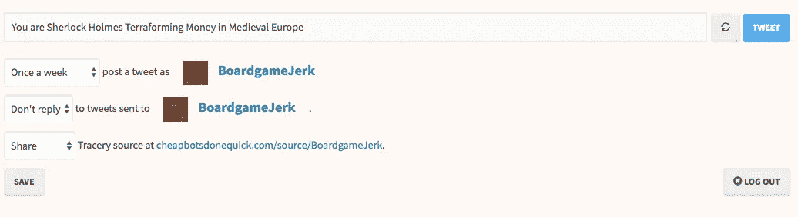

# 用 Tracery 创建你自己的古怪的 Twitter 机器人

> 原文：<https://medium.com/hackernoon/creating-your-own-whimsical-twitter-bot-with-tracery-56ca92d6f72a>

受一系列令人敬畏的推特机器人的启发，我开始创建自己的机器人，这些机器人发布看似随机，但非常有趣的消息，如 [BoredElonMusk](https://twitter.com/boredelonmusk) 或 [thinkpiecebot](https://twitter.com/thinkpiecebot) 。一个在推特上发布棋盘游戏的随机想法，另一个(与我已经进行了一段时间的小说项目相关)在推特上发布世界是如何结束的。我最初不想在这个项目上花太多时间，有人推荐了一个名为[cheapbotsdonequick.com](https://cheapbotsdonequick.com/)的网站，它顾名思义，由 [Tracery](http://www.brightspiral.com/) 驱动，这是一个开源的 Twitter bot 库，这意味着当我准备好的时候，我可以自己托管。

# cheapbotsdonecquick

使用该网站来创建和自托管你的机器人是非常容易的；您使用您的机器人的 Twitter 帐户登录，并添加一个表示机器人的 JSON 字符串。下面是 [BoardgameJerk](https://twitter.com/BoardgameJerk) 的早期代码:

```
{
  "origin": "You are #you_are# #doing# #with_what# in #in#",
  "you_are": ["Dress makers", "Farmers", "Villagers", "Warriors", "Investigators", "Fire fighters", "Scientists", "Explorers", "Wine makers", "Writers", "Superheroes", "Wizards", "Ponies", "Corporations", "Factions", "Cattle Herders", "Civilizations", "Soldiers", "Knights", "Politicians", "Senators", "Generals","Clans","Vikings","Zombies","Cultists","Settlers","Sherlock Holmes","Meeples"],
  "doing": ["Exploring", "Exploiting", "Growing", "Painting", "Eating", "Investigating", "Fighting", "Building", "Trading", "Delivering", "Terraforming", "Researching","Producing","Brewing","Protecting","Eating","Surviving","Escaping"],
  "with_what": ["Crops", "Great Old Ones", "Disease", "Trains", "Money", "Territory", "Ships", "Sheep", "Packages", "Resources", "Spaceships", "Meeples","Cultists","Zombies","A Dragon","Detectives","Victory Points"],
  "in": ["Renaissance Italy", "Medieval Europe", "The Far East", "Deep Space", "Germany", "North America", "The Deepest Ocean", "Wall Street", "The 1920s", "The Far Future", "Mars", "19th Century America", "Ancient Greece", "Ancient Rome", "Ancient Egypt","Dungeons","Scotland","Australia"]
}
```

[Tracery 有一个很棒的教程](http://air.decontextualize.com/tracery/)，我不会在这里重复，但是上面的语法相当清楚，`origin`键包含带有占位符的文本，其他键包含 Tracery 随机插入占位符的值。你可能会很快注意到你的机器人可能开始犯语法错误，虽然你可以设计你的字符串来适应这一点，Tracery 也有一系列的[修饰符](http://air.decontextualize.com/tracery/#modifiers)来帮助。例如，为了灵活起见，我可以删除上面一些文本的复数形式，而使用`.s`修饰语:

```
"origin": "You are #you_are.s# #doing# #with_what.s# in #in#",
```

完成后，你可以设置机器人发微博的频率，然后点击*保存*。



# 自托管

对于许多机器人和它们的创造者来说，这可能已经足够了，但我对自托管我的机器人感兴趣，这样我就可以用它们做更多的事情，例如为其他机器人平台和想法重新设计相同的数据模型，允许其他人为数据模型做出贡献，加上我还没有的其他想法。我选择使用 node.js 和 Heroku 作为我的工具，当然，也有许多其他的选择。

# 属国

首先，将 [dotenv](https://www.npmjs.com/package/dotenv) 、 [tracery-grammar](https://www.npmjs.com/package/tracery-grammar) 和 [twit](https://www.npmjs.com/package/twit) NPM 模块添加到您的项目中。如果你也决定使用 Heroku，那么你可能会发现他们的 [CLI](https://devcenter.heroku.com/articles/heroku-cli) 工具很有用。

# 词汇

我尝试将所有的 bot 词汇表放在一个文件中，但最终将每个列表分成三个文件。我不会在这里全部复制它们，但是你可以在项目的资源库中看到它们。我发现将它们作为数组添加的最简单方法是使用一系列`require`语句:

```
let you_are = require('./you_are.json');
let doing = require('./doing.json');
let with_what = require('./with_what.json');
let in_place = require('./in.json');
```

# 创建语法

准备好词汇表后，将其添加到 Tracery 中，生成您的 tweet 文本，并添加上面的任何修饰符:

```
const grammar = tracery.createGrammar({
    "you_are": you_are,
    "doing": doing,
    "with_what": with_what,
    "in": in_place,
    "origin": ["You are #you_are# #doing# #with_what# in #in#"],
});grammar.addModifiers(tracery.baseEngModifiers);const tweet = grammar.flatten('#origin#');
```

# 发送推文

准备好向全世界广播的文本后，创建一个 Twitter 客户端，向全世界发布您的妙语。在本地运行时，我使用 dotenv 模块和一个*提供的密钥。env* 文件，但是在 Heroku 上运行，它使用平台提供的[配置变量](https://devcenter.heroku.com/articles/config-vars)，但是您可以从一个文件转换到另一个文件，而不需要做任何更改。

```
const T = new Twit(
    {
        consumer_key: process.env.TWITTER_CONSUMER_KEY,
        consumer_secret: process.env.TWITTER_CONSUMER_SECRET,
        access_token: process.env.TWITTER_ACCESS_TOKEN,
        access_token_secret: process.env.TWITTER_ACCESS_TOKEN_SECRET
    }
);T.post('statuses/update', {status: tweet + " #boardgames"}, (err, data, response) => {
    console.log(data)
});
```

# 安排推文

现在，我希望机器人每天发一次微博，所以我使用了 Heroku 调度器。它需要一个 shell 脚本在每个时间间隔运行，所以我创建了 *bin/run_bot.sh，*它有一个命令:

```
#!/bin/bash node index.js
```

# 利润！

就是这样！每天一次，我的机器人向所有互联网的桌游爱好者传递精彩的文字，我为未来的功能和其他平台提供了灵活的代码和词汇基础。


尽情享受吧，我们在赌桌上见！

*原载于*【dzone.com】**。**