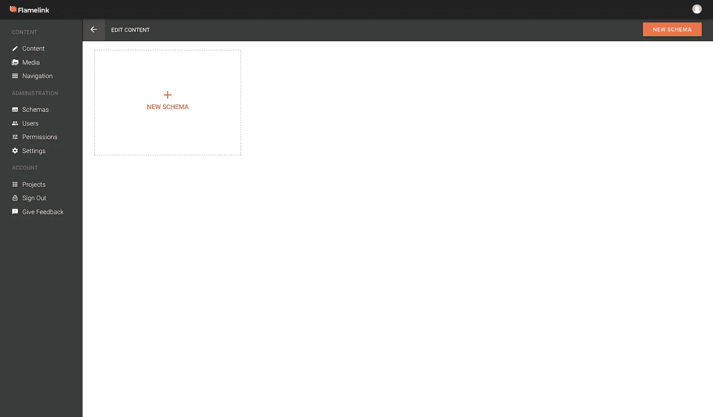
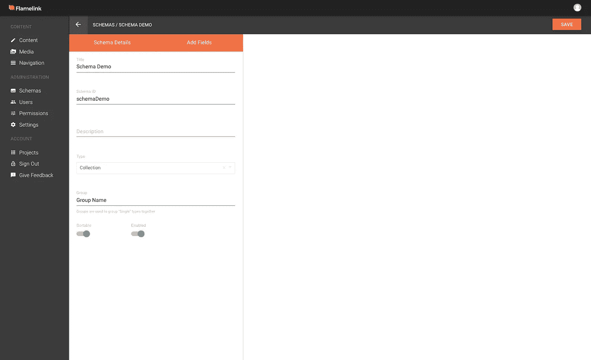
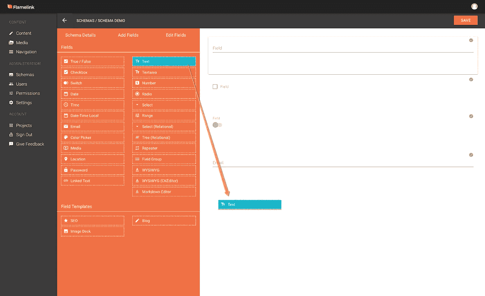
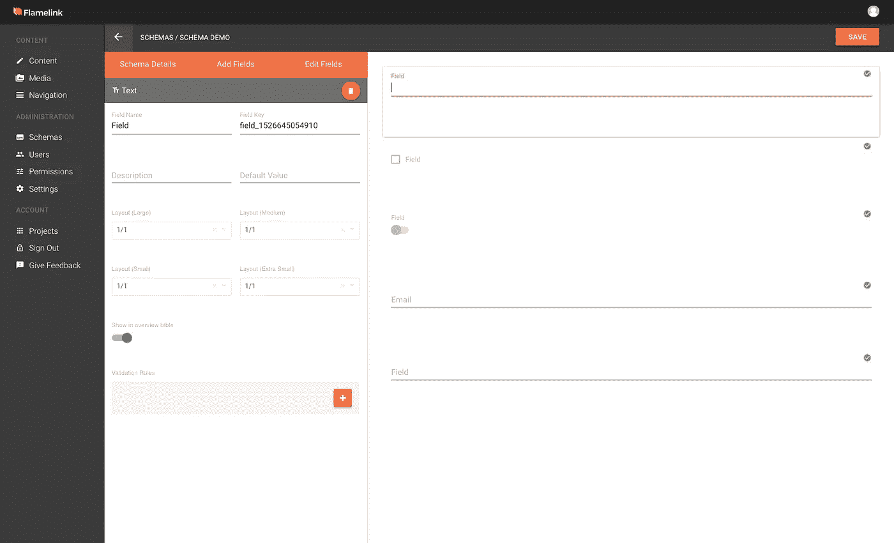

# 在 flamelink . io(Firebase 的无头 CMS)中创建您的模式

> 原文：<https://medium.com/hackernoon/creating-your-schema-in-flamelink-io-a-headless-cms-for-firebase-a692a8dca590>

在本文中，我们将介绍如何在 [**Flamelink**](https://flamelink.io/) **、Firebase** 的无头 CMS 中创建模式。我们还将介绍如何编辑你的模式细节，以及如何添加、排序和定制你的字段。

如果你正在读这篇文章，我想假设你已经:

*   [查看我们的解说视频](https://youtu.be/8Cw5ktNADBQ)
*   [注册为 Flamelink.io](https://app.flamelink.io/register)
*   用这个[教程/指南/文章/文字沙拉](http://.com/want-to-get-started-with-flamelink-a-firebase-cms-right-now-2eb93d6d7be9)将 [Flamelink](https://hackernoon.com/tagged/flamelink) 连接到你的 [Firebase](https://hackernoon.com/tagged/firebase) 项目(感谢 random Redditor 的“文字沙拉”倒钩)
*   爱上了我们厚颜无耻的品牌，吸烟热界面和如何容易 Flamelink 使管理您的 Firebase 项目中的内容。

如果以上没有描述你，请遵循以上 4 个步骤。(这点相信我。)

好吧，让我们直入主题。你可以观看下面的教程视频，或者跟随文章(现在包括免费截图)。

# **设置您的内容模式**

Flamelink 的 Schema builder 允许您以最适合您的应用程序的方式组织您的内容或数据，让您完全自由地选择您需要的字段类型、您需要它们的顺序以及您需要的验证。

**有 3 种模式:**

请记住:Flamelink 是一款内容管理工具，可用于网络和移动应用。

对于本教程，假设您正在使用 Flamelink 构建一个带有博客的网站。

**1。收藏**

您可以使用一个集合来创建博客帖子，这样单个帖子将存储在这个模式下，并且每个帖子都有相同的模式布局。

**2。单个**

这种单一的内容类型具有独特的内容结构，并且各种结构都不相同。因此，与“联系我们”页面相比,“关于”页面将具有不同的数据输入，因此它们将被视为单一的内容类型。

**3。表格**

这是一个典型的数据采集表单，就像一个“联系”表单，由网站访问者填写。

# **模式详细信息**

There are two ways to create a new schema in your project.

在项目屏幕中选择“新模式”块

或者，选择项目或方案屏幕右上角的“新建方案”按钮。

现在，让我们填充模式的主要细节。

您需要完成以下工作:

*   **“标题”:**您选择用来指代您的内容类型的名称。示例包括“主页”、“联系人”页面和“关于”页面。
*   **‘模式 ID’:**这是自动生成的，与您的标题相对应。如果您愿意的话，您可以更改它，但是它应该对您的所有模式都是唯一的。 ***请注意:*** *在您第一次创建您的模式后，该模式键将变得不可编辑。该键用于引用 Flamelink SDK 中相关模式或内容类型的数据。*
*   **‘Description’:**一个简短的描述来解释这个内容类型或模式是什么——纯粹供你自己参考。
*   **‘类型’:**这是我们之前提到的三种模式或内容类型——单一、集合和表单。
*   **“组名”:**您可以将多个单一模式组合在一起，但不能将集合组合在一起。键入您的群名称时，请确保它与您当前的群名称(如果已经存在)完全相同，因为它区分拼写和大小写。如果该群组尚不存在，当您在栏中键入所需的群组名称时，将会自动创建一个新的群组。

在详细信息表单的底部，您还会注意到两个用于排序/启用模式的开关:

**可排序切换:**使用集合模式类型，在内容部分下，您可以排序哪些条目应该位于哪个条目下。因此，坚持我们的博客例子，在“博客类别”下，你可以有不同的类别，比如“技术”和子类别，比如“编程”和“硬件”。使用此功能可以按照您喜欢的顺序对条目进行排序和保存。
**启用切换:**这将允许模式在内容部分下可见或不可见。

点击屏幕右上角的“保存”，确认并保存您的更改。

# **添加字段**

我们以这样一种方式建立了 Flamelink，您可以完全自由地选择您需要的字段，并根据需要对它们进行排序，根据您项目的特定需求进行定制——我们只是提供人们想要的东西。

选择位于屏幕顶部模式详细信息旁边的**添加字段**。
可以添加到您的模式中的所有可用字段将在两列网格中可见。

Let’s add some fields to our Schema.

将必填字段从橙色设置面板拖放到右侧的空白预览面板。

或者，双击左侧橙色设置面板中的字段或模板组，将其添加到右侧的空白预览面板中。

成功添加字段后，字段的右上角会出现一个绿色复选标记。选择右上角的保存按钮，确认并保存您的更改。

将字段/模板添加到模式后，选择第一个字段以打开编辑字段视图。
您添加的所有字段仍将显示在页面右侧，但是，所选字段将高亮显示，其详细信息屏幕现在以两列布局显示在左侧。

Editing Your Fields.

现在，您可以根据自己的需要和偏好定制模式中的每个字段。

将所需验证添加到相关模式字段后，选择“保存”按钮确认并保存您的更改。

您还可以切换“在概览表中显示”开关，以允许用户定义在表视图中查看条目时，他们希望在条目表中显示哪些字段。

# 好了，现在你都准备好了

希望您已经准备好设置内容模式、编辑模式细节，以及添加、排序和定制字段。

如果你觉得这个教程很有帮助，请记得为它鼓掌，并与其他 Firebase 用户分享。

# 取得联系

如需任何技术支持，请加入 [Flamelink 的 Slack workspace](https://flamelink.io/slack) 。我们很乐意帮助你。你也可以阅读我们的[超级有用的用户文档](https://flamelink-docs.firebaseapp.com/user-guide/overview)，同时等待我们的下一个教程。

请记得在 [Twitter](https://twitter.com/FlamelinkCMS) 上关注我们，在 [YouTube](https://www.youtube.com/channel/UCPSOGjXxn2he52czV1XsW3g) 上订阅我们。

下次见。

干杯。