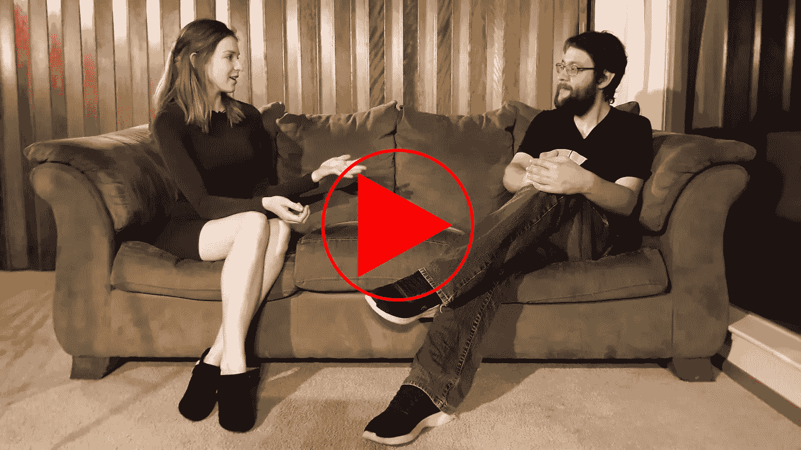
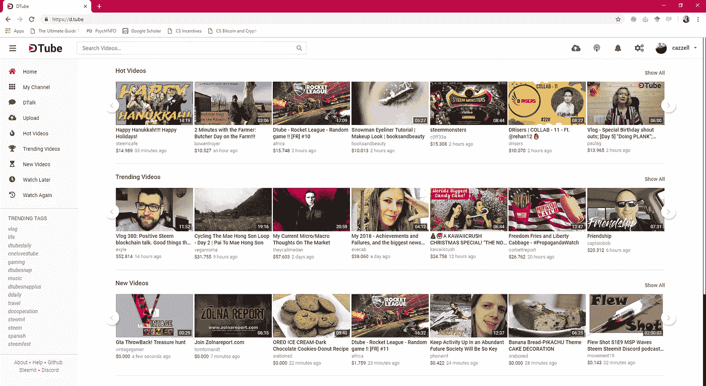
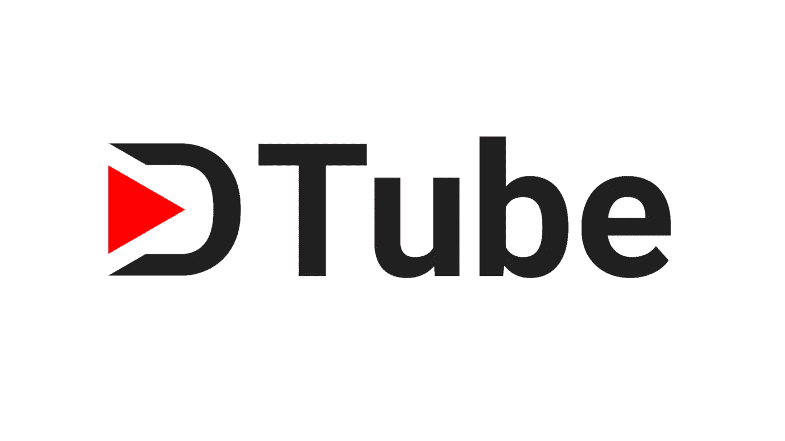

# 创造容易，管理难:社会区块链和激励混乱

> 原文：<https://medium.com/hackernoon/creation-is-easy-curation-is-hard-social-blockchains-and-incentive-snafus-a2c4a8cf2bf6>

## 专访 DTube 创始人兼首席执行官阿德利昂·玛利

YouTube 错过了大画面。至少电视频道的创始人阿德利昂·玛利是这么认为的。Adrien 在 2016 年推出了他的分散式视频平台，并立即获得了成功。DTube 背后的想法是尊重用户隐私，并创建一个简单的高质量内容的无审查平台。如今，DTube 每月有 1700 万次会话，80 万独立访问者。这使得 DTube 成为世界上最受欢迎的 DApp。

阿德里安将 DTube 的快速成功归功于该平台内置的潜在激励结构。DTube 建立在 [Steem](https://steemit.com/) 、 [GUN](https://github.com/amark/gun) 和 IPFS 的基础上，随着用户的视频被投票支持，他们以社交加密货币支付。与 YouTube 不同，如果你访问 DTube，你不会找到广告。相反，DTube 从每个视频的收入中抽取一小部分。

除了提供直接的激励和尊重用户的言论自由，阿德里安计划扩大对优质内容策展人的激励。这是 YouTube 仍然回避的一点。

> “[YouTube]忘记了大多数人，他们忘记了观看视频的人，他们只关注创作者。我们相信这个硬币有两面。有人看视频，有人制作视频，他们只关注创作者，因为这是他们创造观众的方式……”——阿德利昂·玛利

DTube 已经认识到，激励内容创作可能会产生不可预见的后果。在 YouTube 上，这可以从[低质量(有时是不可思议的)](https://www.theverge.com/culture/2017/11/21/16685874/kids-youtube-video-elsagate-creepiness-psychology)机器生成的儿童视频中看出来，这些视频利用了儿童的无鉴别能力和大量媒体观众。该平台现在要求员工/承包商在视频进入他们的 YouTube kids 应用程序之前获得批准，以缓解这一问题。DTube 以 DTube snaps 的形式面临类似的问题。快照是非常短的，赚钱的视频剪辑，依靠朋友上传彼此的内容。数量(不是质量)视频和朋友意味着更多钱的潜力。

但与 YouTube 不同的是，DTube 有一条前进的道路，可以自动处理高质量的内容监管问题:upvotes 本身的数量有限，但代表着加密货币奖励的价值。因此，如果有人是后来成为病毒式传播的内容的最早支持者之一，他们就能赚很多钱。在体制内做一个有才华的策展人是有回报的。

这自动化了内容监管的过程，也自然地剔除了性质可疑的视频。重要的是，它是以一种分散的方式做到这一点的，因此没有 DTube 员工需要决定平台上允许和不允许什么内容。

如果你想了解更多，请观看完整的采访(在 DTube 上！)这里。

 [## 卡泽尔报告:去中心化的 YouTube、经济游戏和阿德利昂·玛利的伪善

### D.Tube 创始人从法国飞来，我们在密码、技术、伦理、行为的最前沿赶上了他…

直管](https://d.tube/#!/v/cazzell/qe2wqvpn) 

我正在用[时代](https://era.eco/#step1)构建去中心化网络的平等主义基础设施。*如果你喜欢这篇文章，如果你为它鼓掌，分享它，并在* [***推特***](https://twitter.com/ambercazzell) *上与我联系，这将意味着很多！也可以订阅我的*[***YouTube***](https://www.youtube.com/channel/UCJsTKB06gr8smQQIkbIXc9Q)**频道！**