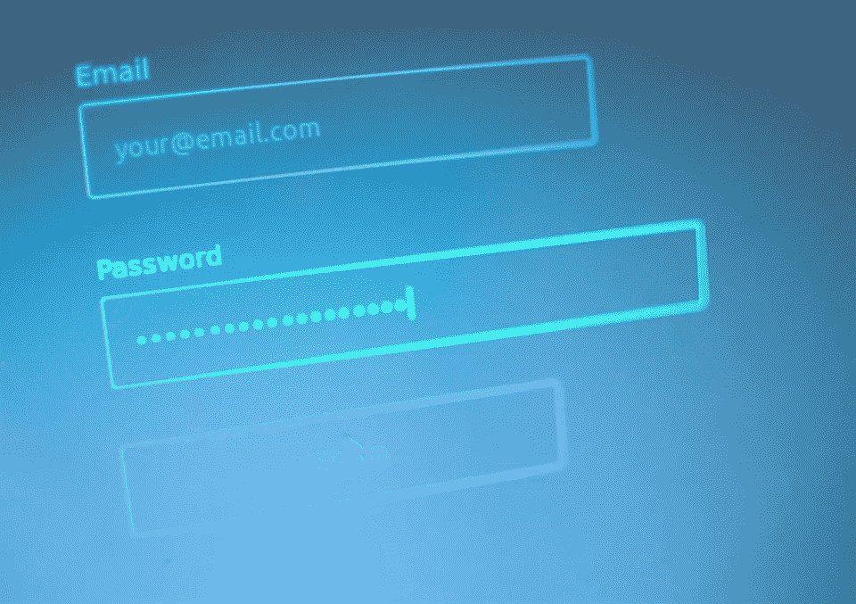
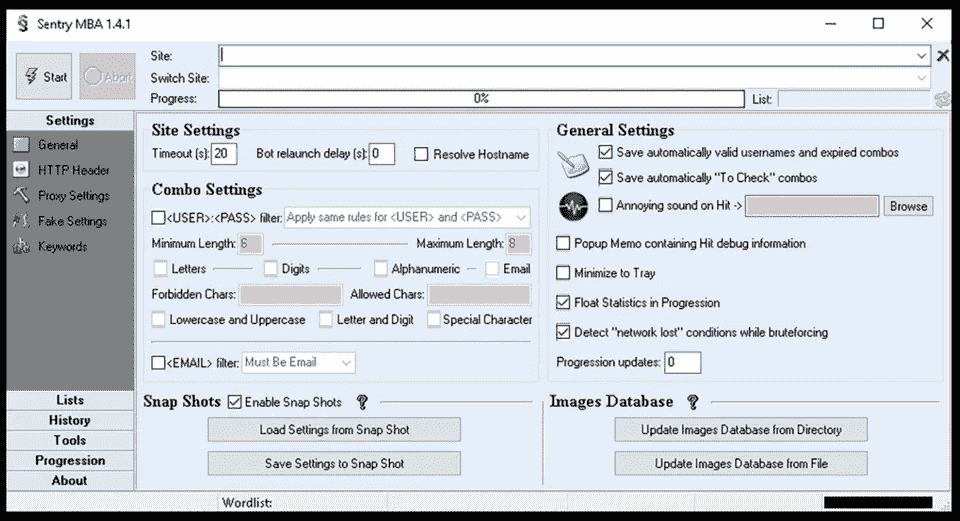
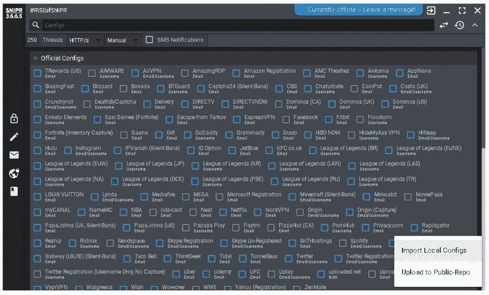

# 凭据填充活动针对金融服务

> 原文：<https://medium.com/hackernoon/credential-stuffing-campaign-targets-financial-services-f2a4fbdd31b9>

## 在过去的几周里，Radware 一直在跟踪一场针对美国和欧洲金融业的重大凭据填充活动。

# 背景

凭据填充是 2018 年新出现的威胁，随着更多违规事件的发生，这一威胁将继续加剧。如今，违规不仅会影响受损的组织及其用户，还会影响用户可能使用的所有其他网站。

此外，重置受损应用程序的密码只能在本地解决问题，而由于用户凭据安全性较差，犯罪分子仍然能够从外部利用这些凭据攻击其他应用程序。

凭据填充是暴力攻击的一个子集，但不同于凭据破解。凭证填充活动不涉及暴力强制密码组合的过程。凭据填充活动以自动方式利用泄露的用户名和密码攻击众多网站，试图通过凭据重复使用来接管用户帐户。

像研究人员一样，犯罪分子收集数据，挖掘数据库漏洞和帐户漏洞有几个原因。通常情况下，网络犯罪分子会保留这些信息以备将来进行有针对性的攻击，出售这些信息以获取利润，或者以欺诈方式利用这些信息。

Radware 看到的当前活动背后的动机完全与欺诈有关。犯罪分子正在使用以前数据泄露的凭据，试图获得访问权限并接管用户的银行帐户。人们已经看到这些攻击者将美国和欧洲的金融机构作为目标。当发生重大违规事件时，受损的电子邮件地址和密码会很快被网络犯罪分子利用。有了来自最近被入侵网站的数千万个凭据，攻击者将使用这些凭据以及脚本和代理，以自动方式向金融机构分发攻击，试图接管银行账户。这些登录尝试可能会大量发生，以至于它们类似于[分布式拒绝服务(DDoS)攻击](https://www.radware.com/resources/ddos_attacks.aspx)。

# 攻击方法

凭据填充是当今网络犯罪分子最常用的攻击手段之一。这是一种自动化的 web 注入攻击，其中犯罪分子使用一系列被破坏的凭据，试图获得访问权限，并由于凭据卫生状况不佳而接管不同平台的帐户。攻击者将通过代理服务器路由他们的登录请求，以避免将他们的 IP 地址列入黑名单。

攻击者使用自动化工具(如 cURL 和 PhantomJS)或专门为攻击设计的工具(如 Sentry MBA 和 SNIPR)自动登录数百万个先前发现的凭据。

由于数据泄露引起的连锁反应，这种威胁对消费者和组织都是危险的。当一家公司被攻破时，这些被攻破的凭据要么被攻击者使用，要么被卖给其他网络罪犯。一旦凭据到达最终目的地，以营利为目的的犯罪分子将使用该数据或从泄露网站获取的凭据，试图接管社交媒体、银行和市场等多个网站上的用户帐户。除了欺诈和身份盗窃对消费者的威胁之外，组织还必须减少凭据填充活动，这些活动会产生大量的登录请求，并在此过程中耗尽资源和带宽。

# 凭证破解

凭证破解攻击是一种自动化的 web 攻击，犯罪分子试图通过按顺序处理所有可能的字符组合来破解用户的密码或 PIN 号码。只有当应用程序没有针对失败登录尝试的锁定策略时，这些攻击才有可能发生。

攻击者将自动使用常用词列表或最近泄露的密码，试图控制特定的帐户。这种攻击的软件将试图通过突变、暴力破解值来破解用户的密码，直到攻击者成功通过身份验证。

# 目标

在最近的活动中，Radware 发现美国和欧洲的[金融机构通过凭证填充活动成为](https://www.radware.com/solutions/financial/)的目标。

# 犯罪软件

Sentry MBA 是当今网络罪犯使用的最流行的凭据填充工具包之一。这个工具是托管在哨兵 MBA 解密论坛。该工具简化并自动化了跨多个网站检查凭据的过程，并允许攻击者配置代理列表，以便他们可以匿名化其登录请求。

SNIPR 是网络犯罪分子使用的一种流行的凭据填充工具包，托管在 SNIPR 黑客论坛上。SNIPR 预装了 100 多个配置文件，并且能够将个人配置文件上传到公共存储库。

# 担忧的原因

过去几年中，最近的违规事件暴露了数亿用户凭据。担心凭据填充活动的一个主要原因是它对用户的影响。跨多个网站重复使用凭据的用户面临着更大的欺诈和身份盗窃风险。

第二个问题是组织必须减少大量欺诈性登录尝试，这些尝试可能会使网络饱和。这种饱和可能是一个值得关注的原因，因为它看起来像是一种 DDoS 攻击，来自各种来源的随机 IP 地址，包括代理背后的地址。这些请求看起来像是合法的尝试，因为攻击者不是在进行暴力攻击。如果该帐户的 user: pass 不存在或在目标应用程序上未通过身份验证，程序将继续处理下一组凭据。

# 减轻

为了抵御凭据填充活动，组织需要部署一个 [WAF](https://www.radware.com/products/cloud-waf-service/) ，它可以正确地识别恶意 bot 流量以及针对您的 web 应用程序的自动登录攻击。 [Radware 的 AppWall](https://www.radware.com/products/appwall/) 通过引入额外的[缓解](https://www.radware.com/solutions/ddos-protection/)层，包括活动跟踪和来源阻止，解决了凭据填充活动面临的多重挑战。

Radware 的 AppWall 是一款 Web 应用防火墙(WAF ),能够保护 Web 应用，并通过缓解 [web 应用](https://www.radware.com/products/application-network-security/)安全威胁和漏洞来实现 PCI 合规性。Radware 的 WAF 可防止数据泄露或被篡改，这对于敏感的公司数据和/或客户信息至关重要。

AppWall 安全过滤器还通过检查在特定时间范围内从 Web 服务器发送的坏/好回复来检测这种侵入系统的尝试。在暴力攻击的情况下，来自 Web 服务器的错误回复的数量(由于错误的用户名、错误的密码等。)触发暴力安全过滤器来监控特定的攻击者并对其采取措施。这种阻止方法可以防止黑客使用自动化工具对 Web 应用程序登录页面进行攻击。

除了这些步骤之外，网络运营商还应该在符合条件的情况下应用双因素身份认证，并监控转储凭据以发现潜在的泄漏或威胁。

# 有效的 Web 应用程序安全要素

*   **OWASP Top-10**针对毁损、注射等的全面保障。
*   **低误报率** —使用消极和积极的安全模型实现最大的准确性
*   **自动策略生成**功能，以最少的操作工作量实现最广泛的覆盖
*   **僵尸防护和设备指纹识别**能够克服动态 IP 攻击，提高僵尸检测和拦截能力
*   **通过过滤路径保护 API**，了解 XML 和 JSON 模式以便实施，以及活动跟踪机制来跟踪僵尸程序并保护内部资源
*   **灵活的部署选项** —本地、路径外、虚拟或基于云