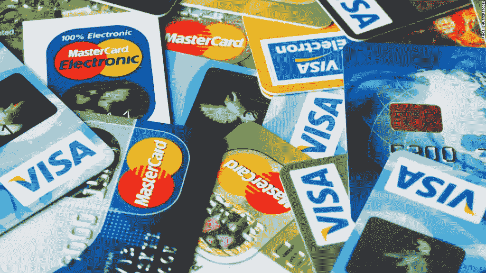

# 信用卡..美丽的一面

> 原文：<https://medium.com/hackernoon/credit-cards-the-pretty-side-df2031343d25>

我们都听说过[信用卡](https://hackernoon.com/tagged/credit-cards)丑陋的一面；**利息**、**债务**、**隐性费用**。毕竟，这是一项由名为银行的营利性企业提供的服务。没有人会愿意免费借钱给你。

还是会？

在这篇博文中，我将向你展示我是如何用信用卡赚钱的！是的，你没看错。

不，我不会为这个[信息](https://hackernoon.com/tagged/information)向你收取一分钱。这不是什么营销计划，没有陷阱，完全合法。

*免责声明:我不是银行家，也不是财务顾问。这里给出的所有建议都是从精明的消费者的角度出发的。*

让我们先来解释一下信用卡的工作原理:**信用卡让你以高利率获得你没有的钱。**

为了了解如何优化系统，使其对您有利，而不是对银行有利，您需要记住以下几点:

1-大多数信用卡只会在购买后一个月左右开始收取利息。换句话说:如果你今天用信用卡买东西，两周后还钱，你可能不会被收取任何额外费用；你将如数偿还。

大多数信用卡都有奖励计划，包括积分、航空里程和现金返还。完成每笔交易后，您就有资格获得这些积分。

一些信用卡的好处不太为人所知，最有用的是:保险、进入机场贵宾休息室和折扣。

4-信用卡可能有也可能没有固定年费。这是一种固定费用，你每年支付持有卡。就当是会员费吧。

一些银行提供具有特定功能的定制信用卡，使特定的客户受益，如经常旅行的人、特定公司的员工或客户，甚至是特定大学的学生。

> **那么，如何用信用卡存钱甚至赚钱呢？**

鉴于以上事实，以下是一些优化你的信用卡体验的方法。它们都很简单，但是其中一些需要很高的财务纪律和意识。

首先，你需要做大量的“购物”,找到适合你需要的信用卡。掠夺利益，以及忠诚度奖励机制。以下是最常见的:

我喜欢提供“返现”的信用卡，而不是以后可以兑换某些奖励的积分。返现信用卡基本上给你一定比例的钱，你花回你的信用卡。在您执行交易的那一刻，您就有资格获得返现。再加上按月偿还全部债务，你最终基本上是在赚钱，而不是支付利息。

即使我手头有现金，我也坚持用信用卡支付所有款项。这样我就能收集到最多的返现。但同时，我对在同一个月内向银行还清全款要求很严格。

不用说，银行不喜欢这种类型的客户，他们甚至有一个词来形容这种客户；“赖账”，但这是完全合法的，银行也没什么办法。

旅行里程
大多数银行都提供信用卡，帮助你积累航空里程，这些里程可以在以后兑换成机票。如果你经常出差，这可能会很有用。

我最不喜欢的忠诚度系统，因为它将你限制在一定的奖励范围内。这里的银行为您的购物提供积分，然后您可以从指定的奖励目录中兑换这些积分，包括礼品卡、电子产品、家具、机票等。

以下是你使用信用卡的其他方式:

购买长期会员资格有时候，购买一个长期会员资格，比如健身房的会员资格，可以帮你省下一大笔钱。假设一个月是 100 美元，但一年是 700 美元(即 58 美元/月)。许多人选择按月支付，因为他们无法一次性支付 700 美元。信用卡可以让你按年利率借款，并从大量储蓄中获益，然后按月支付给银行。不用说，你需要考虑利率因素，以确保你确实在省钱。

**在打折季买东西** 有时候，你需要一些碰巧打折的东西，但是你没有现金去买。在这种情况下使用信用卡可能对你有好处，假设你不会持有债务太久，抵消你得到的任何折扣。

# **了解信用卡的好处**

银行往往没有强调信用卡的额外好处，确保理解这些好处，并做出明智的决定，你是否能从这些好处中受益。你不希望最终得到一张对你来说没有任何好处的信用卡。

常见优势包括:

用信用卡购买的机票上的旅游保险。这可以在发生意外伤害或航班取消时保护您。

用信用卡购买的物品的盗窃/损坏保险。(你买了笔记本电脑，它被偷了，你就保了)。

**进入机场贵宾休息室。如果你经常旅行，这很有用。有两种方法，一种允许您以折扣价访问，另一种允许您免费访问。因此，这项优势对您至关重要，请务必理解其中的条款。**

**折扣**。一些信用卡在某些零售商、餐馆、酒店、航空公司为你提供折扣。然而，大多数情况下折扣并不是自动适用的。你需要意识到这一点，并在购买时提出要求。不方便，我知道。

# 最终提示

*   永远不要用你的信用卡来偿还长期债务。
*   总是询问所有涉及的费用。银行太擅长隐藏费用了。
*   时刻监控你的月结单。我遇到过没看过的人！这非常简单，因为大多数银行都允许你在线获取最新的对账单。这将帮助您发现任何隐藏的费用和欺诈活动。
*   避免用你的信用卡从自动取款机里取钱。虽然这是允许的，但通常会有很高的即时利息，免息日不适用。