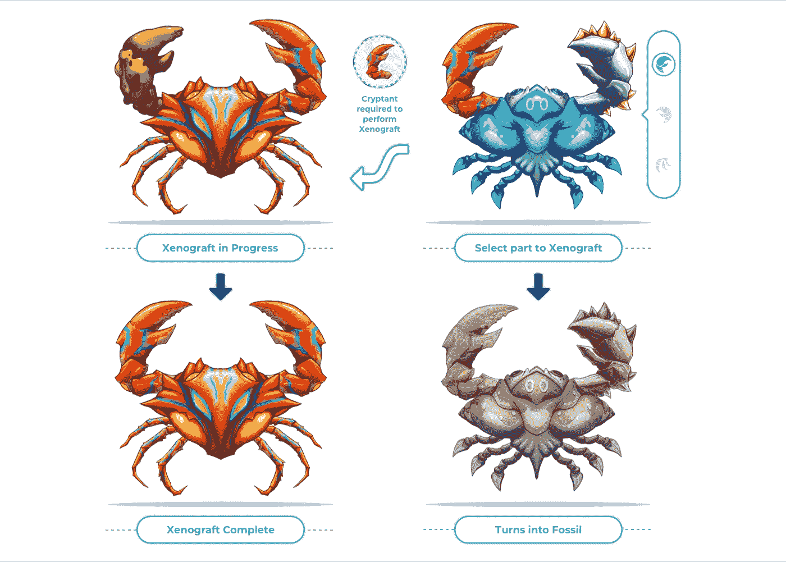
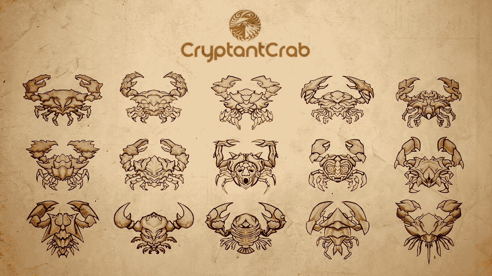
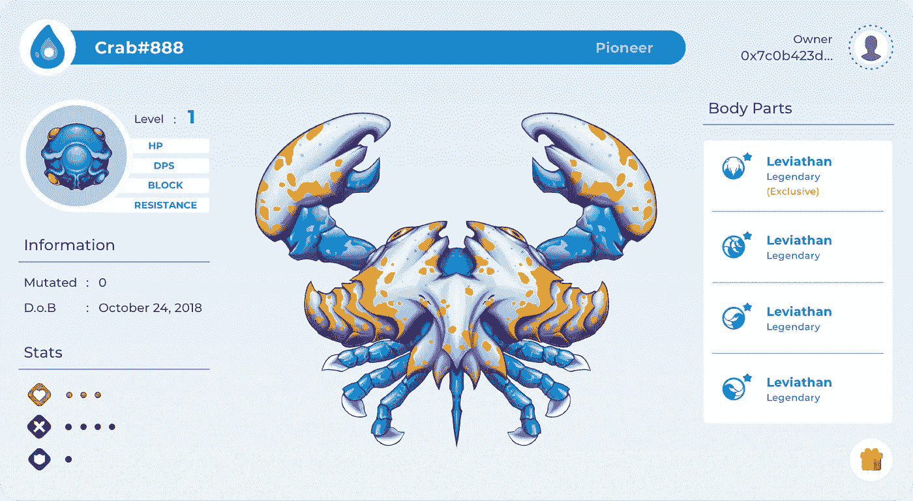
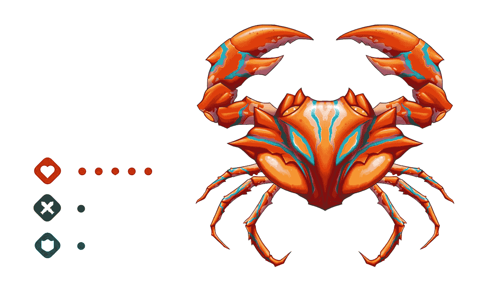

# CryptantCrab 预售延长，揭示了两个主要特点

> 原文：<https://medium.com/hackernoon/cryptantcrab-pre-sale-extended-with-two-major-features-revealed-612f25cd8bd7>

***icandi 确认零件移植功能，提升螃蟹战斗力和市场价值***

对于那些还没有在预售期间开始收集 CryptantCrab 的人来说，庆祝活动被延长了 40 天！新的截止日期是 2018 年 12 月 25 日，为所有人提供了更多时间来进入预售并享受早期优惠。

Xenograft Process

这一声明恰逢区块链驱动的游戏的新核心功能的披露。称为异种移植，这是一个新的功能，既改善了游戏体验，又立即提高了所有已孵化的数码螃蟹的价值。

异种移植对 CryptantCrab 来说是一个真正的游戏规则改变者，将产生额外的兴趣，并鼓励新玩家加入预售并开始他们的数字螃蟹收藏。因此，需要延长预售活动。

当然，这并不是结束，随着游戏上市日期的临近，iCandy Interactive 将继续推出新功能。通过引入这一关键更新，很明显 CryptantCrab 将在未来几周提供更多内容。这就是开发团队计划如何让玩家保持兴奋，特别是那些尚未加入预售的玩家。

**异种移植:新的价值途径**

这个扩展是及时的，因为这两个新功能的推出将改变 CryptantCrab 的基本玩法。更重要的是，异种移植引入了自区块链游戏路线图问世以来大多数人一直要求的东西。

最初，当游戏正式推出时，如果玩家想改变外观和战斗能力，他们只能改变螃蟹的部分。异种移植功能的增加增加了一个新的定制水平，因为它使玩家能够将另一个虚拟甲壳动物的特定螃蟹部分移植到指定的隐窝蟹上。

随着异种移植的引入，每个玩家收藏的每只螃蟹都获得了更多的价值。这对于那些为了收藏而展示特定部分的人来说是正确的。玩家所要做的就是将目标部分移植到一只珍贵的螃蟹上。这将使玩家更容易形成密码蟹集或创造出具有特定平衡或统计焦点的可怕战士。那些喜欢走纯定制路线的人甚至可以创造出终极的外观！

至于失去部分的隐蟹，当它变成化石时，它仍然会保留一些价值。虽然在这种状态下它不能被送上战场，但新形态仍然可以在指定的平台上交易。事实上，其独特的特征可能会在未来的更新中提供一些价值。这意味着不要这么快卖掉它们！

**成长能力**

当预售开始时，许多人孵化了他们的隐窝蟹，并可以看到他们新的电子宠物的一般统计数据。这些特性非常简单，因为它们只包含三个方面:生命值(HP)，每秒伤害，和格挡。它们代表了 CryptantCrab 的基本属性，并且填充了随机分配的 GP。这是为了确保螃蟹是独一无二的。

请注意:GP 将会保持不变，即使这个隐密蟹获得了经验或者升级了。即使发生突变或进行异种移植。相反，GP 将影响数字甲壳动物在爬经验阶梯时可以变得有多强，因此具有良好统计组合的螃蟹将有更高的胜算。

对于那些热衷于开始收集自己的隐蟹的人来说，现在是时候感谢预售延期了。更多的更新——就像异种移植的介绍——可能很快就会上线，所以请在 CryptantCrab [脸书](https://www.facebook.com/CryptantCrab/)和 [Discord](https://discordapp.com/channels/492193350024167426/492193350766821398) 频道关注它们。

更多信息可登陆[https://www . cryptant crab . io](https://www.cryptantcrab.io)。