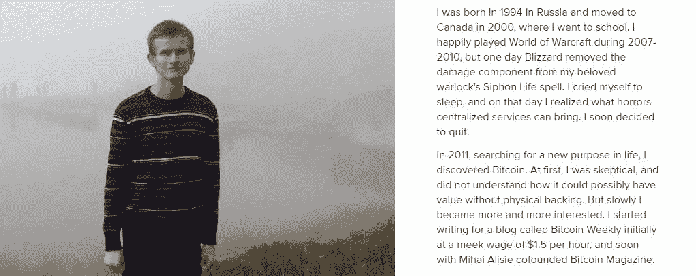

# 密码 101 |词汇表

> 原文：<https://medium.com/hackernoon/crypto-101-the-glossary-645765878bc9>

giphy

我第一次接触加密社区是通过电报组。第一次，我觉得自己像个外星人..理解一个句子就像解另一种语言。“我们去 HODL 吧！”、“我走长了”、“什么时候兰博？”他们在说什么？迷因，gif，图表，我就像在另一个星球。然后一个接一个的寻找，寻找，我用了很短的时间就和社区说上了同一种语言。这个社区对我来说变得非常有价值，这是我喜欢 crypto 的最重要的方面之一。这个社区充满活力，渴望学习，渴望帮助，充满乐趣..迷因，gif，集体性。

哦..这是一个相当长的介绍，让我从列表中删除。我希望你能享受在加密社区的时光。这里是必须知道的，介绍级短语说加密语言 *ELI5* ！

*   **ELI5:** 不是特别隐晦的词，但最好知道。“像我 5 岁一样解释”。
*   **hodl** :你会经常看到这个词，“hold”就是这个词的由来。加密是一个不稳定的市场，尽量避免恐慌性抛售。

the origin of “hodl”

*   **FOMO:** “害怕错过”当你看到一个巨大的绿色蜡烛时的情绪，当你在市场上看到+%120 个硬币时的情绪。
*   **FUD:** “恐惧、不确定和怀疑”当你看到一根巨大的红色蜡烛熄灭时的情绪，当你看到市场上-%30 的硬币时的情绪。很想卖掉的感觉。
*   **月亮:**价格大幅度上涨，要月亮了！

ex: a guy with fomo trying to chase a pump when he sees that the coin is going to the moon

*   **泵:**价格快速上行，成交量大。(大多数时候是鲸鱼或机构的表演)
*   **暴跌:**价格快速下跌，且成交量很大。(大多数时候是鲸鱼或机构的表演)
*   鲸鱼:有很多硬币的人
*   **鱼:**有少量硬币的人
*   **泵&倾卸(P & D) :** 鲸鱼/群体上下移动市场

a random example of pump and dump in a low-cap coin in cryptopia

*   **ATH:** “空前高涨”
*   “买(他妈的)蘸酱”
*   **DYOR:** “做你自己的研究”不要做绵羊！
*   **FA:** “基本面分析”，简单来说就是消息、事件、项目。
*   **TA:** “技术分析”简单来说就是图表/数据分析。
*   **MCAP:** “市值”=价格×流通供应量(密码上和股票很不一样。)
*   **低市值/中市值/高市值硬币:**根据你的规模，有低/中/高市值的硬币。

coinmarketcap.com — one of the most useful websites in crypto to monitor the price and mcap

*   法定货币:政府资金(美元、欧元等)。)
*   **交易所:**您交易加密货币的平台
*   **Altcoin:** “另类币”，现在除了 btc 以外的一切。
*   当某人在交易中损失了很多钱时。
*   **包:**公事包。
*   你买了一枚硬币/代币，它的价格会下降。然后，你不想卖，现在你是一个袋持有者。
*   看涨:对向上运动的预期，看好。
*   **看跌:**预期向下运动，红色。

image from avantfx.com

*   **多头:**卖出更便宜的买入位置。
*   **做空:**在低位买入的卖出头寸。
*   **保证金交易:**简单来说，就是用借来的钱进行交易，你从交易所借出资金，用借出的钱创建多头或空头头寸合约，这就是保证金交易。
*   **限价单:**“限价止蚀单是指当最高买价或最低卖价达到指定价格时发出的常规买入或卖出订单(也称为“限价单”)，称为“止损单”。”(来自 poloniex.com)
*   **ICO:** “首次公开募股”，类似 IPO，集资。
*   **先令:**推广。
*   **挖矿:**像挖金子一样，你的电脑解决了一些问题，而不是挥动你的斧头。
*   兰博:我们在交易成功时购买的汽车，这是加密社区的最终目标。

lot’s of memes

*   **龙头:**他们给免费的 satoshis。
*   **sats/Satoshi:**1 Satoshi = 0.00000001 BTC。
*   **Satoshi:** 比特币之父。
*   **Vitalik:** 玩 WOW 时决定创立 etc 的家伙。

[about.me/vitalik_buterin](https://about.me/vitalik_buterin)

*   **套利:**享受交易所之间的差价。
*   **恐慌性抛售:**看到红烛就恐慌性抛售。
*   **弱手:**第一批卖家 FUD 人慌慌张张地卖。
*   **价格墙:**某一特定价格的限价单累计。

An example of a price wall

*   分叉:区块链的一个分歧/更新。(可能是不可逆的，硬叉—可能是可逆的，软叉)
*   一枚劣质硬币。
*   **白皮书:**描述项目的文档。
*   **制作者:**有人在订单簿上下单。制造流动性。
*   接受者:有人直接根据订单簿上的订单进行买卖。需要流动性。

感谢阅读，我希望它是有帮助的。我会更新这篇文章并添加新词。

最后，你可以在推特上关注我-> [@cryptorocket_](https://twitter.com/cryptorocket_)