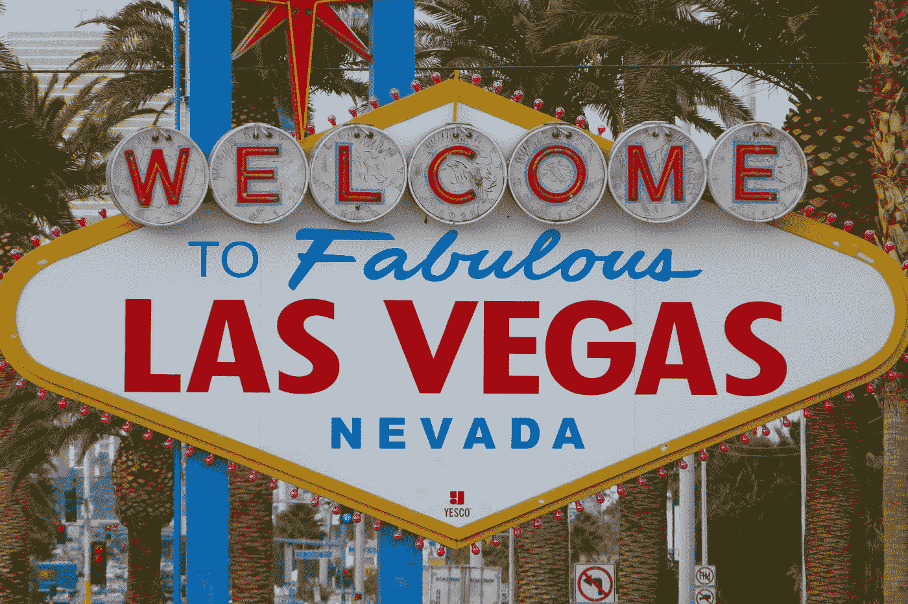

# 加密和博彩业比看起来更相似

> 原文：<https://medium.com/hackernoon/crypto-and-gambling-industries-are-more-similar-than-it-seems-928184f002fa>

## 什么密码可以从网上赌博业学习

Photo by [Nick Fewings](https://unsplash.com/@jannerboy62?utm_source=medium&utm_medium=referral) on [Unsplash](https://unsplash.com?utm_source=medium&utm_medium=referral)

在线赌博是最古老的在线行业之一，它已经存在了 20 多年。自 2010 年以来，我一直在在线赌博行业工作，与游戏运营商、开发商、审计员、认证实验室以及监管机构都有过合作。与流行的观点相反，博彩业是一个高度管制的行业，对经营者有广泛的要求，并在各个层面对其活动进行严格控制。

区块链，即使它现在是一个近 10 年的创新，仍然处于他的青春和发展的第一阶段。似乎在*加密资产*和赌博产业之间有很多相似之处。

# **在线赌博:我们是如何来到这里的？**

随着 90 年代中期互联网的普及，网上赌博也开始出现。即使关于谁是第一个接受赌注的网上赌场可以找到不同的版本，1995 年似乎是开始这一切的一年。从这一刻起，几个地区开始向遵循其通常宽松的要求的公司发放博彩许可证:安提瓜、直布罗陀、马恩岛、奥尔德尼岛、库拉索岛和马耳他可能是在最初几年对博彩业进行监管的最具代表性的地区，远远早于其他“较大”的国家。

此后，“监管浪潮”席卷欧洲，意大利、英国、法国、西班牙、丹麦和其他地区决定对该行业进行监管。与此同时，美国决定完全禁止在线赌博，这是博彩业最令人震惊的事件之一。

事实是，当“大”国家决定监管在线赌博时，该行业已经转移到其他地区，并在那里建立了业务，这些地区看到了通过宽松的法规和低税收吸引博彩业的机会。这就是为什么 2016 年[博彩业贡献了马耳他 12%的 GDP](http://www.independent.com.mt/articles/2017-03-30/local-news/The-gaming-sector-Contributes-1-2-billion-to-Malta-s-Economy-12-of-GDP-Mallia-6736172320) ，或[直布罗陀 25%的 GDP](https://www.vice.com/en_us/article/gq89g4/the-battle-for-the-rock-224)(在英国退出欧盟和某些国家的其他运动迫使运营商离开直布罗陀和类似领土后，这个数字肯定会下降)。

# **赌博和密码有什么相似之处？**

在我看来，赌博和密码有很多相似的地方。监管是其中之一，我认为当前和可能的加密监管短期公告与我们在过去 20 年中看到的赌博之间存在明显的相关性:

*   **良好的监管**:即使“ *crypto 不被监管*”(原文如此)，也有某些迹象让我认为，进化将与网络赌博的进展颇为相似，但速度为 x4。20 年前，直布罗陀、马尔他或马恩岛在博彩业上赚了什么，他们将在其他更大(也总是更慢)的国家之前，在区块链重演。稍后会详细介绍。
*   **糟糕的监管**:美国在 2006 年禁止网上赌博，迫使国际领先的运营商离开这个国家([这篇文章清楚地总结了发生了什么](https://calvinayre.com/2012/10/15/business/unlawful-internet-gambling-enforcement-act-2006/))。更有甚者，在 2011 年，所谓的“[黑色星期五](https://www.poker-king.com/dictionary/black-friday/)”意味着政府查封了世界上最大的 5 家扑克室，并起诉了它们的所有者和员工。此外，70 多个存有客户资金的银行账户被冻结了数亿美元。这就像如果明天，美国政府决定禁止加密，封锁比特币基地，北海巨妖和 Bitstamp，冻结他们所有的银行账户，逮捕他们的主人。我不认为这个选择是不可能的。
*   加密和赌博涉及金钱:或者，至少，涉及有经济价值的资产。金钱和资产从玩家转移到经营者，从买家转移到卖家和所有者。这通常证明了**法规**的合理性，因为它允许欺诈、洗钱等行为。当涉及金钱时，每个人都想避免风险和潜在的欺诈。这就是为什么赌博运营商在欺诈检测方面花费大量资金，而玩家对在某些网站存款非常怀疑。这也是为什么没有人相信巴西有史以来最低收费的 n-cryptoexchange。
*   **社会观感**:1999 年有谁敢在网上下注？即使在今天，许多人仍然认为网上赌场是不公平的，网上赌场使用的 RNG(随机数发生器)是有缺陷的，运营商不断试图欺骗你，不退还你的钱，但网上赌博的看法无疑比 1999 年好得多。我认为 crypto 或多或少也是如此。除了某些圈子，很多人认为加密只是为了赚钱和非法的东西，监管必须解决这个问题。这肯定会改变，但在线赌博用了近 20 年的时间。
*   **信任**:如上所述，赌博和密码的社会认知度不是很高。在博彩业中，通常由*认证实验室*验证所用软件的行为，包括 RNG(随机数生成器)以确保它们确实是随机的，以及游戏、支付方式等的集成。加密的场景是不同的，通常使用开源，允许任何人审计它，但[值得信赖的第三方可能会被需要。](https://www.wsj.com/articles/pwc-has-an-answer-for-the-blockchain-audit-it-1521194401)
*   **诈骗**:网上赌博，尤其是刚开始的时候，是一个充斥着诈骗的地方，数以千计的无证赌场，不断的诈骗和消失得无影无踪的赌场。即使在今天，发现不可信的经营者，阅读论坛上从未看到他们的赌场存款和奖金回来的玩家的帖子也并不罕见。听起来[像不像这个](https://bitconnect.co/)？那[这个](https://www.cnbc.com/2018/04/03/floyd-mayweather-backed-cryptocurrency-ico-fraud-sec-says.html)呢？你还记得最大的密码交易所是一个巨大的骗局吗？最大的扑克室不也是这样吗？
*   **AML & KYC** : AML 代表反洗钱，这是通过 KYC(了解你的客户)政策实现的。博彩运营商需要遵守严格的反洗钱和 KYC 规则，以检测可疑交易，甚至向相关当局报告。当涉及到金钱时，公司需要遵循这些规则，加密交换也不例外。每个地区都有自己的 ow AML 法规，但一般来说，赌博运营商和密码交易所需要验证客户的身份，要求提供其护照/身份证的有效副本、居住证明(即水电费账单)等。

# 那么，下一步是什么？

在我看来，很有可能我们会看到密码类似于在线赌博的演变。我看到的是:

## **短期**

直布罗陀、马耳他、马恩岛等创新地区将率先规范加密技术。其实他们已经在这么做了:[直布罗陀大概会是第一个](https://news.bitcoin.com/gibraltar-launches-regulation-to-protect-value-and-reputation/)，[马尔他也有一些动作恰恰是在区块链赌博](https://cointelegraph.com/news/malta-gaming-authority-proposes-blockchain-gaming-guidelines-testing-sandbox)，[马恩岛似乎很 ICO 友好](https://news.bitcoin.com/isle-of-man-official-announces-permissive-ico-regulations/)。

当币安宣布他们将搬到马尔他时，一点也不令人惊讶。毫无疑问，这三个地区是赌博运营商的主要地区，并且拥有非常先进的基础设施，这是游戏公司和加密项目都非常需要的。

与此同时，[其他国家将会对加密](https://www.reuters.com/article/us-crypto-currencies-eu/eu-says-stands-ready-to-regulate-crypto-currencies-idUSKCN1GA1Q3)进行长时间的讨论，在几个月或几年的时间里发布和讨论监管项目，并主要关注于追逐*加密* - *霍德尔*，而所有行业都将转向更有利于加密的领域。

## **中期**

较大的国家将最终决定监管密码，但他们的法律将比创新者更加严格。还有税。只需将马耳他或马恩岛等地区的博彩税与法国、意大利、西班牙甚至英国等国家的博彩税进行比较。税收大概是 5 倍。

对于 crypto 来说，一场类似于赌博业在 2000 年代末和 2010 年代初经历的“监管浪潮”(主要欧洲国家以非常相似的模式监管在线赌博)的运动将会发生。但在这种情况下，将已建立的赌博/加密公司从马耳他或直布罗陀转移到其他地区确实很复杂。

与此同时，一些地区将禁止加密，一些加密公司的高管将被监禁，就像美国禁止赌博一样。在未来的某一时刻，我们可能会看到灰色或“*的加密交易所。com* “直布罗陀、马尔他等国家许可的市场”，以及“*。国家*”。

这种情况，或多或少，也发生在获得*的赌博场所。运营商通常是允许的，客户可以选择在国际运营商或当地许可的运营商中玩，这些运营商通常会在安全方面提供额外的好处，因为这符合当地法律。在某些情况下，监管网上赌博的国家也*(试图)*禁止访问*。com* “结果有限的运营商(通常一个 VPN 就足够了)，同样的情况也会发生在加密交换上。*

## **长期**

同样，与赌博类似，越来越多的国家将对加密这一已经成熟的行业进行监管。其效果将与中期描述的效果相同，但要晚得多。老一套。

# **你不能禁止加密**

这个论点通常由*密码最大化者*使用。当然，国家不能禁止加密。这是一个分散的系统。但是他们可以切断从当前系统到加密的流程，类似于美国禁止在线赌博。如果你切断流动，阻止交易所接受存款和处理提款，查封域名，冻结银行账户并逮捕它们的所有者……这对 crypto 来说将是一个沉重的打击。请记住，这是 10 年前赌博业已经发生的事情！

如果加密是出了名的被禁止，谁还会使用它呢？当然，这不会杀死 crypto，但是采用率会回到 2011 年的水平。

# **为什么有些国家可能会决定禁止加密？**

*(请注意下一节中的一些 iroines，但是如果某些国家以类似的理由决定禁止 crypto，我一点也不会感到惊讶)*

*   对权势集团和货币垄断的威胁:毫无疑问，密码是有史以来对货币垄断的最大威胁。国家是唯一可以印刷钞票的国家，没有一个国家对失去这种巨大的特权感兴趣。有什么快速的解决方法？禁止加密。
*   只有坏人才会使用密码:这种观点也经常出现，并被政客、监管者和当局所利用。比特币交易和其他加密货币的所谓隐私鼓励其用于坏事，如[购买毒品](https://ftalphaville.ft.com/2018/01/15/2197646/the-bitcoin-drugs-trade-is-highly-centralised/)、[儿童色情](https://www.theguardian.com/sustainable-business/2016/jan/28/bitcoin-darknet-online-child-abuse-financial-sector)、[贩卖枪支](http://abcnews.go.com/US/silk-road-website-dealt-drugs-guns-assassins-bitcoins/story?id=20446005)、[网络犯罪](https://www.techrepublic.com/article/how-the-new-cybercriminals-use-cryptocurrency-to-commit-cybercrimes/)、[恐怖主义](https://www.express.co.uk/finance/city/893151/Bitcoin-price-latest-news-ISIS-terror-cryptocurrency)和[等等](https://www.techrepublic.com/article/how-the-new-cybercriminals-use-cryptocurrency-to-commit-cybercrimes/)。国家必须保护我们免受所有这些不好的事情，所以…禁止加密。
*   保护主义:许多人在赌博中输钱，这是为什么有这么多限制和管制的原因之一。甚至一些国家在贸易保护主义的观点下决定禁止赌博(在线和/或陆上)。很多人因为加密而损失金钱(将来会有更多人)，很少有人真正理解它(我不知道这是否可能)，国家应该保护我们免受不必要的风险…解决方案？禁止加密。
*   **避免欺诈**:毫无疑问，由于密码行业的年轻和缺乏监管，欺诈并不罕见。在某些情况下[这应该是非常明显的](https://bitconnect.co/)……但无论如何，很多人陷入这些骗局。甚至[谷歌](https://mashable.com/2018/03/14/google-ban-crypto-ads/#Yh_UswezSsqK)、[脸书](https://www.theverge.com/2018/1/30/16951670/facebook-cryptocurrency-bitcoin-ico-deceptive-marketing-ban)、[推特](https://techcrunch.com/2018/03/26/twitter-moves-to-ban-crypto-ads/)和 [Mailchimp](https://www.coindesk.com/email-service-mailchimp-block-ico-crypto-marketing/) 都在这种论调下决定封杀 ico。例如，脸书指出，ico "*经常与误导性或欺骗性的促销活动联系在一起"*。国家不是应该保护我们免受这些骗局吗？为什么加密仍然合法？！
*   **比特币是一个庞氏骗局**:捍卫这一论点的人显然不了解比特币(或任何其他加密项目)、庞氏骗局或他们都不了解。但是没关系。就连 JP 摩根的首席执行官也这么说，如果世界上最大的投资银行的首席执行官也这么认为，那么某些政客和他有同样的想法就不足为奇了。如果比特币是庞氏骗局，庞氏骗局被禁止，比特币就必须被禁止。
*   **避免洗钱和恐怖主义**:如上所述，隐私是加密资产的关键特征之一，这意味着，从理论上讲，它们可以用于这些非法目的。甚至看起来 ISIS 是通过比特币资助的。我想象不出比打击全球恐怖主义更好的理由来禁止加密。
*   加密不纳税:由于加密通常是“在系统之外”，国家的控制更少，因此，收税比在“标准经济”中更难。是的，他们可以控制秘密-秘密和秘密-秘密的行动，但不能控制秘密-秘密的行动(我们会看到)。避税是违法的，crypto " *似乎允许那个*"(请注意引号！)而且控制和识别钱包和交易的幕后黑手真的很复杂。我们需要更多的论据来禁止加密吗？

只有时间能告诉我们密码的演变和国家如何面对它，但似乎在线赌博的演变和密码的可能演变之间有很多相似之处，所以我们有一些未来可能发生什么的线索。无论如何，有趣的时代在前方！