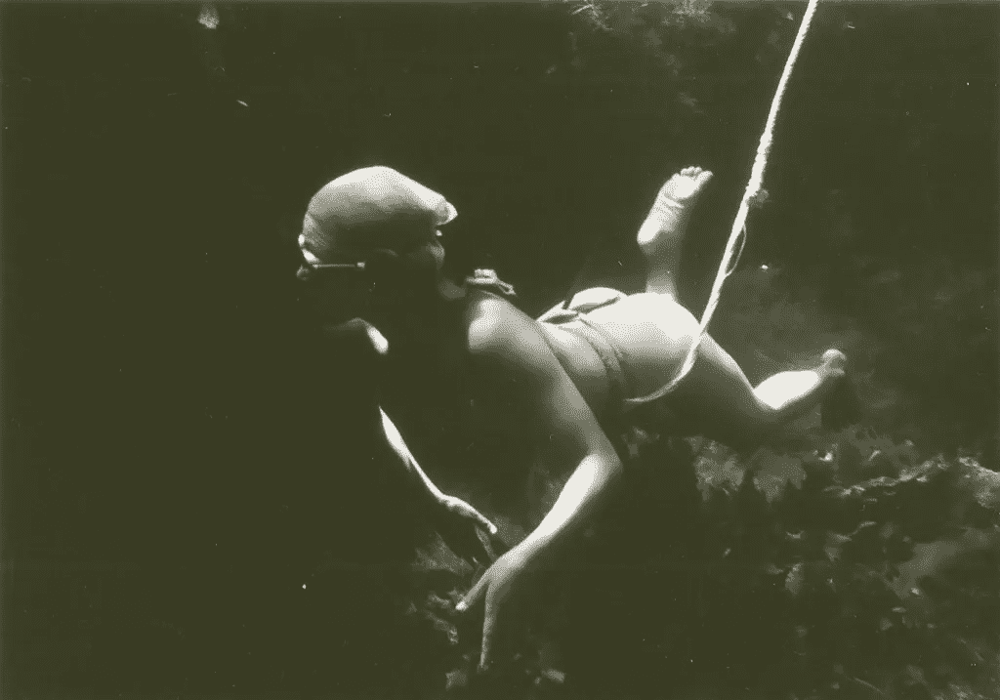
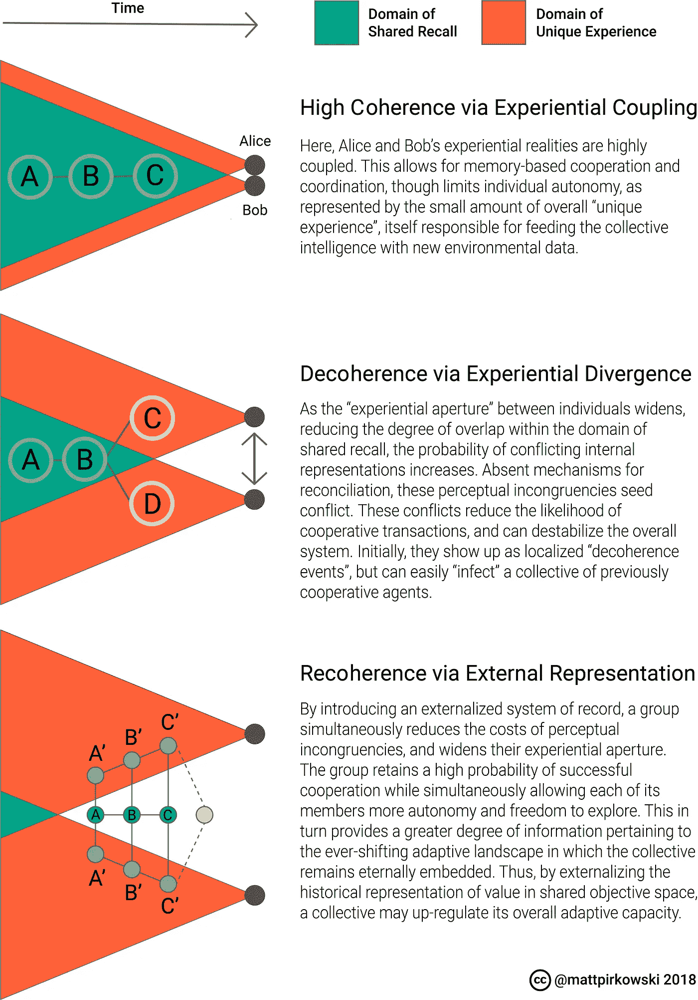

# 超越资本主义的密码:第二部分

> 原文：<https://medium.com/hackernoon/crypto-beyond-capitalism-part-2-9309829247b2>

## 金钱、效用和价值的符号抽象

这是一篇长文的第二部分，概述了我对新兴的秘密生态系统如何适应生物、文化和经济进化的宏观观点。我打算在 3-4 周的时间里每周发布一期。之后，我会以电子书的形式发布全部内容，包括额外的笔记和研究材料。

*如果您还没有阅读本系列* *的第一部分* [*，那么您应该在继续阅读本文之前阅读它，因为每一部分都建立在早期概念的基础上。*](https://hackernoon.com/crypto-beyond-capitalism-the-rise-of-distributed-valerism-7e3c1285a308)

## 金钱和效用:价值边际

A Japanese pearl diver on the hunt for oysters. Does she create, or seek, value?

> "要理解事物的局限性，就要渴望它们."
> ――老子，道德经

本系列的第一部分以一系列问题结束，这些问题强调了当我们试图确定金钱象征着什么时会出现的困难:

> 为什么指定符号和价值之间的关系仍然难以捉摸？
> 
> 为什么我们的货币符号与人类日常活动中更具体的价值观念如此脱节？
> 
> 为什么它们的符号映射更像“爱”而不是椅子？

大多数经济学家对这些问题的简单回答是，货币是一种用来表示、计算、交易和储存经济价值的工具。但是这个定义一直困扰着我，因为它依赖于对价值的先验抽象，即某种最能均匀表达的东西——就好像为了效率，我们必须不可避免地抛弃我们每个人拥有的独特价值。经济学家说，为了权宜之计，我们必须将人类价值打包成单一的数字价格。然而，大多数经济文献很少提到我们为什么应该——首先——以这种方式对待我们的人类价值观。

毕竟，每个人在世界各地移动时都会面临一系列独特的约束，我们每个人都必须*将自己的价值观*应用到一系列*不可预测的生活事件*中，从而随着时间的推移，增加我们满足我们自己*依赖于路径的需求和愿望*的机会。我们当然可以概括这些路径，但仅限于一点。过了这一点，我们开始感觉到金钱和我们感知的现实之间的分离感；前面提到的表象幻觉开始变得混乱。此外，抽象的货币符号和我们感知的现实之间的心理分裂扩大了，因为符号无法跟上我们生活经历的爆炸式复杂性。随着分裂的扩大，那些被其深度消费的人对价值代表系统本身(市场资本主义)感到怀疑，许多人开始鄙视其无处不在的价值图腾(货币符号)。

但这并不新鲜。价值的内在偶然性这一主题出现在有记载的人类思想史上，至少可以追溯到柏拉图和亚里士多德。例如，在亚里士多德的《政治学》中，他指出，视情况而定，太多的好事会变成坏事:

> 像任何其他工具一样，外部物品也有一个限度，所有有用的东西都有这样一种性质，如果太多，它们要么有害，要么至少是无用的。

两千年后，面对快速发展的工业世界，并努力将现有的价值理论改造成全新的经济现实，亚当·斯密在他的《钻石和水的悖论》中再次提出了价值的语境主观性这一永恒的问题:

> 具有最大使用价值的东西在交换中往往很少或没有价值；相反，那些具有最大交换价值的商品通常很少或没有使用价值。没有什么比水更有用，但它几乎买不到任何东西；几乎没有任何东西可以交换它。相反，钻石几乎没有任何使用价值；但是经常可以用大量的其他商品来交换它。

然而，如果一个人假设商品或服务在它们所嵌入的物理和社会系统之外拥有一些内在价值，这只会带来一个悖论。在实践中，商品和服务的价值——在现象学意义上——取决于市场参与者的具体环境、需求和心理状态，以及将它们推向市场所需的总能量。这种关于价值单一来源的模糊最终发现自己被政治因素所吸收，并演变成劳动价值论，其结论是一个事物的价值主要取决于生产它所投入的劳动。

但是，正如经济理论一样，劳动理论也有其弱点。19 世纪英国经济学家理查德·沃特利(Richard Whately)证明了其中一个弱点，他颠覆了以劳动力为中心的观点，强调了商品感知价值和这些感知驱动行为的程度之间的循环关系:

> 这并不是说珍珠卖了高价，因为人们潜水去寻找它们；但恰恰相反，人们会为它们潜水，因为它们能卖个高价。

尽管这又一次引出了一个问题:*为什么珍珠一开始就能卖高价*？似乎我们又回到了起点，并且必须再次面对这个令人沮丧的问题:*什么是价值*？

为了避免集中计算为什么所有人都重视他们所做的事情(相对于他们独特的生活状况和价值体系)这一不可能完成的复杂任务，我们创造了*效用*这个词，并将其归因于市场参与者为了另一个而牺牲一个*的意愿所编码的价值量。通过这种方式，我们确定了摆脱上述循环陷阱的方法，并(至少暂时)避开了追求复杂经济系统的全知计算和集中规划的乌托邦诱惑。*

所以今天我们以金钱的形式不断地互相牺牲。经济学家称我们愿意为每一个额外单位的商品或服务而牺牲的具体金额为其边际效用。例如，如果我徒步穿越沙漠，水用完了，一个水瓶的初始边际效用远远超过一颗钻石。此外，再多的钻石也改变不了这个等式，因为钻石不能解渴。我很乐意为我能携带的尽可能多的水付费，超过这一点，它的边际效用下降到零。或者，如果我水分充足，并且安全地生活在一个将钻石作为获取其他稀缺资源的象征的社会中——或者我参与了一段关系，其中我的伴侣期望这样的礼物作为承诺的象征——钻石的边际效用远远超过水。然而，除了第一颗钻石，更多钻石的边际效用在很大程度上取决于许多其他变量——即一个人的人际谈判技巧和对孤独的容忍度……

在任何情况下，通过引入*边际效用*，我们避开了价值的明显循环，并获得了*货币价值*的功能定义，该定义概括了因个人独特环境而产生的*感知价值*的差异。这种抽象缓解了我们的经济形式主义中的不一致性，但鉴于我们目前的目的，这只会将基本价值的问题推向人类行为底层的更深一层。然后，人们会思考为什么体现这种*货币价值*的纸片或金属片代表了足够的牺牲——从商品所有者或服务提供者的角度来看——来证明放弃自己的财产或劳动是正当的？为什么有人会给你一些你现在可以享受的东西(食物、水、财产、珠宝)来换取抽象的价值象征？

一个原因可能是他们能够使用这些代币在未来的时间和地点购买其他商品或服务——此时此地不存在。但是这个故事仅仅是描述性的，并且理所当然地认为在一个集体的个体头脑中编码这样一个想法是必要的集体知识。社会是如何学会并欣赏这种行为模式的自组织能力的？要回答这个问题，并进一步理解货币作为进化范式转变的重要性，我们必须更深入地挖掘人类最初如何接受价值符号而不是具体商品或服务的亚结构。为此，我们需要跳进我们的时间机器，回到我们的经济、哲学或历史教科书所不能带我们去的更远的地方:回到人类自身的出现。

## 进化、贸易和价值的涌现性抽象

> 对于进化心理学家来说，解释人类做某事是为了“纯粹的享受”根本不是解释，而是提出了一个问题。为什么那么多人觉得珠宝的收藏和佩戴很享受？对于进化心理学家来说，这个问题变成了——是什么导致了这种快乐的进化？
> 
> —尼克·萨伯,《给钱:钱的起源》

像钱一样的收藏品几乎和人类本身一样古老。让那件事过去一分钟。我们的祖先使用实物——贝壳、骨头、打结的绳子等。—在任何大规模文明出现之前很久就代表和抽象了价值的概念。这违背了常识，即货币是从交易物物交换系统中产生的。但是进化人类学家质疑物物交换——正如 18 世纪和 19 世纪的经济学家如史密斯所描述的——曾经作为一种主要的交换机制存在于农业社会之前。

相反，这些早期社会将贵重物品的交换嵌入共享记忆和价值观的连接性心理社会组织中，并以全息分布的方式将其记录存储在社区的大脑中。这种交换系统与文化和地理必要性的具体细节深深交织在一起，并为朝贡关系和社会计算的互惠提供了一种机制。例如，我们没有证据表明生活在小规模安排中的人类曾经从事过纯粹的交易行为，比如在市场上用 3 头猪换 1000 根香蕉。相反，随着时间的推移，跟踪贡献和互惠的非正式机制占了上风。例如，当一个社区成员遭遇狩猎失败的不幸时，那些拥有多余香蕉的人会放他们一马(可以说是食用信贷)，因为他们记得上个月猎人提供的美味烤猪。换句话说，我们并不总是将我们的经济现实从我们永远嵌入其中的社会景观中抽象出来。然而最终我们做到了。*为什么*？

许多在加密和更广泛的技术社区中的人已经非常熟悉这个答案:*扩展问题*。对于存储在人类记忆中的早期数值表示，比例问题非常普遍。人类的记忆从根本上说是有限的。它的编码机制是模糊的(电话游戏)，不太耐用(我们忘记事情)，并且容易发生灾难性的失败事件(死亡，或者偶尔的头部创伤)。此外，对记忆的依赖受制于那些做记忆的人的动机，当你后来过来要香蕉时，他们可能会很方便地误记起你烤猪的美味。如何解决这些问题？

我们做了大脑发达的人类最擅长的事情:我们创造抽象概念来表达，创造工具来解决手边的问题。我们不再单纯依靠记忆，而是开始交换稀有猎物的骨头，交换美观的石头，或者把结打成代表有意义事件的复杂排列。重要的是要理解，虽然这种抽象层次提供了极大程度的实用性，但它仍然与特定社会的特定价值观、美学和传统紧密相关。然而，随着我们开始将信息编码到这些系统中，而不是存储在我们的大脑中，在我们生活经验的内部表示的复杂景观和日益外部化的表示、存储和交换价值符号的机制之间开始出现一定程度的分离。

这个分离的过程对后面的论点至关重要，所以我想进一步解释一下。假设有两个人，爱丽丝和鲍勃，一起生活在一个早期的智人部落里。他们用记忆来记录他们互惠的历史(例如，我们过去为彼此做过多少好事？).一天，鲍勃走近爱丽丝，爱丽丝正舒服地躺在她最喜欢的地质制造的躺椅上，吃着她当天早些时候发现的一些浆果。鲍勃就没那么幸运了，他现在很饿。让我们假设他用那个时代的交流工具让爱丽丝明白了这一点。爱丽丝服从了吗？假设鲍勃不是一个大混蛋，他可能认为他过去做了一些事情，现在应该得到一些浆果，尽管他现在运气不好。但是要爱丽丝同意，她也必须对他们共同的历史有一个相应的积极的精神回忆。鉴于没有物理记录，它必须非常接近鲍勃记忆中的主观回忆。如果它们不匹配，Alice 应该拒绝请求。

仅仅依靠人类的记忆和一时的刺激会给交流带来很大的障碍。为了让爱丽丝的捐赠感觉公平，爱丽丝和鲍勃的主观感知——过去和现在——必须具有高度的重叠。用工程术语来说，为了保持互惠的能力，爱丽丝和鲍勃的主观现实必须随着时间的推移保持*紧密耦合*。为了理解这个系统的脆弱性，思考一下这个系统会在多少方面出问题是很有用的。随着时间的推移，爱丽丝和鲍勃的现实有多少种解耦方式，或者说*解耦方式？爱丽丝和鲍勃的记忆力会有所不同。Alice 和 Bob 可能对过去的互动有不同的评价。自从他们最后一次互动以来，新的信息可能已经进入画面。爱丽丝可能特别饿。鲍勃今天可能心情不好。这个清单还在继续。*

也就是说，如果交换*真的发生*，那就再次证明了爱丽丝和鲍勃对现实的主观感知保持了同步。心理上，他们仍然*生活在同一个世界*。随着时间的推移，他们仍然保持*的连贯性*，并且仍然存在于共享现实的肥沃的人际关系土壤中，信任的纽带可以从这里生长。通过加强他们的纽带，他们也加强了他们所属社区的整体凝聚力。这种社区凝聚力的加强非常重要，尽管通常很难理解、衡量或编码它在当下的价值，因为它在未来大多会带来回报。当集体重复这些人际互动数百次、数千次或数百万次时，无形的信任纽带——即*群体凝聚力*——会回报复合红利。换句话说，一个培养信任的社会随着时间的推移增加了有利的人际交流结果的可能性。一个信任的社会可以扩展它的概念时间范围，并相应地计划，*作为一个元有机体*。

A diagrammatic representation of externalization-mediated coherence

但是随着一个社会的规模——以及其复杂性——的增长，随着时间的推移，维持如此高度的人际和谐变得不可能。信任开始侵蚀。不断增长的社区产生了新可能性的组合爆炸，这种日益多样化的生活方式扩大了社区成员主观现实之间的差距，在依赖于元有机体的*连贯的社区现实的个人互动之间产生了紧张。必须有所让步，否则混乱和暴力就会出现。因此，当人类继续在地球上扩张时，人类将保持自身一致性的方法外化到了共享的价值、交换和互惠债务的历史中。这些新工具使人类能够将维持群体凝聚力的负担外包给个体大脑之外的物理系统。通过在一个有能力的替代品中编码共享的现实，在主观现实的变幻莫测之外，人类建立了一个共享的环境现实；换句话说，我们种下了*行为种子*，这些种子后来会成长为“客观现实”的清晰概念。我们必须先*表演出来*才能概念化，我们必须先*概念化*才能*说出来*。*

这些原始货币会计系统的例子(如本节开始时描绘的 quipu)代表了人类集体智慧的最初物理表现。因此，通过将前面提到的*社会一致性问题*外包给共享的客观空间，我们允许每个社会成员有更多的自由来探索、发展和区分他们自己对世界的主观解释。我们降低了个性化的*成本*，因此开辟了认知探索的新领域，允许个体身份的*扩展*。更重要的是，我们打开了这片肥沃的边疆，却没有打开混乱的闸门，这种混乱的特点是社会凝聚力和信任受到侵蚀。在平衡中，个体和集体元有机体都茁壮成长。爱丽丝和鲍勃不再需要拥有几乎相同的现实内部映射来获得交换的好处。实际上，这是一个双赢的结果。爱丽丝和鲍勃个人受益于认知和经济自由的增加，集体社会有机体受益于连贯的、基本稳定的创造力和增长的爆发。

## [**继续第三部分:文明的价值符号的集中化**](https://hackernoon.com/crypto-beyond-capitalism-part-3-c6128853ebba)

**感谢阅读！如果您发现这些内容很有价值，请关注我，这样您就不会错过下一期。在那里，我们将探索文明对价值抽象的逐渐集中，以及对人类生存风险状况的下游影响。**

***如果你慷慨大方，愿意帮我创作更多长篇、跨学科的内容，可以考虑*** [***支持我上 patr eon***](http://patreon.com/matthewpirkowski)***。***

***如果你用 Twitter，可以找我***[***@ mattpirkowski***](https://twitter.com/MattPirkowski)***。***