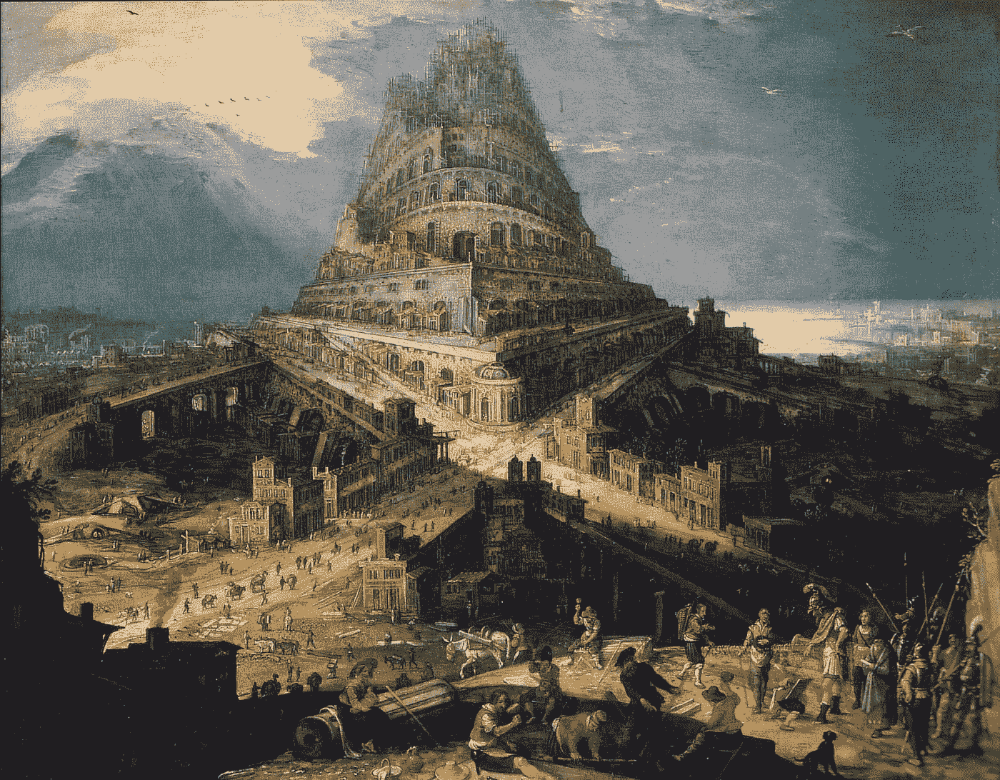

# 超越资本主义的密码:第三部分

> 原文：<https://medium.com/hackernoon/crypto-beyond-capitalism-part-3-c6128853ebba>

## 文明的价值符号集中

这是一篇长文的第三部分，概述了我对新兴的秘密生态系统如何适应生物、文化和经济进化的宏观观点。我打算在 3-4 周的时间里每周发布一期。之后，我会以电子书的形式发布全部内容，包括额外的笔记和研究材料。

*如果您还没有阅读本系列的第一期***和第二期* [*和第二期*](https://hackernoon.com/crypto-beyond-capitalism-part-2-9309829247b2) *文章，您应该在继续阅读本文之前阅读它们，因为每期文章都建立在早期概念的基础上。**

**

> *尽管从严格的物理角度来看，城市建筑的加速是能量流动增强的结果，但一个给定城镇的实际形式是由人类决策决定的。对于决定能源如何在城市中流动的社会机构，也就是说，对于城市的“分配系统”,也必须对集中决策和分散决策进行类似的区分。*
> 
> *—曼努埃尔·德·兰达，《一千年的非线性历史》*

*大约 10，000 年前，在古代美索不达米亚，人类利用他们扩大的认知自由，使自然自身屈从于人类有机体的集体意志。在我们达到早期文明出现所需的可预测性水平之前，我们不清楚多少代饥饿的人类煞费苦心地试验了种植、繁殖和收获作物的方法，但整个现代历史证明了我们最终的成功。非常突然，大规模的文明不知从哪里冒了出来。我这样说是因为我们对植物的驯化——以及随之而来的农业文化的发展——推动了肥沃的农业土地附近定居城市的快速发展。*

*再一次，随着这些社会经济重心集中了越来越多的人，强化了他们的能量流动，个人生活的结构和系统的复杂性爆炸了。我们发明的在小范围内维持社区凝聚力的工具再一次不再能够平衡这个快速发展的世界的必要的协调和稳定。在令祖先相形见绌的等级结构的重压下，人类的*连贯机制*开始失灵。*

*等级组织的规模越来越大——早期农业文明的特征——需要比人际或部落效率更多的东西来抵抗紧随其后的熵。随着混沌不断试图将这些进化的结构拉进混乱状态，我们会愚蠢地认为大多数维持其稳定性的早期尝试都逃脱了崩溃。相反，崩溃和失败是相对常见的；我们有考古(和神话)记录来证明这一点。这就是人类倾向于学习的方式；混乱和崩溃带来的痛苦对幸存者来说是严酷的，尽管是无时不在的导师。为了避免崩溃的地狱般的经历，我们新膨胀的等级制度需要在城市居住模式中保持社会凝聚力的新方法。在不引入不必要的复杂性的情况下，这种系统必须快速扩展，以适应支撑城市的人际交往的爆炸式多样性和频率。任何破坏信息流稳定的东西——威胁崩溃——都可能开始变得无关紧要。我们再次提高了保持社会一致性所需的抽象和标准化水平，牺牲了特定于上下文的细节，以换取效率和可预测性。*

*如果这意味着没有足够的粮食来养活那些心理和行为可预测性建立在吃饱肚子基础上的人，那么对于人际关系或社会环境来说，不再有含糊不清的余地。正如许多大规模等级社会的统治者所发现的那样，饥饿的人们往往会让日常生活变得完全疯狂，而且常常是致命的。但是贫困只是能够迅速动摇像城市这样复杂的系统的众多因素之一。由于这些原因，早期文明开始使用新发明的工具来标准化会计方法。事实上，最早出土的书写例子正是为这一功能服务的；它们是粮店和相关交易的会计记录。*

*从历史的角度来看，人们可能想知道为什么这种日常记录是人类决定写下的第一个信息。毕竟，古代文明拥有根深蒂固的宗教传统，并以口头和象形文字的形式讲述其文化遗产的故事。为什么不像后来的文明那样，首先把它们写下来呢？但这不是正确的问题。这是一个对写作如此熟悉以至于对其作用视而不见的头脑所提出的问题，类似于一条刚发现水的鱼可能提出的第一个问题。但是，当被重新框定为人类自身*社会凝聚力引擎*的外化和抽象的延续，作为对爆炸式复杂性的回应，这些信息最先获得不朽似乎是理所当然的。就个人而言，我喜欢把这些*一致性引擎*看作是人类日益强大的社交飞轮。它们储存了我们*一贯的文化惯性*的能量，并在我们应对各种各样的干扰——包括环境干扰和自身干扰——时，防止我们复杂的社会从生存的钢索上掉下来。当我们作为个体越来越自由地探索世界时，我们外在的价值符号将我们紧密地联系在一起。*

*因此，文明的进化要求我们在稳定的祭坛上牺牲我们所珍视的对环境敏感的特性。负责稳定增长的中央集权当局最终发行了标准化代币——旨在使社会所有成员的价值符号一致化——由接近普遍价值的物质通过其稀缺性制成。那之前所珍视的多元价值观又发生了什么变化呢？我们开始了遗忘特定价值观的漫长过程，以便衡量我们的整体连贯性。这些代币的制造、分配和最终支持，以及我们的价值体系，现在都掌握在特定宗教范式或政治体的中央权威手中。我们开始忘记我们分散的*价值万神殿*，因为新造货币作为*一个真正的价值之神*站在所有其他事物之上。*

*这种普遍的模式在多种伪装下展现了自己。正如所暗示的，货币和一神论的同时出现不仅仅是巧合。不稳定和混乱的威胁驱使人类将经济价值的象征外化和抽象化，同时也驱使宗教的外化和抽象化。但是，宗教抽象化的过程并没有将功能性的价值符号具体化和抽象化，而是将较小群体的特殊神灵整合成更容易被大众接受的形式。可以说，它磨平了它们许多不协调的边缘，或者稀释了它们更极端的味道。随着小规模社会围绕着引力城市吸引物不断发展，或者被日益强大的城邦军事力量所超越，他们主观精神现实的分形轮廓以稳定和一致的名义融入了更为普遍接受的宗教符号和抽象概念。*

*鉴于不相称的世界观，人类对冲突的基本倾向几乎是一个行为常数。当群体使用通常不可调和的抽象概念——更普遍地被称为神——来代表他们独特的形而上学现实时，任何最初的摩擦通常都会扩大为他们共有的心理现实之间的深刻分裂。这种分裂*阻止了集体元有机体内部的一致性，而集体元有机体本身试图发现群体之间相互作用的稳定模式*。正如我们前面所探讨的，围绕这些分歧的紧张局势不断累积。随着时间的推移，这种紧张关系往往会降低社会凝聚力和人际信任，并经常演变成混乱和暴力。*

*要点是:维护不同的价值代表系统与维护不同的信仰系统一样困难。不协调的系统——无论是货币的、形而上学的还是语言的——会给整个系统带来成本。想象一下，在美索不达米亚社会中，维持两种不同的货币价值体系。想想在一个写作相当于[在湿粘土上蚀刻符号](https://en.wikipedia.org/wiki/Cuneiform_script)的世界里，冗余带来的挫败感吧，与现代手写相比，它慢得惊人，更不用说打字了。保留多种货币体系意味着在关于给定商品或服务效用的不同观点之间不断进行翻译和计算(使用新生的、容易出错的音译过程)。这意味着额外的争端解决机制。这意味着以物理方式存储、运输和保护更多的物理令牌来完成相同的任务。这些摩擦来源增加了交易、执行和协调成本，并使激励向集中秩序和简单性倾斜。*

*那些从权力中心的角度来看问题的人倾向于认为这种没有直接利益的成本是不受欢迎的 T2。这个简单的启发很可能指导了美索不达米亚的管理，即使那些有问题的人缺乏现代经济词汇来阐明其基本原理。毕竟，负责稳定增长的统治者不必提供抽象的解释，因为他们的新兴城市仍然很小，足以让居民直接体验失败的后果。当复杂性的重量超过了系统的承载能力时，系统会明显地崩溃——通常是剧烈地崩溃，大多数人愿意牺牲相当程度的个人自主权来换取稳定性。因此，尽管事实上个人可以从保留他们独特的观点中获益，但是从集中的权威人物的角度来看，增加的成本使得这种多样性变得不可容忍，按照马基雅维利的说法，这主要关系到公民有机体的稳定性。正如任何反对中央政府命令的人将会证明的那样，那些肩负维持稳定任务的人将会竭尽全力阻止替代价值体系的出现。问问罗斯·乌尔布里希就知道了。*

*因此，在过去的 10，000 年里，我们一直生活在一个越来越集中的范式中。我们已经*牺牲了大量的个人潜力*，跨越千年，为了中央集权的稳定之神*。用今天的说法，我们经常把这种权衡——这种牺牲——归类为压迫。但是这种定性应该引起我们的关注，因为越来越多的生活在高度发达、基本和平和极度繁荣的文明中的公民主观上担心*稳定是压迫*，这表明我们正在迅速接近中央集权模式下稳定增长的极限。我们已经到达了一个点，人类必须再次利用我们的抽象和创新能力来建造一个更有能力，但仍然集体一致的容器，我们可以将我们物种的创造潜力注入其中。**

## *价值观失去了，但没有被遗忘*

**

*如果这一切听起来有点悲观，那只是因为我想强调并准确定义*我们牺牲了什么*来维持我们卓越的中央集权模式中相对稳定、结构化的增长。同样，我也不是乌托邦主义者。我承认并感激在这个过程的最后，我从纯粹的出生运气中获得了无穷的利益。没有这些历史上的人类创新中心系统，我不会写下这些文字，你们也不会读到这些文字。我们将没有思考当今全球问题的特权，更不用说解决这些问题的挑战了。*

*如果没有这些束缚，通常是压迫性的结构，我们就不会发明印刷机，也不会想到自来水，更不用说计算机或互联网了。大自然就是这么有趣。由于分权的局限性，系统向集权方向摆动，然后由于集权自身的局限性，系统又向分权方向摆动。但是我们一路走来所面临的问题并不一定意味着一个破碎的系统。相反，它们表明当前的范式已经走到了尽头，一个巨大的人类潜能库还没有被现存的结构开发，准备好为下一次逆转提供燃料。这个水库包含了我们千百年来以效率和稳定的名义提取出来的所有人类价值的集体效用。它充满了独特的视角和以前不可扩展的人类行为的边缘刨花，它开始溢出历史上建造的中央集权的大坝。我相信密码社区代表了对这个水库的压力管道的全球朝圣。感受到它的巨大潜力，数百万人正试图利用分散的人类价值表现、存储、谈判和交换的新范例来挖掘这一潜在潜力。为了扩展这个比喻，密码社区正在试验一种新的行为发生器，能够将尚未开发的长尾人类价值转化为可行的经济能量流。*

*为了更清楚地想象这一朝圣之旅的轮廓，并将其置于背景中，让我们缩小范围，回顾一下迄今为止我们所了解的价值表征的演变:*

*   *我们今天使用的货币是一个社会所持有的潜在行为价值观的高度抽象的表现。金钱使道德法典化。此外，它位于一个进化过程的终点，这个进化过程将具体的人类行为提炼为越来越同质和抽象的价值表征。*
*   *最初，一小群人开始对与社区成员的日常活动和价值观相关的行为信息进行编码。他们使用足够耐用的技术将他们的心理表征外部化，以延长信息的寿命和保真度，跨越距离和时间跨度，超越人类独立交流、记忆、健康和寿命的能力。*
*   *这些特定价值观的外化编码——*行为模式*——使我们能够在时间和空间上玩一系列新的经济游戏，我们用这些新游戏来组织我们的社会，这样我们就能最大限度地平衡社会稳定和个人创造力。*
*   *这种平衡优化了信息的流动(即创新)，并催化了新的*集约化技术*——即农业的发现。人类社会群体随后经历了爆炸式增长。随着时间的推移，这种扩展过程对以前用于编码、外部化和跟踪价值的系统施加了适应性压力。*
*   *对这些新压力的适应以前所未有的等级社会组织的形式出现。我们通过合理化、形式化和均质化以前用于维持早期部落等级制度的稳定性和一致性的工具，来补偿这些庞大等级制度的内部复杂性。*
*   *在日益增长的复杂文明的等级体系中，激励机制更倾向于效率和稳定性，而不是差异化和信息的最大化。这是因为——从当权者的中心观点来看——在前技术时代，差异化的近似成本超过了其潜在收益。*
*   *我们通过将最小公分母的值编码成标准化的令牌来满足这些约束。货币诞生了，行为上所表现的道德价值的管理被委托给行动缓慢且日益集中的公民机构。*

*在故事的浓缩形式中，出现了一种模式。姑且称之为*周期的连贯强化*，其中:*

*   *日益增加的复杂性以不稳定和混乱的形式施加适应性压力，在整个系统中广泛体验为非典型的压力不确定性和日益频繁的*退相干*。*
*   *系统内的代理人——在这种情况下是人类——通过创造能够*凝聚*日益不稳定的复杂性的抽象来做出反应。*
*   *这些新发现的能力打开了通往更高的一致性复杂性平台的大门。然而，在稳定之后，这些相同的新能力越来越多地引发新的复杂性的产生，开始新的循环。*

*冲洗并重复。当它起作用时，这是一个良性的向上螺旋，通向地球上的天堂。当它失败时，我们的社会很快就会陷入混乱的地狱般的境地，文明的时钟会倒退几千年。但是，通往天堂的螺旋和坠入地狱的螺旋有什么区别呢？正如我在这篇文章中多次提到的，我相信这个反馈循环的方向取决于我们的能力*在循环的各个阶段保持集体一致性*，同时不断*增加个人自主性*。如果一个社会实现了集体代理而没有随之而来的个人自主性的增加，那么这个系统将无法在自身内部发展出足够的能力来应对下一个周期的去相干事件的复杂性，并将倒退到先前的稳定平台。相反，如果以牺牲集体代理为代价来追求个人自治，混乱的消相干会越来越抵消增加自治的价值，系统又会倒退。*

*今天，我们站在文明向中央集权钟摆的顶点，并有先见之明地(尽管可能是下意识地)在过去半个世纪里建设基础设施，帮助我们驾驭惯性转变，回到一个更加分散、更加一致的世界。互联网；万维网；网状网络；微型卫星；加密货币。这些新工具有可能帮助我们首先建立，然后保持一个指数级的更有能力和道德的物种范围的集体一致性*,因为我们开始转向分散增长、组织和授权的范式。但是，虽然我仍然充满希望，但越来越明显的是，我们的技术发展已经超过了我们负责任地处理技术实力后果的心理、社会、经济和政治能力。尽管我们从未如此紧密地联系在一起，但似乎我们也正变得越来越分崩离析，危险地不连贯，这是我们加速技术文化发展和分化的结果。我们已经发展了巨大的破坏能力，并扩散到全球各地，我们根本无法承受 20 世纪发生的那种灾难性的退相干事件。然而，在现状的支持下，我们似乎越来越有可能引发一场具有世界末日规模的[黑天鹅](https://en.wikipedia.org/wiki/Black_swan_theory)事件。**

**只有在更新了我们的价值表现、存储和交易系统之后，这种必要的转变才会真正开始。这是加密货币的宏大叙事，尽管那些看不到它的人经常受到短视的批评。我们正在*升级凝聚引擎*，凝聚我们的全球社会，同时释放个人探索新的创造性领域。目前集中的价值象征——货币和管理它们的机构——在面对成倍增长的复杂性浪潮时很难保持一致性。虽然这些系统迄今为止提供了巨大的价值，但它们也变得与长尾行为现实脱节，过于抽象，并且容易腐败。与之前的历史拐点类似，我们已经开始感受到系统中不可容忍的摩擦水平。这种结构性的摩擦最终会以全球同步衰退、日益棘手的意识形态两极分化以及对进一步全球一体化的阻力不断增加的形式出现。**

**当我们的集中代表系统努力封装和适应日益多样化的人类价值观时，一条裂缝出现了。这个地下裂缝释放的力量在信任的基础上制造了裂缝。随着这些裂缝的蔓延，人际信任、跨文化信任和制度信任都开始崩溃。那些价值观没有被代表的人最终会反叛。他们反对金钱本身。他们开始质疑加强其合法性的治理体系。他们拒绝资本主义范式的人道原则。那些感受到这个裂缝的地震影响的人说得有道理。毕竟，*一切都必须进化，没有什么能逃脱熵*。虽然支撑我们文明的机构和系统在 250 年前就已经走在了时代的前面，但它们现在迫切需要结构性改革。**

**我们在数字空间中加剧了这些问题，我们越来越多地回避或攻击那些与我们价值观不同的人。更糟糕的是，考虑到货币激励的在线景观，我们所知的互联网缺乏将我们的社会结构缝合在一起所必需的针线包。它最杰出的企业实际上从撕裂这种精致的织物中获利，尽管事实上它的最终解体也意味着它们自己的灭亡。脸书、推特和谷歌不能也不会解决这个问题。我们现在的政府无法解决这个问题。这是因为——不管意图如何——这些行为者仍然受到牢牢植根于中央集权范式的限制。他们结构性惰性的内在逻辑和动机排除了必要的增长，就像严重的成瘾暗中阻止其宿主达到清醒一样。**

**因此，我们需要新的解决方案来代表和重新整合我们花了几千年时间抽象出来的人类价值观。这样做需要分散的、可信赖的和*价值感知的*网络；我们今天所处的日益脆弱、腐败和中央集权的价值体系，根本经不起 21 世纪的复杂程度。第一波出现的此类系统——[加密货币](/@vijayb_24615/the-bullish-case-for-bitcoin-6ecc8bdecc1)和[加密经济原型](/@jacobscott/the-emergence-of-cryptoeconomic-primitives-14ef3300cc10)——是我们可以用来首先重建，然后维持集体凝聚力和个人自主权之间必要平衡的工具。就像早期价值表征的范式转变一样，这些新工具打开了一扇通往未开发潜力世界的大门，并让我们能够解决越来越多的问题，这些问题有可能将我们的世界拉回到混乱之中。我们下周将讨论这一主张的正当性。**

## **[继续第四部分:牺牲的基本维度](https://hackernoon.com/crypto-beyond-capitalism-part-4-c75c541b207a)**

****感谢阅读！如果您发现这些内容很有价值，请花一点时间阅读本文的** [**部分，并在 Medium 上关注我，这样您就不会错过下一期。在那里，我们将探索牺牲在调解个体和群体之间的进化张力中的作用，并进一步揭示分布式瓦莱主义的首要原则。**](https://help.medium.com/hc/en-us/articles/115011350967-Claps)**

*****如果你觉得大方，愿意帮我创作更多长篇、跨学科的内容，可以考虑*** [***支持我上 patre on***](http://patreon.com/matthewpirkowski)***。*****

*****如果你用 Twitter，可以找我***[***@ mattpirkowski***](https://twitter.com/MattPirkowski)***。*****