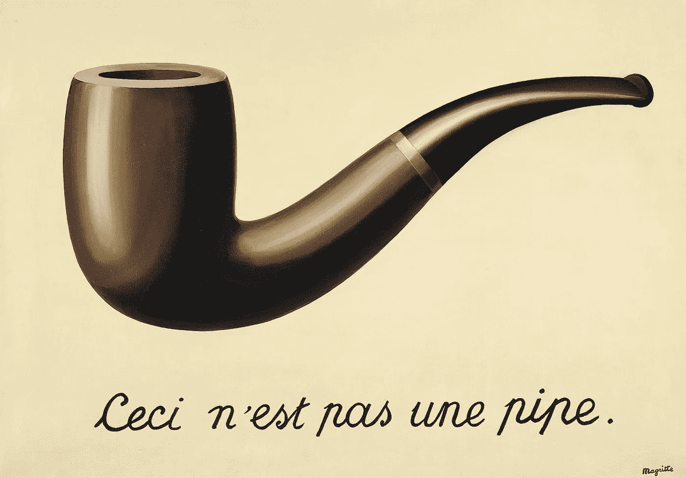

# 超越资本主义的密码:分布式价值主义的兴起

> 原文：<https://medium.com/hackernoon/crypto-beyond-capitalism-the-rise-of-distributed-valerism-7e3c1285a308>

## 人类价值表现和交换的进化调查

欢迎阅读一篇长文的第一部分——或一本短书——概述我对新兴的秘密生态系统如何适应生物、文化和经济进化的宏观观点。我打算在接下来的 3-4 周内每周发布一期。之后，我会以电子书的形式发布全部内容，包括额外的笔记和研究材料。

*随着每一节的发表，这里会把它们的* [*加上*](https://hackernoon.com/crypto-beyond-capitalism/home) *。*

*尽情享受，我期待真诚地参与所有的评论分享。*

> 人类生活的痛苦和混乱的主要原因，似乎是由于高估了一种永久状态和另一种永久状态之间的差异。贪婪高估了贫穷和富有之间的区别:野心，私人和公共职位之间的区别:虚荣，默默无闻和广泛的声誉。一个人在这些奢侈的激情的影响下，不仅在他的实际情况下是痛苦的，而且经常倾向于扰乱社会的和平，以达到他如此愚蠢地钦佩。
> 
> —亚当·斯密，《道德情操论》

## 作为新兴道德的资本主义

亚当·斯密(Adam Smith)从他母亲位于苏格兰的小联排别墅的窗外望去，努力理解发生在他周围的社会和经济变革的含义。随着每周一期的《爱丁堡晚报》,一些新奇的发明、商业冒险或革命性的科学范例的消息似乎给尚未成文的模糊的未来投下了微弱的光。这些即将出现的形状和力量——出现在过去的知识和现在的创新的交汇处——每晚都困扰着他，让他难以入睡。然而，在史密斯脑海深处形成的思想反映了他所处的不断变化的经济模式的结构。一个人怎么能在这样的幻象挣扎着逃离自己身体的束缚时入睡呢？他感到非常需要在公理的基础上，以曾经被认为不可思议的速度改革世界。因此，他开始阐明一个正在孕育中的新兴工业世界的道德轮廓。就这样，资本主义诞生了。

历史专业的学生知道亚当·斯密是《国富论》的作者，也是资本主义理论的创始人。但很少有人知道，在他开始阐述他的理论——概述了工业化世界中人类的创造、表现和财富交易——之前，他是一位道德哲学家。因此，他写了大量塑造人类互动的行为模式。他主要关注的是我们辨别和延续正确行为(道德)模板的方式，以及这些模板如何影响我们对价值的感知。尽管许多当代经济学家已经忽略了感知道德领域和经济价值领域之间的基本联系，但这个问题在他的脑海中占据了首要位置。对史密斯来说，人们用他们的经济行为作为代理人来传达人类自身涌现的道德情感。

但是为什么道德和经济理论之间的联系很重要呢？它与新兴的加密货币世界有什么关系？在这篇文章中，我将论证，在花了数千年时间抽象出我们的价值表现与它们所表达的潜在道德情感之间的基本联系之后，我们正站在通过一种新颖的技术工具包将这些道德情感明确地重新引入市场的边缘。然后，我将展示这样一个案例:这个新兴的工具包打开了一扇大门，让人类表现、储存和交易价值的能力呈指数级增长。

就像 200 年前的亚当·斯密一样，我们站在一个新经济世界的事件地平线上。我们不可能准确预测新世界将会带来什么，但我相信——根据我们用来代表和交易价值的现有系统的演变和局限性——我们有可能清晰地描绘出即将到来的经济和技术变革的有用轮廓。

## 分布式价值主义:21 世纪的经济前沿

Everyone sees Mt. Crypto, but what’s happening beneath the surface?

> “我不容易盲目跟随别人的领导。我一直努力让我的头脑保持自由，以便一旦事实表明与假设相反，就放弃任何假设，无论它多么受人喜爱(我无法抗拒对每个主题都建立一个假设)。”
> 
> ――查尔斯·达尔文，查尔斯·达尔文的生平和书信

重新设想一个能够利用工业革命潜力的经济体系，需要牺牲许多农业和重商主义的假设，这些假设在当时被认为是理所当然的。同样，我们很可能需要抛弃资本主义工业时代遗留下来的许多意识形态、文化和神话，以便充分发挥信息时代的经济潜力。通过引入分布式瓦莱主义的概念，从拉丁语 *valere —* 大致翻译为*of worth】*—*，我试图建立一个概念上的把手，更紧密地映射到当前地平线上的技术、文化和经济变革。*

*分布式 Valerism 将经济焦点从对所有权的集中管理的关注转移到适应信息经济的新物理和博弈论约束的行为环境中的价值表示、存储和交易的长尾动态。在可能的情况下，我试图摆脱资本主义与社会主义的二分法框架，并相信分布式价值观提供了一个务实的进化框架，可以在其中嵌套关于平衡前进道路的讨论。通过描述发生在当今货币和经济格局深处的构造变化的性质，目前可以以地震般的意识形态隆隆声和加密货币对经济和政治格局的早期爆发的形式检测到，我们可能会开始看到——并有望理解——在*集体人类有机体*的规模上驱动进化变化的构造流。*

*简而言之，如果资本主义通过所有权转移来代表我们的道德价值观，无论是物质资源、机器、土地还是一般的货币代币，那么 Valerism 就代表了资本主义向信息时代的延伸以及在信息时代的平衡转变。这是使大量未开发的人类潜力变得肥沃并在经济上融入其中的过程，这些潜力目前由于历史和技术的限制而闲置。具体来说，两个主要转变将改变和扩展我们当前财务工具包的假设:*

*   *通过*去中心化的价值表现系统*增加的表达能力和减少的交易摩擦，在货币系统本身中封装了日益多样化的人类价值和知识。*
*   *玩新颖的经济游戏的能力，这在以前由于集体行动的问题而无法实现，并且依赖于分布式方法来管理跨越扩展的时间范围的经济信任的游戏理论。*

*通过将这些特征融入资本主义引擎，人类将在追求增加总体财富创造、改善公平分配、降低金融和政治波动性的过程中开启新的强大工具。加密货币爆炸的最初形态已经展现了很好地映射到这一框架的早期轮廓。但是在讨论当前和未来动态的细节之前，我想把分布式 Valerism 的主要特征的重要性放在它们适当的环境中。基于这一目标，我将首先对我们物种和货币技术之间的关系进行跨学科回顾，然后描述为什么这些新货币技术的创造和整合与迄今为止的任何技术创新一样具有革命性，甚至更具革命性。*

## *模糊性和金钱的意义*

**

*An image of a pipe is not a pipe, and a representation of value is not itself that value.*

> *我们看到的一切都隐藏着另一个东西，我们总想看到被我们看到的东西所隐藏的东西。人们对隐藏的和可见的事物不感兴趣。这种兴趣可以表现为一种非常强烈的感觉，一种冲突，可以说是隐藏的可见事物和存在的可见事物之间的冲突。*
> 
> *―勒内·马格里特*

*如果我们试图调查我们的*货币表现*相对于它们的*潜在含义*是如何演变的，那么简单地思考一下货币的当前*含义*会有所帮助。那么，一美元*意味着什么*？我们倾向于被它的功能性使用所困扰，因此我们对金钱意义的民间观念常常停留在交易层面的分析上。一个人可以用一些美元购买食品、汽油和娱乐。从某种意义上说，只要这一点成立，一美元对大多数市场参与者来说意味着什么并不重要。事实上，如果你严肃地向大多数人提出这个问题，他们可能会看着你，好像你有点被感动了；我知道，我一直在问…*

*但我一直在问，因为当一个人思考这个问题很长时间后，金钱的概念开始显得相当荒谬。我们用作货币的这些小纸片——每一张都覆盖着象征性的华丽图案——不知何故已经代表了一套集体价值观，否则这些价值观就会藏在 70 亿只猿的头骨里。的确很奇怪。然而，美元，就此而言，所有其他货币，与上面这幅马格里特的画有许多共同之处:当你停下来想一想，它们*只是潜在事物的* *符号*大多数人认为它们*实际上是*。例如，如果我问你*上方的图像是什么*，你可能会回答:“哦，那是一根管子”。但是当然在你面前没有可吸烟的烟斗。这是一个曾经存在于艺术家头脑中的烟斗的图像，描绘在纸上给其他人看，现在在你的屏幕上观看。换句话说，代表管道的图像和管道本身之间的心理映射是如此强烈，以至于它实际上消失了。这个比喻近似于我们认为我们手中的钱实际上是有价值的，而不仅仅是价值的占位符。*

*作为人类，我们在头脑中保留了许多这种看不见的映射——符号。通常，符号和被符号化的事物之间的映射在个体之间保持一致，但并不总是如此。一致性的程度取决于被象征的物品在具体和抽象之间的光谱上的位置。象征的物品越具体，当在头脑之间交流时，这个符号就越有可能保持其完整性。例如，管道是相当具体的，因此在人们心目中与“管道”相关联的基本品质具有高度的人际重叠和低程度的功能模糊性。另一方面，我们经常使用“爱”、“希望”、“信仰”和“邪恶”这样的词。这些词——由于其高度的抽象性和主观性——不太可能在两个人之间映射到相同的概念表示。此外，很难确定它们的本质特征。因此，这些抽象的文字符号不太适合封装在简单的图像或代表性的上下文中。例如，我们允许我们的艺术家更主观地描绘“爱”的概念，而不是“椅子”的概念。我们天生就理解爱情的主观本质，但却本能地回避将“椅子”这个词归属于那种不被认为是“建造的坐位”的东西。*

*考虑到这一点，反思自己对金钱的概念化，并确定它的符号在具体和抽象之间的光谱上的位置是有帮助的。美元象征着什么？它是具体的，还是抽象的？它是美国军事力量的象征，是美国经济潜力的贴现现值的象征，是个人对他人施加权力的能力的象征，是一件小物件的价值的象征，是一个人行动的价值的象征，是陌生人之间的信任的象征，还是爱情本身的象征？当然，它同时代表了所有这些不同现实的一部分，因此从定义上来说，它比任何给定的范例都更抽象。*

*这意味着，尽管我们在日常交易中不假思索，并且在现有系统中花费了惊人的人力来创造、储存和传递货币符号，但货币符号所代表的*潜在事物*仍然是近乎滑稽的抽象。金钱代表的潜在“价值”——作为一种符号——更像是与“爱”和“希望”等概念相关的模糊的潜在现实，而不是由“烟斗”或“椅子”等词象征的具体实体。然而，尽管潜在的价值景观依然模糊，但其通过货币符号的具体表现使*集体人类有机体*能够自我组织成具有近乎持续增长能力的巨大创造力群体。这样一项任务绝非小事，它依赖于不断地重新平衡个人的需求和个人在其中度过一生的更大社会的需求。因此，金钱本身已经增长，几乎渗透到我们生活中的每一个体验领域。我们将这种爆炸性增长描述为相当于数万亿单位的当今抽象货币符号(美元、、、、€)的潜在价值。还是很奇怪。*

*考虑到货币符号抽象行为价值的能力，为什么指定符号和价值之间的关系仍然难以捉摸？为什么我们的货币符号与人类日常活动中更具体的价值观念如此脱节？为什么它们的符号映射更像“爱”而不是椅子？我们下周将讨论这些问题…*

## *[**阅读第二部分:金钱、效用和价值的象征性抽象**](https://hackernoon.com/crypto-beyond-capitalism-part-2-9309829247b2)*

***感谢阅读！如果您发现这些内容很有价值，请关注我，这样您就不会错过下一期。在那里，我们将进一步挖掘价值的进化基础，根据:**
- *金钱和效用:价值边际* ***-****进化、交易和价值的突现抽象**

****如果你慷慨大方，愿意帮我创作更多长篇、跨学科的内容，可以考虑*** [***支持我上 Patreon***](http://patreon.com/matthewpirkowski) ***。****

****如果你用 Twitter，可以找我***[***@ mattpirkowski***](https://twitter.com/MattPirkowski)***。****