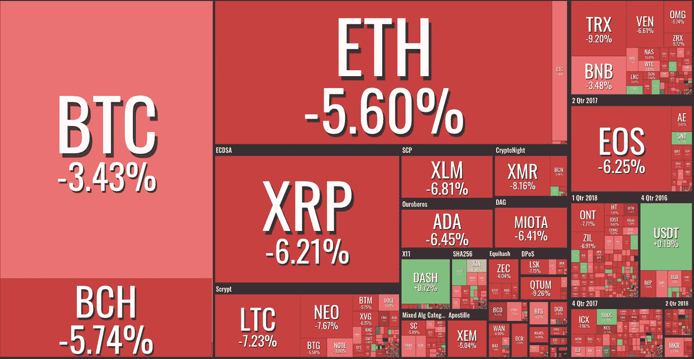
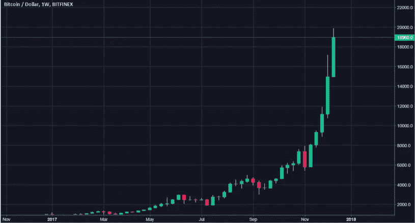
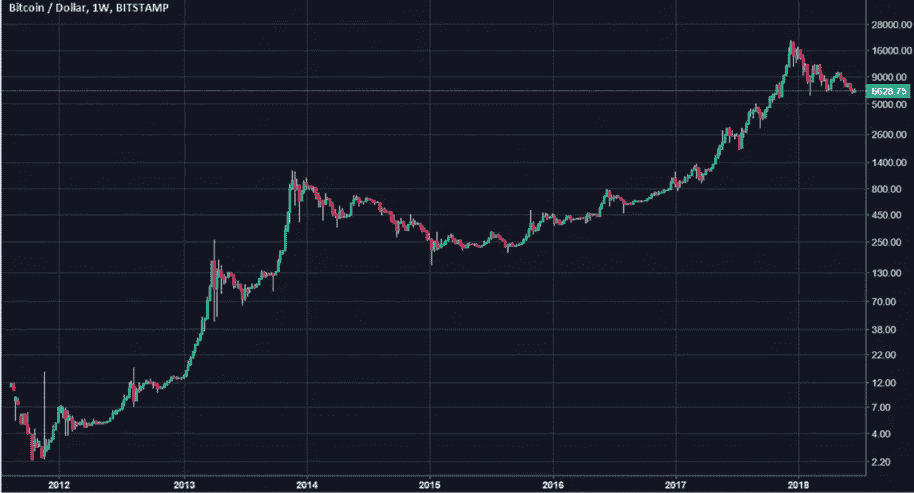
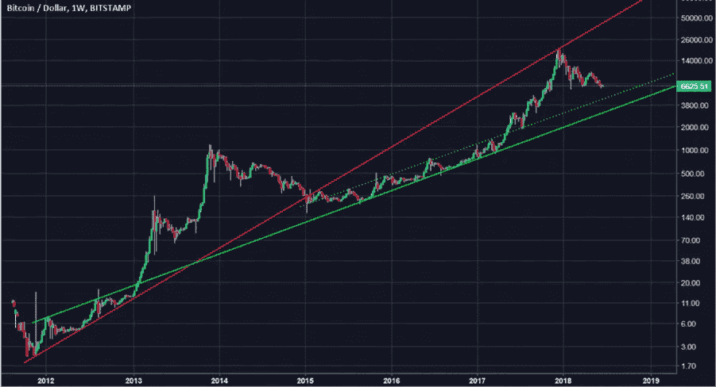

# 秘密大屠杀:为什么市场已经下跌了三次，接下来是什么？

> 原文：<https://medium.com/hackernoon/crypto-bloodbath-why-has-the-market-fallen-3-times-and-what-comes-next-6d466015901a>

*作者马克·奥布莱恩，*[*Crypterium*](http://crypterium.com)*前英国 Visa 首席执行官。*

*就在几天前，美国消费者新闻与商业频道“埋葬”了比特币。快钱主持人梅丽莎·李(Melissa Lee)想知道她是否还应该报道加密货币。断定答案是否定的，她* [*把程序献给了比特币的“葬礼”*](https://www.cnbc.com/video/2018/06/22/fast-moneys-bitcoin-funeral.html) *。这已经不是第一次给比特币和其他加密货币写墓志铭了，这种标题已经为***衍生了 300 多次。**

*让我们退一步，试着看看大局。我们是在见证另一场金字塔骗局的崩溃，还是像最乐观的加密爱好者预测的那样，比特币有可能在今年年底达到 6 万美元大关？神秘的“鲸鱼”是如何影响市场的？我来自传统的金融世界，我试图把事情放在正确的位置上，下面是我对今年加密货币的看法。*

# *第一部分。到底发生了什么？*

## ***大众媒体歇斯底里***

*自 2017 年年中以来，加密货币定价动态一直是大众媒体关注的焦点。还记得无数煽动性的[文章](https://www.nytimes.com/2018/01/13/style/bitcoin-millionaires.html)关于密码行业的少数赢家变得“富得流油”吗，或者关于青少年比特币百万富翁的[故事](https://www.theguardian.com/technology/2018/jun/13/meet-erik-finman-the-teenage-bitcoin-millionaire)吗？*

*大型媒体最初的怀疑很快变成了乐观:美国消费者新闻与商业频道甚至直播解释如何购买 crypto 以及如何使用它。每篇文章甚至标题都可能导致这种对错过机会的恐惧，不是吗？*

## ***心理学 101***

*在此背景下，许多新来者开始投资加密货币。在希望获得一些“轻松钱”的驱动下，缺乏经验的投资者涌入市场，推动了其资本化。*

*就在去年秋天，你可以去购买几乎任何一种流动性硬币或代币，然后期待一个抛物线式的增长。在 2017 年 7 月至 2018 年 1 月期间，总市值增长了近 10 倍，于 2017 年 12 月达到 [20 089 美元](https://coinmarketcap.com/currencies/bitcoin/historical-data/?start=20130428&end=20180627)。看看这个。*

**

*理智一点，你会买那个吗？当然不是。但那时候，你的观点可能会被大众的欢欣鼓舞所蒙蔽。*

*就连那些毫无用处、只是为了开个内部玩笑的代币，也在去年 12 月和今年 1 月实现了 10 倍的增长。一个很好的例子是一个被称为无用以太币的代币，它的资本[在 12 月 14 日到 1 月 14 日之间从 2 万美元增长到 35 万美元。](https://coinmarketcap.com/currencies/useless-ethereum-token/#charts)*

## ***市场周期和操纵***

*比特币期货市场让机构交易者进入了加密货币的世界。虽然这被广泛认为是好消息，但一些人也担心新工具将允许在官方监管的市场上卖空头寸，而不公开参与半合法资产比特币。*

*众所周知，比特币最终会开始下跌，但准确的时刻只有神秘的【鲸鱼】——那些积累了足够多比特币来影响市场的人——知道。他们是如何决定何时锁定利润的？我们有自己的假设——非常精确的假设——但是我们稍后会谈到它们。*

## ***监管争议***

*主要国家的监管机构已经讨论了一整年的加密技术，但很少有人能够对数字资产提出明确的观点。人们特别期待 SEC 的公告，但美国监管机构只是诉诸于对单独的密码相关项目采取措施，而没有提供明确的指导方针。*

*在 G20 峰会上，许多国家的代表讨论了该技术的可能用途，但他们对加密货币的总体态度充其量是中立的。*

*亚洲是世界上最大的加密货币市场之一，由于意外禁止 ico 和/或加密货币交易，加密市场几次陷入大屠杀。另一方面，该地区也包含国家对加密货币采取的最明确的监管措施的例子。2016 年，日本成为第一个[承认数字货币为货币](https://cointelegraph.com/news/japan-officially-recognizes-bitcoin-and-digital-currencies-as-money)的国家。*

# ***第二部分:现在发生了什么？***

*快速增长通常会导致快速下跌——这一规则适用于市场上的任何资产，尤其是那些没有真正理由升值的资产。比特币也不例外:当交易者愿意锁定他们的利润并创造新的市场周期时，市场修正就会发生。*

*这正是我们自今年年初以来所目睹的情况，因为加密货币的价值已经多次下跌。6 月 18 日，最低市值为[2353.31 亿美元](https://coinmarketcap.com/charts/)。*

*自 1 月份以来，交易员和投资者一直处于紧张状态，既定的定价动态已将缺乏耐心的人挤出市场。*

*所有交易所的交易量也在下降，这显然是一个负面因素。然而，我们没有看到隐藏的场外交易——据传这是大规模的。*

*ICO 热潮仍然强劲:在 2018 年的前 5 个月，ICO 总共筹集了 98 亿美元。越来越多的项目出现在市场上，但与此同时，用于资本化的资金却在减少。投资者的资金正在分散，主要是因为他们愿意通过快速交易从交易所上市的代币中赚钱。*

*至此，看完所有这些，你可能已经变得悲观了。不要只是现在。*

*尽管如此，我们仍然认为基本面市场情绪是积极的。中国国家主席[称](https://cointelegraph.com/news/chinas-president-xi-says-blockchain-part-of-new-technological-revolution)为[区块链](https://hackernoon.com/tagged/blockchain)技术有前途，而美国证券交易委员会主席[裁定](https://www.cnbc.com/2018/06/06/sec-chairman-clayton-says-agency-wont-change-definition-of-a-security.html)目前的区块链交易不属于安全交易，从而消除了市场的一个相当大的监管威胁。该市场即将成熟，因为许多大型项目的主网将于今年夏天推出。*

# *第三部分:下一步是什么？*

*试图预测一个最不稳定市场的未来绝非易事。尽管如此，我们还是有一些假设要和你分享。*

## ***消失的投资者***

*相对较晚入市(3k-5k 关口之后)的投资者，大部分都会被“洗出局”。当[比特币](https://hackernoon.com/tagged/bitcoin)达到 4k 大关时，[活跃地址](https://coinmetrics.io/charts/#assets=btc_roll=30_left=activeAddresses_zoom=1367366400000,1529884800000)数量暴涨超过 50%:3 个月 70 万到 110 万。价格大幅下跌后，这一数字降至 55 万——2016 年 10 月的水平。*

## ***更强 ico***

*2017 年出现的巨量 ico 将被重新评估。ICO 不再可能仅靠承诺生存:它还必须展示真实的产品和积极的动态才能生存。*

*2018-2019 年的新兴项目将通过提供相对完整的产品和深思熟虑的战略来设定更高的标准。竞争将变得更加激烈，因为许多项目将致力于解决同样的问题。就像互联网市场一样，这一次将消除所有的“抢钱”行为。许多项目将不复存在，所以是时候考虑你所持股票的基本价值了。问自己一个问题:这个令牌或服务会带来什么额外的价值？*

## ***比特币统治地位***

*比特币是并将继续是基础——如果你愿意，可以称之为加密之王。它是现存的唯一一种真正去中心化和无领导的加密货币。没有要逮捕的人，没有要关闭的公司，所以无法阻止。*

*用于保护比特币网络的散列能力是无与伦比的。为了控制 BTC 区块链，你必须拥有 51%的哈希拉特。能源的财务成本高于超车可以获得的金钱。*

*经常被引用的比特币速度慢、不够现代的观点也不成立。闪电网络带来了快速支付，根茎带来了智能合约，驱动链带来了侧链，MimbleWimble 和 Schnorr 签名带来了隐私。*

## ***精明的资金动向***

*现在最令人兴奋的问题是市值和找到锁定利润的点。下面，你可以看到 2012 年以来对数标度的 BTC 图。*

**

*您可以清楚地查看资产显著价格差异期间发生的所有趋势。现在，让我们添加几行代码:*

**

*图表很有意义，不是吗？两条线显示了自 2012 年以来的支撑位和阻力位。它们完全符合当前的定价动态。*

*图上每一个被线交叉的点都代表了“聪明的资金流动”,它定义了进一步的定价动态。这些点是给定时间跨度内支撑位和阻力位趋势的基础。*

*红线表示趋势在被打破之前是一个支撑位；此后一直是阻力位。如图所示，价格在 2017 年 12 月达到阻力位但无法突破(另一个“聪明的资金移动”点)，这是交易员开始锁定利润的信号。*

*从图表和市场现状来看，比特币的支撑位位于 3000 美元和 5000 美元关口(绿色实线和虚线)。*

## ***高级调节***

*监管问题将继续出现。它们很可能会在全球范围内受到审查，因为比特币现象同样关系到所有互联网接入国家。因此，我们可能会看到全球性的监管计划和解决方案，而不仅仅是地方性的。*

## ***基础设施协议***

*市值会逐渐向投资回报率更高的项目转移。分散式应用开发的 Dapp 平台已经失宠；基础设施协议代表了新的趋势，这是一种允许将不同类型的链结合在一起的专用软件环境。这种协议的一个例子是 Wanchain 与 ETH 和 BTC 的集成。*

## ***标记化***

*令牌比任何其他形式的数据存储都方便得多。甚至公司股份也可以通过安全令牌进行令牌化。进行 ISTO(初始证券代币发行)而不是 IPO 的平台已经在开发中。*

*这样一个市场在资本化方面可能会超过传统市场，因为它将完全受到监管，并能够定义股票交易的所有基本方面。本质上，公司股票将被数字化，而交易将保持不变。*

# *关于地下室*

*Crypterium 正在开发一个移动应用程序，它将把加密货币转换成你可以像使用现金一样轻松消费的货币。*

*在世界各地购物，在任何 NFC 终端用硬币和代币支付，或通过扫描二维码支付。在网上商店购物，支付您的账单，或者只是在几秒钟内可靠地跨境汇款，而且只需几分之一便士。*

*在[http://crypterium.com/](http://crypterium.com/)了解更多信息，并加入我们[电报聊天](http://t.me/crypterium)的讨论。*