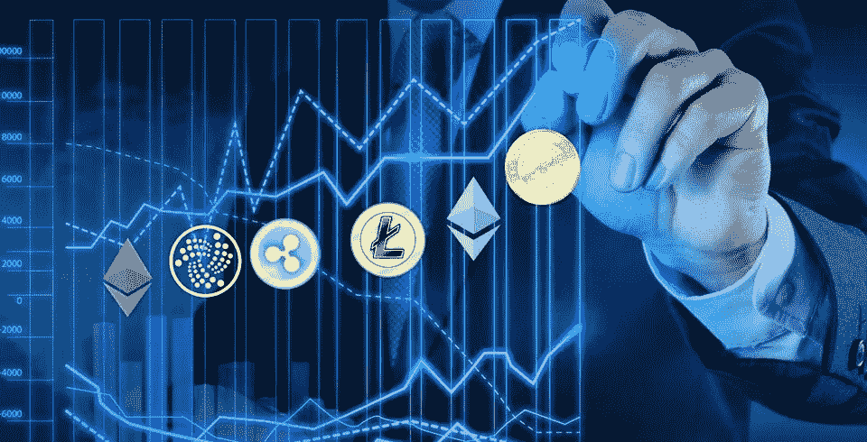

# 密码购买者需要从长计议

> 原文：<https://medium.com/hackernoon/crypto-buyers-need-to-take-the-long-view-1fe18c15a98c>

你是秘密投资者吗？也许你在 2017 年下半年，甚至是 2018 年初买入，希望围绕加密货币的热潮能够继续下去。不幸的是，对那些人来说，情况并非如此，甚至那些较早买入的人也会有所损失。

许多人认为市场的低迷是暂时的；一些市场观察人士表示，比特币将在 2018 年圣诞节前再次上涨，一些看涨者，如汤姆·李，预测比特币的价值将超过 20，000 美元。它没有发生，但这并不意味着它是比特币或其他密码的末日。现在的情况是，技术需要赶上对数字资产的热情，但技术仍然太新太复杂，大多数消费者认为风险太大。此外，还有一个不容忽视的问题，那就是大规模的采用。

那么， [crypto](https://hackernoon.com/tagged/crypto) 投资者应该做什么，或者在过去的一年里已经做了什么。一些人在坚持，等待牛市的回归，而另一些人则在寻找一个可以接受的退出市场的时机。

对于那些以前从未投资过股票、债券或证券的人来说，加密投资是一种教育。它为那些拥有几百或几千人的人提供了一个参与市场的机会，迄今为止，这个市场一直是为获得批准的投资者保留的；那些银行里有数百万和数十亿存款的人。然而，新手加密投资者可能没有意识到，所有的市场都是一个危险的地方，除非你做好功课，并有一定的“安全外套”。

如果你看看成熟的投资市场，它们都有一系列的规定，赋予投资者特定的所有权。相比之下，加密市场是一个未知的领域。监管机构已经采取了一些行动，制定了一套法规和指导方针，但这些法规和指导方针仍然是粗略的，司法系统尚未参与进来，以批准一些管辖区的法规。

出于这个原因，在政府及其立法机构批准之前，加密货币投资者几乎没有或根本没有任何权利。有些投资者希望一个密码的价格可以被抬高，这将是一个灾难性的举动，因为操纵将导致像 SEC 这样的监管机构认为代币是一种证券，如果是的话，那么发行代币的项目必须经过一个漫长而昂贵的过程才能将其注册为证券，至少在美国是这样。对于许多项目来说，这意味着终结。

购买 crypto 的人需要有耐心并从长远考虑，因为现在没有立竿见影的效果。正如约瑟夫·p·迪帕斯夸莱(Joseph P. DiPasquale)所写的那样:“如今，加密货币购买者比以往任何时候都更需要支持基本面强劲的项目:称职、有能力的领导层；满足路线图里程碑的跟踪记录；独特的技术目标和成就；广泛的潜在用户基础；和一个相关的未来愿景。”