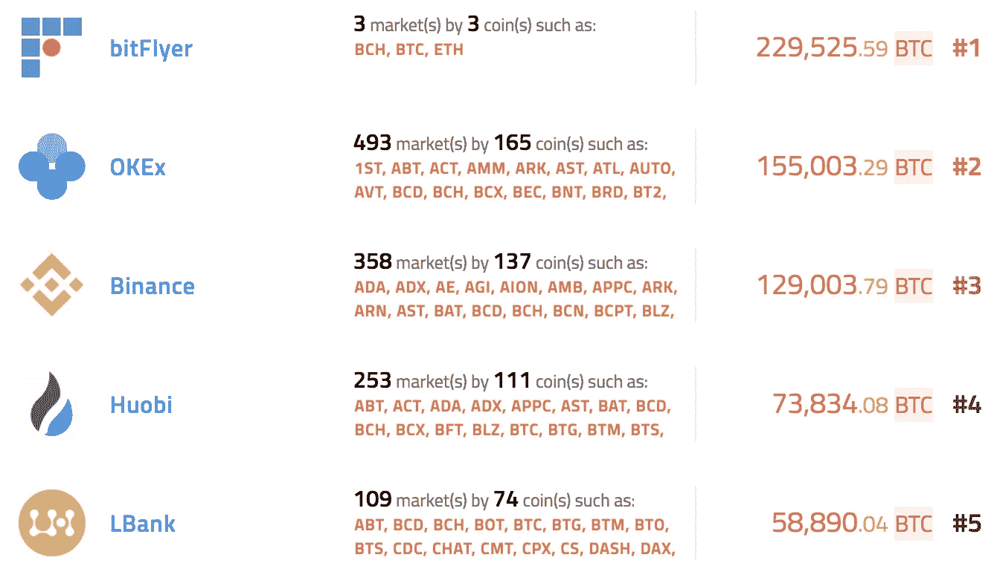
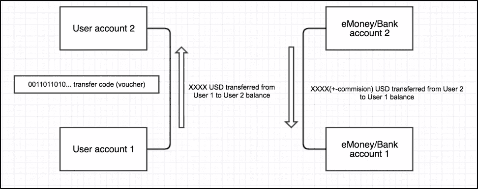
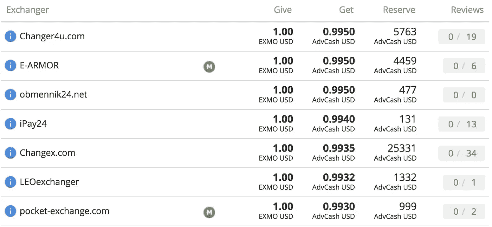

# 加密提现:凭借兑换凭证轻松获得您的资金

> 原文：<https://medium.com/hackernoon/crypto-cash-outs-get-your-money-nice-and-easy-by-virtue-of-exchange-vouchers-ed125741773a>

所有密码持有者——他们可能更愿意被称为霍德勒——在某个时候都需要出售他们的硬币或代币，以获得现金用于日常支出。对于那些直接参与区块链产业的人来说，套现甚至更加重要，因为他们经常收到定期付款或其他形式的加密收入。无论是“霍德勒”还是加密专家，他们的标准要求是以合适的价格并通过安全快速的程序按需兑现。

尽管第一个加密货币交易所出现在 2010 年[和 2012 年](https://ru.wikipedia.org/wiki/Mt.Gox)的知名 p2p 平台 localbitcoins.com，但不超过几分钟的快速套现问题在今天非常重要。为什么会这样呢？

**1。** **大多数顶级加密货币交易所没有法定货币对**

这看起来很疯狂，但事实是前 5 名的加密交易所中有 4 家根本没有菲亚特！其中只有一家——bit flyer——只有日元兑换选项:

Top 5 exchanges by volume from coinhills.com (snapshot taken 17/06/18)

如果我们进一步深入十大最重要的交易所列表，从 6 到 10 检查头寸，我们将发现只有一个——拥有一套法定货币(美元、欧元、英镑、日元)的 Bitfinex。最后，top-10 只有一个和美元交换！

当然，还有知名的北海巨妖、Bitstamp、GDAX 等。菲亚特交易对，但我们将在下一段谈到这一点。

**2。来自加密货币交易所的银行转账可能会变成一个大问题**

主要交易所的所有资金通常都是通过银行转账支付的，因此您的银行需要对来自加密货币交易所的转账保持友好，因为此类支付在合规性和反洗钱政策方面通常会被打上红色标记。因此，在真正有机会使用你的钱之前，你应该首先找到一家友好的银行，然后等待一段时间来提取这笔钱(通常需要 3-5 天),最后支付所有应付的税款。这是为你的日常杂货或汽油获得现金的简单方法吗？不太可能，尤其是少量的。

**3。Localbitcoins 等 p2p 服务怎么样？既不快速，也不灵活**

本地比特币和其他 p2p 服务的主要问题与以下内容有关:

a)您需要等待长达 1 小时(甚至更长时间！)用于接收固定付款

b)付款方式通常不方便:礼品卡或银行转账

c)您需要接受所列订单的价格(可能低于全球交易所的市场价格),或者自己设定价格，然后等待更长时间！

当然，Localbitcoins 是比特币买卖的传奇服务，但它绝对不属于“快速舒适”的范畴。

**那么，快速轻松套现的解决方案是什么呢？**

这个解决方案的建立出乎意料，它实际上是传统电子货币的交换余额要求(凭证或代码)和系统的权利捆绑。似乎太复杂了？让我解释一下。

想象一下，有一个交易所，你可以在那里以美元出售你的比特币和其他主要密码，同时允许你点击一下就可以将任何数量的美元转移到这个交易所内的另一个账户。因此，另一个用户可以在交易所外通过某种支付方式向你付款，从而在交易所内获得美元金额。这可以通过发行唯一的代码(或凭证)来实现，该代码一旦被激活就转移余额。它基本上是这样工作的:

Scheme of funds flow. Left part is related to internal funds flow between uses accounts on exchange. Right part is related to internal eMoney or Bank transaction

谁有兴趣购买已经存入加密交易所的美元？个人，他们需要购买密码以及与各种电子货币系统、大银行、加密货币甚至礼品卡配合使用的数字互联网交易所。他们购买美元余额来为他们的业务购买密码，或者向需要向交易所存款的客户出售美元余额。通过这样做，他们直接连接到来自客户的现金和客户进入加密空间的资金流。

显然，制作基于集中兑换的美元转账凭证是在交易所内立即转让 BTC“索赔权”的解决方案。但是法定货币的转移有多快多容易呢？很简单——使用电子货币系统或内部银行转账。

**为什么使用电子货币支付系统很舒服？**

多年的经验证明，电子货币系统是不超过
10，000 美元的中小额转账的最佳选择。这种操作被缩小到电子支付服务内部的资金转移，因此可以立即完成，看起来更像是从一个账户到另一个账户的普通资金转移。与电汇相比，它速度快，历史不长。

最受欢迎并且可能是最好的电子货币服务是 Payeer、Advcash、Neteller 以及本地品牌，例如在俄罗斯和独联体，现在有两个正在流行的电子货币服务— QIWI 和 Yandex.Money。一个重要的优势是，在这样的系统中可以发行一个帐户绑定的塑料卡，因此在收到付款后，可以立即在商店等处消费。

**如何找到支持凭证(代码)和数字互联网交换的密码交换？**

首先，要慎重选择合作的交易所。有几个交易所有一个代码(凭证)系统:EXMO，WEX，LiveCoin，Btc-Alpha(如果你知道一些其他的——请在评论中输入一些信息！).

然而，对于特定兑现算法的成功操作，仅仅具有发布与账户余额相关的代码的技术能力是不够的。代码创建完成后，就到了最后一个阶段——找到一个互联网交换点和机会，以舒适的模式从那里接收付款。这可以通过不同的 exchange 集成商完成，如 Okchanger 或 Bestchange。使用此服务，有可能找到法定货币兑换代码的方向，例如:

Typical list of digital exchanges from Okchanger service

找到一个方便的兑换方向后，只需在所选的电子支付或银行系统内发布代码并兑换成菲亚特即可。通常，整个操作不超过几分钟。

**结束语**

借助于与电子货币系统和数字互联网交换捆绑的凭证发行系统的交换，有一种快速和安全的加密兑现的好方法。这种方法的工作原理是两个独立的容器同时用于提取现金和输入密码。基本上，有两个交易所提供代码，这些代码在市场上是流动的，可以通过其中一个电子货币系统支付快速出售。

*有你自己的想法就容易加密兑现？请在此留下您的评论！*

T *感谢读者。如果你觉得这些内容很有价值，请花点时间鼓掌，然后在 Medium 上跟我来。所有信息仅用于教育目的，并非法律或财务建议*