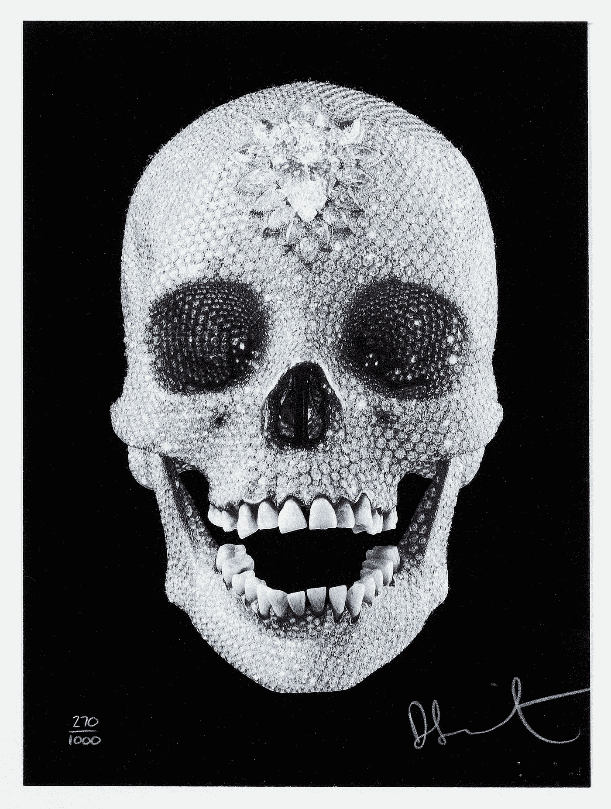
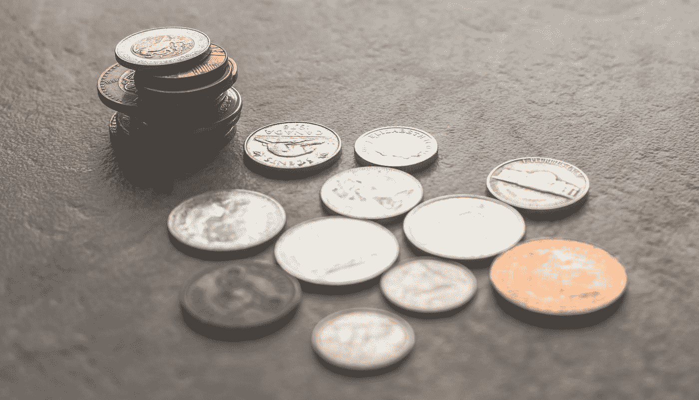

# 加密分类:安全与商品

> 原文：<https://medium.com/hackernoon/crypto-classification-security-vs-commodity-decf2d78c4a1>

关于如何对加密资产进行分类以及它属于哪个监管机构，加密市场一直在进行一场大辩论。加密资产是证券，因此受 SEC 监管，还是商品，因此受 CFTC 监管？2017 年，市场上许多人开始宣布实用令牌的想法，并将其与安全令牌区分开来。广义而言，安全令牌代表金融证券的令牌化版本。你可以把作为令牌化资产的房地产或股票想象成一种证券令牌。因此，公用令牌是用于为区块链网络供电的令牌。许多协议币和令牌使用实用令牌在其网络上进行交易。一个例子可能是基本注意力令牌(BAT ),它与 Brave web 浏览器一起使用，将注意力货币化。

Photo by [Luca Bravo](https://unsplash.com/@lucabravo?utm_source=medium&utm_medium=referral) on [Unsplash](https://unsplash.com?utm_source=medium&utm_medium=referral)

## 豪威试验

用来判断某样东西是否安全的基本框架被称为豪威测试。豪威测试指的是 SEC 诉 W.J .豪威公司的一个[法庭案件](https://en.wikipedia.org/wiki/SEC_v._W._J._Howey_Co.)。它包括 3 个问题:

1.  是对未来利润的预期的金钱投资吗？
2.  钱的投入是一般企业吗？
3.  有利润是来自于某个推广者或者第三方的努力吗？

证券给一个共同的企业带来回报，我认为这个企业可以被称为一个中心组织。法律的精神是捕捉一个协议，“我会给你一些钱，作为企业产生的潜在利润的一个百分比。”企业资本结构中的所有权，无论是股权还是债务。

大多数加密实用程序令牌不会出现这种情况。加密代币不会产生回报，然后由所有者通过股息或股票回购进行分配。尽管有些代币确实会分割费用带来的回报。大多数对未来回报的预期是由供给和需求的稀缺性产生的。可能存在利润预期，但这正是棘手之处。

## 考虑因素—类似的模拟资产

人们带着这种回报预期购买大量资产。其中大部分都围绕着资产的稀缺性，在供需紧张的市场中发挥作用。巧合的是，这也是大多数参与者期望用他们的加密资产产生利润的方式。一些例子包括:

*   音乐会门票
*   钱币
*   贵重金属
*   收藏品
*   稀有艺术品

这些财产或资产都不被视为证券。

## 商品——看“什么”

商品是可以在交易所买卖的货物、财产或资产。它们通常是原材料或农产品。商品不会从普通企业中产生回报。它们是被开采或种植的商品或财产，其价值是基于市场供求的内在价值。这是商品和证券的区别。

Photo by [Andre Francois](https://unsplash.com/@silverhousehd?utm_source=medium&utm_medium=referral) on [Unsplash](https://unsplash.com?utm_source=medium&utm_medium=referral)

## 加密资产——是“什么”和“如何”？

如果你只是评估一种功能性的加密资产，比如加密货币或公用事业令牌，它通常会被归类为商品。问题在于 cryptoasset 项目是如何产生的。更多的是关于“如何”而不是“什么”。

如果加密资产是通过首次硬币发行(ICO)或代币产生的事件(TGE)产生的，在工作网络或产品尚未存在之前，该发行是一种预先换取金钱的代币，并且投资者期望获得回报，那么就有问题了。属于这一类别的任何东西都很可能被归类为证券，并且必须遵守证券法。

我喜欢把风险看作一个连续体。作为一名企业家或投资者，评估你的项目或加密资产在这个连续体中的位置非常重要。我使用了一组考虑因素。

Photo by [Steve Johnson](https://unsplash.com/@steve_j?utm_source=medium&utm_medium=referral) on [Unsplash](https://unsplash.com?utm_source=medium&utm_medium=referral)

## 要考虑的 7 个因素

以下是我评估任何特定加密资产的监管风险时要考虑的 7 个因素:

1.  它是硬币还是代币？
2.  如果是硬币，可以开采吗？
3.  如果投币，是去中心化吗？
4.  它在生产中发挥作用了吗？
5.  有 ICO/TGE 吗？
6.  它在美国是公开出售还是私下出售？
7.  如果在美国上市，是否完成了 KYC/反洗钱？

好吧，让我们评估一下这些问题的答案，看看我们在监管风险的连续体中处于什么位置。风险最小的加密资产是运行在一个正常运转的分散区块链网络上的可开采硬币。一般来说，硬币的风险比代币略低。这是因为它运行自己的区块链和网络。如果硬币是可开采的，它与人们在 ICO(或其他方式)中购买它的经济情况不同，因为在这种情况下，矿工因工作而获得硬币。当美国证券交易委员会宣布比特币不是一种证券时，这个概念就出现了。这使得它比预先开采的硬币风险更小。如果项目是分散的，风险会小得多，因为可以说它不是一个普通的企业。这个概念来自于[证券交易委员会关于“足够分散”的论点](https://www.sec.gov/news/speech/speech-hinman-061418)。

如果一枚硬币是预先开采和集中的，它是最危险的硬币类型。它被归类为证券的监管风险很大。(我想到了一个特别的硬币。)

现在，如果它是代币而不是硬币，那么第一个问题是——它的网络功能正常吗？如果令牌具有正常工作的网络、协议、实用程序或产品，那么风险就较小。当 [SEC 宣布 Etheruem 不是一种安全](https://markets.businessinsider.com/currencies/news/ethereum-not-a-security-what-it-means-for-ico-coin-offerings-cryptocurrencies-blockchain-bitcoin-2018-6-1027123435)时，这个概念就出现了。如果它目前没有发挥作用，那么它将承担更大的监管风险。

最后一组问题围绕着加密资产是如何产生的。有 ICO 吗？如果是这样，风险就更大了。如果它是空投的，或者以另一种方式出现，那么风险会小一些。如果在美国有公开出售，那么它比私下出售风险更大。如果公开销售没有进行 KYC/反洗钱，那么风险要比进行了更大。如果您有一个做了 ICO 的令牌，但它当前没有运行，并且您在美国做了一个没有反洗钱/KYC 的公共 ICO，那么您的监管风险最大，您很可能必须以某种方式与 SEC 打交道。

我希望这有助于你作为企业家或投资者评估你的加密资产的监管风险。美国证券交易委员会正在追捕坏人，而不是试图做正确事情的人。如果你是风险最小的一方，我不会太担心。如果你处于风险最大的一边，那么就有工作要做。当然，这是我的观点，不代表财务建议。

狩猎愉快，

上等的

*免责声明:以上仅代表一种观点，仅供参考。它无意成为投资建议。请自己做作业。*

[***杰克瑞安***](/@jake_ryan) ***是加密对冲基金 Tradecraft Capital 的创始人/ GP。他还是一名创业顾问、天使投资人和投资作家。如果你喜欢这篇文章，请“鼓掌”帮助别人找到它！欲知详情，敬请关注*** [***【脸书】***](https://www.facebook.com/WealthRituals/)*[***推特******。***](https://twitter.com/TradecraftJake)*

*# crypto #加密货币#比特币#投资#区块链#贸易*