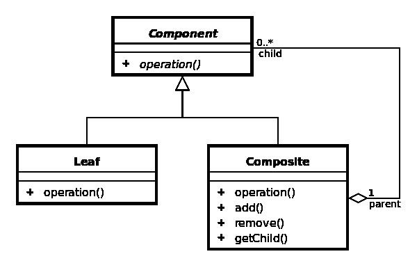

# 加密组件 ERC-998 —更新 4:“命名”

> 原文：<https://medium.com/hackernoon/crypto-composables-erc-998-update-4-the-namening-7a05d28f3401>

## 回顾第二次电话会议:大量讨论、工作进展报告、组织掌控力等


What’s in a name? Corny enough for you? 🤣 [Pexels](https://www.pexels.com/photo/beautiful-bloom-blooming-blossom-442189/)

## 背景和概述(如果您在 998 鞭中，请跳过):

[](/coinmonks/introducing-crypto-composables-ee5701fde217) [## 介绍加密组件

### 自从比特币问世以来，我们已经有了一个可证明的分散数字稀缺模型，可用于替代资产…

medium.com](/coinmonks/introducing-crypto-composables-ee5701fde217) [](/coinmonks/crypto-composables-erc-998-update-1cc437c13664) [## 加密组件 ERC-998 更新😊

### 24 天前，我在 Github 和本帖中提出了以太坊的 ERC-998 可组合不可替换令牌标准。的…

medium.com](/coinmonks/crypto-composables-erc-998-update-1cc437c13664) [](/coinmonks/crypto-composables-erc-998-update-2-4b160df79836) [## 加密组件 ERC-998 更新#2

### 哇！我在纽约！共识 2018 正在进行，我不在😂。

medium.com](/coinmonks/crypto-composables-erc-998-update-2-4b160df79836) [](/@mattdlockyer/crypto-composables-erc-998-update-3-first-contact-f3930a08636) [## 加密组件 ERC-998-更新 3:第一次接触

### 我将谈论建立“NFTy 魔术师”社区，在第一次“Composables Call”中讨论了什么，以及一些…

medium.com](/@mattdlockyer/crypto-composables-erc-998-update-3-first-contact-f3930a08636) 

# 命名

为什么“[命名为](https://hackernoon.com/tagged/namening)”？🤔随着我们越来越接近 ERC-998 [可组合](https://hackernoon.com/tagged/composable)不可替换令牌(CNFTs)的标准接口，记住不可替换令牌(NFT)的标准扩展将服务的抽象和通用目的是很重要的。

正如我在过去的更新中提到的，一些项目已经在以太坊上尝试某种形式的合成。作为一个社区，我们的目的是汇聚一个服务于大多数项目和用例的接口，并保持开放以供扩展。命名函数、变量、注释和示例实现代码是其中很大的一部分。我们希望尽快确定我们的命名并达成共识，但是这需要时间。

我将在下面概括本次电话会议的主要内容，但首先要感谢电话会议中所有人的想法、精力和热情。我们将开发一个奇妙而灵活的界面，以满足以太坊(甚至其他连锁店)上大多数项目的需求。我相信我们有能力共同努力实现这一目标，并加快分散式应用程序开发的步伐。🤗

# 🧙 NFTy 魔术师摇滚！

特别感谢尼克“固体/气体”穆奇又名[娜塔莉-ckc](https://medium.com/u/ca7b1065d06a#composables)</li><li id=)

*   [尼克·穆奇](https://medium.com/u/ca7b1065d06a#composables)</li><li id=)*   [无限轴(很晚才加入)](https://medium.com/u/ca7b1065d06a#composables)</li><li id=)

# [议程](https://medium.com/u/ca7b1065d06a#composables)</li><li id=)

*   [Nick Mudge 通用函数，如可组合组件上的 tokenTransaction，用于调用子契约中的任何可用函数；](https://medium.com/u/ca7b1065d06a#composables)</li><li id=)
*   [Matt:我想让 Nick Mudge 提出他对深度嵌套令牌的建议，我认为有一个解决方案的可能性，CNFT 中的子树操作？；](https://medium.com/u/ca7b1065d06a#composables)</li><li id=)
*   [命名法:NFTs ->父/子；财务交易->余额；共识？；](https://medium.com/u/ca7b1065d06a#composables)</li><li id=)
*   [尼克·穆奇和我认为 ERC-20 余额和子代币的命名需要进一步讨论；](https://medium.com/u/ca7b1065d06a#composables)</li><li id=)
*   [尼克·穆奇和我认为 ERC-20 余额和子代币的命名需要进一步讨论；](https://medium.com/u/ca7b1065d06a#composables)</li><li id=)
*   [Nathalie:在哪里跟踪 ERC-998 代码任务的待办事项/待办事项&谁在处理它们&围绕它们的讨论？在 Github 问题上？；](https://medium.com/u/ca7b1065d06a#composables)</li><li id=)
*   [简要回顾:NFT 从 CNFT 离职后，会有什么样的回调或事件发生？回调；](https://medium.com/u/ca7b1065d06a#composables)</li><li id=)
*   [总结:需要批准其他合同添加到 CNFT 从 CNFT 删除。](https://medium.com/u/ca7b1065d06a#composables)</li><li id=)
*   [回顾:需要哪些标准事件？是的。有人要吗？；](https://medium.com/u/ca7b1065d06a#composables)</li><li id=)
*   [总结:继续探索与可组合注册中心互操作的方法；](https://medium.com/u/ca7b1065d06a#composables)</li><li id=)

# [“拆包”](https://medium.com/u/ca7b1065d06a#composables)</li><li id=)

[Nick 立即介绍了两种处理子树可组合子函数和管理的新方法。](https://medium.com/u/ca7b1065d06a#composables)</li><li id=)

1.  [一个`tokenTransaction`函数，作为调用子契约上任何函数的替换“调用”函数](https://medium.com/u/ca7b1065d06a#composables)</li><li id=)
2.  [一个递归查找函数，用于确定可组合函数调用事务的发送方是否实际上是根所有者。](https://medium.com/u/ca7b1065d06a#composables)</li><li id=)

[🚨几个小时后，尼克解释说`tokenTransaction`需要更多的研究，而且可能不安全。他决定暂时放弃这个方向，但是如果有人能够在保证安全的同时开发这种类似代理的行为，它仍然对社区开放。](https://medium.com/u/ca7b1065d06a#composables)</li><li id=)

[Nick 的递归查找函数已经在一个粗略的草稿中实现，看起来像这样:](https://medium.com/u/ca7b1065d06a#composables)</li><li id=)

```
function isApprovedOrOwnerOf(address _sender, address childContract, uint256 _childTokenId) public view returns (bool) {uint256 tokenId = ownerOfChild(childContract,_childTokenId);
    if(super.isApprovedOrOwner(_sender, tokenId)) {
      return true;
    }
    address ownerUpOneLevel = ownerOf(tokenId);
    return ERC998PossessERC721(ownerUpOneLevel).isApprovedOrOwnerOf(_sender, this, tokenId);
  }
```

[我们在这里所做的基本上是检查`_sender`是否是父令牌的所有者，以便转移或调用子令牌上的函数。如果不是，那么我们将从作为父令牌所有者的契约中调用这个完全相同的函数，再次询问`isApprovedOrOwnerOf`。递归在常规编程中不是一件容易的事情，尤其是当你考虑存储和汽油成本时。谢天谢地，像这样的函数调用只花费了 2000 个气体单位。尼克现在已经成功了，我很高兴能支持他的努力。](https://medium.com/u/ca7b1065d06a#composables)</li><li id=)

## [你想要一张图表吗？](https://medium.com/u/ca7b1065d06a#composables)</li><li id=)

[当讨论所有复杂的令牌转移到其他令牌、不同的子树的方式时，我开始看到一个模式。我们需要一些我们都同意的指导图来通知这些电话。我已经决定接手这项工作，希望能尽快完成。这可能会形成一个更详细的帖子，涵盖链上复合设计模式。在保持问题的本质抽象的同时，图表将有助于引导大量的讨论，因为它们在视觉上消除了模糊性，并允许每个人更清楚地看到相同的概念。](https://medium.com/u/ca7b1065d06a#composables)</li><li id=)

[这在电话 1 中帮助很大:](https://medium.com/u/ca7b1065d06a#composables)</li><li id=)

[](https://medium.com/u/ca7b1065d06a#composables)</li><li id=)

[The Composite Pattern from Java design patterns and Wikipedia](https://medium.com/u/ca7b1065d06a#composables)</li><li id=)

## [**命名法又名命名法**](https://medium.com/u/ca7b1065d06a#composables)</li><li id=)

[抓住你了。😁如果你期待重大新闻，那就没有了。](https://medium.com/u/ca7b1065d06a#composables)</li><li id=)

[在这次通话中，我们没有就与命名相关的任何令人兴奋的事情达成共识。然而，提出了一些强有力的想法。即在我们的标准中使用标准的名称。看起来大概是这样的:](https://medium.com/u/ca7b1065d06a#composables)</li><li id=)

```
function transferERCOf(address to, string ERCStandard) public;
```

[作为上一次通话的总结，我们都同意使用 parent，child 作为拥有其他 NFT 的 NFT 的命名约定，但是当 NFT 拥有 ERC-20 合约的余额时，这种情况就会发生变化。由于 ERC-998 的多重继承，我们还会遇到名称冲突，因为 NFT 和 FT 扩展可以同时被继承。这造成了更多的麻烦，因为命名应该是一致的，但不能冲突。细微的差别是肯定的，但如果我们不能正确地命名，这可能会特别令人沮丧。](https://medium.com/u/ca7b1065d06a#composables)</li><li id=)

## [事件](https://medium.com/u/ca7b1065d06a#composables)</li><li id=)

[Maciej Górski](https://medium.com/u/47f89b402c63?source=post_page-----7a05d28f3401--------------------------------) 对所有可能用 Composables 触发的独特事件做了一个很好的总结。事情是这样的:

*   NFT 转投 CNFT
*   NFT 从 CNFT 转到 EOA(钱包)
*   NFT 从 CNFT 转到 CNFT
*   …

我相信在一个案例中有 3 个，在另一个案例中有 7 个。他在 ERC 遇到了一些限制，需要更多的时间。我会就此事与他私下沟通，并更新帖子。

## 回调还是 Callblock？

基于特定条件返回 true 或 false(布尔值)的回调函数可用于限制子 NFT 的传输。这允许在游戏角色身上施放不能通过移出法术 NFT 移除的法术。

我们都赞成支持限制令牌可转让性的回调。现在，设计好“粘性”令牌的责任落在了分散的应用程序制造商身上。让我们看看结果如何😂

# 代理可组合令牌？可升级合同？

最后一个建议是我自己的想法，我想让社区仔细考虑一下，看看这是否值得探索。考虑到已经存在如此多的 NFT，并且 ERC-998 是 ERC-721 标准的扩展；用同样标准的新功能对其进行补充...为什么不让“根”CNFT 作为现有 NFT 的代理呢？存在添加映射的问题，但是对于所有这些新功能，每个升级的 NFT 令牌 1 次存储操作值得吗？

反应相当积极。虽然有人担心旧令牌会丧失功能，但我觉得这可能行得通。相关工作可以在 Bitclave 团队的可升级合同中找到。

# WIP 实施

我们有一个工作的回购…暂时的😆

[](https://github.com/mattlockyer/composables-998) [## mattlockyer/composables-998

### composables-998 -一个为以太坊开发 ERC-998 标准的实现和文档报告。

github.com](https://github.com/mattlockyer/composables-998) 

轻点，是 WIP。有些时候，测试可能会由于一些大规模的界面检修而失败。对于早期项目来说，这是正常的成长烦恼。

## 😉眨眼眨眼😉

对于你正在考虑参与的新项目和回购，一个很好的方法是帮助解决一些小问题，比如可能被破坏的测试用例，编写新的测试和增加覆盖率。我们将非常感谢你们的支持！🤗

## 组织掌控

我要再次感谢 Nathalie 的建议，她建议我们讨论如何在 WIP 上工作以及如何处理 Todos 之类的事情。我们已经决定现在继续使用不和谐的聊天和 GitHub 的问题，我们的“接近代码”的任务。谢谢你娜塔莉。

😃额外的是，她还从通话记录中惊人地详细记录了可以在这里找到的。

# 包扎

哇，更新太多了！感谢您关注 ERC-998 的最新消息。社区正在发展，工作正在进行中。我们希望在不久的将来为以太坊社区提供一个有价值的资源。构成令牌的标准接口。

我叫马特·洛克尔。我没有工作，没有关系，也没有代币要卖🤣我喜欢这么说。我启动了 ERC-998，因为我看到了需要支持这一功能的项目浪潮，并希望社区共同努力来做好它。我不是可组合先生或 ERC 先生-998。我不是领导；只有主持人。我在这里为社区工作，综合我杰出的同事们的想法、设计和知识。

我们是 NFTy 魔术师🧙 [加入我们的不和谐](https://discord.gg/XcQh7nP)

感谢支持 OSS 和开放标准！

[medium.com/@mattdlockyer](/@mattdlockyer)
twitter.com/mattdlockyerT5[linkedin.com/in/mattlockyer](https://linkedin.com/in/mattlockyer)