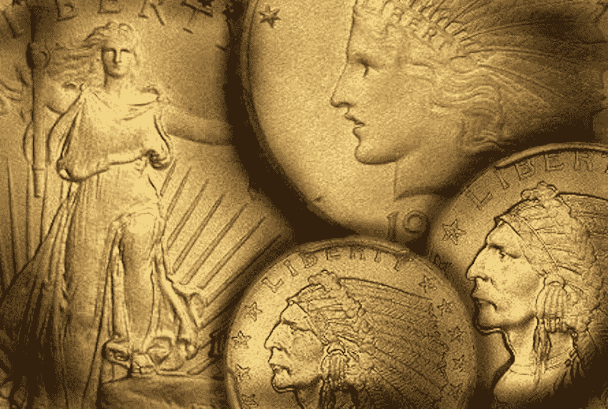
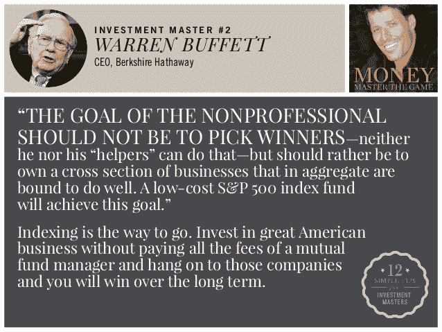
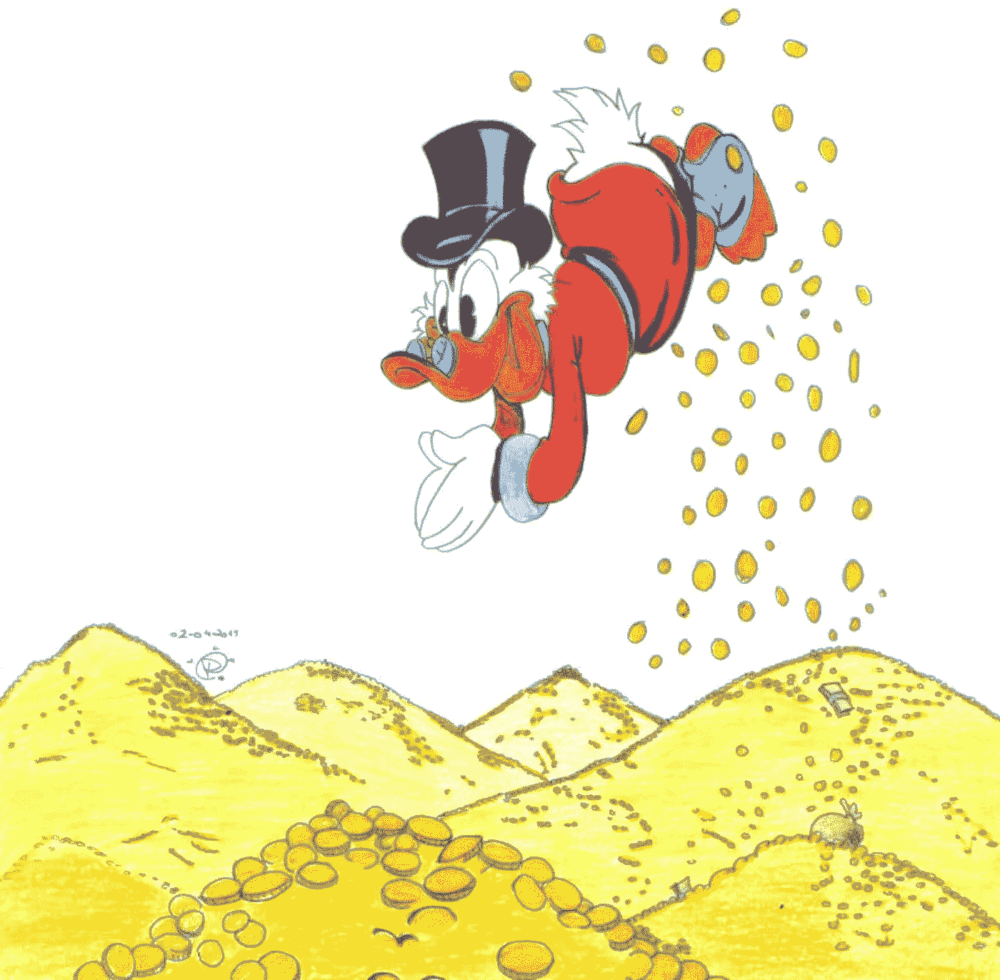
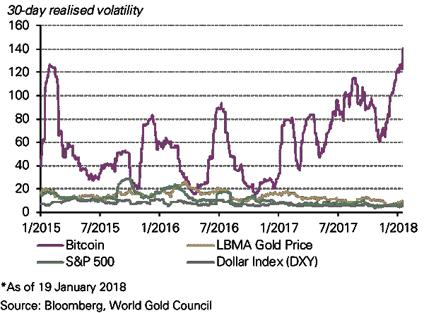
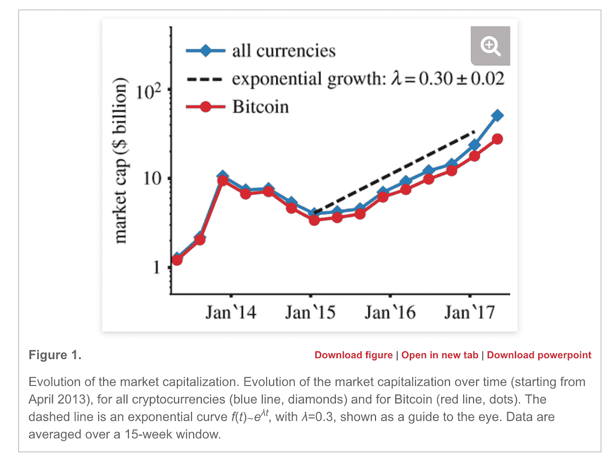
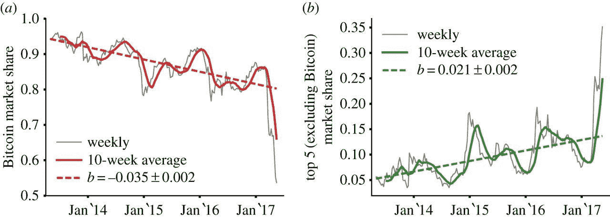
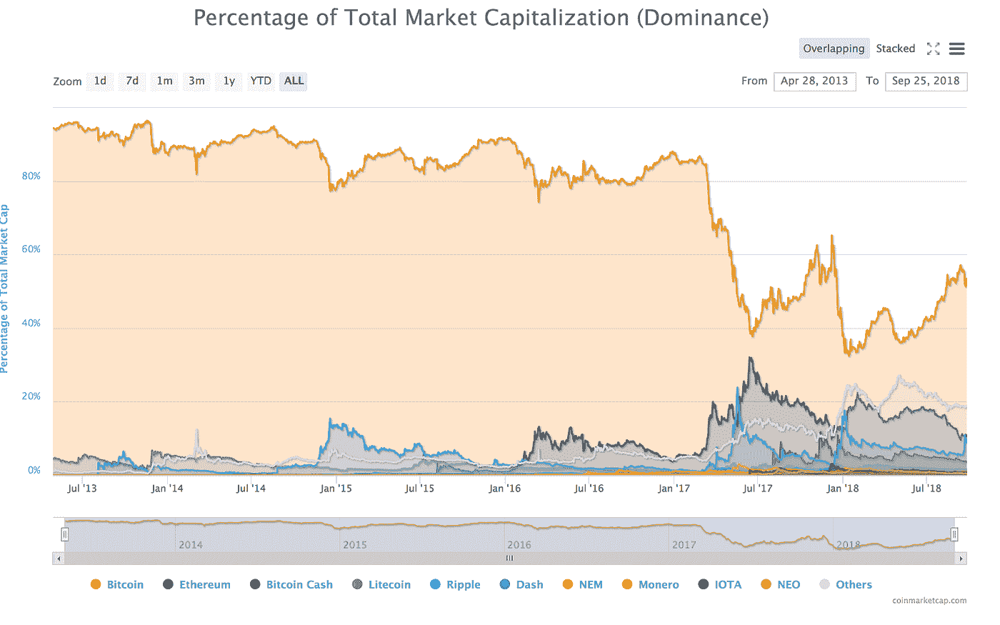
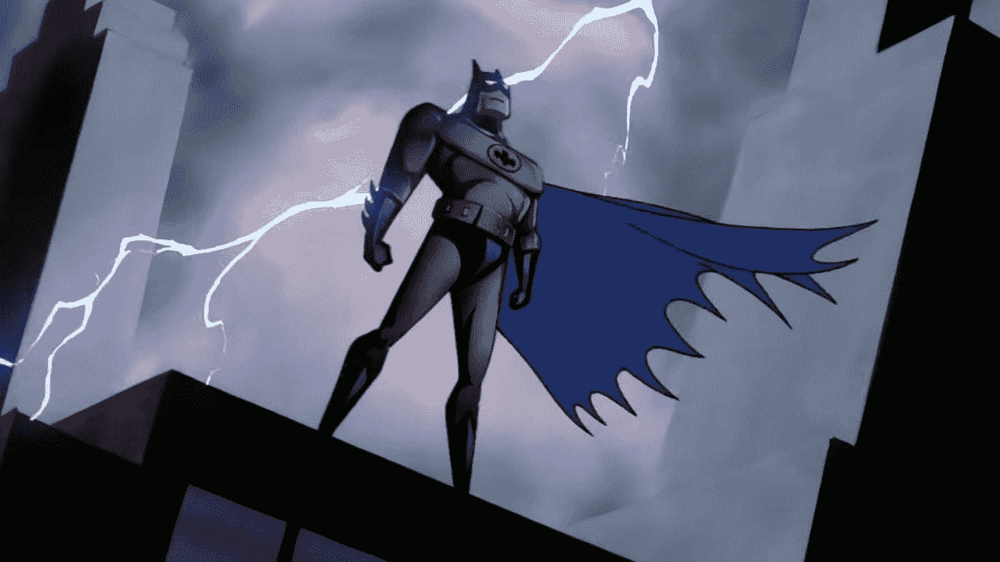

# 密码保守主义者:投资于勇敢新世界的旧时代

> 原文：<https://medium.com/hackernoon/crypto-conservative-old-time-investing-in-a-brave-new-world-3d2f604d4787>

[Source: Aurica Assets, Numismatic Coins](http://auricassets.com/wp-content/uploads/2017/02/gold-img.jpg)

加密是投资界的蛮荒之地。在硅谷和华尔街相遇的地方，黑手党头目和痴迷于快照的一代人都走到了一起。密码已经成为一种资产类别，由(自称的)密码狂热者和对风险有巨大胃口的投资者炫耀，他们盲目相信另一种未来。

> 多样化背后的关键思想是增加对不同资产类别的投资，最好是不相关的。

另一方面， D 多元化是为抵消风险而部署的战略。分散投资的黄金时间化身是指数基金——它允许投资于整个市场，分散在顶级基金的股票中——并提供抵御个股波动的弹性。多元化背后的关键理念是增加对不同资产类别和情景的敞口，最好是*不相关*的，例如，不要同时投资钢铁和汽车，同时投资石油和清洁能源，以押注竞争结果，等等。几个错误的选择不会让你的净值化为乌有，而且你已经降低了在不同市场中获胜的风险。这个想法很简单，但却很合理，以至于像沃伦·巴菲特和托尼·罗宾斯这样的人都是直言不讳的拥护者。

Source: Money Master the Game by Tony Robbins

# 如果有一种方法可以将现代货币的狂野西部和投资大师的保守实用主义结合起来，会怎么样？

当 rypto 成为主流时，它取得了巨大的胜利。当它被从内曼·马库斯到当地报摊的所有人接受时。是的，我说密码和报纸相提并论。在技术和监管之外，其中一个障碍是空间的相对昏暗——大众传统上将钱视为硬币和纸币，最好是成堆的，便于涉水。

Illustration by [lobosolitario1983](https://www.deviantart.com/lobosolitario1983)

金钱的概念从可移动的实体转变为通过复杂、模糊的数字分类账和采矿业务网络流动的比特和字节流，公众对此持怀疑态度，只有毒贩和骗子才会持这种态度。鉴于该领域的巨大波动性，这并非完全没有根据。

> **全面投资密码市场的障碍很高。**

除了加密市场的内在风险和不断重新划分——每天有数百种新货币出现和消亡，投资数字货币也在一定程度上受到较小货币与某些较大货币(如比特币)的紧密耦合的阻碍。例如，如果不先购买比特币，你就无法将美元兑换成 Stellar 等排名前十的硬币。完全投资于加密市场的障碍很高——需要间接的水平和技术专长。也就是说，这一领域正在迅速发展，不仅是货币的大量流入和流出，也包括使进入这一领域民主化的工具。工具带来了几十年的金融投资和投资组合优化的专业知识。

> 完全托管就像是让基金经理管理你的财富，而无需将你的资产交给他们。

一个这样的工具是[余烬基金](https://emberfund.app.link/medium-Crypto-Conservative-Old-time-Investing)。Ember 基金是由一群广告技术老手在威尼斯海滩的一个孵化器里运作的。它采用了非常简单的多样化思想，并将其应用于加密。希望驯服一些我们去年 12 月看到的疯狂的山峰和山谷。它的力量在于简单性——它作为一个 iPhone 应用程序存在，并授予用户对其资产的完全监护权——这相当于使用基金经理来管理你的财富——而无需将你的资产交给他们。

# 为什么要分散您的加密投资组合？

准将·巴克西叔叔于 2014 年从军队退役，现在热衷于投资股票。他像老鹰一样追踪他的投资，使用最先进的工具。他最近的问题是，“*我应该投资比特币吗？嗡嗡声是真的吗？*”。

> 很容易迷失在比特币的传奇中，错过引擎盖下发生的真正创新。

比特币吸引了数百万人的关注。像大多数引人注目的故事一样，它吸引人的地方在于引人注目地抢走了聚光灯。像大多数引人入胜的故事一样，它带有一种虚构的气氛。只不过这不是故事，也不是虚构的。人们很容易迷失在比特币的传奇中，它的沧桑，错过了引擎盖下发生的创新。区块链技术不可逆转地扰乱现状的真正潜力，以一种跨行业而不局限于金融的方式。

> 比特币加密的比例已经下降，尽管它本身的内在净增长。

对更大的生态系统的研究表明，加密正在呈指数级增长。

Source: [Evolutionary dynamics of the cryptocurrency market](http://rsos.royalsocietypublishing.org/content/4/11/170623)

与此同时，比特币在这个市场中所占的比例有所下降，尽管其自身出现了净增长。

Source: [Evolutionary dynamics of the cryptocurrency market](http://rsos.royalsocietypublishing.org/content/4/11/170623)

> 自 2017 年 1 月 1 日以来，比特币的市值从 85%降至 50%。同时仍呈现 62%的净正增长。

Source: [CoinMarketCap](https://coinmarketcap.com/charts/)

除了固有的波动性和市值的减少，比特币已经表现出惊人的净正增长——过去一年增长 62%，过去两年增长 900%以上，而且随着时间的推移，这一数字还在增加。

比特币市值在更大的加密空间中所占比例的下降，以及这些年来其同时出现的总价值增长，表明了该空间的增长程度。超越了它的创造者比特币的限制，新的硬币出现了新的应用和用例。

# 替代硬币的机会

> 新的现任者在对冲比特币波动性方面至关重要。

尽管市值很能说明问题，但它们并不是唯一的价值指标。在其他指标上，如[流动性](https://blog.sfox.com/bitcoin-liquidity-how-it-can-hurt-you-and-how-it-can-help-you-a989c7f9c925?gi=f2c97eceee0)、增长、生态系统和效用，已经出现了几个现任者——智能合约的以太坊(截至本文撰写时，市值为 21b)、实现跨境支付的 Ripple(18b)以及为既定的区块链协议增加隐私和匿名层的 Monero 和 DASH(1.7b 和 1.3b)。随着它们获得主导地位，它们成为对冲比特币波动的重要工具，同时也暴露了更大的加密市场。

> 这些参与者并不蚕食当前的收入，而是将第一原则的分权结构引导到几个陷入困境的行业。

然后是后起之秀，像[0x](https://0xproject.com/)(4.43 亿英镑)这样的硬币推动了跨资产类别的分散化交易——期货、股票、衍生品、猫，你能想到的，广告商的[BAT](https://basicattentiontoken.org/)(2.43 亿英镑)，游戏平台[ENJ](https://enjincoin.io/)(3700 万英镑)，等等。这些新的参与者并没有蚕食现有的参与者，而是引导着区块链的结构和第一原则去中心化到旧世界秩序的几个停滞不前的行业。

> 广告技术是一个 2720 亿美元的产业。如果 BAT 能给一个拥有大量技术投资的行业带来颠覆，想象一下在技术含量较低的领域的创新潜力。

这种行业的一个例子是广告技术。自 21 世纪初谷歌搜索推出[付费点击广告以来，广告技术一直遭受点击诱饵、](https://www.adpushup.com/blog/the-history-of-online-advertising/)[欺诈](https://www.juniperresearch.com/press/press-releases/ad-fraud-to-cost-advertisers-$19-billion-in-2018)和玩家拥挤争夺同一组库存的困扰。当今的广告技术利用其掌握的技术和广告库存来开展高利润的广告活动，但缺乏对其在推动转化方面的有效性的可见性。这就创造了一个生态系统，在这个生态系统中，广告客户向无所事事的受众收取过高的费用。给观众提供的广告往好里说是不相关的，往坏里说是欺诈性的。

Wrong BAT. Source [GeekTyrant.com](https://geektyrant.com/news/watch-the-remastered-hd-opening-to-batman-the-animated-series)

输入[球棒](https://basicattentiontoken.org/index/)。除了是在黑夜中保护哥谭市的蒙面十字军，蝙蝠也是一种另类硬币。BAT 或基本注意力令牌字面意思是*付钱给观众看广告*。虽然这听起来很荒谬，但它会导致一些行为，比如用户更愿意观看广告，从而刺激广告相关性。它还根据内容的表现向内容创作者和发布者支付费用。英美烟草由广告商付费，每投入一美元就能获得更高的投资回报率。它通过省去中间人，将他们与更多投资的出版商和读者联系起来来做到这一点。

广告技术是一个价值 2720 亿美元的行业，有很多创新和颠覆的机会。即使 BAT 没有所有的答案，它也是我们如何开始带来公平和透明的一个具体例子。这是成长和进化的开始。如果像一只穿过区块链的蝙蝠这样的东西可以给一个已经是当今最大的技术投资领域之一的行业带来颠覆，想象一下在技术不太发达的领域的创新潜力。

所以密码很有前途。所以这是我们这个时代最聪明的头脑的汇集。所以多样化是我们取胜的机会。但是像任何新事物一样，它的信噪比很低——还记得网络泡沫吗？货币很容易创造，由于缺乏监管，该行业充斥着欺诈性的 ico。一个人如何理解它？如何从青蛙中挑选王子？岩石上的钻石..你明白了。

# 青蛙王子

> 快速的变化和对深度专业知识的需求使得秘密投资变得更加困难。

不可避免的是，加密技术正处于快速的技术变迁中。新的区块链协议周期性地出现，去年取得了突破，今天是 MS DOS 的区块链版本。由于需要深厚的专业知识，投资变得更加困难——交易批准频率如何影响你的交易能力？私有、公共和联邦区块链之间有什么区别？这些如何转化为可扩展性、安全性、采用率和价值？等等。对于投资者来说，随着这些变化的发展，他们需要快速做出反应。

Ember 的基金旨在最大化回报，而无需跟踪生态系统的每一个细微差别。它通过邀请最可信的头脑来管理合法的高回报投资组合来实现这一点。一个这样的头脑是 [Marius Kramer](https://www.quora.com/profile/Marius-Kramer) ，一个顶尖的 Quora 比特币作家，被浏览超过 300 万次。Marius 是区块链技术的技术、历史和趋势方面的专家。Ember 提供了 Marius5，这是一个由 Marius 每周重新平衡的管理基金。通过 Marius 的建议，Ember 帮助您将您的持有多样化，不仅仅是顶级替代硬币，如以太币、莱特币、Ripple 等。这也让你有机会接触到 BAT、币安、ENJ 等新星。当用户停留在 Ember 上时，Marius5 继续通过重新平衡他们的持有量来对市场的变化做出反应，以保持领先地位。

> 投资组合再平衡，低买高卖等原则几十年来一直应用于传统的基金管理。

投资组合再平衡和低买高卖等原则的应用并不是 Ember 独有的，几十年来一直被应用于传统的基金管理。独一无二的是它们对加密的应用，通过手机应用程序的可访问性，让用户对市场变化做出实时响应，接触到回报与你的回报挂钩的优质基金经理，最核心的是，让用户完全控制他们的资产。

> 比特币基地拥有并保管你的资产，造成你可能被冻结资金的局面。考虑到市场的波动性，这让人们感到紧张。

对加密多样化的支持已经存在一段时间了。比特币基地推出了捆绑包，允许你购买按市值加权的前 5 种货币的组合。他们的产品使购买机制变得更容易，但不是为了回报。此外，在比特币基地意味着比特币基地拥有并保管你的资产，造成你可能被锁定资金的局面。鉴于市场的波动性，这让人们感到紧张。已经有[个比特币基地持有和不释放资金的例子](https://www.google.com/search?q=coinbase+lock+funds+reddit&oq=coinbase+lock+funds+reddit&aqs=chrome..69i57.3980j0j7&sourceid=chrome&ie=UTF-8)——即使这些例子很少，也表明了持有模式的缺陷。

然后是总部位于旧金山的 Bitwise，由硅谷和华尔街的头面人物创办。Bitwise 是一只管理型指数基金，迎合高投资下限，同时也是托管型基金——它控制资产和所有投资决策。

> 交易所被黑。Mt. Gox 是一个 4 亿美元的黑客，Coincheck 是 5.3 亿美元。Ember 通过让你完全控制你的资产来规避这个问题。

Ember 与你的钱包一起工作，而比特币基地和 Bitwise 是保管人。交易所被黑，Mt. Gox 被黑了 4 亿美元， [Coincheck 被黑了 5.3 亿美元。Ember 通过让你完全控制你的资产来规避这一点，并且不受攻击影响。授予您高价值指数和对冲，而不会失去控制。](https://money.cnn.com/2018/01/29/technology/coincheck-cryptocurrency-exchange-hack-japan/index.html)

从团队和技术的角度来看，Ember 拥有该领域最敏锐的思维。他们是一个年轻的和即将到来的企业，激励给用户最好的回报。马里乌斯本人管理着最低金额为 20 万英镑的高价值基金。使用余烬带走了最低限度，让几乎免费获得优质产品。从投资的角度来看，这是显而易见的。

# 最后

> 区块链和金融科技的颠覆是你想要成为其中一部分的未来。

回到沃伦·巴菲特的话题上来——*分散投资是对无知的保护，当你知道自己在做什么的时候，分散投资毫无意义。作为一个推论，当生态系统以光速移动，你很少知道自己在做什么时，多样化就很有意义 Crypto 就是这种情况。*

我怎么回答巴克西叔叔关于 BTC 的问题呢？即使你不确定比特币，金融和区块链技术也有一波颠覆——这是未来，你想成为其中的一部分。慢慢来，边投资边学习，对冲你的赌注。怎么会？

用你最喜欢的千禧一代的话说——“大概有 [*一个 app*](https://emberfund.app.link/medium-Crypto-Conservative-Old-time-Investing)*”。*

***所有市值和统计数据截至本文撰写之时。**