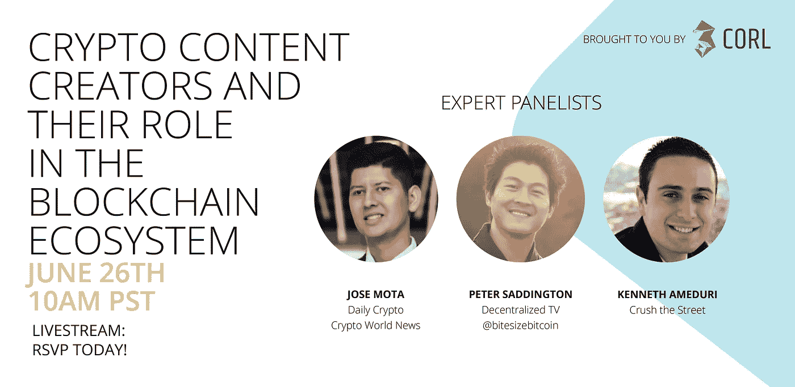

# 加密内容创作者及其在区块链生态系统中的角色

> 原文：<https://medium.com/hackernoon/crypto-content-creators-and-their-role-in-the-blockchain-ecosystem-7530c7a6a280>

Crypto 是一个全新的生态系统，由于梦想获得高额投资回报而成为主流。事实上，它是由企业家精神和建设美好未来的愿望推动的。类似于一个叫做互联网的小发明，每个人都意识到了[区块链](https://hackernoon.com/tagged/blockchain)技术的未来含义，我们都有点不确定一切将如何发展。

新闻，以及可靠新闻的含义，对当前的生态系统有着深远的影响。有许多内容创作者和新闻媒体报道区块链的发展，但作为一名消费者和一家新企业的企业家，你如何驾驭这个世界？

[Corl 的 Matt Ward](https://medium.com/u/de3bd78f4455?source=post_page-----7530c7a6a280--------------------------------) 在美国东部时间 6/26 @下午 1 点主持了一场直播，与分散式电视和 thebitcoin.pub 的 Peter Saddington，Daily Crypto 的若泽·莫塔和 Crush the Street 的 thisweekincrypto 和 Kenneth Ameduri 一起谈论这个生态系统以及内容创作者如何有能力塑造这个令人兴奋的行业的未来。

## 小组成员:

[彼得·萨丁顿](https://medium.com/u/4fda3d5444a4?source=post_page-----7530c7a6a280--------------------------------)是日元的创始人。IO，世界上第一个[加密货币](https://hackernoon.com/tagged/cryptocurrency)社会经济体，包括比特币 Coinpuffs.com。酒吧，CryptoYum.com 和 10DaysofBitcoin.com。他也是[分散电视](https://medium.com/u/13183fdd9d10?source=post_page-----7530c7a6a280--------------------------------)的主持人。他在敏捷转型项目方面的经验涵盖了一些最大的财富 500 强公司，包括 Cisco、T-Mobile、Capital One、Blue Cross Blue Shield 等。他是一名认证的 Scrum 培训师，已经获得了 3 个硕士学位。

[若泽·莫塔【Daily Crypto】](https://medium.com/u/4e688c0cbf90?source=post_page-----7530c7a6a280--------------------------------)是一名数字媒体营销人员、播客创作者，创建了 Daily Crypto 播客，这是一个可靠的加密货币市场简报和采访该领域顶级区块链影响者的来源。他现在正在建立 thisweekincrypto.co，一个类似但规模更大的项目，将信息和透明度带入加密领域。

肯尼斯·阿梅杜里是另类财经新闻网站 CrushTheStreet.com 的主编和联合创始人。他是拥有成千上万读者的未来货币趋势和财富研究集团的创始人，也是管理着数百万美元客户资金的 FMT 咨询公司的创始人。Kenneth 热衷于分析资源、技术和其他行业，发现哪里可以获得股权，哪里可以盈利。他在自己的新闻网站 CrushTheStreet.com 上分享了这一观点。

## 由[科尔](https://corl.io/?utm_source=roundtable&utm_medium=description)为您带来

> 除非另有明确说明，否则 Corl 不隶属于任何圆桌会议嘉宾或相关业务。客人是根据经验和知识选择的；他们不同的观点和经历引发了有趣的讨论。

[Corl](https://corl.io/?utm_source=roundtable&utm_medium=description) 是区块链上全球首款收入共享令牌。我们通过允许初创企业和中小企业获得非稀释性的按需增长资本，打破了传统的初创企业融资模式。

如果您有兴趣了解更多信息，[请阅读我们的白皮书](https://corl.io/crltoken?utm_source=medium&utm_medium=roundtable)并与我们联系。