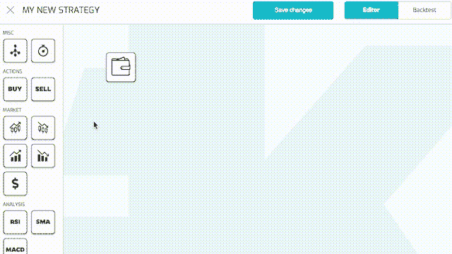
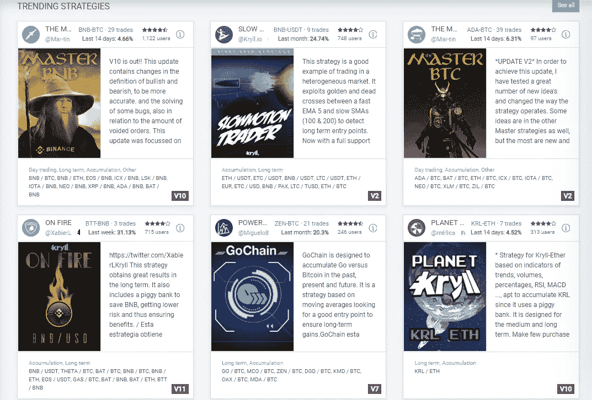

# 厌倦了加密日交易？自动化可以提供帮助

> 原文：<https://medium.com/hackernoon/crypto-day-trading-automation-help-kryll-review-694ec29ccdfd>

## 让你建立自己的自动化策略或使用他人的策略

你还记得以前你每 5 分钟刷新一次 CoinMarketCap，而且不用在早上第一件事就是查看它的日子吗？是啊，我也是。去工作，实际上能够专注于你的工作，而不是反刍你的加密投资，寻找每一个机会，看看他们做得如何，并可能快速交易？早就走了。社交还是追求兴趣爱好？别提了。

# 我们完了吗？

还没有——不时会有闪亮的 ICO 出现，并承诺改变一切。 [Kryll 是一家初创公司](https://platform.kryll.io/r/5a8b8a6cc9ac6518cf4c53b4)，最终寻求减轻我们的痛苦。

The strategy building interface

这个项目背后的想法非常简单。该平台允许您创建自己的定制自动化策略，遵循您选择的一组条件，并使用*简单的拖放式界面*构建。策略流可以由逻辑运算符、信号、变量值(市场容量、趋势、TA 指标)、用户通知、订单组成。

然后你可以**将它发布到社区中心，并为每个使用你策略的用户赚取佣金**。或者，你可以选择租用其他用户发布的一些最佳策略。

The strategy marketplace

虽然止损等功能很有用，可以让你免于灾难，但它们远不及定制策略所能提供的灵活性。

Kryll 提供了一个沙盒环境，在这里你可以测试你的策略，看看它们在真实交易中的表现。他们只对实时交易收费，所以你可以随心所欲地测试和调整，直到你满意为止。

此外，Kryll 与所有主要交易所整合，因此你可以制定一个策略，然后忘记它，而不是对多个交易所之间的交易进行 24/7 的微观管理。

# 准备好开始了吗？

Kryll 正在直播，你可以在这里注册。

> *官方渠道:* [网站](https://platform.kryll.io/r/5a8b8a6cc9ac6518cf4c53b4) | [电报](https://t.me/kryll_io) | [推特](https://twitter.com/kryll_io)

