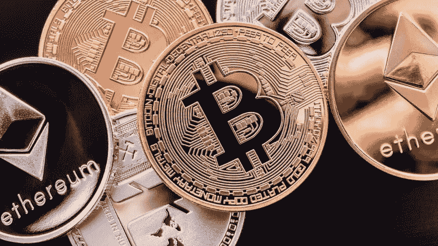

# 加密公司在 2018 年向赏金猎人支付了大笔奖金，比特大陆的首席执行官可能会下台

> 原文：<https://medium.com/hackernoon/crypto-firms-made-large-payouts-to-bounty-hunters-in-2018-and-bitmain-ceos-may-step-down-4a2e68d6e627>

**市场状况—2018 年 12 月 31 日** [**BTC**](https://berminal.com/coins/Bitcoin-BTC)**:3796.93 美元(-1.88%)** [**XRP**](https://berminal.com/coins/XRP-XRP)**:0.358231 美元(-2.56%)** [**ETH**](https://berminal.com/coins/Ethereum-ETH)**:137.11 美元(-1.14**

市场有些稳定，在过去的 24 小时内只损失了 22 亿美元。比特币坚守 3800 美元的支撑，而以太坊在测试了 150 美元的阻力后，位于 140 美元以下。币安硬币(BNB)是当今 25 种顶级加密货币中唯一的绿色硬币。

另一则新闻，被称为“丝绸之路”的黑暗网络市场的创始人罗斯·乌布里希特最近给加密技术的支持者罗杰·弗写了一封亲笔信，请求帮助他的法律斗争。Ver 一直是罗斯最积极的支持者之一，自他首次被捕以来，多次呼吁释放他。

**1)根据 TheNextWeb 的一份报告，2018 年，white hack 黑客通过赏金计划从密码公司赚了 87.8 万美元。大多数公司会奖励向他们报告漏洞的负责任的黑客，这样他们就可以在漏洞被利用之前修复漏洞。阻止。第一，EOS 背后的公司已经支付了 534，500 美元，占今年奖金的 60%。加密货币交易所比特币基地是第二大支出者，支付了 290，381 美元，创排名第三，支付了 76，200 美元。虽然 HackerOne 的平均奖金为 900 美元，但区块链产业的平均奖金为 1490 美元。([阅读更多](https://berminal.com/news/148084/White-Hack-Hackers-Earned-878000-From-Crypto-Companies-Through-Bounties-In-2018))**

加密货币矿业公司的首席执行官吴(音译)和米卡里詹(音译)可能会在的人事变动和重组中离职。一位接近比特大陆的知情人士表示，“此事还没有定论，目前处于过渡期。”比特大陆尚未证实或否认这些报道，并对所有请求做出回复，称“感谢您的关注，但我们目前无可奉告，请参考招股说明书。”([阅读更多](https://berminal.com/news/147607/Reports-Suggest-That-Jihan-Wu-and-Micree-Zhan-May-Step-Down-as-CEOs-of-Bitmain))

**3) Paxos 标准代币(PAX)是区块链以太坊上流行的 20 元稳定币，与美元挂钩。**它现在的市值为 1.47 亿美元，并在多家热门交易所上市。然而，根据一些交易商的说法，将 PAX token 兑换成法定美元并不是一件容易的事情。他们向希望赎回代币的交易者发送了一系列问题。他们要求一名交易员验证他们的钱包，并解释他们钱包上的交易。对于另一名交易员，他们询问了雇主的位置、职位和年薪。交易者对 Paxos 的敌意很不高兴，这对一些人来说是一场噩梦。([阅读更多](https://berminal.com/news/148029/Paxos-Is-Making-It-Difficult-For-Traders-To-Redeem-The-Stablecoin))

[***订阅百慕达简讯***](https://visitor.r20.constantcontact.com/d.jsp?llr=myyhdl6ab&p=oi&m=1131022639884&sit=9ar6aztmb&f=776989ec-8460-43a4-b86a-bcf8f2f1bca7)

[***免费下载百慕大 App***](https://berminal.app.link/medium-post)

*[***百慕大官方电报***](https://t.me/berminal)*

*[***百慕大推特***](https://twitter.com/berminalapp)*

**