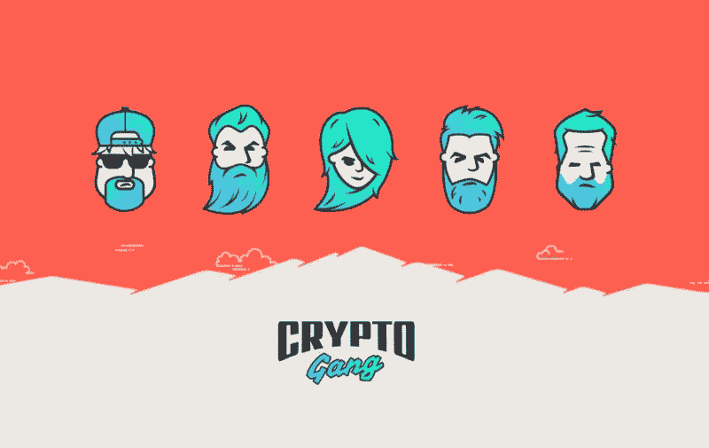

# 加密团伙-品牌和设计，以扶摇直上你的 ICO

> 原文：<https://medium.com/hackernoon/crypto-gang-branding-and-design-to-skyrocket-your-ico-57062ce78d40>

你好，欢迎光临！我们是 [CryptoGang](http://cryptogang.agency) ，一家为加密初创公司、ico 和投资基金提供品牌和[设计](https://hackernoon.com/tagged/design)的机构。我们是一个不可分割的创意和网页开发团队，他们喜欢让事情看起来很酷，同时实现我们客户的战略目标。

我们做什么？

我们帮助初创公司和加密项目为投资者构建正确的信息。我们知道如何制作全面的视觉效果，让您的项目告别平庸。这让我们很开心。我们相信设计和视觉传达的变革力量，用我们的想法传达你的故事。

我们为什么这么做？

我们的主要任务是构建一个项目的视觉传达，以最大限度地吸引投资者的兴趣。这使得该项目能够实现其目标，并在私人销售期间筹集资金。最近，为成千上万的初创公司在加密领域打造品牌变得异常平庸，因为聘请顶级品牌策略师、设计师和文案对一家初创公司来说可能相当困难。因此，我们正在用我们的创新方法和专业知识改变这种状况。

我们的方法有何不同？

我们认为设计不仅仅是漂亮的图片或漂亮的网络界面。我们的设计决策基于意图和项目目标。这就是一流的品牌代理公司所做的。考虑到加密行业独特的怪癖和任务，我们将 10 多年来与优质品牌和卓越国际项目合作的丰富经验带入加密行业。除了大量的计划和策略之外，复杂的项目通常需要多种技能，而这些技能只有经验丰富的专业团队才具备。

做好你的工作，和与你有相同想法的伟大的人在一起——这是我们成功的公式。

什么是好的设计？

在好的设计中，每个小东西都有其用途。当我们对设计做出决定时，我们不会关注“喜欢与不喜欢”的个人标准，而是会问这样的问题:“这个设计传达了什么信息？”以及“这个东西解决任务了吗？”。设计的成功依赖于每一个微小的细节为宏观目标增添意义。区分优秀和平庸的是深思熟虑的意图。

我们为什么喜欢加密？

加密项目有一个共同的挑战——完成的速度。我们做很酷的事情，而且做得很快。这带来了独特的个人挑战，需要我们团队的每个成员付出额外的努力。我们喜欢我们工作得越快，结果就越快。在密码市场出现之前，耐心是一种美德，对此我们并不感到难过。

我们在这里帮助你让你的设计对你的利益相关者来说更棒更全面。我们走到一起，相信创新的项目造就创新的世界。

想咨询如何让你的 ICO 设计变得伟大，看我们的作品集或聊天？请在我们的网站上给我们留言。