# Crypto Gang 参观 Crypto Valley——欧洲区块链的瑞士心脏

> 原文：<https://medium.com/hackernoon/crypto-gang-visits-crypto-valley-the-swiss-heart-of-european-blockchain-488d159392b0>

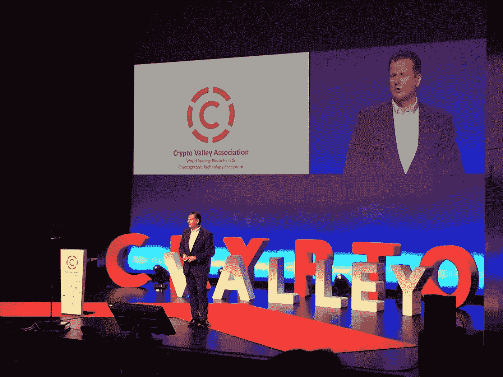

Opening of the Crypto Valley Conference and introduction by Oliver Bussmann, President of [Crypto Valley Association](https://cryptovalley.swiss), and one of the top blockchain influencers in the world.

瑞士是欧洲的硅谷、马耳他和新加坡。该国是密码技术发展的重要枢纽之一。大部分基础设施位于楚格独特区内的 Crypto Valley。它是区块链生态系统的母舰。新兴的[加密货币](https://hackernoon.com/tagged/cryptocurrency)、区块链和其他分布式账本技术崛起的全球中心。在那里，他们在高度支持和安全的环境中发展。

去瑞士是我们的兴趣与客户的支持和热情的合作。Crypto Gang 的业务开发总监 Anton Dyshkant 前往 Crypto Valley，与我们现有的客户会面并合作。他还有机会参加关于区块链技术的国际[密码谷会议](https://www.cryptovalleyconference.com)。以下是 Crypto Gang 最想分享的亮点摘要。

**事件**

2018 年国际加密谷会议由[加密谷](https://cryptovalley.swiss)组织，于 2018 年 6 月 20 日至 22 日在楚格举行。它聚集了来自美国和欧洲的与会者，讨论区块链技术生态系统内的最新进展。

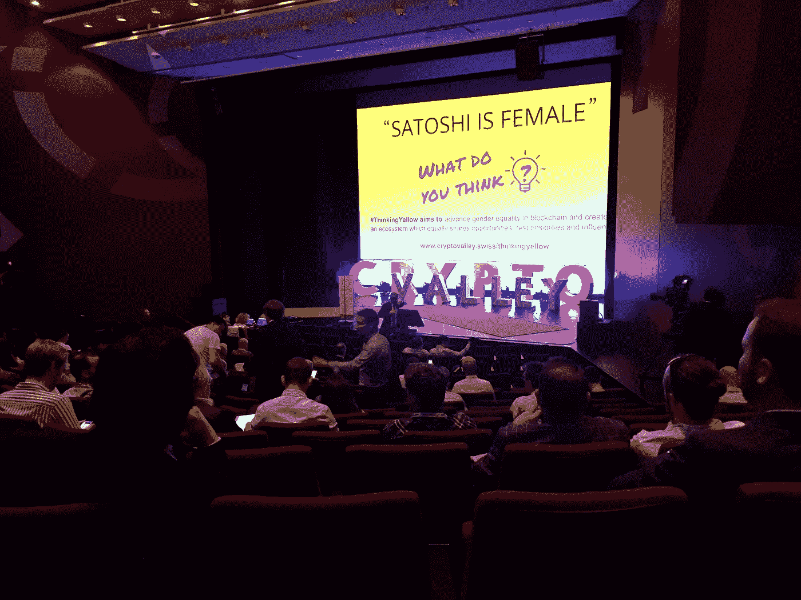

Opening of the Crypto Valley conference.

我们参与了一次真正独特的经历。该活动仅接待了 800 名与会者，他们都是行业专业人士。这些人完全致力于发展区块链世界，并积极为其进步做出贡献。

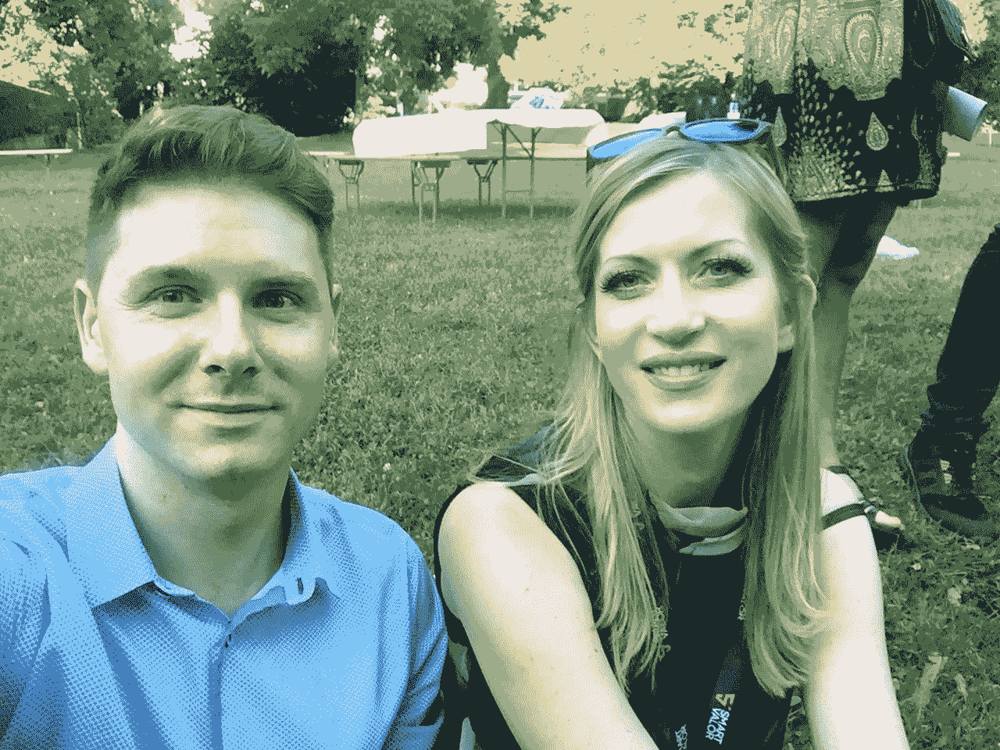

At the pre-event of Crypto Valley conference arranged by [Token Foundry](https://tokenfoundry.com/). With Olga Feldmeier — CEO of Smart Valor, a former executive of UBS, Barclays Investment Bank, The Boston Consulting Group (BSG), and a well-known influencer in crypto world.

发言者中有来自以下组织的代表:Ripple、微软、康奈尔大学、瑞士政府、加州大学伯克利分校、IBM 苏黎世研究院、思科、Eternity 以及许多其他组织。每个人都关注高质量的社交机会。这次活动充满了创新，散发着由国际合作引发的创造力。

下面列出了一些最著名的与会者:

*   奥利弗·巴斯曼——顶级加密项目的顾问( [IOTA](https://www.iota.org) 、 [Ripple](https://ripple.com) 、 [Shapeshift](https://shapeshift.io) )
*   康奈尔大学教授艾敏·冈瑟勒博士
*   Stefan Thomas——inter ledger 协议的发明者和 [Ripple](https://ripple.com) 的 CTO
*   多尔菲·穆勒——楚格市市长，他大力支持全瑞士的区块链
*   Daniel Haudenschild——[Swisscom 区块链股份公司](https://blockchain.swisscom.com)负责人
*   理查德·奥尔森——[Lykke](https://www.lykke.com/)的首席执行官

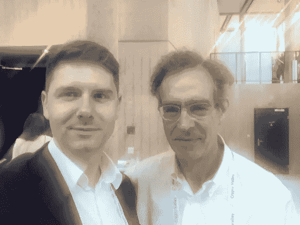

With Richard Olsen, founder of [Lykke](https://www.lykke.com) foundation. Crypto Gang is partnering with Swiss-based Lykke providing branding services to its clients. Apart from ICO services, Lykke is a crypto exchange and a digital wallet for crypto currencies and one of the leading service providers in Switzerland.

会议涵盖了广泛的主题。它触及了从令牌经济、金融科技和物联网的未来到智能合约安全的方方面面。讨论的其他一些问题包括:身份管理、共享数据、小额支付和加密货币基础设施的法律方面。

这是不可能不评论的无可挑剔的工作，加密谷协会在规划和实施这一事件。他们以前从未举办过如此规模和比例的会议，然而从嘉宾名单到众多卫星分支机构的一切都组织得非常完美。卫星元素尤其值得注意，因为它允许行业专业人士与行业内的一些初创公司和不太知名的公司近距离交谈。

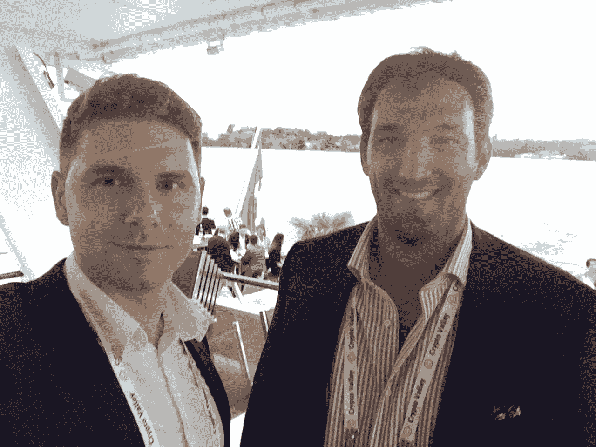

Together with a great pal, Shay Gammer, co-founder of Montfort Family Office and COO at [Fortune Family Office Group](https://fortunepartnersgroup.com/) based in Geneva.

**秘密机会之谷**

一个秘密组织来到楚格，意图参观瑞士秘密项目的发源地。这里，州级支持加密。政府官员优先考虑为加密货币的发展创造最佳的商业环境。楚格是一个非常小而风景如画的地方，人口 28000。尽管面积很小，但由于有利的监管框架和税收，瑞士的这个地区被认为是最有兴趣启动科技和区块链项目的地方之一。毫不奇怪，它已经吸引了一些世界上最著名的加密公司和组织，如:以太坊、Monetas、瑞士比特币、Xapo、ShapeShift、ConsenSys 和 Tezos。

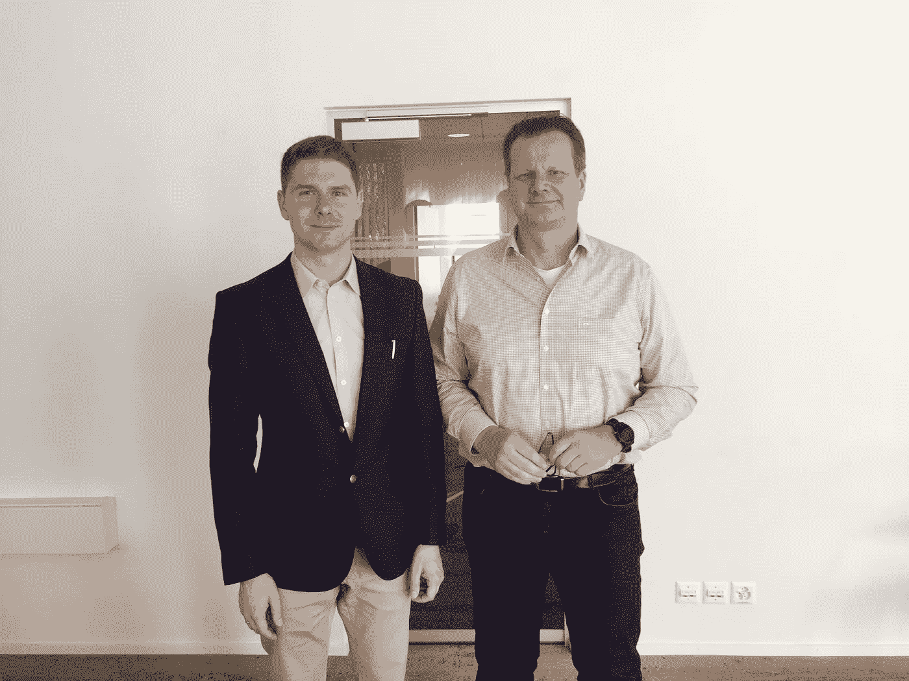

With Oliver Busman, President of the Crypto Valley Association, CEO and Founder of Bussmann Advisory consultancy firm, in his office.

我们惊讶地发现，几乎每个居民都知道区块链、加密和会议。我们遇到的几乎每个人都有自己的观点和想法来分享他们使用 crypto 的经验，证明这项技术对楚格乃至整个瑞士有多么重要。作为密码传播者，我们强烈希望很快其他国家将达到这种水平的加密兴趣和认识。我们期待着有一天，加密通信将进入每个城镇的主流文化。

**网络和通信**

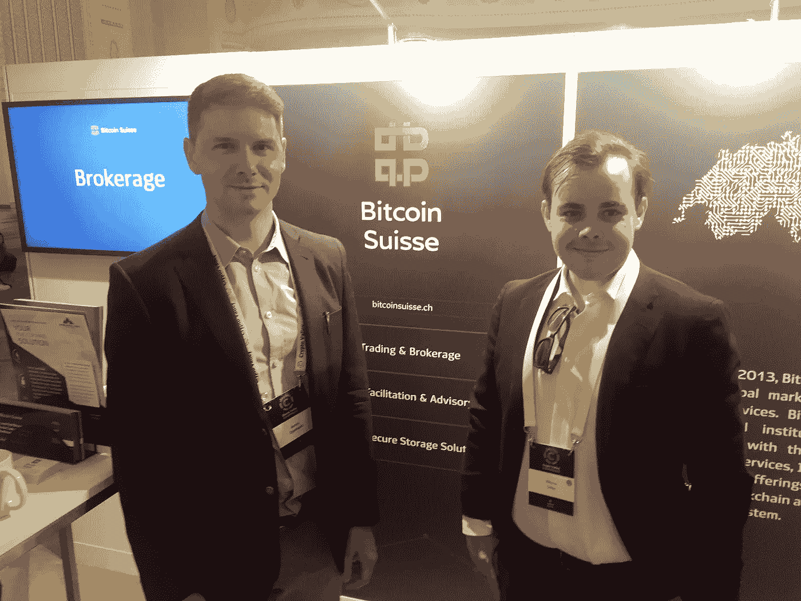

At the booth of Bitcoin Suisse together with Nicolai Oster, Head of ICO and Partner. Discussing collaborations between our companies on ICOs and blockchain projects.

对于加密社区的每个人来说，这样的会议是一个与业内其他专业人士和爱好者联系的好机会。这对于加密初创公司和 ico 来说尤其有价值，因为他们的目标是测试电梯演讲和产品创意，在发布前收集反馈。它也让公司见到他们的投资者和未来的支持者。在 Crypto Gang，我们不断鼓励我们的客户参加这样的活动和网络。

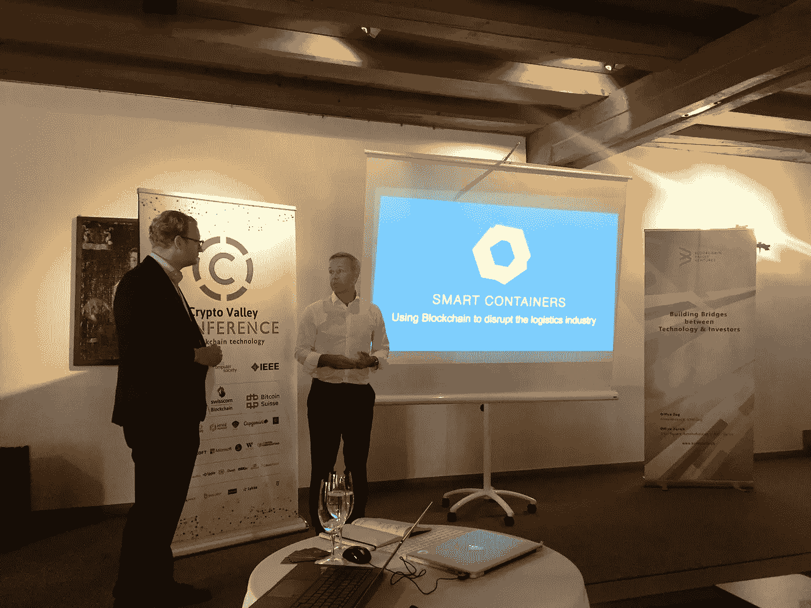

One of the satellite events of the conference — “ICO investments”, led by Heinrich Zetlmayer, who is the founder and General Partner of the BVV, and former Vice President of IBM. Crypto Gang is partnering with BVV, Heinrich and their great team.

很荣幸能成为少数几家乌克兰公司中的一员，参与关于现代创业领域主要观点的国际对话。但更重要的是，我们有一个极好的机会见到我们的一些合作伙伴并讨论我们的进展。我们还实现了我们的目标，即联系并获得一些对进一步合作伙伴关系感兴趣的关键市场参与者的支持。我们很高兴在即将发布的版本中分享更多关于这些方面的细节，所以请回来查看更新。

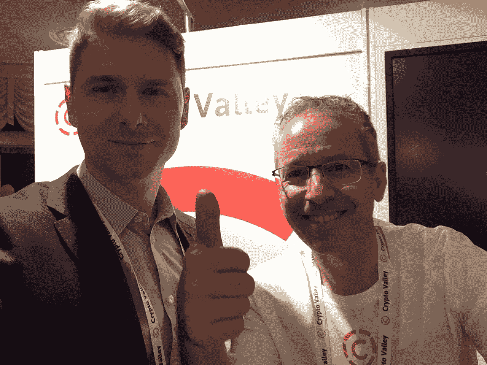

Together with Dr. Mattia L. Rattaggi, a great person and a blockchain industry professional, who is a Chair Regulatory Policy at Crypto Valley Association and Founder of the [blockchain Advisory and Consulting firm](http://drmattiarattaggi.com)named after him.

我们还有幸会见了一些瑞士客户，并讨论了正在进行的项目活动。我们会见了安全系统公司的罗伯特·罗根莫瑟。他们总部位于苏黎士，生产硬件和软件产品，通过确保€1000 亿美元的日常交易并为瑞士顶级金融机构提供服务，已经保护了瑞士的银行系统。我们有机会讨论了他们即将开展的 ICO/ITO 项目，以及我们在设计他们的 ICO/ITO 网站、白皮书和其他文档方面的进展。

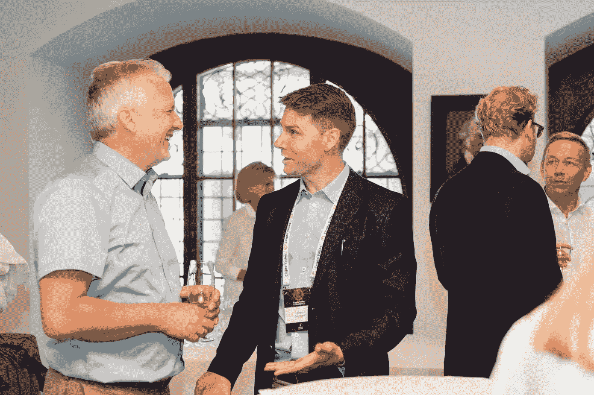

With Robert Rogenmoser.

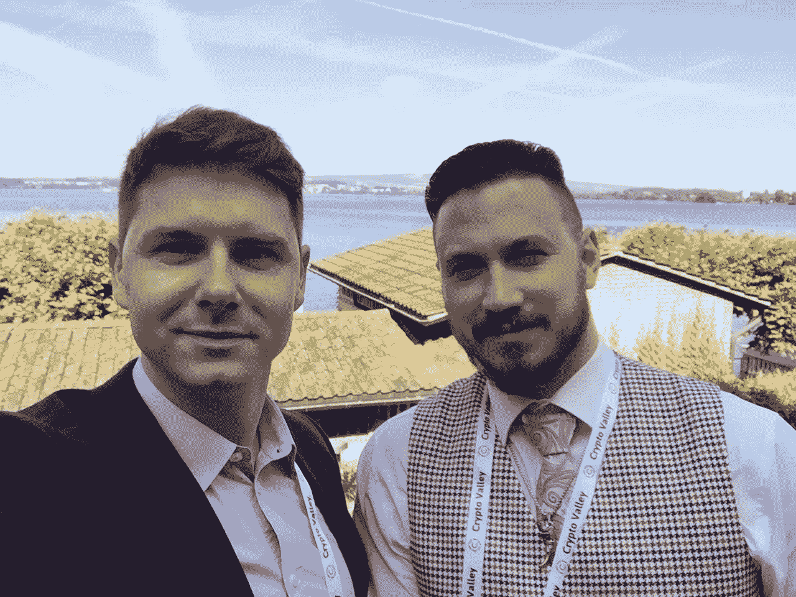

Together with one of the conference attendees, Roland Kask, a marketing professional from Estonia.

我们拜访了我们的好伙伴公司 Lykke 的办公室，以及他们在 Zug alpen strasse 9 新开的办公室，在那里我们见到了 Michael Guzik、Victor Solomon 和其他人。

我们还会见了 Heinrich Zetlmayer 和 Luigi Bruno 以及[区块链谷风险投资](http://bvventures.ch/)的团队。BVV 是一家新的加速器和风险公司，专注于孵化，发展和投资区块链支持的企业。我们目前正在合作项目，并渴望讨论我们的进展。

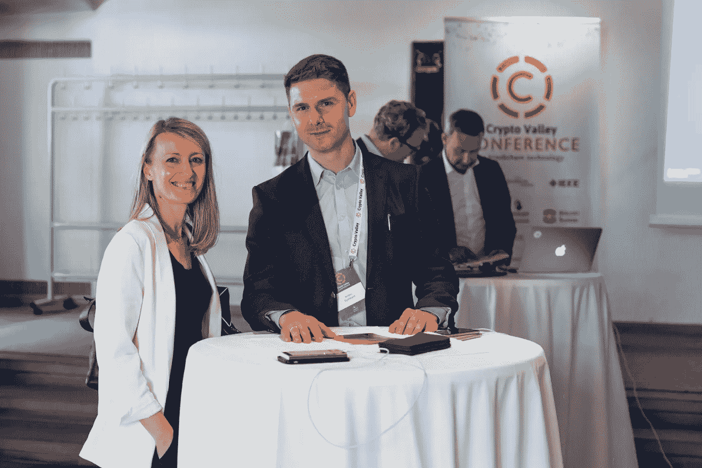

With Deyana Nedeva, Head of Investor Relations at BVV.

总的来说，这是一个伟大的事件！在 Crypto Gang，我们强烈鼓励每个人定期访问各自领域的协作活动，以分享、联系和发展。我们希望不久能在世界的某个地方见到你！

想咨询如何让你的 ICO 设计变得伟大，看我们的作品集或聊天？给我发邮件到 [anton@cryptogang.agency](http://anton@cryptogang.agency) 。