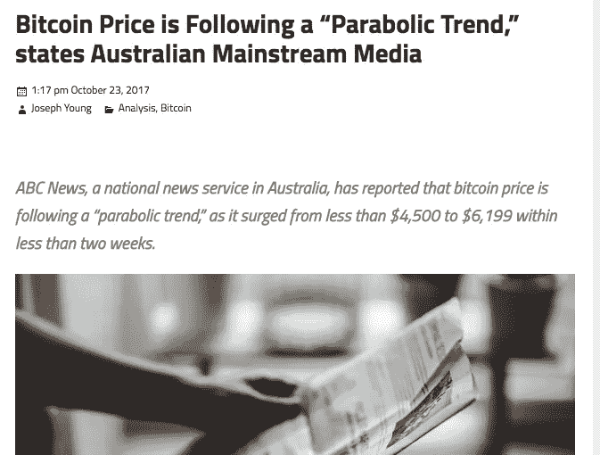
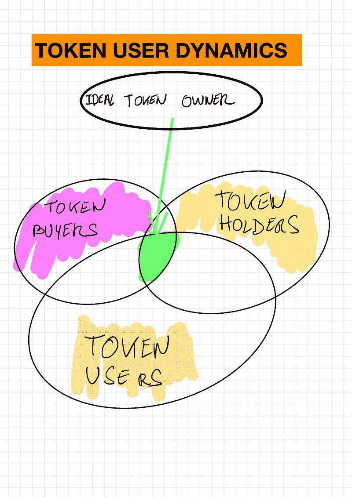
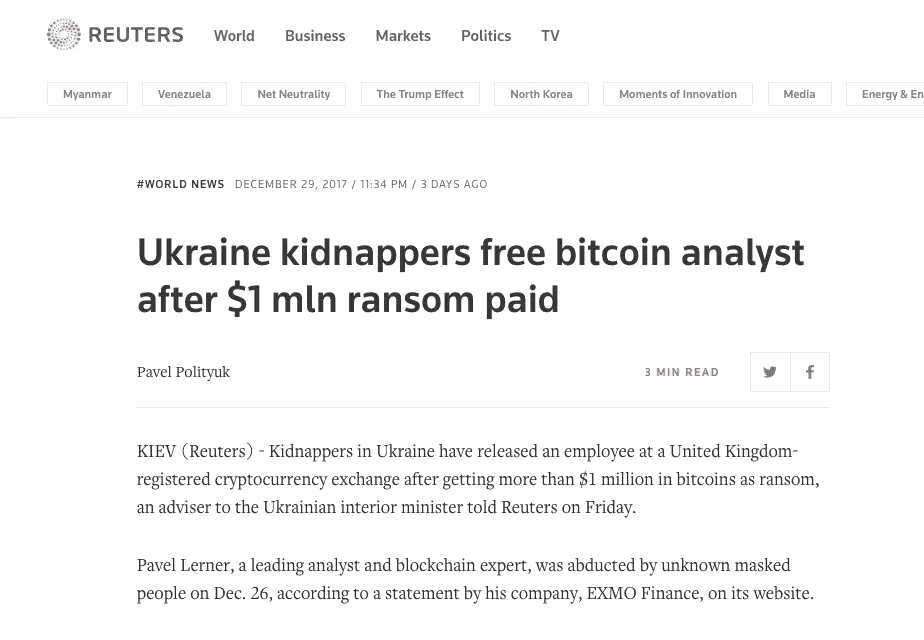
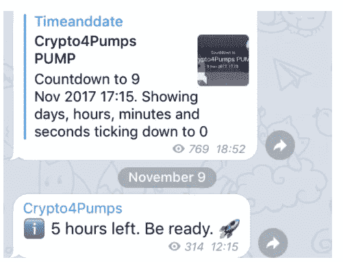
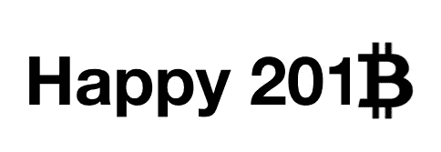

# 2018 年的 Cryptos:我担心的事情

> 原文：<https://medium.com/hackernoon/crypto-in-2018-things-i-worry-about-fbaf2f9a2c6f>

我来加密空间晚了。从技术上讲，我在 2017 年年中真正参与进来，但我试图让自己深深沉浸在那个空间中。我已经收集了足够的信息来理解为什么 Crypto 会存在。我非常看好长期趋势，以及去中心化将如何影响我们的日常数字生活，也许还有非数字生活。但我也观察到了一些在短期内确实令我担忧的情况。他们就像影子一样跟随着我，不会在阳光下离开你。

它们都可能对加密创新周期的短期生命产生重大影响。很难说到什么程度。因此，在[我预测了 2018 年可能发生的事情](https://blog.goodaudience.com/crypto-and-non-crypto-insights-for-2018-d45393380b03)之后，以下是令我担忧的因素(注意，这篇文章*不是*关于“[泡沫](https://startupsventurecapital.com/lets-talk-about-this-bitcoin-bubble-8aa8db926d42)”)。

## 1.大众迷信

相信某事的未来和被告知是有区别的。盲目购买 crypto(或放弃它)是危险的。问题是，在过去的几个月里，大量通常被误导的人涌入了密码世界。有些人会称之为贪婪、投机或简单的羊群效应。

实际上，我认为这是教育过程中积极而必要的一部分。问题是，当大多数拥有 crypto 的人信息不够灵通时，他们不会有必要的防弹夹克来应对出现的“坏消息”。出于懒惰，这可能导致恐慌运动，加速不可逆转的硬着陆(我不是在说典型的 30/40%修正)。

## 2.(无知的)主流媒体的作用

媒体的业务是产生页面浏览量和销售广告。标题越花哨越好。而主流媒体很少准确报道新闻。如果你对任何话题都很了解，并且阅读了大多数报纸对同一话题的报道，你就会知道我在说什么。主流媒体对凝聚一群人或解散一个行业的影响仍然是巨大的。我看到的根本问题是，通过社交网络的放大，做出明智决策的信息很少出现。

此外还有假新闻因素:有多少硬币和代币已经受到网络上提供的虚假骗局或新闻的影响。

我真的担心我们大多数人接触到的信息不足以在这个行业的海洋中航行。如果现在有一个明显的泡沫，那就是媒体泡沫。

社交网络和应用商店必须在建立必要的信任层方面发挥重要作用。检测早期的坏消息、不良玩家、诈骗等将变得至关重要。但是他们有能力做到吗？

## 3.令牌所有者/令牌用户比率

我要说，即使这让很多企业家不高兴:但大多数购买 ico 的人并不关心你宝贵的令牌、你的使命或你的协议。他们关心的是快速制作 10/100 倍。没有人买你的代币，因为他们打算使用它。我怀疑买了 Kin tokens 的都是 Kin 用户，或者 Zrx tokens 主人打算用。有些人可能相信你的使命，但在你的 ICO 完成后，*“hodl 因素”*处于低位。

我们在一个资产类别上投入了数十亿美元，在这个资产类别中，代币发行者(你的初创公司)[、代币购买者(交易者)和代币使用者](https://hackernoon.com/token-buyers-token-holders-and-token-users-40e7234c46bb)之间的关系并不是直线的。原因是显而易见的:这些令牌中的大部分是不可用的，甚至还不可用。他们唯一的价值在交换订单簿上。

当你的公司无法兑现承诺，或者不再是投资界的宠儿时，会发生什么？它会崩溃。今年，留住一群受高回报激励的投资者将是一项艰巨的挑战，尤其是如果你不能兑现承诺的话。

## 4.秘密企业家安全

今年早些时候，Vitalik Butterin 和其他业内人士访问了以色列。看到那些肩上扛着那么多责任的人无忧无虑地行走，我感到震惊。我们生活在一个坏事发生的世界。少数人对这种新经济有很高的“感知”影响，尽管一切都是分散的。我不希望任何人受到伤害，但我会优先考虑他们的安全，因为这可能会产生严重的“可感知的”影响。如果你怀疑这种影响，[看看当一个关于 ETH 创始人的假消息传开后，ETH](http://fortune.com/2017/06/26/vitalik-death/) 的比率发生了什么。最近在乌克兰发生了一起绑架事件。

如果不走这么远，即使你的密码表现不好，你也不会愿意冒被威胁的风险。从这个角度来看，我可能理解为什么像 Litecoin 的创始人查理·李这样的人宁愿卖掉他所有的硬币，也不愿在 twitter 或其他网络上被暴民私刑处死

我还认为，每个口袋里装着大量“虚拟货币”的人，无论多么安全，也可能面临风险。如果你的菲亚特钱包被盗，损失是有限的(打电话给你的银行？visa？).但是有了 crytpos..你可能会损失更多……而钱包不能解决这种风险。

## 5.政府战争

他们可能会在“杀死密码”上失败，但我确实相信，一些政府感到他们可能/失去控制而引发的一场大战将打击密码服务、公司和 ICO 价值链。它竟然[开始](https://hackernoon.com/the-empire-strikes-back-with-a-coordinated-war-on-crypto-bdd84fd2f854)。过度监管可能是风险之一，取缔一些活动或以一些公司为榜样。这将对现在专注于解决这场战争而不是创新的行业健康产生重大影响。尽管这是一种徒劳的努力，但我确实相信:政府使用加密货币的收益大于损失

所有的目光都指向了中国和韩国，在这两个国家，大量的秘密经济正在发生。中国可以接管甚至禁止比特币挖矿活动，这不是一件好事。韩国可能会关闭密码交易所，这将产生非常恶劣的影响。这些风险是真实存在的

## 6.有组织的泵和转储环

认为所有硬币和代币的价格都是公平交易的想法是天真的。有一群投资者[串通](http://uk.businessinsider.com/how-traders-pump-and-dump-cryptocurrencies-2017-11)人为操纵一些加密资产的价格。

我不确定到目前为止这到底有多自动化，但这并不好，所有交易所都警告用户不要采取那些很难发现的做法，行业越大，回报越高(风险相对较低……)

**7。税收阉割**

政府可能不喜欢提高加密，但他们喜欢通过向你征税来增加收入的想法。而 crypto 也不会例外。

我希望我们亲爱的政府不要把这弄得过于复杂，因为这可能会影响人们愿意承担风险和采用这些新货币的意愿。有一件事会让事情变得容易得多:用加密货币直接缴税的可能性。但是如果你必须报告每一笔交易，包括你用加密签证卡买的咖啡:祝你好运！

我支持对收益征税，但报告的规则和机制必须足够简单。

**8。开放式与集中式链**

我们今年目睹的比特币内部争斗就是一个例子。总体辩论和意见分歧是一件好事。它迫使改进。但是，当那些参与开发开源协议的人的治理工作做得不好时，这可能意味着它的死亡。如果开放不能获胜，我预计封闭协议可能会取而代之。但是那有什么意义呢？审查——抵制和去中心化只有在开放的运动中才能奏效。如果环境是封闭的或集中的，那么拥有大规模、高交易量是没有意义的。我们又回到了原点。

我希望开发者社区能够克服内部争斗，不要扼杀区块链运动的灵魂。

## 9.采矿集中力

开采隐蔽处变得越来越难了。更硬更贵。像比特大陆和 Bitfurry 这样的大公司利用了这一浪潮，许多采矿活动不再是一种业余爱好，而是由世界上几个集团领导的真正的商业活动。所以，是的，你可以说区块链是分散的，但采矿活动似乎是。这令人担忧，因为这可能导致极端情况，即[采矿力量的目标是产生 51%的攻击](https://pando.com/2014/06/16/crypto-armageddon-researchers-claim-mining-concentration-threatens-to-destroy-bitcoin/)。有人说，BCH 对比特币的涨价之所以成为可能，是因为矿权集中了，这在几年前是非常困难的。新的硬币和资产出现了，新的区块链也有了新的采矿协议。我希望在每个协议中以及协议之间出现一些达尔文主义来解决这个问题。

# 你不应该害怕

我不是想吓唬这里的读者，我本可以在今年的第一天发布一个更积极的帖子。但是当你在这个特殊的领域投资时，意识到风险是很重要的。要乐观，但也要高度务实。成为这个行业的一部分是有代价的，这不是你要投入多少钱的问题。在太空中航行非常困难。进入这个行业需要耐心和极大的好奇心。没有立竿见影的效果。这是要付出的代价。

