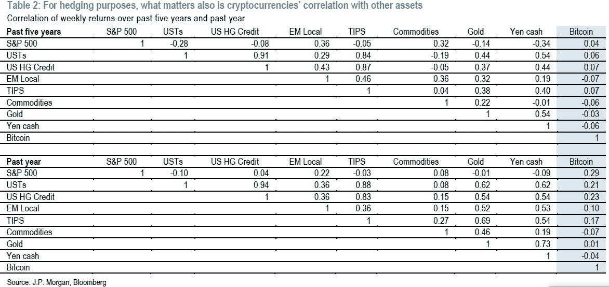
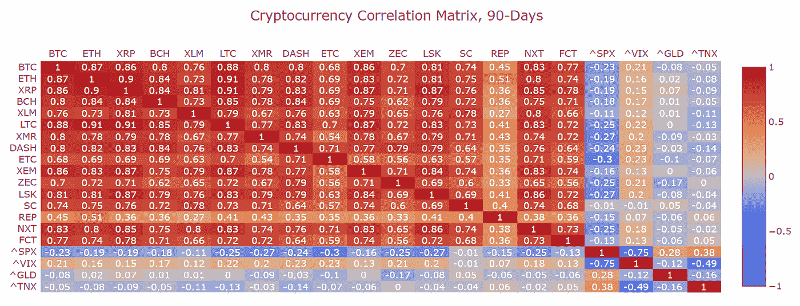
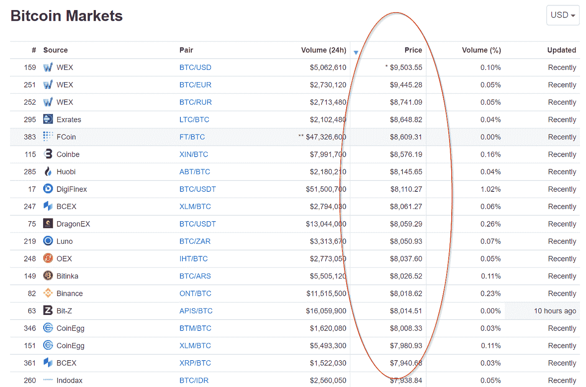

# 传统资产管理公司的加密投资

> 原文：<https://medium.com/hackernoon/crypto-investing-for-traditional-asset-managers-76879f331c0e>

为什么传统资产管理公司和投资者关心加密资产？

当它们进入市场时，它们将如何在不同的加密资产之间进行分配？

他们将如何进出交易？

需要避免哪些潜在的陷阱？

# 为什么是加密？阿尔法还是多元化？

在某种程度上，如果有人能够可靠地预测某项资产的表现会比 T1 更好，他们就会想拥有更多。实际上，这很难做到。更难的是大规模的交易——通常通过深度分析，你可以做出比机会更好的预测( [alpha，而不是 beta](https://www.investopedia.com/ask/answers/102714/whats-difference-between-alpha-and-beta.asp) )，但是当你开始执行时，你的交易会比你希望的更快地让市场回到合理价值。**阿尔法，当你找到它时，往往会很快耗尽。**

事实上，中等资产管理公司对产生显著的阿尔法值不抱太大希望。精明的人会选择退而求其次的选择:最大程度的多样化。多样化是金融市场上唯一的免费午餐。良好的多元化投资都与相关性有关——你希望拥有彼此相关性低或负相关的资产。最好的大型资产管理公司，比如 Bridgewater，渴望得到低贝塔资产，或者更具体地说，与他们投资组合的其他部分不相关的资产。这对于没有经验的投资者来说并不明显，但是从风险/回报的角度来看，负相关资产可以提高投资组合的表现*，即使该资产的平均表现不佳*。如果要让比特币成为你投资组合中有价值的一部分，你不需要押注它会大幅升值。

这是 crypto，特别是比特币，对机构来说最大的卖点:**比特币的回报与其他资产类别没有太大关联**。即使没有比特币是否会取代黄金、美联储或其他什么的观点，聪明的投资者还是对其不相关的回报感兴趣。我预测这将是未来 12-24 个月新资金流入比特币(或许还有其他一些顶级硬币)的主要驱动力。

Source: [“J.P. Morgan Perspectives: Decrypting Cryptocurrencies”](https://forum.gipsyteam.ru/index.php?act=attach&type=post&id=566108)

当然，有很多人认为比特币(和其他一些东西)有机会取代黄金(和其他贵金属)或离岸银行作为避险资产。许多人已经写了关于这个论题的文章，这确实是一件大事。整个加密经济的当前市值是 2500 亿美元，而黄金是 3 万亿美元，离岸银行代表着 20 万亿美元的 T2。部分由于对央行资产负债表的担忧，更激进的资产管理公司(如宏观对冲基金)将会押注于此。

还有机会对特定的硬币、链条、代币等进行特殊的阿尔法下注。目前，这是专门的加密对冲基金和风险投资的领域。在可预见的未来，这种情况可能会持续下去。

最后，证券化代币。这仍然是一个很大的未知数，在某种程度上，它们成为一件大事，底层平台可能会受益(如以太坊)。

# 他们将如何分配密码？

机构投资者在投资组合中增加新的资产类别时可能会有一些主要顾虑:

*   **持久力**——这只是昙花一现的可能性有多大？
*   **保管**——我怎么才能拿到并保管好？
*   **流动性**——当我们需要退出时，我们被套牢的可能性有多大？
*   **法律** —我们可以合法地把这个东西放在我们的基金里吗？我们有可能被起诉或者被整吗？

从这个角度来看，比特币可能是最好的选择。尤其是在机构对 beta 感兴趣的程度上，因为大多数其他流动性硬币与比特币高度相关(流动性较低)。

Source: [Sifr Data](https://www.sifrdata.com/cryptocurrency-correlation-matrix/) (note: table also includes SPX = S&P 500, VIX = S&P 500 Volatility Index, GLD = Gold, TNX = 10 year Treasury Note)

## 忍耐力

从[林迪效应](https://en.wikipedia.org/wiki/Lindy_effect)的角度来看，比特币拥有最长的历史记录和最多的用户支持。一些机构仍然会沿着最高的几个硬币进行分配，以对冲他们的赌注，甚至可能将小额投机分配放在看起来足够不同的有前途的新项目上(例如，使用[Dag](https://en.wikipedia.org/wiki/Directed_acyclic_graphhttps://en.wikipedia.org/wiki/Directed_acyclic_graph)或新型 [DLT](https://en.wikipedia.org/wiki/Distributed_ledger) )。

只有当你非常确信自己没有承担大量的负阿尔法值时，贝塔值才有价值——如果资产损失了大部分价值，你还是会被骗。

## 监护

保管和流动性，如何获得和持有加密资产的细节，仍然是一团乱麻。与加密的风气相反，[大多数机构将被要求有第三方保管人](https://hackernoon.com/decentralized-exchanges-fincen-payment-channels-and-custody-oh-my-1ae3d83bc42a)。他们不会管理自己的钱包。虽然[比特币基地](https://custody.coinbase.com/)、[王国信托](https://www.kingdomtrust.com/)和其他一些公司已经有了机构发行(或者很快会有)，但是大多数投资者对于成为早期参与者还是很谨慎的。**在这些机构级第三方托管机构被视为可靠和安全之前，可能需要数年的“实战检验”。**

## 资产流动性

即使你已经找到了托管解决方案，交易所的流动性仍然是一个现实问题。虽然 [coinmarketcap 可能显示 BTC 交易量每天数十亿](https://coinmarketcap.com/currencies/bitcoin/)，但是任何一个大的交易者都会告诉你，在没有大量滑点的情况下完成大的交易还是很昂贵的。订单簿中的长期流动性相当低，更不用说在这些交易所中流动资金和托管硬币的问题了。

与传统资产管理公司所习惯的相比，需要将大量资金进出比特币基地(更不用说声誉较差的交易所)仍然不方便。

## 法律地位

此外，金融机构非常关注它们收购的资产的法律地位。最令人担忧的是，这些硬币，尤其是 ICO 代币，被归类为未注册证券销售和发行者、交易所等。受到一波声称欺诈的诉讼的打击。

比特币和以太坊的关联法律风险最小。2018 年 3 月，[法官裁定比特币为商品](http://fortune.com/2018/03/07/bitcoin-cftc-commodities-coin-drop-markets/)。最近美国证券交易委员会的非正式指引表明，他们也将以太坊视为一种商品。

# 他们将如何进出交易？

## ETF 和 cef

许多机构希望通过费用相对较低的公开上市工具持有加密风险敞口:交易所交易基金或封闭式基金(如[gray 的比特币投资信托](https://grayscale.co/bitcoin-investment-trust/))。为数不多的可用选项之一是灰度的 GBTC，但费用理想情况下可以更低(2%)。一个更大的问题是，它的交易价格相对于资产净值的[溢价非常高](https://www.investopedia.com/terms/p/premium_to_nav.asp)，[截至 2018 年 7 月](https://grayscale.co/bitcoin-investment-trust/#market-performance)约为 50%，尽管它的交易价格溢价高达 100%。

这表明了对这类产品的巨大需求，但也使其缺乏吸引力(至少目前如此)。).批准 ETF 将是一个巨大的帮助，并可能导致 NAV 溢价暴跌。通过交易所交易产品实现加密所有权的好处是，它向更广泛的参与者开放了竞技场:从做多/做空股票对冲基金到拥有交互式经纪人账户的个人投资者，无所不包。同样，CFTC 批准的期货产品[在主要交易所的存在](/@garybasin/crypto-derivatives-lending-and-a-touch-of-stablecoin-59e727510024)让广泛的参与者能够对比特币价格进行对冲和投机。

然而， [SEC 最近将对五个比特币相关交易所交易基金](https://www.coindesk.com/sec-delays-decision-on-direxions-bitcoin-etfs-until-september/)的裁决推迟到 9 月，我采访过的大多数消息来源认为批准的几率为 10-15%。Atlantis Asset Management 首席投资策略师迈克尔·科恩表示，批准意味着“他们正在给(比特币)资产盖上橡皮图章，我认为政府还不想这么做。”

## 非处方药

目前，大多数机构交易都发生在朋友、经纪人和交易柜台之间的场外交易(如 T2 圈和 T4 坎伯兰交易)。我的猜测是，这很大程度上是因为机构不愿意将数百万美元转移到比特币基地或双子座(更不用说他们声誉较低的竞争对手)——或许这样做的信贷额度甚至还没有到位。随着监管环境的成熟，这种情况可能会改变，交易所的交易量将会增加。

随着清算和信用组件的建立，加密交易的前景可能开始变得更像现有的股票或外汇交易。在这些世界里，成熟的基础设施是用来执行大宗交易的。游戏的名字是藏起你的手以减少滑动。在加密领域，有一个新兴的玩家世界在研究这个基础设施，特别是[暗池](https://www.investopedia.com/articles/markets/050614/introduction-dark-pools.asp)和订单路由器/执行算法。

## 暗池

据推测，许多主要的场外交易柜台正在开发、甚至已经在运营自己的暗池。暗池的基本前提是允许大型交易者以相对于流动性交易所(即“明”场所)的*价格执行隐藏订单，例如，在中间点。Lit 市场可能具有足够的流动性，使这一机制表现相对良好，尽管即使这样也为时过早。也有像[共和国协议](https://republicprotocol.com/)这样的努力，旨在创造*分散*暗池。(关于它是如何工作的，以及它是否有潜力，将不得不等待一个单独的帖子。我的初步印象是，与中央交易所相比，dex 可能会面临同样的障碍和缺点。这可能是致命的，即使从长远来看。)*

如何导航交易所本身？比特币在数十家甚至数百家交易所进行交易。由于不受监管，这些机构从不可靠的运营到半成熟的机构(拥有完整的 KYC/反洗钱和高性能匹配引擎)不等，甚至可能提供托管服务(我认为目前只有 Gemini)。**考虑到各种因素，从资本管制(朝鲜)到潜在的财务状况虚假陈述导致的资本损失风险(如目前的 WEX)，价格预计会有所不同。**在许多这样的交易所之间“套利”相当困难。转移资本和硬币需要时间，而且往往伴随着限制和高额费用。

Source: [Coinmarketcap Bitcoin Markets](https://coinmarketcap.com/currencies/bitcoin/#markets)

## 订单路由器和执行算法

传统的解决方案是[智能订单路由](https://en.wikipedia.org/wiki/Smart_order_routing)。基本上，你把你的订单分成更小的部分，分散到多个交易所，同时考虑:不同的价格(低买高卖)，流动性(越多越好)，费用(我们不喜欢它们)，执行的延迟/可能性(高延迟=坏；越来越多的不确定性被填满)。

如今，在加密交易中，有一些玩家在提供或至少支持类似的服务: [SFOX](https://www.sfox.com/) 、 [Coinigy](https://www.coinigy.com/) 、 [CoinRoutes](http://coinroutes.com/) 和 [TradeBlock](https://tradeblock.com/) 。

其中一些像 SFOX 和 CoinRoutes 是托管的——它们持有你的资本，并在各个交易所使用自己的账户来提供快速执行。(虽然，他们[似乎在和 DEX 客户](http://coinroutes.com/CoinRoutes_v1.3_Whitepaper-2-18-18.pdf)做些什么，我还没有完全想好去评论)。其他公司，如 Coinigy，只是给你一个统一用户界面的 API 包装器，这意味着你需要在不同的交易所拥有自己的账户，并根据需要来回转移资金。最后， [OmegaOne](https://omega.one/) 是一个很有前途的项目，希望将暗池匹配和订单路由结合在一个非托管的链上(与银行集成)机制中。

*更新:在回顾了 CoinRoutes 的工作原理后，我意识到它实际上并不是托管的。它的工作方式更像是一个 Coinigy 模型+合并的订单簿——你需要在不同的交易所维持账户，以及必要的资本。*

除了更智能地发送订单，传统玩家(尤其是股票交易玩家)将利用[买方执行算法](https://www.investopedia.com/articles/active-trading/101014/basics-algorithmic-trading-concepts-and-examples.asp)来减少滑点，隐藏他们进行大额交易的意图。执行算法应用了比设置限价或市价单更复杂的逻辑。简单的例子包括 VWAP(交易量加权平均价格)和 TWAP(时间加权平均价格)，它们执行订单的速度与市场活动保持同步或在一段时间内保持均衡。

整个世界都在围绕着增加定价和交易逻辑来改善执行——它确实增加了价值，尤其是在进行大宗交易时。目前，SFOX 是我能看到的提供算法的主要玩家，尽管我希望这一点会随着时间的推移而改变。

**目前，对于订单路由器和执行算法的生态系统来说，市场可能还不成熟。**与场外交易相比，交易所的流动性仍然很低，而且在清算和信贷系统到位之前，这种情况可能会一直持续下去。

# 潜在的陷阱是什么？

在执行机构规模的加密交易时，有一些潜在的陷阱。

## 交易所是高风险、不受监管、垂直整合的庞然大物

在传统金融领域，交易场所处理撮合交易，通常提供中央清算和结算。然后，交易所与清算公司或大宗经纪商对峙，后者再与经纪商和交易员互动。这些中介不仅仅是寻租者，他们还提供价值。相比之下，比特币基地既是交易所、托管人，又是经纪人。花些时间去理解传统交易世界是如何设计的，而不是假设一站式商店是市场的最佳结构，加密交易所将从中受益。

例如，想象一个清算公司站在交易者和交易所之间的世界。不是交易所控制他们的交易所钱包中的所有硬币，而是他们将依赖清算公司在某个时间段内(例如，在 24 小时内)结算硬币和现金余额。这使得清算公司可以跨交易所向他们的交易员提供信贷——套利者可以在比特币基地 Pro 上购买 BTC，然后立即在 Gemini 上卖出，而不用担心转移硬币或现金。

## 场外交易成本很高

那个世界仍然是一个出路，如果它曾经到来的话。目前，大宗交易将继续在场外进行。OTC 通常很贵——2–5%的总成本并不少见。作为回报，你可以更有信心快速安全地得到硬币(或者现金，如果你要卖的话)。

## 硬币的来源通常是未知的

最后，要考虑的一件事是你的硬币的出处。具体而言，反洗钱(AML)关注的是持有被已知犯罪活动“污染”的硬币。**如果你拥有的一枚硬币的一部分通过了与洗钱或硬币盗窃有关的钱包地址，你以后可能很难卖掉它。**这是一个广泛的话题，对于许多加密投资者来说可能是房间里的大象。一个安全但或许极端的解决方案是直接从矿商那里购买，你可以亲自检查反洗钱风险。

# 结论

许多传统资产管理公司希望接触加密资产，因为回报与其他资产类别不相关，从而允许他们从风险/回报角度改善投资组合的表现(即使加密资产表现不佳)。其他人认为比特币(或许还有其他一些)有机会取代黄金和其他贵金属的避险资产地位。

对持久力、托管、流动性和法律风险的担忧将驱使传统资产管理公司集中投资比特币、以太坊，或许还有其他一些硬币。

crypto 的进出交易可以通过 CEFs/投资信托基金进行，最终也可以通过 ETF 进行，尽管它们目前的交易价格明显高于 NAV。对于习惯于托管自有资金的资产管理公司来说，场外交易是最受欢迎的选择，尽管全包执行成本可能达到 5%以上。暗池、订单路由器和执行算法可能会在未来提供更好的解决方案，尽管市场可能仍然太不成熟。

最后，传统资产管理公司必须应对综合交易所的潜在陷阱，以及未知的硬币来源。

# 想聊天吗？

最近，我的好朋友泰勒·皮尔森和我一直在探索加密领域，打算建立一家公司。我们反复听到的一句话是，即使从专业资产管理人的角度来看，加密投资也是如此神秘莫测。即使是精明的投资组合经理也很难接触到加密货币。在本文中，我们概述了我们认为的主要原因。**我们希望让任何人都能安全、简单、低成本地用加密货币实现投资组合的多元化。**作为第一步，我们正在探索通过一个费用非常低的基金来帮助合格投资者获得加密曝光。更多信息请联系我们 [**简单币都**](https://www.simplecoincapital.com/) 。