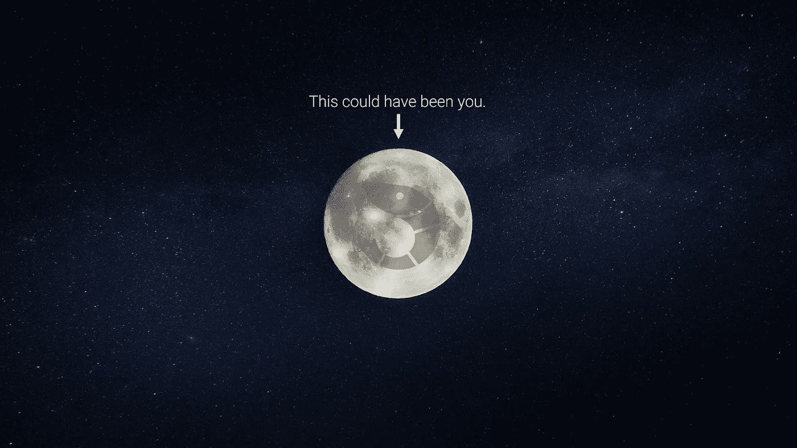
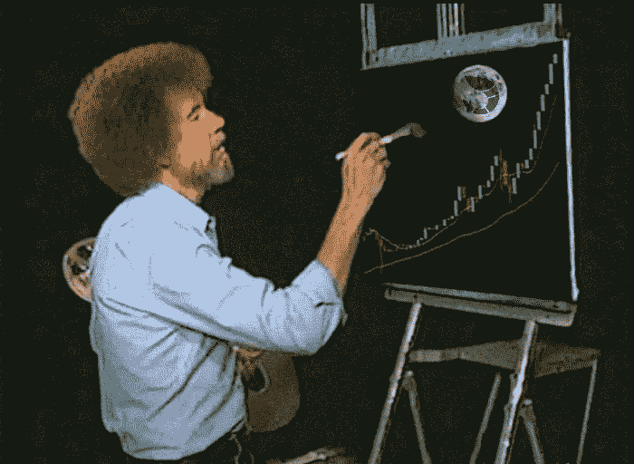
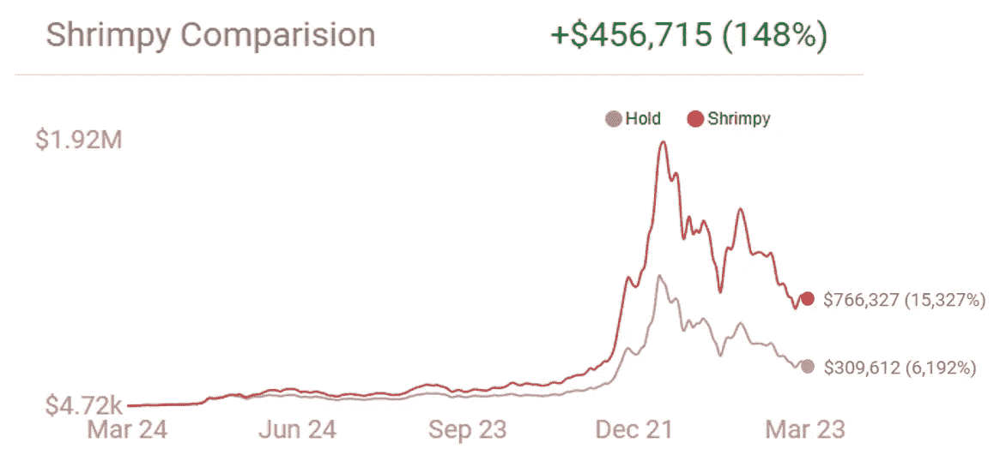

# 秘密投资者:想要更高的回报？别废话了。

> 原文：<https://medium.com/hackernoon/crypto-investors-want-free-money-stop-hodling-30f547130266>

2017 年，密码世界充满了一个词:HODL。我们只听说了这些。"如果你是 HODL，你就不会输！"他们喊道。“你打不过 HODL！”他们声称。

他们错了。也许霍德勒没有输，但他们没有赢。也许你不能打败 HODL，但我可以。现在，我要告诉你我是怎么做的。没有任何魔术，内幕消息，或非法交易策略，我打败了 HODL。我不是只差一点点，我摧毁了 HODL。最棒的是，我在整个过程中没有做任何手动交易。我只是在享受收益的同时，看着我的投资组合增值。

Me painting my happy little coins.

# 投资组合再平衡

是的，这就是我做的。我每天都平衡我的投资组合。每天早上，我交易我的资产，这样我就能平均分配每一笔资产。当我第一次开始时，这最初是从手工交易开始的，但时间不长。一旦我看到我跑赢 HODL 的速度有多快，我就把这个过程自动化了。我写了一个简单的脚本来平衡我的投资组合，每天一次。这个简单的脚本最终扩展成了一个完整的桌面应用程序。然后，过了一段时间，那个桌面应用程序变成了一个网站。现在，我已经向公众开放了网站，所以任何人都可以利用这些免费的回报。没错，我甚至不为你获得这些免费回报而收费。所以，如果你不使用这个网站，你基本上是在赔钱。就这么简单。您只需在 [Shrimpy](https://www.shrimpy.io) 上创建一个账户，并添加您的 Bittrex 或 Poloniex API 密钥，即可开始平衡您的投资组合。史林皮会处理剩下的事。没有额外的工作，没有人工交易。您可以在此了解更多关于重新平衡的信息:

 [## 加密货币的投资组合再平衡

### 投资组合再平衡是投资者使用了几十年的策略。首先，投资者必须确定如何…

medium.com](/@ShrimpyApp/portfolio-rebalancing-for-cryptocurrency-7a129a968ff4) 

# 结果

哦，我知道你不相信我。你认为这么简单的策略不可能提供我所说的那种回报。我料到会有这种反应。霍德勒没那么容易被说服。我知道我没有。所以我给你做了个模拟器。模拟器使用交易所的精确数据来构建过去一年的回溯测试。它可以准确地告诉你，如果你只是简单地重新平衡而不是重新分配，你会错过多少钱。现在，我不仅仅停留在创建一个模拟器，我还编制了一个完整的分析。你可以用模拟器进行实验，并在这里看到我的完整分析:

 [## 再平衡与 HODL:技术分析

### 这项研究的目的是描绘一幅公平的画面，说明再平衡作为一种策略如何符合霍德林。为了…

medium.com](/@ShrimpyApp/rebalance-vs-hodl-a-technical-analysis-6f341b0db9cd)  [## Shrimpy 的表现超过 holding 97%！

### 看看这个简单的回溯测试工具，看看你的加密组合在 Shrimpy 上表现如何。

www.shrimpy.io/backtest](https://www.shrimpy.io/backtest?c=EAgGgEFA&p=1d&r=97) 

# 现在走吧！

不要再等了！你每等一秒钟，你就错过了收获。所以去吧。现在就报名参加 Shrimpy，乘坐那趟甜蜜的列车去月球吧。你错过了 2017 年的所有那些收获，因为你没有重新平衡，所以不要让 2018 年成为重复的一年。

我们都在恢复霍德勒。所以，让我们一起经历这场斗争。与你的朋友和家人分享 Shrimpy 的潜力。迫使他们将那些停滞不前的硬币转换成一种积极有效的投资，以获得回报。

不要忘记查看 [Shrimpy 网站](https://www.shrimpy.io/)，关注我们在 [Twitter](https://twitter.com/ShrimpyApp) 和[脸书](https://www.facebook.com/ShrimpyApp)的更新，并向我们在[Telegram](https://t.me/ShrimpyGroup)&[Discord](https://discord.gg/gXyy95y)上的惊人、活跃的社区提出任何问题。

留下你的评论，让我们知道你的平衡经验！

*捕虾队*