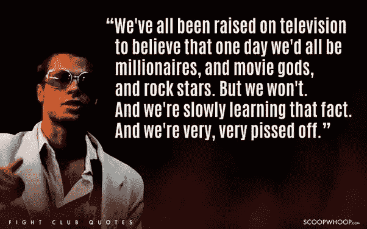

# 加密是我们的大混乱项目(搏击俱乐部)

> 原文：<https://medium.com/hackernoon/crypto-is-our-project-mayhem-fight-club-8bd0a792c53d>

订阅-[Itunes](https://itunes.apple.com/us/podcast/bit-better-have-my-money/id1374764732)[Google Play](https://playmusic.app.goo.gl/?ibi=com.google.PlayMusic&isi=691797987&ius=googleplaymusic&apn=com.google.android.music&link=https://play.google.com/music/m/Ikoddu7nd3g5ijjnhnedvdpgzo4?t%3DBit_Better_Have_My_Money!%26pcampaignid%3DMKT-na-all-co-pr-mu-pod-16)[Stitcher](http://www.stitcher.com/s?fid=183129&refid=stpr)[iHeartRadio](https://www.iheart.com/podcast/269-Bit-Better-Have-My-29238100)YouTube 视频如下

《搏击俱乐部》是我最喜欢的电影之一。打斗、表演、对话，我喜欢它的一切。但我认为总的来说有一件事多年来一直困扰着我。

**不符合社会标准的感觉。**

我们周围的一切都告诉我们买什么，穿什么，吃什么。从我们出生的那一刻起，我们就被告知什么是金钱，以及金钱的价值。Crypto 正在改变这一切。

**Crypto 是我们的 Mayhem 项目。**

在《搏击俱乐部》中，泰勒·德顿最终聚集了最忠诚的搏击俱乐部成员，并组建了“大混乱计划”:一个将自己训练成一支军队来摧毁现代文明的组织。

**Crypto 有能力搞垮现代文明。**

你可能会想，“哇，这有点极端，不是吗？”

是的，我不是说我们需要打倒现代文明。但是为什么不调整一下呢？

我们被赋予了改变事物运作方式的能力。改变做事的方式。改变金钱的运作方式。正如一句老话所说，“金钱是世界运转的动力。”

银行、机构和政府都非常清楚加密改变事物的方式。我们只是需要人们开始看到同样的事情。意识到我们有机会创造改变。

所以，加入泰勒·德顿、我和许多其他人的行列吧。来加入加密混乱吧。

