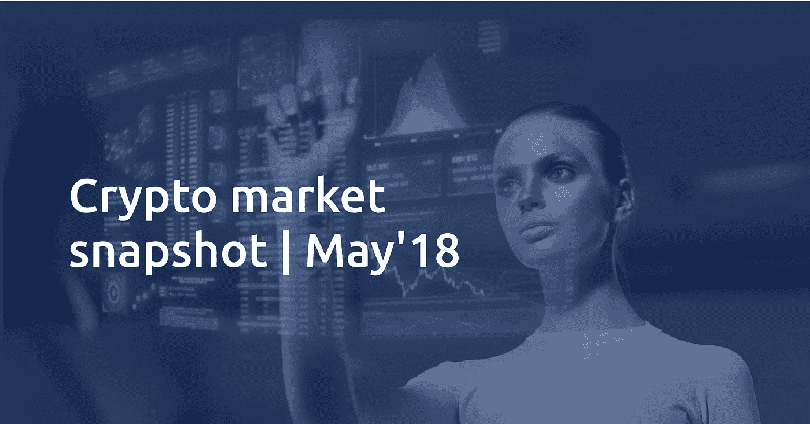
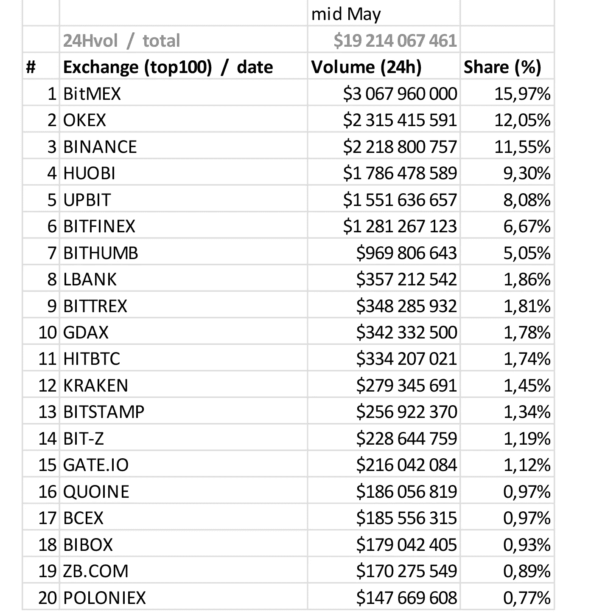
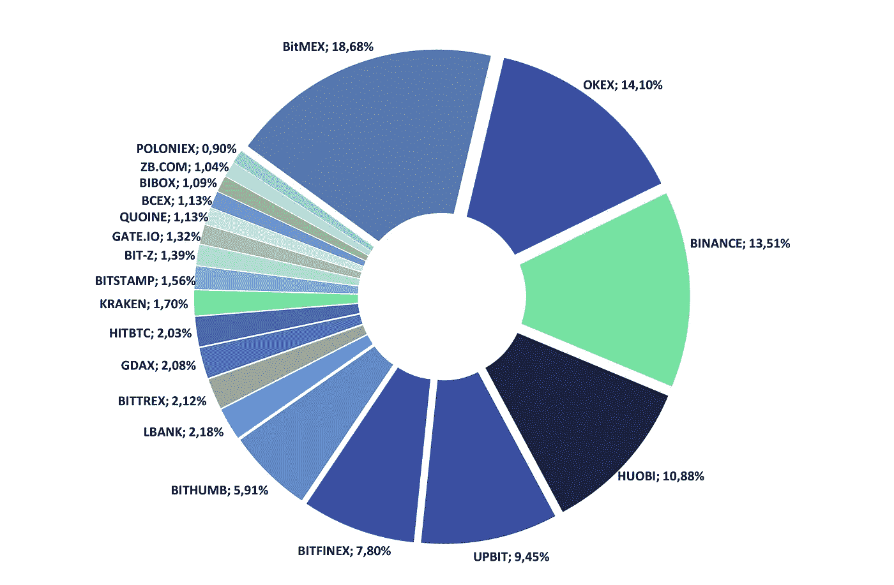
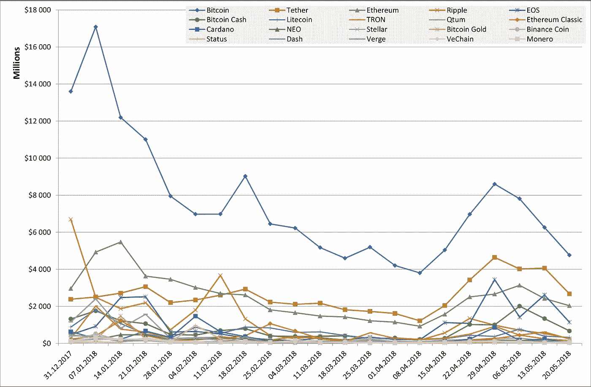
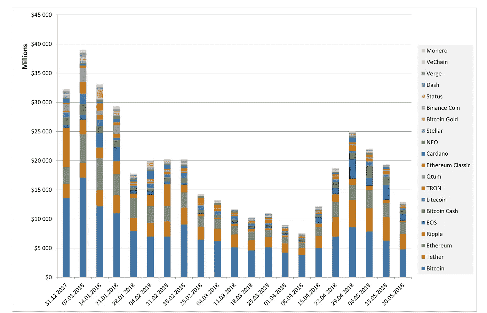
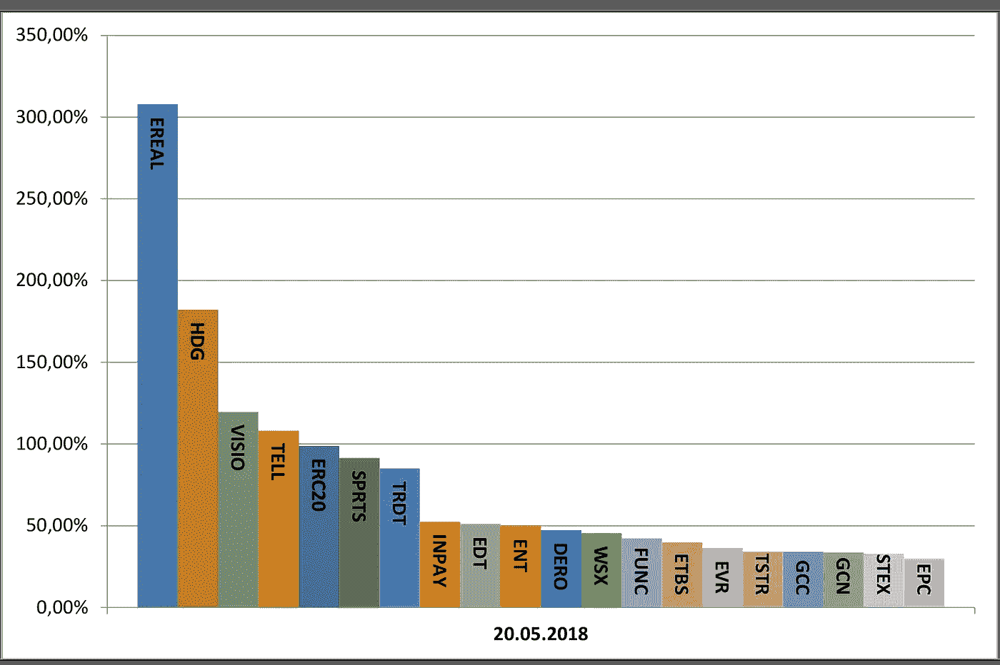
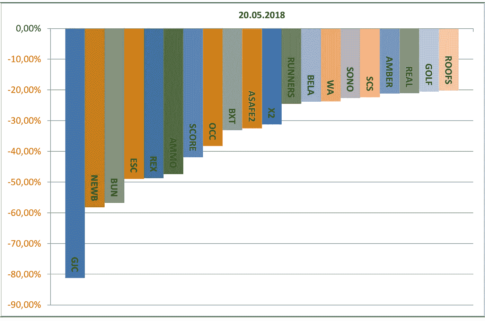

# 加密市场快照| 2018 年 5 月

> 原文：<https://medium.com/hackernoon/crypto-market-snapshot-may18-11478631e0c9>

密码市场非常活跃和不稳定。市场环境每时每刻都在变化。下面，我们提供了一个每周加密市场快照，概述了市场动态，趋势和行为。

## 总体市场份额

加密市场的资本总额是不断变化的，具有典型的上升和下降周期。去年的大肆宣传吸引了许多人的注意力，不仅来自金融和投资资本，也来自毫无准备的大众市场。尽管规模相对较小，但该市场仍在继续形成，每日交易量巨大。

> 我们可以清楚地看到这个市场的高波动性和高风险水平。我们也知道，你冒的风险越大，你赚的就越多。交易市场分析的典型方法是收集和分析市场数据和动态。特别是当我们应用机器学习和人工智能的时候，我们需要收集相关的数据，并进行适当的分析。

我们希望定期收集此类信息并提供给您使用。

## 每日交易量排名靠前的加密交易所

人们通常通过加密交易所买卖代币。新的交易所不时出现，试图吸引更多的客户加入他们的投资组合。最活跃的加密交易所产生了大部分的每日交易量。**日交易量(以美元计)排名前 20 位的加密交易所变化不大。**

## 截至 5 月中旬，前 15 家加密交易所的日交易量超过 80%。

**请看下表列表:**

Table 1: Top-20 crypto exchanges by daily trading volume, as of mid-May, 2018

> 市场正显示出初步的整合迹象，我们预计这一趋势将在可预见的未来继续下去。

**考虑交易机会的人，建议选择日成交量较大的交易所**。交易活跃资产是件好事(类似于常规交易市场中的秘密世界)，因为你总能决定何时买入或卖出。

**如果我们只考虑排名前 20 位的加密交易所，它们的市场份额如下。**

Diagram 2: Top20 crypto exchanges, with market shares recalculated among the Top20

## 交易加密资产的市场动态

Diagram 3: Top‐20 crypto assets daily trading volumes and their weekly dynamics

上图清楚地说明了我们在今年年初的**宣传**。**最显著的下降之一是比特币。它的日交易量随着价格的下降而下降。**

然而，我们看到从 4 月中旬开始，日交易量开始增长。和其他玩家出现在市场上。比特币仍然是交易的领导者，但其他加密资产重新安排了加密交易环境，例如 EOS、比特币黄金等。
自 4 月中旬以来，交易量再次增长，但这种增长与市值增长没有直接联系，可能是投资者接受新定价水平的迹象。

Diagram 4: Daily trading volume for Top20 crypto assets (weekly snapshots)

## 交易加密资产:赢家和输家

加密资产在交易中非常不稳定，需要交易者进行严格的风险管理。不过，有些项目更有价值和未来前景。然后相应的令牌显示持续增长。
加密资产通常表现为短期增长，随后下降。反之亦然，一些加密资产在开始时下跌，因此对相信一个项目并期待其未来增长的风险投资者来说变得有吸引力。
下面你可以看到一张市场快照，显示了 24 小时内市场的涨跌情况。很明显，更成熟的加密货币通常表现出更低的波动性，因此，与更低的预期回报相关的风险也更低。

Diagram 5: Crypto market gainers, as of May 20, 2018 (24 hours change)

Diagram 6: Crypto market losers, as of May 20, 2018 (24 hours change)

## 结论

*这个简短的分析并不旨在告诉你何时买入或卖出。唯一的目的是概述当前的加密市场快照。*

觉得这篇文章有用？请订阅我们的社区。我们正在建立一个伟大的平台！

# 交易链接

## [网站](https://aitrading.com)

## [路线图](https://aitrading.com/#s_time)

## [白皮书](https://aitrading.com/pdf/AITrading_WP_EN.pdf)

## [媒体博客](https://medium.com/aitrading)

## [电报社区](https://t.me/aitrading_com)

## [电报通道](https://t.me/aitrading_en)

## [推特](https://twitter.com/aitrading_com)

## [脸书](https://facebook.com/aitrading.official)

## [Insta](https://instagram.com/aitrading_official)

## [Bitcointalk 安](https://bit.ly/2It3Dd2)

## [钢模](https://steemit.com/@aitrading.com)

## [子编辑](https://www.reddit.com/r/aitrading_official)